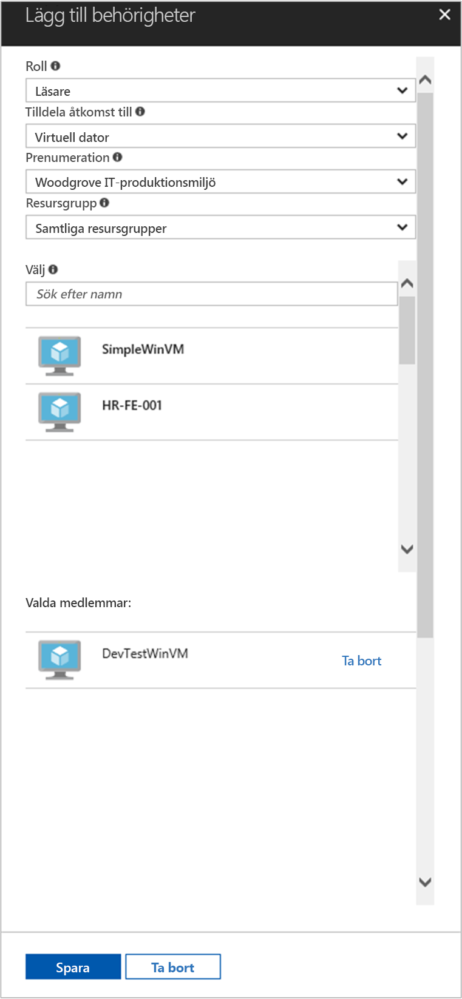

# <a name="use-a-windows-vm-managed-service-identity-msi-to-access-resource-manager"></a>Använd en Windows VM hanterade tjänsten identitet (MSI) för att komma åt hanteraren för filserverresurser

[!INCLUDE[preview-notice](../../includes/active-directory-msi-preview-notice.md)]

Den här kursen visar hur du aktiverar hanterade tjänsten identitet (MSI) för en Windows-dator (VM). Du kan sedan använda identitet för åtkomst till Azure Resource Manager API. Hanterade Tjänsteidentiteter hanteras automatiskt av Azure och gör att du kan autentisera tjänster som stöder Azure AD-autentisering utan att behöva infoga autentiseringsuppgifter i din kod. Lär dig att:

> [!div class="checklist"]
> * Aktivera MSI på en Windows VM 
> * Ge dina VM-åtkomst till en resursgrupp i Azure Resource Manager 
> * Hämta en åtkomst-token med VM-identitet och använda den för att anropa Azure Resource Manager

## <a name="prerequisites"></a>Krav

[!INCLUDE [msi-qs-configure-prereqs](../../includes/active-directory-msi-qs-configure-prereqs.md)]

[!INCLUDE [msi-tut-prereqs](../../includes/active-directory-msi-tut-prereqs.md)]

## <a name="sign-in-to-azure"></a>Logga in på Azure
Logga in på Azure-portalen på [https://portal.azure.com](https://portal.azure.com).

## <a name="create-a-windows-virtual-machine-in-a-new-resource-group"></a>Skapa en virtuell Windows-dator i en ny resursgrupp

Den här självstudiekursen skapar vi en ny Windows virtuell dator.  Du kan också aktivera MSI på en befintlig virtuell dator.

1.  Klicka på knappen **New** (Nytt) i det övre vänstra hörnet i Azure Portal.
2.  Välj **Compute**, och välj sedan **Windows Server 2016 Datacenter**. 
3.  Ange informationen för den virtuella datorn. Den **användarnamn** och **lösenord** skapade här är de autentiseringsuppgifter som du använder för att logga in på den virtuella datorn.
4.  Välj rätt **prenumeration** för den virtuella datorn i listrutan.
5.  Att välja en ny **resursgruppen** som du vill skapa den virtuella datorn, Välj **Skapa nytt**. När du är klar klickar du på **OK**.
6.  Välj storlek för den virtuella datorn. Om du vill se fler storlekar väljer du **Visa alla** eller så ändrar du filtret för **disktyper som stöds**. Behåll standardinställningarna på sidan Inställningar och klickar på **OK**.

    

## <a name="enable-msi-on-your-vm"></a>Aktivera MSI på den virtuella datorn 

En VM MSI kan du få åtkomst-token från Azure AD utan att du behöver publicera autentiseringsuppgifter i koden. Aktivera MSI visar Azure för att skapa en hanterad identitet för den virtuella datorn. Under försättsbladen, aktivera MSI gör två saker: MSI VM-tillägget installeras på den virtuella datorn och det gör att MSI i Azure Resource Manager.

1.  Välj den **virtuella** som du vill aktivera MSI på.  
2.  Klicka på det vänstra navigeringsfältet **Configuration**. 
3.  Du ser **hanterade tjänstidentiteten**. För att registrera och aktivera MSI-filerna, Välj **Ja**, om du vill inaktivera det, väljer du Nej. 
4.  Se till att du klickar på **spara** att spara konfigurationen.  
    

5. Om du vill kontrollera och vilka tillägg som finns på den här virtuella datorn, klickar du på **tillägg**. Om MSI aktiveras sedan **ManagedIdentityExtensionforWindows** visas i listan.

    

## <a name="grant-your-vm-access-to-a-resource-group-in-resource-manager"></a>Ge dina VM-åtkomst till en resursgrupp i Resource Manager
Med hjälp av MSI hämta koden åtkomsttoken att autentisera till resurser som stöder Azure AD-autentisering.  Azure Resource Manager stöder Azure AD-autentisering.  Vi måste först och ge den här Virtuella datorns identitet åtkomst till en resurs i hanteraren för filserverresurser, i det här fallet resursgruppen där den virtuella datorn finns.  

1.  Gå till fliken för **resursgrupper**. 
2.  Välj specifikt **resursgruppen** du skapade för din **Windows VM**. 
3.  Gå till **åtkomstkontroll (IAM)** i den vänstra panelen. 
4.  Sedan **Lägg till** en ny rolltilldelning för din **Windows VM**.  Välj **rollen** som **Reader**. 
5.  I nästa listrutan, **bevilja åtkomst till** resursen **virtuella**. 
6.  Kontrollera sedan att korrekt prenumeration visas i den **prenumeration** listrutan. Och för **resursgruppen**väljer **alla resursgrupper**. 
7.  Slutligen i **Välj** väljer Windows VM i listrutan och klicka på **spara**.

    

## <a name="get-an-access-token-using-the-vm-identity-and-use-it-to-call-azure-resource-manager"></a>Hämta en åtkomst-token med VM-identitet och använda den för att anropa Azure Resource Manager 

Du måste använda **PowerShell** i den här delen.  Om du inte har installerat kan du hämta det [här](https://docs.microsoft.com/powershell/azure/overview?view=azurermps-4.3.1). 

1.  I portalen, går du till **virtuella datorer** och gå till din Windows-dator och i den **översikt**, klickar du på **Anslut**. 
2.  Ange i din **användarnamn** och **lösenord** för som du har lagt till när du skapade den virtuella Windows-datorn. 
3.  Nu när du har skapat en **anslutning till fjärrskrivbord** med den virtuella datorn, öppna **PowerShell** i fjärrsessionen. 
4.  Använder PowerShells Invoke-WebRequest, gör en begäran till den lokala MSI-slutpunkten för att hämta ett åtkomsttoken för Azure Resource Manager.

    ```powershell
       $response = Invoke-WebRequest -Uri http://localhost:50342/oauth2/token -Method GET -Body @{resource="https://management.azure.com/"} -Headers @{Metadata="true"}
    ```
    
    > [!NOTE]
    > Värdet för ”resurser”-parametern måste vara en exakt matchning för vad som förväntas av Azure AD. När du använder Azure Resource Manager resurs-ID, måste du inkluderar det avslutande snedstrecket på URI.
    
    Därefter extraheras det fullständiga svaret som lagras som en JavaScript Object Notation (JSON) formaterad sträng i $response-objektet. 
    
    ```powershell
    $content = $response.Content | ConvertFrom-Json
    ```
    Extrahera sedan den åtkomst-token från svaret.
    
    ```powershell
    $ArmToken = $content.access_token
    ```
    
    Slutligen anropa Azure Resource Manager med den åtkomst-token. I det här exemplet använder vi också PowerShells Invoke-WebRequest göra anrop till Azure Resource Manager och inkludera den åtkomst-token i auktoriseringshuvudet.
    
    ```powershell
    (Invoke-WebRequest -Uri https://management.azure.com/subscriptions/<SUBSCRIPTION ID>/resourceGroups/<RESOURCE GROUP>?api-version=2016-06-01 -Method GET -ContentType "application/json" -Headers @{ Authorization ="Bearer $ArmToken"}).content
    ```
    > [!NOTE] 
    > URL: en är skiftlägeskänsligt, så se till att om du använder samma skiftläge som du använde tidigare när du namnet på resursgruppen och versaler ”G” i ”resursgrupper”.
        
    Följande kommando returnerar information om den resursgrupp:

    ```powershell
    {"id":"/subscriptions/98f51385-2edc-4b79-bed9-7718de4cb861/resourceGroups/DevTest","name":"DevTest","location":"westus","properties":{"provisioningState":"Succeeded"}}
    ```

## <a name="related-content"></a>Relaterat innehåll

- En översikt över MSI finns [hanterade tjänstidentiteten översikt](../active-directory/msi-overview.md).

Använd följande avsnitt för kommentarer för att ge feedback och hjälp oss att förfina och utforma innehållet.

