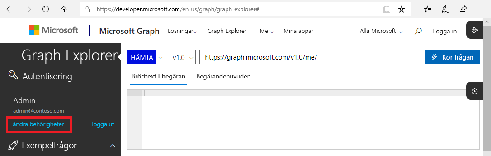
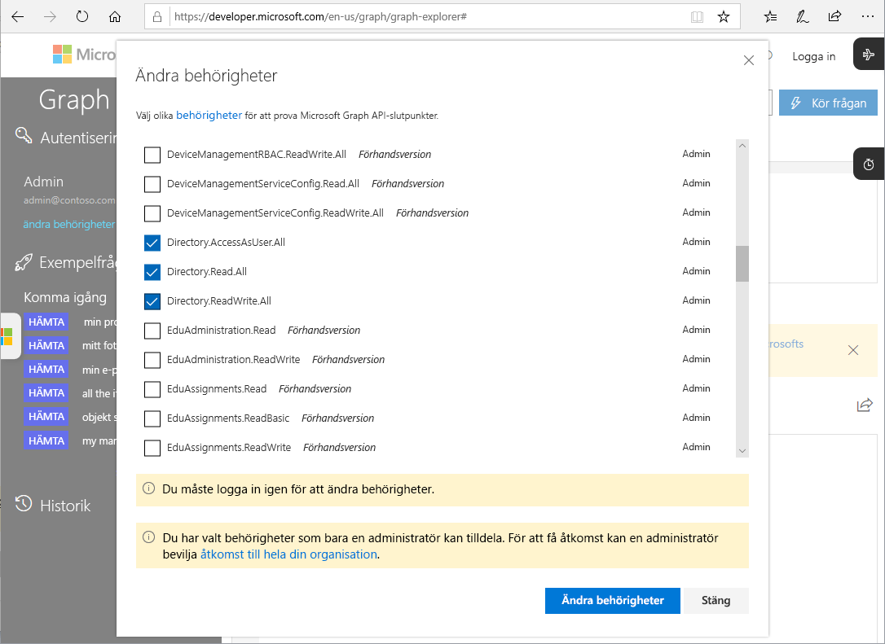

# Microsoft Graph-API:er för PIM (förhandsversion)

För de flesta av de uppgifter du kan utföra i Azure Active Directory (Azure AD) Privileged Identity Management (PIM) med Azure-portalen, kan du också utföra med hjälp av den [Microsoft Graph API: er](https://developer.microsoft.com/graph/docs/concepts/overview). Den här artikeln beskriver några viktiga begrepp vid användning av Microsoft Graph-API:er för PIM. Mer information om Microsoft Graph-API:er finns i [referensen för Azure AD Privileged Identity Management API](https://developer.microsoft.com/graph/docs/api-reference/beta/resources/privilegedidentitymanagement_root).

> [!IMPORTANT]
> API:er under /betaversionen i Microsoft Graph är i förhandsversion och kan komma att ändras. Användning av dessa API:er i produktionsprogram stöds inte.

## Nödvändiga behörigheter

För att anropa Microsoft Graph API:er för PIM måste du ha **en eller flera** av följande behörigheter:

- `Directory.AccessAsUser.All`
- `Directory.Read.All`
- `Directory.ReadWrite.All`
- `PrivilegedAccess.ReadWrite.AzureAD`

### Ställa in behörigheter

För att program ska kunna anropa Microsoft Graph-API:er för PIM måste de ha nödvändiga behörigheter. Det enklaste sättet att ange nödvändiga behörigheter är att använda [Azure AD-ramverket för medgivande](../develop/consent-framework.md).

### Ställa in behörigheter i Graph Explorer

Om du använder Graph Explorer för att testa anrop kan du ange behörigheterna i verktyget.

1. Logga in på [Graph Explorer](https://developer.microsoft.com/graph/graph-explorer) som global administratör.

1. Klicka på **ändra behörigheter**.

    

1. Lägg till bockar intill de behörigheter som du vill inkludera. `PrivilegedAccess.ReadWrite.AzureAD` är ännu inte tillgänglig i Graph Explorer.

    

1. Klicka på **Ändra behörigheter** för att tillämpa behörighetsändringarna.

## Nästa steg

- [Referens för Azure AD Privileged Identity Management API](https://developer.microsoft.com/graph/docs/api-reference/beta/resources/privilegedidentitymanagement_root)
