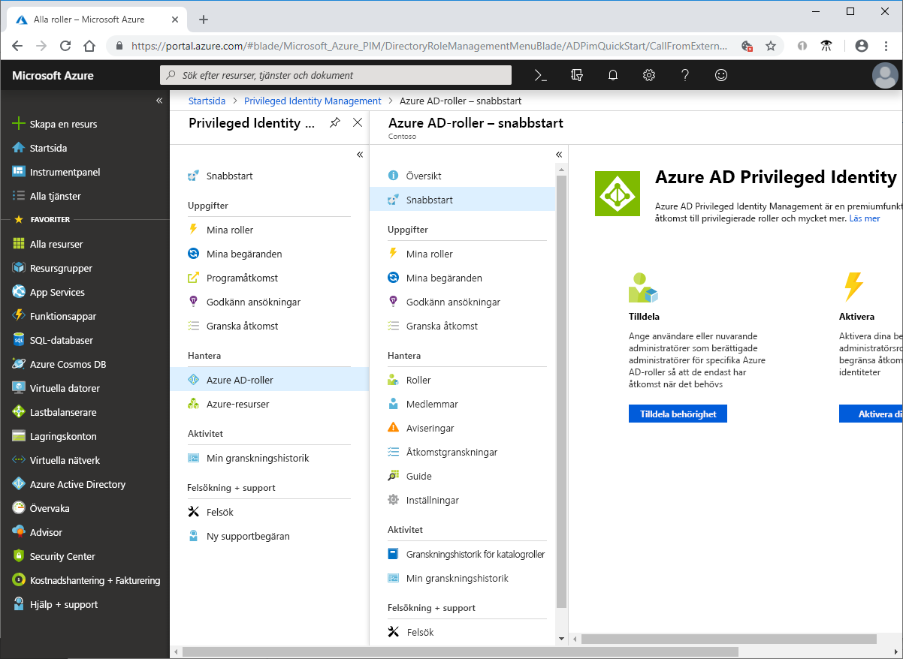

# Vad är Azure AD Privileged Identity Management?

Azure Active Directory (Azure AD) Privileged Identity Management (PIM) är en tjänst som du kan använda för att hantera, kontrollera och övervaka åtkomst till viktiga resurser i din organisation. Detta innefattar åtkomsten till resurser i Azure AD, Azure Resources och andra Microsoft Online-tjänster som Office 365 och Microsoft Intune.

## Varför bör jag använda PIM?

Organisationer behöver minimera antalet personer som har åtkomst till skyddad information eller skyddade resurser för att därigenom minska risken för att användare som vill vålla skada får åtkomst till informationen eller att behöriga användare oavsiktligt påverkar känsliga resurser. Användare måste emellertid fortfarande kunna utföra privilegierade åtgärder i Azure AD, Azure, Office 365 och SaaS-appar. Organisationer kan ge användare privilegierad just-in-time-åtkomst (JIT) till Azure-resurser och Azure AD. Det finns ofta behov av att övervaka vad användarna gör med sina administratörsprivilegier. PIM minskar risken för att åtkomsträttigheter missbrukas eller används i onödan eller i överdriven utsträckning.

## Vad kan jag göra med PIM?

PIM hjälper dig i princip att hantera ”vem, vad, när, var och varför” för de resurser du bryr dig om. Här följer några viktiga funktioner för PIM:

- Ge privilegierad **just-in-time**-åtkomst till Azure AD och Azure-resurser
- Tilldela **tidsbunden** åtkomst till resurser med hjälp av start- och slutdatum
- Kräv **godkännande** för att aktivera privilegierade roller
- Framtvinga **multifaktorautentisering** för aktivering av roller
- Använd **motivering** för att förstå varför användare aktiverar
- Få **meddelanden** när privilegierade roller aktiveras
- Utför **åtkomstgranskningar** för att se till att användare fortfarande behöver ha vissa roller
- Ladda ned **granskningshistorik** för intern eller extern granskning

## Nödvändiga komponenter

Du måste ha en av följande betal- eller utvärderingslicenser för att använda PIM. Mer information finns i [Vad är Azure Active Directory?](../fundamentals/active-directory-whatis.md).

- Azure AD Premium P2
- Enterprise Mobility + Security (EMS) E5

Information om licenser för användare finns i [licenskraven för användning av PIM](subscription-requirements.md).

## Terminologi

För att bättre förstå PIM och dess dokumentation bör du läsa om följande termer.

| Term eller begrepp | Kategori för rolltilldelning | Beskrivning |
| --- | --- | --- |
| berättigad | Typ | En rolltilldelning som kräver att en användare utför en eller flera åtgärder för att använda rollen. Om en användare har gjorts berättigad för en roll innebär det att användaren kan aktivera rollen när det finns behov av att utföra privilegierade åtgärder. Det finns ingen skillnad i den åtkomst som ges till någon med en permanent kontra berättigad rolltilldelning. Den enda skillnaden är att vissa användare inte behöver den åtkomsten hela tiden. |
| aktiv | Typ | En rolltilldelning som inte kräver att en användare utför några åtgärder för att använda rollen. Användare som är tilldelade som aktiva har de behörigheter som rollen har tilldelats. |
| aktivera |  | Processen med att utföra en eller flera åtgärder för att använda en roll som en användare är berättigad för. Det kan vara åtgärder som att utföra en kontroll av multifaktorautentisering (MFA), ange en affärsmotivering eller begära godkännande från utnämnda godkännare. |
| tilldelad | Status | En användare som har en aktiv rolltilldelning. |
| aktiverad | Status | En användare som har en berättigad rolltilldelning, utförde åtgärderna för att aktivera rollen och nu är aktiv.  När användaren är aktiverad kan han/hon använda rollen under en förinställd tidsperiod innan aktivering krävs igen. |
| permanent berättigad | Varaktighet | En rolltilldelning där en användare alltid är berättigad att aktivera rollen. |
| permanent aktiv | Varaktighet | En rolltilldelning där en användare alltid kan använda rollen utan att utföra några åtgärder. |
| berättigad med upphörande | Varaktighet | En rolltilldelning där en användare är berättigad att aktivera rollen inom angivna startdatum och slutdatum. |
| aktiv med upphörande | Varaktighet | En rolltilldelning där en användare kan använda rollen utan att utföra några åtgärder inom angivna startdatum och slutdatum. |
| just-in-time-åtkomst (JIT) |  | En modell i vilken användarna får tillfällig behörighet att utföra privilegierade uppgifter, vilket hindrar skadliga eller obehöriga användare från att få åtkomst när behörigheterna har gått ut. Åtkomst beviljas endast när användare behöver den. |
| princip om minsta behörighetsåtkomst |  | En rekommenderad säkerhetsrutin där varje användare endast har fått de minsta privilegier som krävs för att utföra uppgifterna som de har behörighet att utföra. Den här metoden minimerar antalet globala administratörer och använder i stället specifika administratörsroller för vissa scenarier. |

## Hur ser PIM ut?

När du har konfigurerat PIM visas alternativen **Uppgifter**, **Hantera** och **Aktivitet** i den vänstra navigeringsmenyn. Som administratör kan du välja mellan att hantera **Azure AD-roller** och **Azure-resurs**-roller. När du väljer vilken typ av roll du vill hantera visas en liknande uppsättning med alternativ för den rolltypen.

## Vem kan göra vad i PIM?

Om du är den första personen som använder PIM tilldelas du automatiskt rollerna [Säkerhetsadministratör](../users-groups-roles/directory-assign-admin-roles.md#security-administrator) och [Privilegierad rolladministratör](../users-groups-roles/directory-assign-admin-roles.md#privileged-role-administrator) i katalogen.

För Azure AD-roller kan endast användare med rollen Privilegierad rolladministratör hantera tilldelningar för andra administratörer i PIM. Du kan [bevilja åtkomst till andra administratörer att hantera PIM](pim-how-to-give-access-to-pim.md). Globala administratörer, säkerhetsadministratörer och säkerhetsläsare kan visa tilldelningar till Azure AD-roller i PIM.

För Azure-resursroller kan endast prenumerationsadministratörer, resursägare och administratörer för resursanvändaråtkomst hantera tilldelningar för andra administratörer i PIM. Användare som är privilegierade rolladministratörer, säkerhetsadministratörer eller säkerhetsläsare har som standard inte behörighet att visa tilldelningar för Azure-resursroller i PIM.

## Scenarier

PIM stöder följande scenarier:

**Som Privilegierad rolladministratör kan du:**

- aktivera godkännande för specifika roller
- specificera godkända användare och grupper för att godkänna begäranden
- visa historik för begäranden och godkännanden för alla privilegierade roller.

**Som granskare kan du:**

- visa väntande godkännanden (begäranden)
- godkänna och avvisa begäranden om att upphöja roller (en i taget eller i grupp)
- ange en motivering för godkännandet/avvisandet. 

**Som berättigad rollanvändare kan du:**

- begära aktivering av roller som kräver godkännande
- visa status för begäran att aktivera
- slutföra uppgiften i Azure AD om aktiveringen godkändes.

## Nästa steg

- [Licenskrav för användning av PIM](subscription-requirements.md)
- [Skydda privilegierad åtkomst för hybrid- och molndistributioner i Azure AD](../users-groups-roles/directory-admin-roles-secure.md?toc=%2fazure%2factive-directory%2fprivileged-identity-management%2ftoc.json)
- [Distribuera PIM](pim-deployment-plan.md)
