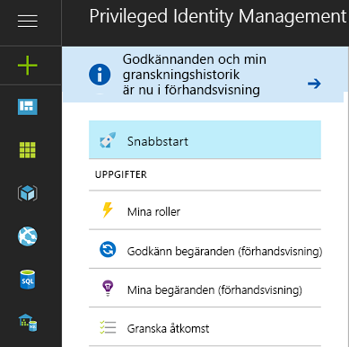
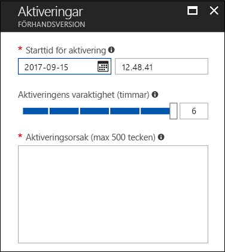
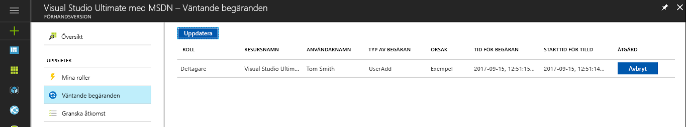
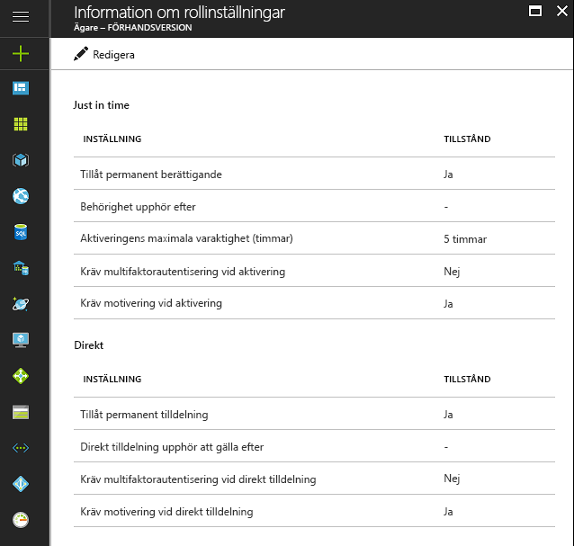

# Vad är Azure AD Privileged Identity Management?

Med Azure Active Directory (AD) Privileged Identity Management kan du hantera, kontrollera och övervaka åtkomst inom din organisation. Detta innefattar åtkomsten till resurser i Azure AD, Azure Resources (förhandsversion) och andra Microsoft Online-tjänster som Office 365 och Microsoft Intune.

> [!NOTE]
> När du aktiverar Privileged Identity Management för din klientorganisation krävs en giltig Azure AD Premium P2- eller Enterprise Mobility + Security E5-licens (betald licens eller utvärderingslicens) för varje användare som interagerar med eller får en förmån från tjänsten. Exempel innefattar användare/användare i en grupp som:
>
>- Tilldelas till rollen Privilegierad rolladministratör 
>- Tilldelas som berättigade till andra katalogroller som hanteras via PIM 
>- Kan godkänna/neka begäranden i PIM 
>- Tilldelas till en Azure-resursroll med Just-in-time- eller direkttilldelningar (tidsbaserade)  
>- Tilldelas till en åtkomstgranskning
>
>Mer information finns i [Azure Active Directory-versioner](../fundamentals/active-directory-whatis.md).

Organisationer behöver minimera antalet personer som har åtkomst till skyddad information eller skyddade resurser för att därigenom minska risken för att obehöriga användare får åtkomst till informationen eller att behöriga användare oavsiktligt påverkar känsliga resurser.  Användare måste emellertid fortfarande kunna utföra privilegierade åtgärder i Azure AD, Azure, Office 365 och SaaS-appar. Organisationer kan ge användare privilegierad åtkomst till Azure-resurser som exempelvis prenumerationer och Azure AD. Det finns ofta behov av att övervaka vad användarna gör med sina administratörsprivilegier. Azure AD Privileged Identity Management ser till att åtkomsträttigheter inte missbrukas eller används i onödan eller i överdriven utsträckning.

Med Azure AD Privileged Identity Management kan din organisation:

- Se vilka användare som har tilldelats privilegierade roller för att hantera Azure-resurser (förhandsversion), samt vilka användare som har tilldelats administrativa roller i Azure AD.
- Aktivera administrativ åtkomst ”just in time” och på begäran till Microsoft Online-tjänster som Office 365 och Intune, och till Azure-resurser (förhandsversion) i prenumerationer, resursgrupper och enskilda resurser, t.ex. virtuella datorer. 
-   Visa en historik över administratörsaktivering, inklusive vilka ändringar administratörer har gjort i Azure-resurser (förhandsversion).
- Få meddelanden om ändringar i administratörstilldelningar.
- Kräva godkännande för att aktivera privilegierade administratörsroller i Azure AD (förhandsversion). 
- Granska medlemskap i administrativa roller och kräva att användare anger en motivering för fortsatt medlemskap.

I Azure AD kan Azure AD Privileged Identity Management hantera användare som tilldelats till inbyggda Azure AD-organisationsroller, t.ex. Global administratör. I Azure kan Azure AD Privileged Identity Management hantera användare och grupper som tilldelats via Azure RBAC-roller, t.ex. Ägare och Deltagare.

## Just-in-time-administratörsåtkomst

Tidigare kunde du tilldela en användare till en administratörsroll via Azure Portal, andra Microsoft Online Services-portaler eller Azure AD-cmdlets i Windows PowerShell. Med detta förfarande blir användaren en **permanent administratör** som alltid är aktiv i den tilldelade rollen. Azure AD Privileged Identity Management introducerar begreppet **berättigad administratör**. Berättigade administratörer bör vara användare som behöver privilegierad åtkomst då och då men inte hela tiden, varje dag. Rollen är inaktiv tills användaren behöver åtkomst. Därefter slutför användaren en aktiveringsprocess och blir aktiv administratör under en förinställd tidsperiod. Allt fler organisationer väljer att använda den här metoden för att minska eller eliminera ”fast administratörsåtkomst” till privilegierade roller.

## Aktivera Privileged Identity Management för din katalog

Du kan börja använda Azure AD Privileged Identity Management på [Azure Portal](https://portal.azure.com/).

> [!NOTE]
> Du måste vara en global administratör med ett organisationskonto (till exempel @yourdomain.com), inte ett Microsoft-konto (till exempel @outlook.com), för att aktivera Azure AD Privileged Identity Management för en katalog.

1. Logga in på [Azure-portalen](https://portal.azure.com/) som global administratör för din katalog.
2. Om din organisation har mer än en katalog väljer du ditt användarnamn längst upp till höger på Azure-portalen. Välj den katalog där du kommer att använda Azure AD Privileged Identity Management.
3. Välj **Alla tjänster** och använd textrutan Filter för att söka efter **Azure AD Privileged Identity Management**.
4. Markera **Fäst på instrumentpanelen** och klicka sedan på **Skapa**. Privileged Identity Management-programmet öppnas.

Om du är den första som använder Azure AD Privileged Identity Management i din katalog och du navigerar till Azure AD-katalogroller kommer en [säkerhetsguide](pim-security-wizard.md) att vägleda dig genom den första tilldelningen. Därefter blir du automatiskt katalogens första **säkerhetsadministratör** och **privilegierade rolladministratör**.

För Azure AD-roller kan endast en användare som har rollen Privilegierad rolladministratör hantera tilldelningar för andra administratörer i Azure AD PIM. Du kan [ge andra användare behörighet att hantera katalogroller i PIM](pim-how-to-give-access-to-pim.md). Globala administratörer, säkerhetsadministratörer och säkerhetsläsare kan visa tilldelningar till Azure AD-roller i Azure AD PIM.
För Azure RBAC-roller kan endast en prenumerationsadministratör, en resursägare eller en administratör för resursanvändaråtkomst hantera tilldelningar för andra administratörer i Azure AD PIM.  Användare som är privilegierade rolladministratörer, säkerhetsadministratörer eller säkerhetsläsare har som standard inte behörighet att visa tilldelningar för Azure RBAC-roller i Azure AD PIM.

## Privileged Identity Management – översikt (startpunkt)

Azure AD Privileged Identity Management har stöd för administration av Azure AD-katalogroller och roller för Azure-resurser (förhandsversion). Funktionen för roller för Azure-resurser skiljer sig från administrativa roller i Azure AD. Azure-resursroller ger behörighet på detaljnivå för den resurs där de är tilldelade, samt alla underordnade resurser i resurshierarkin (detta kallas arv). [Lär dig mer om RBAC, resurshierarkin och arv](../../role-based-access-control/role-assignments-portal.md). PIM för både Azure AD-katalogroller och Azure-resurser (förhandsversion) kan administreras via relevant länk under avsnittet Hantera på den vänstra navigeringsmenyn från PIM-översiktens startpunkt.

I PIM kan du enkelt aktivera roller, visa väntande aktiveringar/begäranden, väntande godkännanden (för Azure AD-katalogroller) och granskningar som väntar på ditt svar i avsnittet Uppgifter på den vänstra navigeringsmenyn.

När du använder något av menyalternativen i Uppgifter från översiktens startpunkt innehåller den resulterande vyn resultat för både Azure AD-katalogroller och Azure-resursroller (förhandsversion).

Mina roller innehåller en lista över aktiva och berättigade rolltilldelningar för Azure AD-katalogroller och Azure-resursroller (förhandsversion). [Lär dig mer om hur du aktiverar berättigade rolltilldelningar](pim-how-to-activate-role.md).

Aktiveringen av roller för Azure-resurser (förhandsversion) introducerar nya funktioner som gör att berättigade medlemmar i en roll kan schemalägga aktiveringen till ett framtida datum eller en framtida tidpunkt och välja en specifik varaktighet för aktiveringen inom den maxgräns som tillåts av administratörer.

Om en schemalagd aktivering inte längre behövs kan användaren avbryta sin väntande begäran genom att gå till Väntande begäranden på den vänstra navigeringsmenyn och klicka på knappen Avbryt på samma rad som begäran.

## Privileged Identity Management – administratörsinstrumentpanel

Azure AD Privileged Identity Manager innehåller en administratörsinstrumentpanel som visar viktig information som:

* Aviseringar som påpekar möjligheter att förbättra säkerheten
* Det antal användare som har tilldelats varje privilegierad roll  
* Antalet berättigade och permanenta administratörer
* Ett diagram över aktiveringar av privilegierade roller i din katalog
*   Antalet tilldelningar som är just-in-time, tidsbegränsade och permanenta för Azure-resursroller (förhandsversion)
*   Användare och grupper med nya rolltilldelningar under de senaste 30 dagarna (Azure-resursroller)

## Hantering av privilegierade roller

Med Azure AD Privileged Identity Management kan du hantera administratörerna genom att lägga till eller ta bort permanenta eller berättigade administratörer till varje roll för Azure AD-katalogroller. Med PIM för Azure-resurser (förhandsversion) kan ägare, administratörer för användaråtkomst och globala administratörer som aktiverar hantering av prenumerationer i deras klientorganisationer tilldela användare eller grupper till Azure-resursroller som berättigad (just-in-time-åtkomst) eller tidsbunden (kräver ingen aktivering) åtkomst med ett start- och slutdatum/tid, eller permanent (om det har aktiverats i rollinställningarna).

## Konfigurera inställningar för rollaktivering

Med hjälp av [rollinställningarna](pim-how-to-change-default-settings.md) kan du konfigurera egenskaperna för berättigad rollaktivering för Azure AD-katalogroller, inklusive:

* Rollaktiveringsperiodens varaktighet
* Rollaktiveringsmeddelandet
* Den information som en användare måste ange under rollaktiveringsprocessen
* Tjänstbiljett eller incidentnummer
* [Krav för godkännandearbetsflöde – förhandsversion](./azure-ad-pim-approval-workflow.md)

Observera att knapparna för **multifaktorautentisering** i bilden är inaktiverade. För vissa mycket privilegierade roller krävs multifaktorautentisering (MFA) för extra skydd.

Med hjälp av rollinställningarna för Azure-resursroller (förhandsversion) kan administratörer konfigurera inställningar för just-in-time- och direkttilldelning, inklusive:

- Möjligheten att tilldela användare eller grupper till roller utan ett slutdatum/tid (permanent tilldelning)
- Standardvaraktigheten för en tilldelning (när den är inte permanent)
- Den maximala aktiveringsvaraktigheten (när en berättigad rollmedlem aktiveras)
- Den information som en användare måste ange under rollaktiveringen (just-in-time-tilldelningar) eller tilldelningsprocessen (direkttilldelningar)

## Rollaktivering

För att [aktivera en roll](pim-how-to-activate-role.md) begär en berättigad administratör en tidsbunden ”aktivering” för rollen. Aktiveringen kan begäras med hjälp av alternativet **Aktivera min roll** i Azure AD Privileged Identity Management.

En administratör som vill aktivera en roll måste initiera Azure AD Privileged Identity Management på Azure Portal.

Rollaktiveringen kan anpassas. I PIM-inställningarna kan du kontrollera aktiveringens längd och vilken information som administratören behöver ange för att aktivera rollen.

## Granska rollaktivitet

Det finns två sätt att spåra hur anställda och administratörer använder privilegierade roller. Det första alternativet är att använda [Granskningshistorik för katalogroller](pim-how-to-use-audit-log.md). Granskningshistorikloggarna spårar ändringar i privilegierade rolltilldelningar, rollaktiveringshistorik samt ändringar av inställningar för Azure-resursroller (förhandsversion). 

Det andra alternativet är att konfigurera vanliga [åtkomstgranskningar](pim-how-to-start-security-review.md). Dessa åtkomstgranskningar kan utföras av en tilldelad granskare (till exempel en gruppchef), eller så kan de anställda granska själva. Det här är det bästa sättet att övervaka vem som fortfarande behöver åtkomst och vem som inte längre behöver det.

## Azure AD PIM vid upphörande av prenumeration

En klient måste ha en utvärderingsprenumeration eller en betald prenumeration på Azure AD Premium P2 (eller EMS E5) i klientorganisationen för att kunna använda Azure AD PIM.  Utöver det måste licenser tilldelas till administratörerna för klientorganisationen.  Mer specifikt måste licenser tilldelas till administratörer i Azure AD-roller som hanteras via Azure AD PIM, administratörer i Azure RBAC-roller som hanteras via Azure AD PIM samt alla icke-administratörsroller som utför åtkomstgranskningar.
Om din organisation inte förnyar Azure AD Premium P2 eller om utvärderingsversionen upphör att gälla kommer Azure AD PIM-funktionerna inte längre att vara tillgängliga i din klientorganisation, berättigade rolltilldelningar tas bort och användare kommer inte längre att kunna aktivera roller. Du kan läsa mer i [kraven för Azure AD PIM-prenumeration](./subscription-requirements.md)

## Nästa steg

[!INCLUDE [active-directory-privileged-identity-management-toc](../../../includes/active-directory-privileged-identity-management-toc.md)]
