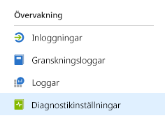
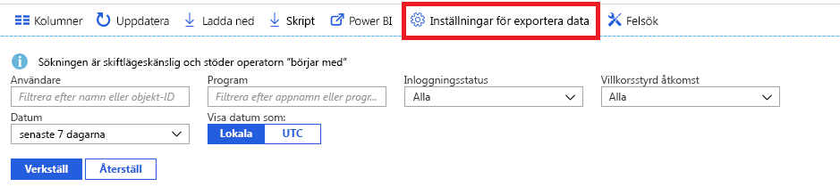

# Vad är Azure Active Directory-övervakning?

Med Azure Active Directory-övervakning (Azure AD) kan du nu dirigera dina Azure AD-aktivitetsloggar till olika slutpunkter. Du kan antingen behålla dem för långvarig användning eller integrera dem med SIEM-verktyg (säkerhetsinformation och händelsehantering) för att få insikter om din miljö.

För närvarande kan du dirigera loggarna till:

- Ett Azure-lagringskonto.
- En Azure-händelsehubb, så du kan integrera med dina Splunk- och Sumologic-instanser.
- Azure Log Analytics-arbetsyta, där du kan analysera data, skapa en instrumentpanel och avisera vid specifika händelser

**Nödvändig roll**: global administratör

> [!VIDEO https://www.youtube.com/embed/syT-9KNfug8]

[!INCLUDE [azure-monitor-log-analytics-rebrand](../../../includes/azure-monitor-log-analytics-rebrand.md)]

## Licensiering och krav för Azure AD-rapportering och-övervakning

Du behöver en Azure AD Premium-licens för att få åtkomst till Azure AD-inloggnings loggarna.

Detaljerad information om funktioner och licensiering i [Azure Active Directory prissättnings guide](https://azure.microsoft.com/pricing/details/active-directory/).

För att distribuera Azure AD-övervakning och-rapportering behöver du en användare som är global administratör eller säkerhets administratör för Azure AD-klienten.

Beroende på den slutliga destinationen för dina loggdata behöver du något av följande:

* Ett Azure-lagringskonto som du har ListKeys-behörigheter för. Vi rekommenderar att du använder ett allmänt lagringskonto och inte ett blob-lagringskonto. Information om lagringspriser hittar du i [Priskalkylatorn för Azure Storage](https://azure.microsoft.com/pricing/calculator/?service=storage).

* Ett Azure Event Hubs-namnområde som kan integreras med SIEM-lösningar från tredje part.

* En Azure Log Analytics-arbetsyta för att skicka loggar till Azure Monitor loggar.

## Konfiguration av diagnostikinställningar

Du konfigurerar övervakningsinställningarna för Azure AD-aktivitetsloggarna genom att först logga in på [Azure-portalen](https://portal.azure.com) och sedan välja **Azure Active Directory**. Härifrån kan du komma åt konfigurationssidan Diagnostikinställningar på två sätt:

* Välj **Diagnostikinställningar** från avsnittet **Övervakning**.

    
    
* Välj **Granskningsloggar** eller **Inloggningar** och välj sedan **Exportinställningar**. 

    

## Dirigera loggar till lagringskonto

Genom att dirigera loggar till ett Azure Storage-konto kan du behålla dem längre än standardperioden för kvarhållning som beskrivs i våra [principer för kvarhållning](reference-reports-data-retention.md). Lär dig hur du [dirigerar data till ditt lagringskonto](quickstart-azure-monitor-route-logs-to-storage-account.md).

## Strömma loggar till händelsehubb

När du dirigerar loggar till en Azure-händelsehubb kan du integrera med SIEM-tredjepartsverktyg som Sumologic och Splunk. Den här integrationen gör att du kan kombinera Azure AD-aktivitetsloggdata med andra data som hanteras av ditt SIEM, för att ge bättre inblick i din miljö. Lär dig hur du [skickar händelser till en händelsehubb](tutorial-azure-monitor-stream-logs-to-event-hub.md).

## Skicka loggar till Azure Monitor-loggar

[Azure Monitor-loggar](../../azure-monitor/log-query/log-query-overview.md) är en lösning som konsoliderar övervakningsdata från olika källor och tillhandahåller ett frågespråk och en analysmotor som ger dig insikter om hur dina program och resurser fungerar. Genom att skicka Azure AD-aktivitetsloggar till Azure Monitor-loggar kan du snabbt hämta, övervaka och agera på insamlade data. Lär dig att [skicka data till Azure Monitor-loggar](howto-integrate-activity-logs-with-log-analytics.md).

Du kan också installera fördefinierade vyer för Azure AD-aktivitetsloggar för vanliga scenarier som omfattar inloggningar och granskningshändelser. Lär dig att [installera och använda logganalysvyer för Azure AD-aktivitetsloggar](howto-install-use-log-analytics-views.md).

## Nästa steg

* [Aktivitetsloggar i Azure Monitor](concept-activity-logs-azure-monitor.md)
* [Strömma loggar till händelsehubb](tutorial-azure-monitor-stream-logs-to-event-hub.md)
* [Skicka loggar till Azure Monitor-loggar](howto-integrate-activity-logs-with-log-analytics.md)
