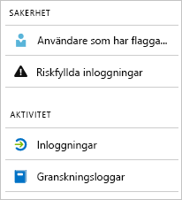

# Vad är rapporter i Azure Active Directory?

Med Azure Active Directory-rapportering kan du få insikter om din miljös prestanda.  
Med dessa data kan du:

- Avgör hur din app och dina tjänster används av dina användare
- Identifiera potentiella risker som påverkar hälsotillståndet för din miljö
- Felsöka problem som hindrar användare från att uträtta sitt arbete  

Rapportarkitekturen förlitar sig på två huvudsakliga pelare:

- Säkerhetsrapporter
- Aktivitetsrapporter

## Säkerhetsrapporter

Säkerhetsrapporter i Azure Active Directory hjälpa dig att skydda din organisations identiteter.  
Det finns två typer av säkerhetsrapporter i Azure Active Directory:

- **Användare som har flaggats för risk** - Från [användare som har flaggats för risksäkerhetsrapporten](concept-user-at-risk.md) får du en översikt över användarkonton som kan ha drabbats.

- **Riskfyllda inloggningar** – med [ säkerhetsrapporten för riskfyllda inloggningar](concept-risky-sign-ins.md) får du en indikator för inloggningsförsök som kan ha utförts av någon som inte är tillförlitligt ägare för ett användarkonto. 

**Vilka Azure AD-licens behöver komma åt en säkerhetsrapport?**  

Alla utgåvor av Azure Active Directory ger rapporter över användare som har flaggats för risk och riskfyllda inloggningar.  
Nivån av rapportens detaljrikedom varierar dock mellan versionerna: 

- I **versionerna Azure Active Directory Free och Basic** har du redan en lista över användare som har flaggats för risk och riskfyllda inloggningar. 

- Utgåvan **Azure Active Directory Premium 1** har en utökad modell där du även kan utforska några av de underliggande riskhändelser som har identifierats för varje rapport. 

- Utgåvan **Azure Active Directory Premium 2** ger den mest detaljerade informationen om de underliggande riskhändelser och du kan konfigurera säkerhetsprinciper som automatiskt svarar på konfigurerade risknivåer.

## Aktivitetsrapporter

Det finns två typer av aktivitetsrapporter i Azure Active Directory:

- **Granskningsloggar** – [aktivitetsrapport för granskningsloggar ](concept-audit-logs.md) ger dig tillgång till historiken för varje aktivitet i din klient.

- **Inloggningar** – med [aktivitetsrapport för inloggningar ](concept-sign-ins.md) kan du bestämma vem som har utfört de uppgifter som rapporteras i granskningsloggarna.

**Granskningsloggarna** ger dokumentation över systemaktiviteter för kontroll av överensstämmelse. Dessa data gör att det möjligt att hantera vanliga scenarier, till exempel:

- Någon i min klient har fått tillgång till en administratörsgrupp. Vem som gav användaren åtkomst? 

- Jag vill ha en lista över användare som loggar in på en viss app eftersom jag nyss publicerade appen och vill veta om den fungerar bra

- Jag vill veta hur många lösenordsåterställningar som sker i min klient

**Vilken Azure AD-licens behöver du för att komma åt granskningsloggar?**  

Granskningsloggarna är tillgängliga för funktioner som du har licenser för. Om du har en licens för en specifik funktion har du också åtkomst till dess granskningslogg.

Mer information finns i **Jämför allmänt tillgängliga funktioner i Free, Basic och Premium-utgåvorna** i [Azure Active Directory-funktioner](https://www.microsoft.com/cloud-platform/azure-active-directory-features).   

**Aktivitetsrapport för inloggningar**  gör det möjligt för att få svar på frågor som:

- Vilket inloggningsmönster har en användare?
- Hur många användare har en användare loggat in under en vecka?
- Vad är status för dessa inloggningar?

**Vilken Azure AD-licens behöver du för att komma åt inloggningsaktiviteter?**  

Din klient måste ha en associerad Azure AD Premium-licens för att det ska gå att se alla rapporter om inloggningsaktiviteter.

## Programmässig åtkomst

Utöver användargränssnittet, ger Azure Active Directory-rapportering också [programmässig åtkomst](concept-reporting-api.md) till rapporteringsdata. Data för de här rapporterna kan vara användbara för dina program, till exempel SIEM-system, gransknings- och business intelligence-verktyg. Azure AD reporting API: er ger programmässig åtkomst till data via en uppsättning REST-baserade API: er. Du kan anropa API: erna från en mängd olika programmeringsspråk och verktyg. 

## Nästa steg

- [Rapport över riskfyllda inloggningar](concept-risky-sign-ins.md)
- [Granskningsloggar](concept-audit-logs.md)
- [Inloggningsrapport](concept-sign-ins.md)