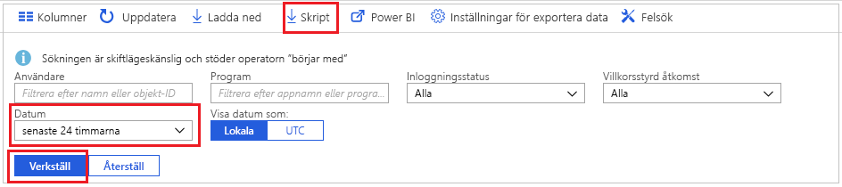
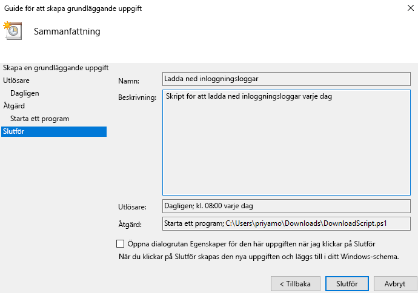

# Självstudier: Ladda ned och använda ett skript för åtkomst till inloggningsloggar

Du kan ladda ned informationen om inloggningsaktivitet om du vill arbete med den utanför Azure Portal. Alternativet **Ladda ned** i Azure-portalen skapar en CSV-fil av de senaste 5 000 posterna. Om du behöver mer flexibilitet, till exempel för att ladda ned mer än 5 000 poster i taget eller ladda ned loggarna efter schemalagda intervall, kan du använda knappen **Skript** till att generera ett PowerShell-skript för att ladda ned dina data.

I den här självstudien lär du dig hur du genererar ett skript för att ladda ned alla inloggningsloggar från de senaste 24 timmarna och schemalägger den för körning varje dag. 

## Nödvändiga komponenter

Du behöver

* En Azure Active Directory-klientorganisation med en premiumlicens (P1/P2). Observera att om du inte har några aktivitetsdata före uppgraderingen tar det ett par dagar innan data visas i rapporterna när du har uppgraderat till en premiumlicens. 
* En användare som har rollen **global administratör**, **säkerhetsadministratör**, **säkerhetsläsare**, eller **rapportläsare** för klienten. Dessutom kan alla användare komma åt sina egna inloggningar. 
* Om du vill köra nedladdningsskriptet på en Windows 10-dator [konfigurerar du Azure PowerShell-modulen och anger körningsprincipen](concept-sign-ins.md#running-the-script-on-a-windows-10-machine).

## Självstudier

1. Gå till [Azure-portalen](https://portal.azure.com) och välj din katalog.
2. Välj **Azure Active Directory** och välj **Inloggningar** i avsnittet **Övervakning**. 
3. Använd filterlistrutan **Datumintervall** och välj **24 timmar** för att hämta data från de senaste 24 timmarna. 
4. Välj **Använd** och verifiera att filtret tillämpas som förväntat. 
5. Välj **Skript** på menyn högst upp för att ladda ned Powershell-skriptet med tillämpade filter.

     
     
6. Öppna programmet **Schemaläggaren** på din Windows-dator och välj **Skapa en standardaktivitet**.
7. Ange ett namn på och en beskrivning för uppgiften och klicka på **Nästa**.
8. Välj alternativknappen **Varje dag** så att uppgiften körs varje dag och ange startdatum och -tid.
9. På åtgärdsmenyn väljer du **Starta ett program** och väljer det nedladdade skriptet. Välj sedan **Nästa**. 
10. Granska den schemalagda uppgiften och välj **Slutför** för att skapa uppgiften.

     

Nu körs uppgiften varje dag och sparar inloggningsinformation från de senaste 24 timmarna i en fil med formatet **AAD_SignInReport_YYYYMMDD_HHMMSS.csv**. Du kan också redigera det nedladdade PowerShell-skriptet och spara det med ett annat filnamn eller ändra antalet nedladdade poster. 

## Nästa steg

* [Kvarhållningsprinciper för rapporter i Azure Active Directory](reference-reports-data-retention.md)
* [Kom igång med Azure Active Directory Reporting API:n](concept-reporting-api.md)
* [Komma åt Reporting-API med certifikat](tutorial-access-api-with-certificates.md)
