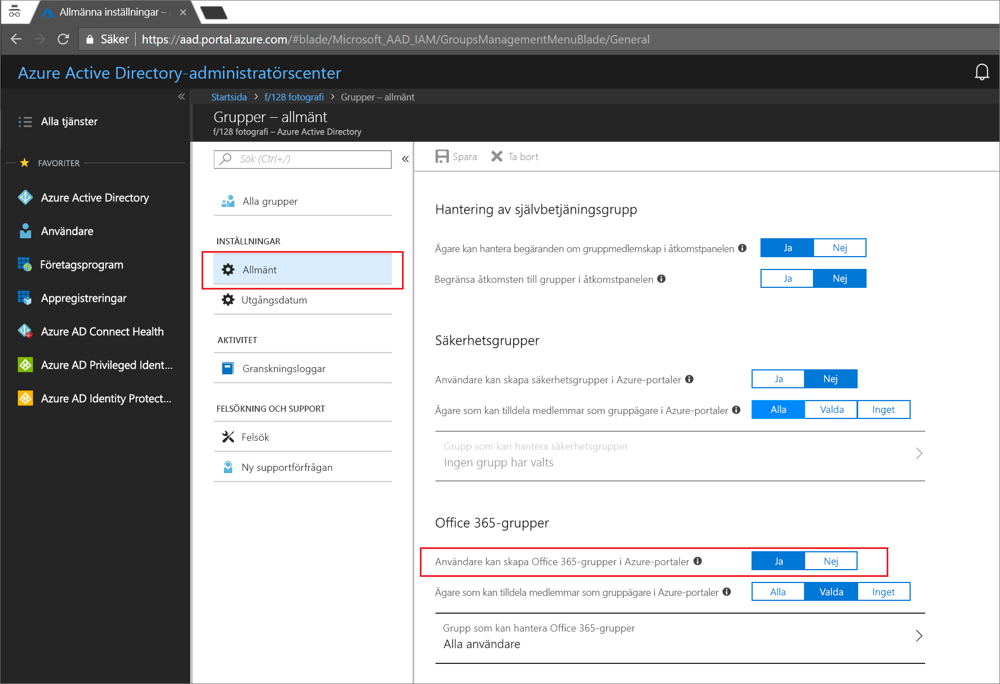
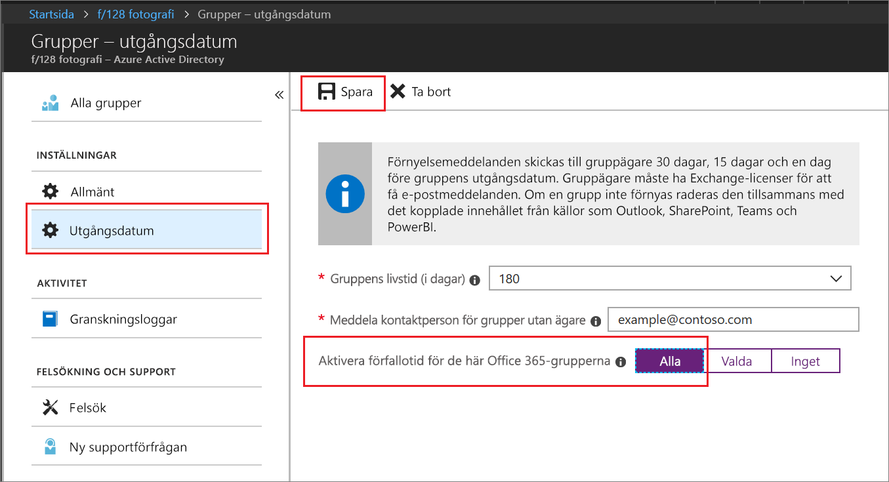

# Snabbstart: Konfigurera Office 365-grupper att upphöra att gälla i Azure Active Directory

I den här snabbstarten anger du en förfalloprincip för dina Office 365-grupper. När användare kan konfigurera sina egna grupper kan det uppstå många oanvända grupper. Ett sätt att hantera oanvända grupper är att ställa in dessa grupper att upphöra, för att minska underhållet med att ta bort grupper manuellt.

Förfalloprinciper är enkla:

* Gruppägare meddelas om att förnya en grupp som håller på att upphöra
* Grupper som inte förnyas tas bort
* En borttagen Office 365-grupp kan återställas inom 30 dagar av en gruppägare eller en Azure AD-administratör

Om du inte har en Azure-prenumeration kan du [skapa ett kostnadsfritt konto ](https://azure.microsoft.com/free/) innan du börjar.

## Krav

Du måste vara en Global administratör eller Användaradministratör i organisationen för att ställa in förfallodatum.

## Aktivera användarskapande för grupper

1. Logga in på den [Azure-portalen](https://portal.azure.com) med ett konto som är en Global administratör eller Användaradministratör för organisationen.

2. Välj **Grupper** och välj sedan **Allmänt**.
  
   

3. Ställ in **Användare kan skapa Office 365-grupper** till **Ja**.

4. Välj **Spara** för att spara gruppinställningarna när du är klar.

## Ange gruppförfallotid

1. Logga in på den [Azure-portalen](https://portal.azure.com)väljer **Azure Active Directory** > **grupper** > **upphör att gälla** till Öppna inställningar för giltighetstid.
  
   

2. Ange förfallointervallet. Välj ett förinställt värde eller ange ett anpassat värde över 31 dagar. 

3. Ange en e-postadress dit meddelanden om förfallotid ska skickas när en grupp inte har någon ägare.

4. För den här snabbstarten ställer du in **Aktivera förfallotid för de här Office 365-grupperna** till **Alla**.

5. Välj **Spara** för att spara förfalloinställningarna när du är klar.

Klart! I den här snabbstarten ställde du in en förfalloprincip för de valda Office 365-grupperna.

## Rensa resurser

### Ta bort en princip

1. Se till att du är inloggad på [Azure-portalen](https://portal.azure.com) med ett konto som är global administratör för klientorganisationen.
2. Välj **Azure Active Directory** > **Grupper** > **Utgångsdatum**.
3. Ställ in **Aktivera förfallotid för de här Office 365-grupperna** på **Inga**.

### Inaktivera användare skapas för grupper

1. Välj **Azure Active Directory** > **Grupper** > **Allmänt**. 
2. Ställ in **Användare kan skapa Office 365-grupper i Azure-portaler** till **Nej**.

## Nästa steg

Mer information om förfallotid inklusive tekniska begränsningar, att lägga till en lista med egna blockerade ord samt slutanvändarupplevelser i Office 365-appar finns i följande artikel med information om förfalloprinciper:

> [!div class="nextstepaction"]
> [All information om förfalloprinciper](groups-lifecycle.md)
