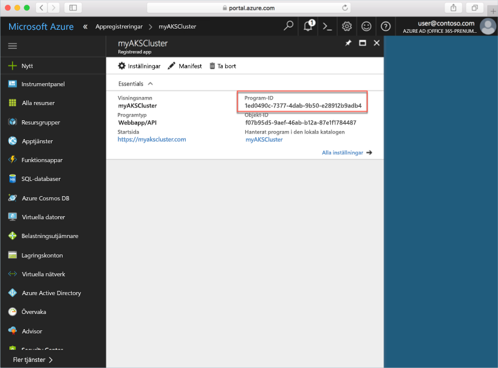
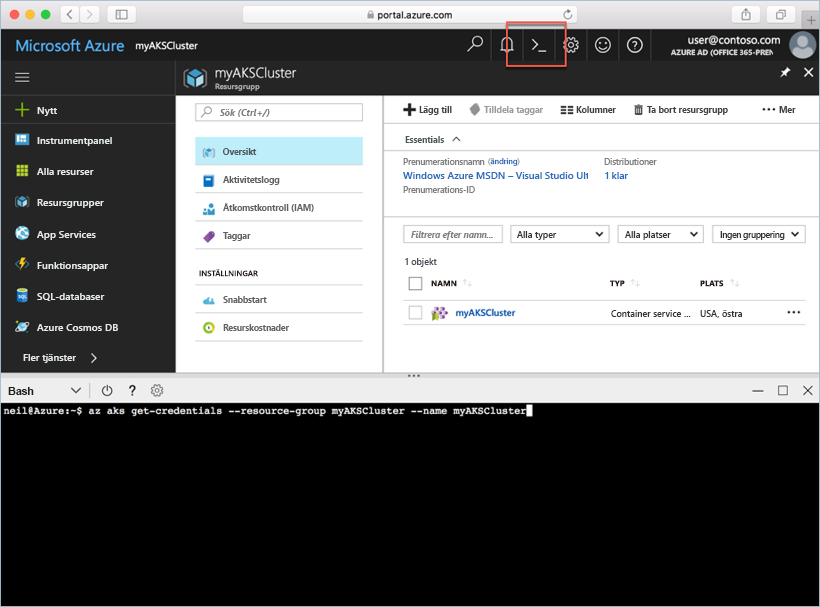

# <a name="deploy-an-azure-container-service-aks-cluster"></a>Distribuera ett Azure Container Service-kluster (AKS)

I den här snabbstarten ska du distribuera ett AKS-kluster med hjälp av Azure-portalen. Därefter kör vi ett flerbehållarprogram som består av en webbklientdel och en Redis-instans i klustret. När vi har gjort det kan programmet nås via Internet.


Den här snabbstarten förutsätter grundläggande kunskaper om Kubernetes-begrepp. Detaljerad information om Kubernetes finns i [Kubernetes-dokumentationen](https://kubernetes.io/docs/home/).

## <a name="sign-in-to-azure"></a>Logga in på Azure

Logga in på Azure Portal på http://portal.azure.com.

## <a name="create-service-principal"></a>Skapa tjänstens huvudnamn

Innan du skapar AKS-klustret i Azure-portalen måste du skapa tjänstens huvudnamn. Azure använder tjänstens huvudnamn för att hantera infrastrukturen som är associerad med AKS-klustret.

Välj **Azure Active Directory** > **Appregistreringar** > **Ny programregistrering**.

Ange ett namn på programmet. Det kan vara vilket värde som helst. Välj **Webbapp/API** som programtyp. Ange ett värde för **Inloggnings-URL**. Det kan vara vilket värde som helst i ett giltigt URL-format, men det måste inte vara en riktig slutpunkt.

Välj **Skapa** när du är klar.


Välj den nyligen skapade programregistreringen och anteckna programmets ID. Värdet behövs när du skapar AKS-klustret.



Sedan måste du lägga till ett nytt lösenord för tjänstens huvudnamn. Välj **Alla inställningar** > **Nycklar** och ange valfritt värde för nyckelbeskrivningen. Välj en varaktighet som är hur länge tjänstens huvudnamn ska vara giltigt.

Klicka på **Spara** och anteckna lösenordsvärdet. Lösenordet behövs när du skapar ett AKS-kluster.


## <a name="create-aks-cluster"></a>Skapa AKS-kluster

Välj **Ny** > **Behållare** > **Azure Container Service - AKS (preview)** (Azure Container Service – förhandsversion).

Ange klusternamnet, DNS-prefix, resursgruppens namn, plats och Kubernetes-version för klustret. Anteckna klusternamnet och resursgruppens namn. De behövs när du ansluter till klustret.

Välj **OK** när du är klar.


I konfigurationsformuläret anger du följande:

- Användarnamn – namnet som anges till de administrativa kontona på klusternoderna.
- Offentlig SSH-nyckel – associeras med nyckeln som används för att komma åt klusternoderna.
- Klient-ID för tjänstens huvudnamn – program-ID:t för tjänstens huvudnamn som du skapade tidigare i det här dokumentet.
- Klienthemlighet för tjänstens huvudnamn – lösenordet för tjänstens huvudnamn som du skapade tidigare i det här dokumentet.
- Antal noder – antal AKS-noder att skapa.
- Nodstorlek för virtuell dator – AKS-nodernas VM-storlek
- OS-diskstorlek – storleken på AKS-nodernas OS-disk.

Välj **OK** när du är klar och **OK** igen när verifiering har slutförts.


Efter en kort stund är ASK-klustret distribuerat och klart att användas.

## <a name="connect-to-the-cluster"></a>Anslut till klustret

Hantera Kubernetes-kluster med [kubectl](https://kubernetes.io/docs/user-guide/kubectl/), Kubernetes kommandoradsklient. Klienten kubectl är förinstallerad i Azure Cloud Shell.

Öppna Cloud Shell med knappen längst upp till höger i Azure-portalen.



Du konfigurerar kubectl att ansluta till ditt Kubernetes-kluster genom att köra kommandot [aaz aks get-credentials](/cli/azure/aks?view=azure-cli-latest#az_aks_get_credentials).

Kopiera och klistra in följande kommando i Cloud Shell. Ändra resursnamnet grupp och klustret om det behövs.

```azurecli-interactive
az aks get-credentials --resource-group myAKSCluster --name myAKSCluster
```

Du kan kontrollera anslutningen till klustret genom att köra kommandot [kubectl get](https://kubernetes.io/docs/user-guide/kubectl/v1.6/#get) för att returnera en lista över klusternoderna.

```azurecli-interactive
kubectl get nodes
```

Resultat:

```
NAME                       STATUS    ROLES     AGE       VERSION
aks-agentpool-14693408-0   Ready     agent     6m        v1.8.1
aks-agentpool-14693408-1   Ready     agent     6m        v1.8.1
aks-agentpool-14693408-2   Ready     agent     7m        v1.8.1
```

## <a name="run-the-application"></a>Köra programmet

En Kubernetes-manifestfil definierar ett önskat tillstånd för klustret, till exempel vilka behållaravbildningar som ska köras. I det här exemplet använder du ett manifest för att skapa alla objekt som behövs för att köra Azure Vote-programmet.

Skapa en fil med namnet `azure-vote.yml` och kopiera följande YAML-kod till den. Om du arbetar i Azure Cloud Shell, kan du skapa filen med vi eller Nano som i ett virtuellt eller fysiskt system.

```yaml
apiVersion: apps/v1beta1
kind: Deployment
metadata:
  name: azure-vote-back
spec:
  replicas: 1
  template:
    metadata:
      labels:
        app: azure-vote-back
    spec:
      containers:
      - name: azure-vote-back
        image: redis
        ports:
        - containerPort: 6379
          name: redis
---
apiVersion: v1
kind: Service
metadata:
  name: azure-vote-back
spec:
  ports:
  - port: 6379
  selector:
    app: azure-vote-back
---
apiVersion: apps/v1beta1
kind: Deployment
metadata:
  name: azure-vote-front
spec:
  replicas: 1
  template:
    metadata:
      labels:
        app: azure-vote-front
    spec:
      containers:
      - name: azure-vote-front
        image: microsoft/azure-vote-front:redis-v1
        ports:
        - containerPort: 80
        env:
        - name: REDIS
          value: "azure-vote-back"
---
apiVersion: v1
kind: Service
metadata:
  name: azure-vote-front
spec:
  type: LoadBalancer
  ports:
  - port: 80
  selector:
    app: azure-vote-front
```

Använd kommandot [kubectl create](https://kubernetes.io/docs/user-guide/kubectl/v1.6/#create) för att köra programmet.

```azurecli-interactive
kubectl create -f azure-vote.yml
```

Resultat:

```
deployment "azure-vote-back" created
service "azure-vote-back" created
deployment "azure-vote-front" created
service "azure-vote-front" created
```

## <a name="test-the-application"></a>Testa programmet

När programmet körs skapas en [Kubernetes-tjänst](https://kubernetes.io/docs/concepts/services-networking/service/) som exponerar programmets klientdel mot Internet. Den här processen kan ta ett par minuter att slutföra.

Du kan övervaka förloppet genom att använda kommandot [kubectl get service](https://kubernetes.io/docs/user-guide/kubectl/v1.6/#get) med argumentet `--watch`.

```azurecli-interactive
kubectl get service azure-vote-front --watch
```

Till en början visas *EXTERNAL-IP* för *azure-vote-front*-tjänsten som *pending* (väntande).

```
NAME               TYPE           CLUSTER-IP   EXTERNAL-IP   PORT(S)        AGE
azure-vote-front   LoadBalancer   10.0.37.27   <pending>     80:30572/TCP   6s
```

När *EXTERNAL-IP*-adressen har ändrats från *pending* till en *IP-adress* använder du `CTRL-C` för att stoppa kubectl-övervakningsprocessen.

```
azure-vote-front   LoadBalancer   10.0.37.27   52.179.23.131   80:30572/TCP   2m
```

Nu kan du bläddra till den externa IP-adressen för att se Azure Vote-appen.


## <a name="delete-cluster"></a>Ta bort klustret

När klustret inte längre behövs kan du ta bort klusterresursgruppen, vilket tar bort alla associerade resurser. Det kan du göra i Azure-portalen genom att välja resursgruppen och klicka på borttagningsknappen. Du kan även använda kommandot [az group delete](/cli/azure/group#delete) i Cloud Shell.

```azurecli-interactive
az group delete --name myAKSCluster --no-wait
```

## <a name="get-the-code"></a>Hämta koden

I den här snabbstarten har fördefinierade behållaravbildningar använts för att skapa en Kubernetes-distribution. Den tillhörande programkoden, Dockerfile och Kubernetes-manifestfilen finns på GitHub.

[https://github.com/Azure-Samples/azure-voting-app-redis](https://github.com/Azure-Samples/azure-voting-app-redis.git)

## <a name="next-steps"></a>Nästa steg

I den här snabbstartsguiden distribuerade du ett Kubernetes-kluster och distribuerade sedan ett flerbehållarprogram till det.

Om du vill lära dig mer om AKS, och gå igenom ett exempel med fullständig distributionskod, fortsätter du till självstudiekursen om Kubernetes-kluster.

> [!div class="nextstepaction"]
> [Hantera ett AKS-kluster](./tutorial-kubernetes-prepare-app.md)

