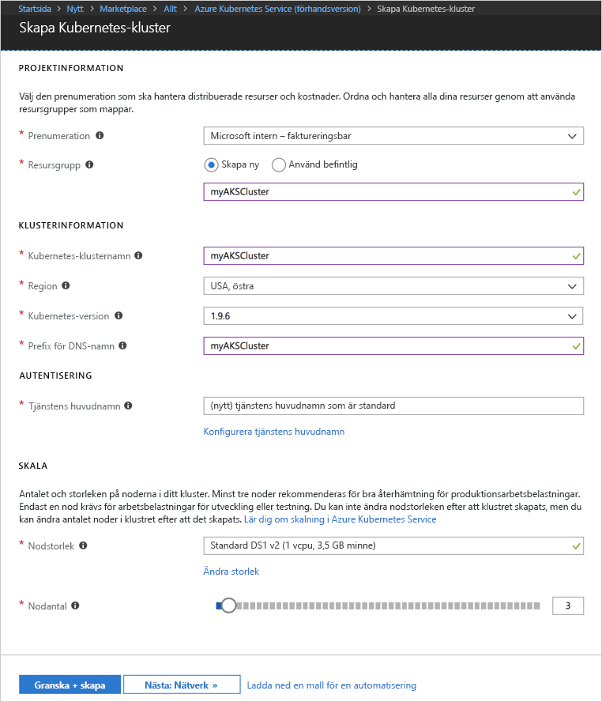
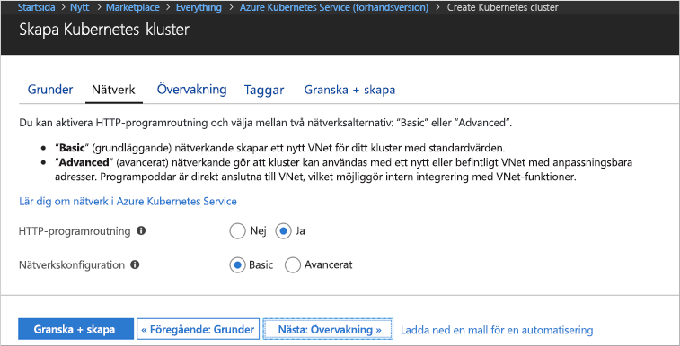
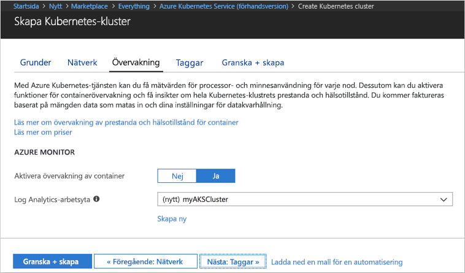
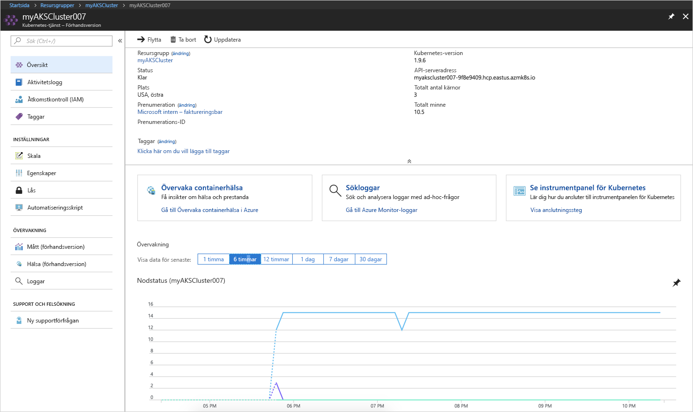
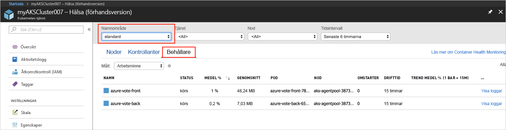
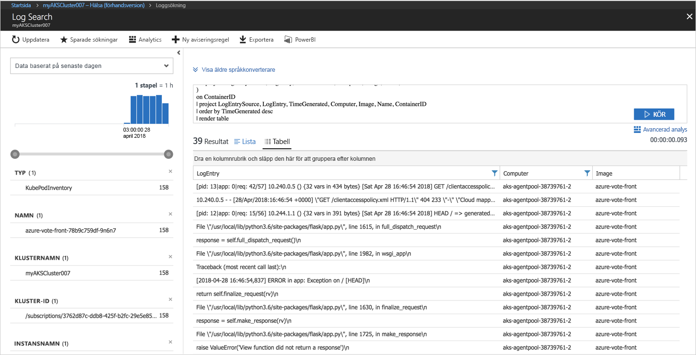

# <a name="quickstart-deploy-an-azure-kubernetes-service-aks-cluster"></a>Snabbstart: Distribuera ett Azure Kubernetes Service-kluster (AKS)

I den här snabbstarten ska du distribuera ett AKS-kluster med hjälp av Azure-portalen. Därefter kör vi ett flerbehållarprogram som består av en webbklientdel och en Redis-instans i klustret. När vi har gjort det kan programmet nås via Internet.


Den här snabbstarten förutsätter grundläggande kunskaper om Kubernetes-begrepp. Detaljerad information om Kubernetes finns i [Kubernetes-dokumentationen][kubernetes-documentation].

## <a name="sign-in-to-azure"></a>Logga in på Azure

Logga in på Azure Portal på http://portal.azure.com.


## <a name="create-aks-cluster"></a>Skapa AKS-kluster

Välj **Skapa en resurs** > välj **Kubernetes Service** > **Skapa**.

Utför följande steg under varje rubrik för att skapa AKS-klustret.

- **PROJEKTINFORMATION**: välj en Azure-prenumeration och en ny eller befintlig Azure-resursgrupp.
- **KLUSTERINFORMATION**: ange namn, region, version och DNS-prefix för AKS-klustret.
- **AUTENTISERING**: skapa ett nytt huvudnamn för tjänsten eller använd ett befintligt. Du måste ange ID och hemlighet för SPN-klienten om du använder ett befintligt SPN.
- **SKALNING**: välj en VM-storlek för AKS-noderna. VM-storleken **kan inte** ändras efter att ett AKS-kluster har distribuerats. Markera också antalet noder som ska distribueras till klustret. Antalet noder **kan** justeras efter att klustret har distribuerats.

Välj **Nästa: nätverk** när du är klar.



Konfigurera följande nätverksalternativ:

- **HTTP-programroutning** – konfigurerar en integrerad kontrollant för inkommande trafik som automatiskt skapar offentliga DNS-namn. Mer information om HTTP-routning finns i [AKS HTTP-routning och DNS][http-routing].
- **Nätverkskonfiguration** – välj mellan grundläggande konfiguration med hjälp av [kubenet][kubenet] plugin-programmet Kubernetes eller avancerad konfiguration med hjälp av [Azure CNI][azure-cni]. Mer information om nätverksalternativ finns i [Översikt över AKS-nätverk][aks-network].

Välj **Nästa: övervakning** när du är klar.



När du distribuerar ett AKS-kluster, kan Azure Container Insights konfigureras för att övervaka hälsotillståndet för AKS-klustret och poddar som körs i klustret. Mer information om övervakning av hälsotillstånd för behållare finns i [Övervaka hälsotillstånd för Azure Kubernets Service][aks-monitor].

Välj **Ja** för att aktivera övervakning av behållaren och välj en befintlig Log Analytics-arbetsyta eller skapa en ny.

Välj **Granska + skapa** och välj sedan **Skapa** när du är klar.



Efter en kort stund är AKS-klustret distribuerat och klart att användas. Bläddra till AKS-klusterresursgruppen och välj AKS-resursen, så bör du se AKS-klusterinstrumentpanel.



## <a name="connect-to-the-cluster"></a>Anslut till klustret

Hantera Kubernetes-kluster med [kubectl][kubectl], Kubernetes kommandoradsklient. Klienten kubectl är förinstallerad i Azure Cloud Shell.

Öppna Cloud Shell med knappen längst upp till höger i Azure-portalen.


Du konfigurerar kubectl att ansluta till ditt Kubernetes-kluster genom att köra kommandot [aaz aks get-credentials][az-aks-get-credentials].

Kopiera och klistra in följande kommando i Cloud Shell. Ändra resursnamnet grupp och klustret om det behövs.

```azurecli-interactive
az aks get-credentials --resource-group myAKSCluster --name myAKSCluster
```

Du kan kontrollera anslutningen till klustret genom att köra kommandot [kubectl get][kubectl-get] för att returnera en lista över klusternoderna.

```azurecli-interactive
kubectl get nodes
```

Resultat:

```
NAME                       STATUS    ROLES     AGE       VERSION
aks-agentpool-11482510-0   Ready     agent     9m        v1.9.6
aks-agentpool-11482510-1   Ready     agent     8m        v1.9.6
aks-agentpool-11482510-2   Ready     agent     9m        v1.9.6
```

## <a name="run-the-application"></a>Köra programmet

Kubernetes-manifestfiler definierar ett önskat tillstånd för ett kluster, till exempel vilka behållaravbildningar som ska köras. I det här exemplet används ett manifest för att skapa alla objekt som behövs för att köra Azure Vote-programmet. Dessa objekt omfattar två [Kubernetes-distributioner][kubernetes-deployment], en för Azure Vote-klientdelen och den andra för en Redis-instans. Dessutom skapas två [Kubernetes-tjänster][kubernetes-service], en intern tjänst för Redis-instansen och en extern tjänst för att komma åt Azure Vote-programmet från Internet.

Skapa en fil med namnet `azure-vote.yaml` och kopiera följande YAML-kod till den. Om du arbetar i Azure Cloud Shell kan du skapa filen med ”vi” eller Nano som i ett virtuellt eller fysiskt system.

```yaml
apiVersion: apps/v1beta1
kind: Deployment
metadata:
  name: azure-vote-back
spec:
  replicas: 1
  template:
    metadata:
      labels:
        app: azure-vote-back
    spec:
      containers:
      - name: azure-vote-back
        image: redis
        ports:
        - containerPort: 6379
          name: redis
---
apiVersion: v1
kind: Service
metadata:
  name: azure-vote-back
spec:
  ports:
  - port: 6379
  selector:
    app: azure-vote-back
---
apiVersion: apps/v1beta1
kind: Deployment
metadata:
  name: azure-vote-front
spec:
  replicas: 1
  template:
    metadata:
      labels:
        app: azure-vote-front
    spec:
      containers:
      - name: azure-vote-front
        image: microsoft/azure-vote-front:v1
        ports:
        - containerPort: 80
        env:
        - name: REDIS
          value: "azure-vote-back"
---
apiVersion: v1
kind: Service
metadata:
  name: azure-vote-front
spec:
  type: LoadBalancer
  ports:
  - port: 80
  selector:
    app: azure-vote-front
```

Använd kommandot [kubectl apply][kubectl-apply] för att köra programmet.

```azurecli-interactive
kubectl apply -f azure-vote.yaml
```

Resultat:

```
deployment "azure-vote-back" created
service "azure-vote-back" created
deployment "azure-vote-front" created
service "azure-vote-front" created
```

## <a name="test-the-application"></a>Testa programmet

När programmet körs skapas en [Kubernetes-tjänst][kubernetes-service] för att göra programmet tillgängligt mot Internet. Den här processen kan ta ett par minuter att slutföra.

Du kan övervaka förloppet genom att använda kommandot [kubectl get service][kubectl-get] med argumentet `--watch`.

```azurecli-interactive
kubectl get service azure-vote-front --watch
```

Till en början visas *EXTERNAL-IP* för *azure-vote-front*-tjänsten som *pending* (väntande).

```
NAME               TYPE           CLUSTER-IP   EXTERNAL-IP   PORT(S)        AGE
azure-vote-front   LoadBalancer   10.0.37.27   <pending>     80:30572/TCP   6s
```

När *EXTERNAL-IP*-adressen har ändrats från *pending* till en *IP-adress* använder du `CTRL-C` för att stoppa kubectl-övervakningsprocessen.

```
azure-vote-front   LoadBalancer   10.0.37.27   52.179.23.131   80:30572/TCP   2m
```

Gå till den externa IP-adressen så att du ser Azure Vote-appen.


## <a name="monitor-health-and-logs"></a>Övervaka hälsotillstånd och loggar

Om övervakningen av insikter om behållaren har aktiverats, finns hälsomått för både AKS-klustret och poddar som körs på klustret tillgängliga i instrumentpanelen för AKS-klustret. Mer information om övervakning av hälsotillstånd för behållare finns i [Övervaka hälsotillstånd för Azure Kubernets Service][aks-monitor].

Om du vill visa aktuell status, driftstid och resursanvändning för Azure Vote-poddar, går du tillbaka till AKS-resursen och väljer **Övervaka behållarens hälsotillstånd** > namnområdet **standard** > **Behållare**. Det kan ta några minuter för dessa data att hämtas till Azure Portal.



Om du vill se loggarna för podden `azure-vote-front`, väljer du länken **Visa loggar**. Loggarna inkluderar strömmarna stdout och stderr från behållaren.



## <a name="delete-cluster"></a>Ta bort klustret

När klustret inte längre behövs, kan du ta bort klusterresursen. Alla associerade resurser tas då också bort. Du kan göra detta i Azure Portal genom att klicka på borttagningsknappen på AKS-klustrets instrumentpanel. Du kan även använda kommandot [az aks delete][az-aks-delete] i Cloud Shell.

```azurecli-interactive
az aks delete --resource-group myAKSCluster --name myAKSCluster --no-wait
```

## <a name="get-the-code"></a>Hämta koden

I den här snabbstarten har fördefinierade behållaravbildningar använts för att skapa en Kubernetes-distribution. Den tillhörande programkoden, Dockerfile och Kubernetes-manifestfilen finns på GitHub.

[https://github.com/Azure-Samples/azure-voting-app-redis][azure-vote-app]

## <a name="next-steps"></a>Nästa steg

I den här snabbstartsguiden distribuerade du ett Kubernetes-kluster och distribuerade sedan ett flerbehållarprogram till det.

Om du vill lära dig mer om AKS, och gå igenom ett exempel med fullständig distributionskod, fortsätter du till självstudiekursen om Kubernetes-kluster.

> [!div class="nextstepaction"]
> [Självstudiekurs om AKS][aks-tutorial]

<!-- LINKS - external -->
[azure-vote-app]: https://github.com/Azure-Samples/azure-voting-app-redis.git
[azure-cni]: https://github.com/Azure/azure-container-networking/blob/master/docs/cni.md
[kubectl]: https://kubernetes.io/docs/user-guide/kubectl/
[kubectl-apply]: https://kubernetes.io/docs/reference/generated/kubectl/kubectl-commands#apply
[kubectl-get]: https://kubernetes.io/docs/reference/generated/kubectl/kubectl-commands#get
[kubenet]: https://kubernetes.io/docs/concepts/cluster-administration/network-plugins/#kubenet
[kubernetes-deployment]: https://kubernetes.io/docs/concepts/workloads/controllers/deployment/
[kubernetes-documentation]: https://kubernetes.io/docs/home/
[kubernetes-service]: https://kubernetes.io/docs/concepts/services-networking/service/

<!-- LINKS - internal -->
[az-aks-get-credentials]: /cli/azure/aks?view=azure-cli-latest#az_aks_get_credentials
[az-aks-delete]: /cli/azure/aks#az-aks-delete
[aks-monitor]: ../monitoring/monitoring-container-health.md
[aks-network]: ./networking-overview.md
[aks-tutorial]: ./tutorial-kubernetes-prepare-app.md
[http-routing]: ./http-application-routing.md
