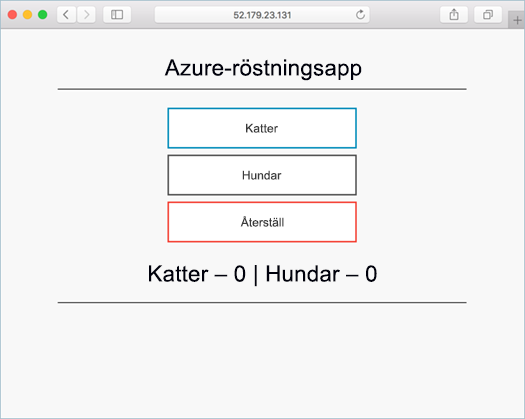

# <a name="quickstart-deploy-an-azure-kubernetes-service-aks-cluster"></a>Snabbstart: Distribuera ett AKS-kluster (Azure Kubernetes Service)

I den här snabbstarten ska du distribuera ett AKS-kluster med hjälp av Azure-portalen. Därefter kör vi ett flerbehållarprogram som består av en webbklientdel och en Redis-instans i klustret. När vi har gjort det kan programmet nås via Internet.



Den här snabbstarten förutsätter grundläggande kunskaper om Kubernetes-begrepp. Detaljerad information om Kubernetes finns i [Kubernetes-dokumentationen][kubernetes-documentation].

Om du inte har en Azure-prenumeration kan du skapa ett [kostnadsfritt konto](https://azure.microsoft.com/free/?WT.mc_id=A261C142F) innan du börjar.

## <a name="sign-in-to-azure"></a>Logga in på Azure

Logga in på Azure Portal på https://portal.azure.com.

## <a name="create-an-aks-cluster"></a>Skapa ett AKS-kluster

Längst upp i vänstra hornet i Azure-portalen väljer du **Skapa en resurs** > **Kubernetes Service**.

Du skapar ett AKS-kluster genom att slutföra följande steg:

1. **Grunder** – Konfigurera följande alternativ:
    - *PROJEKTINFORMATION*: Välj en Azure-prenumeration och välj sedan eller skapa en Azure-resursgrupp, till exempel *myResourceGroup*. Ange ett **Kubernetes-klusternamn**, till exempel *myAKSCluster*.
    - *KLUSTERINFORMATION*: Välj en region, en Kubernetes-version och ett DNS-namnprefix för AKS-klustret.
    - *SKALA*: Välj en storlek på virtuell dator för AKS-noderna. VM-storleken **kan inte** ändras efter att ett AKS-kluster har distribuerats.
        - Välj även det antal noder som ska distribueras till klustret. För den här snabbstarten ställer du in **Nodantal** till *1*. Antalet noder **kan** justeras efter att klustret har distribuerats.
    
    

    Välj **Nästa: Autentisering** när det är klart.

1. **Autentisering**: Konfigurera följande alternativ:
    - Skapa ett nytt tjänsthuvudnamn eller *Konfigurera* för att använda ett befintligt. Du måste ange ID och hemlighet för SPN-klienten om du använder ett befintligt SPN.
    - Aktivera alternativet för kontroller för rollbaserad åtkomstkontroll (RBAC) för Kubernetes. De här kontrollerna ger mer detaljerad kontroll över åtkomst till de Kubernetes-resurser som har distribuerats i ditt AKS-kluster.

    Välj **Nästa: nätverk** när du är klar.

1. **Nätverk**: Konfigurera följande nätverksalternativ:
    
    - **HTTP-programdirigering** – välj **Ja** för att konfigurera en integrerad kontrollant för inkommande trafik som automatiskt skapar offentliga DNS-namn. Mer information om HTTP-routning finns i [AKS HTTP-routning och DNS][http-routing].
    - **Nätverkskonfiguration** – välj nätverkskonfigurationen **Grundläggande** med hjälp av Kubernetes-plugin-programmet [kubenet][kubenet] i stället för avancerad nätverkskonfiguration med [Azure CNI][azure-cni]. Mer information om nätverksalternativ finns i [Översikt över AKS-nätverk][aks-network].
    
    Välj **Nästa: övervakning** när du är klar.

1. När du distribuerar ett AKS-kluster, kan Azure Monitor för containrar konfigureras för att övervaka hälsotillståndet för AKS-klustret och poddar som körs i klustret. Mer information om övervakning av hälsotillstånd för containrar finns i [Övervaka hälsotillstånd för Azure Kubernets Service][aks-monitor].

    Välj **Ja** för att aktivera övervakning av containern och välj en befintlig Log Analytics-arbetsyta eller skapa en ny.
    
    Välj **Granska + skapa** och välj sedan **Skapa** när det är klart.

Det tar några minuter för AKS-klustret att skapas och bli redo för användning. Bläddra till AKS-klusterresursgruppen, till exempel *myResourceGroup*, och välj AKS-resursen, till exempel *myAKSCluster*. Instrumentpanelen för AKS-klustret visas som i följande exempelskärmbild:


## <a name="connect-to-the-cluster"></a>Anslut till klustret

Hantera Kubernetes-kluster med [kubectl][kubectl], Kubernetes kommandoradsklient. `kubectl`-klienten är förinstallerad i Azure Cloud Shell.

Öppna Cloud Shell med knappen längst upp till höger i Azure-portalen.


Använd kommandot [az aks get-credentials][az-aks-get-credentials] för att konfigurera `kubectl` till att ansluta till ditt Kubernetes-kluster. I följande exempel hämtas autentiseringsuppgifterna för klusternamnet *myAKSCluster* i den resursgrupp som heter *myResourceGroup*:

```azurecli-interactive
az aks get-credentials --resource-group myResourceGroup --name myAKSCluster
```

Du kan kontrollera anslutningen till klustret genom att köra kommandot [kubectl get][kubectl-get] för att returnera en lista över klusternoderna.

```azurecli-interactive
kubectl get nodes
```

Följande exempelutdata visar den enskilda nod som skapades i föregående steg. Kontrollera att status för noden är ”klar”.

```
NAME                       STATUS    ROLES     AGE       VERSION
aks-agentpool-14693408-0   Ready     agent     10m       v1.11.2
```

## <a name="run-the-application"></a>Köra programmet

Kubernetes-manifestfiler definierar ett önskat tillstånd för ett kluster, till exempel vilka containeravbildningar som ska köras. I den här snabbstarten används ett manifest för att skapa alla de objekt som behövs för att köra ett Azure Vote-exempelprogram. De här objekten innefattar två [Kubernetes-distributioner][kubernetes-deployment] – en för Azure Vote-klientdelen och den andra för en Redis-instans. Dessutom skapas två [Kubernetes-tjänster][kubernetes-service] – en intern tjänst för Redis-instansen och en extern tjänst för att komma åt Azure Vote-programmet från Internet.

> [!TIP]
> I den här snabbstarten skapar och distribuerar du manuellt applikationsmanifest till AKS-klustret. I verkliga scenarier kan du använda [Azure Dev Spaces][azure-dev-spaces] för att snabbt iterera och felsöka koden direkt i AKS-klustret. Du kan använda Dev Spaces på olika OS-plattformar och i olika utvecklingsmiljöer samt arbeta tillsammans med andra i ditt team.

Skapa en fil med namnet `azure-vote.yaml` och kopiera följande YAML-kod till den. Om du arbetar i Azure Cloud Shell kan du skapa filen med `vi` eller `Nano` som i ett virtuellt eller fysiskt system.

```yaml
apiVersion: apps/v1
kind: Deployment
metadata:
  name: azure-vote-back
spec:
  replicas: 1
  selector:
    matchLabels:
      app: azure-vote-back
  template:
    metadata:
      labels:
        app: azure-vote-back
    spec:
      containers:
      - name: azure-vote-back
        image: redis
        resources:
          requests:
            cpu: 100m
            memory: 128Mi
          limits:
            cpu: 250m
            memory: 256Mi
        ports:
        - containerPort: 6379
          name: redis
---
apiVersion: v1
kind: Service
metadata:
  name: azure-vote-back
spec:
  ports:
  - port: 6379
  selector:
    app: azure-vote-back
---
apiVersion: apps/v1
kind: Deployment
metadata:
  name: azure-vote-front
spec:
  replicas: 1
  selector:
    matchLabels:
      app: azure-vote-front
  template:
    metadata:
      labels:
        app: azure-vote-front
    spec:
      containers:
      - name: azure-vote-front
        image: microsoft/azure-vote-front:v1
        resources:
          requests:
            cpu: 100m
            memory: 128Mi
          limits:
            cpu: 250m
            memory: 256Mi
        ports:
        - containerPort: 80
        env:
        - name: REDIS
          value: "azure-vote-back"
---
apiVersion: v1
kind: Service
metadata:
  name: azure-vote-front
spec:
  type: LoadBalancer
  ports:
  - port: 80
  selector:
    app: azure-vote-front
```

Använd kommandot [kubectl apply][kubectl-apply] för att köra programmet.

```azurecli-interactive
kubectl apply -f azure-vote.yaml
```

Följande exempelutdata visar Kubernetes-resurser som skapas på AKS-klustret:

```
deployment "azure-vote-back" created
service "azure-vote-back" created
deployment "azure-vote-front" created
service "azure-vote-front" created
```

## <a name="test-the-application"></a>Testa programmet

När programmet körs skapas en [Kubernetes-tjänst][kubernetes-service] för att göra programmet tillgängligt mot Internet. Den här processen kan ta ett par minuter att slutföra.

Du kan övervaka förloppet genom att använda kommandot [kubectl get service][kubectl-get] med argumentet `--watch`.

```azurecli-interactive
kubectl get service azure-vote-front --watch
```

Till en början visas *EXTERNAL-IP* för *azure-vote-front*-tjänsten som *pending* (väntande).

```
NAME               TYPE           CLUSTER-IP   EXTERNAL-IP   PORT(S)        AGE
azure-vote-front   LoadBalancer   10.0.37.27   <pending>     80:30572/TCP   6s
```

När *EXTERNAL-IP*-adressen har ändrats från *pending* till en *IP-adress* använder du `CTRL-C` för att stoppa kubectl-övervakningsprocessen.

```
azure-vote-front   LoadBalancer   10.0.37.27   52.179.23.131   80:30572/TCP   2m
```

Öppna en webbläsare till externa IP-adressen för din tjänst för att se Azure Vote-appen, enligt följande exempel:


## <a name="monitor-health-and-logs"></a>Övervaka hälsotillstånd och loggar

När du skapade klustret aktiverades övervakning av containerinsikter. Den här övervakningsfunktionen tillhandahåller hälsomått för både AKS-klustret och de poddar som körs i klustret. Mer information om övervakning av hälsotillstånd för containrar finns i [Övervaka hälsotillstånd för Azure Kubernets Service][aks-monitor].

Det kan ta några minuter för dessa data att hämtas till Azure Portal. Om du vill se aktuell status, drifttid och resursanvändning för Azure Vote poddarna bläddrar du tillbaka till AKS-resursen i Azure-portalen, till exempel *myAKSCluster*. Du kan sedan komma åt hälsostatusen så här:

1. Under **Övervakning** väljer du **Insights (förhandsversion)** på vänster sida
1. Överst väljer du **+ Lägg till filter**
1. Välj *Namnrymd* som egenskapen, och välj sedan *\<Alla förutom kube-system\>*
1. Välja att visa **containrarna**.

Containrarna *bak-azure-vote* och *azure-vote-front* visas enligt följande exempel:


Om du vill se loggar för podden `azure-vote-front` väljer du länken **Visa containerloggar** på höger sida av listan över containrar. Loggarna inkluderar strömmarna *stdout* och *stderr* från containern.


## <a name="delete-cluster"></a>Ta bort klustret

När klustret inte längre behövs, kan du ta bort klusterresursen. Alla associerade resurser tas då också bort. Du kan göra detta i Azure-portalen genom att välja knappen **Ta bort** på AKS-klustrets instrumentpanel. Du kan även använda kommandot [az aks delete][az-aks-delete] i Cloud Shell:

```azurecli-interactive
az aks delete --resource-group myResourceGroup --name myAKSCluster --no-wait
```

> [!NOTE]
> När du tar bort klustret tas Azure Active Directory-tjänstens huvudnamn, som används av AKS-klustret, inte bort. Stegvisa instruktioner om hur du tar bort tjänstens huvudnamn finns i dokumentationen om [viktiga överväganden och borttagning av AKS-tjänsten][sp-delete].

## <a name="get-the-code"></a>Hämta koden

I den här snabbstarten har fördefinierade containeravbildningar använts för att skapa en Kubernetes-distribution. Den tillhörande programkoden, Dockerfile och Kubernetes-manifestfilen finns på GitHub.

[https://github.com/Azure-Samples/azure-voting-app-redis][azure-vote-app]

## <a name="next-steps"></a>Nästa steg

I den här snabbstartsguiden distribuerade du ett Kubernetes-kluster och distribuerade sedan ett flerbehållarprogram till det.

Om du vill lära dig mer om AKS, och gå igenom ett exempel med fullständig distributionskod, fortsätter du till självstudiekursen om Kubernetes-kluster.

> [!div class="nextstepaction"]
> [Självstudiekurs om AKS][aks-tutorial]

<!-- LINKS - external -->
[azure-vote-app]: https://github.com/Azure-Samples/azure-voting-app-redis.git
[azure-cni]: https://github.com/Azure/azure-container-networking/blob/master/docs/cni.md
[kubectl]: https://kubernetes.io/docs/user-guide/kubectl/
[kubectl-apply]: https://kubernetes.io/docs/reference/generated/kubectl/kubectl-commands#apply
[kubectl-get]: https://kubernetes.io/docs/reference/generated/kubectl/kubectl-commands#get
[kubenet]: https://kubernetes.io/docs/concepts/cluster-administration/network-plugins/#kubenet
[kubernetes-deployment]: https://kubernetes.io/docs/concepts/workloads/controllers/deployment/
[kubernetes-documentation]: https://kubernetes.io/docs/home/
[kubernetes-service]: https://kubernetes.io/docs/concepts/services-networking/service/

<!-- LINKS - internal -->
[az-aks-get-credentials]: /cli/azure/aks?view=azure-cli-latest#az-aks-get-credentials
[az-aks-delete]: /cli/azure/aks#az-aks-delete
[aks-monitor]: ../monitoring/monitoring-container-health.md
[aks-network]: ./concepts-network.md
[aks-tutorial]: ./tutorial-kubernetes-prepare-app.md
[http-routing]: ./http-application-routing.md
[sp-delete]: kubernetes-service-principal.md#additional-considerations
[azure-dev-spaces]: https://docs.microsoft.com/azure/dev-spaces/
