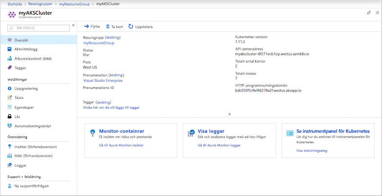
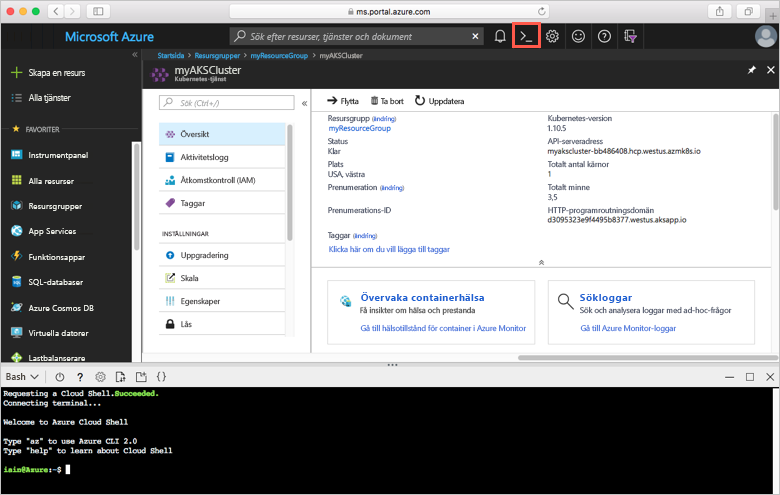
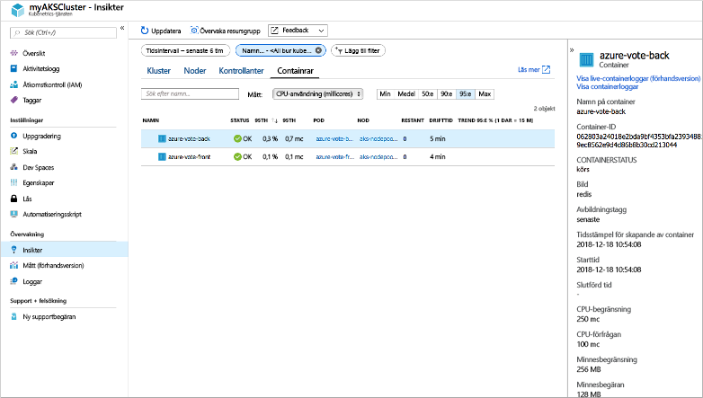
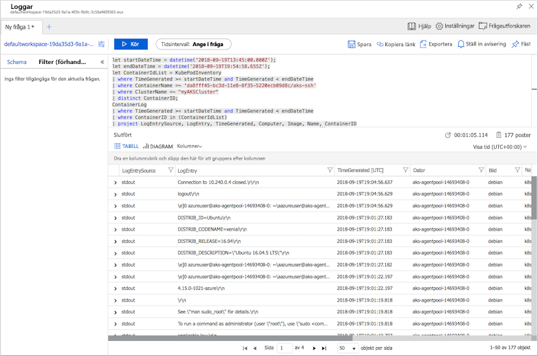

# <a name="quickstart-deploy-an-azure-kubernetes-service-aks-cluster-using-the-azure-portal"></a>Snabb start: Distribuera ett Azure Kubernetes service-kluster (AKS) med hjälp av Azure Portal

Azure Kubernetes Service (AKS) är en hanterad Kubernetes-tjänst som gör att du snabbt kan distribuera och hantera kluster. I den här snabbstarten ska du distribuera ett AKS-kluster med hjälp av Azure-portalen. Ett flerbehållarprogram som består av en webbklientdel och en Redis-instans körs sedan i klustret. Då ser du hur du övervakar hälsotillståndet för klustret och poddar som kör programmet.


Den här snabbstarten förutsätter grundläggande kunskaper om Kubernetes-begrepp. Mer information finns i [Viktiga koncept för Azure Kubernetes Service (AKS)][kubernetes-concepts].

Om du inte har någon Azure-prenumeration kan du [skapa ett kostnadsfritt konto](https://azure.microsoft.com/free/?WT.mc_id=A261C142F) innan du börjar.

## <a name="sign-in-to-azure"></a>Logga in på Azure

Logga in på Azure Portal på [https://portal.azure.com](https://portal.azure.com).

## <a name="create-an-aks-cluster"></a>Skapa ett AKS-kluster

Du skapar ett AKS-kluster genom att slutföra följande steg:

1. I menyn i Azure-portalen eller på sidan **Start** väljer du **Skapa en resurs**.

2. Välj **Containrar** >  **Kubernetes Service**.

3. På sidan **Grunder** konfigurerar du följande alternativ:
    - **Projekt information**: Välj en Azure- **prenumeration** och välj eller skapa en Azure- **resurs grupp**, till exempel *myResourceGroup*.
    - **Kluster information**: Ange ett **Kubernetes-kluster namn**, till exempel *myAKSCluster*. Välj en **region** och en **Kubernetes-version** för AKS-klustret.
    - **Primär Node-pool**: Välj en VM- **nods storlek** för AKS-noderna. Den virtuella datorns storlek *kan inte* ändras när ett AKS-kluster har distribuerats.
            -Välj antalet noder som ska distribueras till klustret. För den här snabbstarten ställer du in **Nodantal** till *1*. Antalet noder *kan* justeras efter att klustret har distribuerats.
    
    

    Välj **Nästa: Node-pooler** när du är klar.

4. Behåll standard alternativen på sidan **Node-pooler** . Längst ned på skärmen klickar du på **Nästa: autentisering**.
    > [!CAUTION]
    > Det kan ta flera minuter att sprida nya AAD-tjänstens huvud namn och bli tillgängliga, vilket orsakar att tjänstens huvud namn inte hittades fel och validerings fel i Azure Portal. Om du når [den här lösningen går du](troubleshooting.md#received-an-error-saying-my-service-principal-wasnt-found-or-is-invalid-when-i-try-to-create-a-new-cluster) vidare till lösning.

5. På sidan **Autentisering** konfigurerar du följande alternativ:
    - Skapa ett nytt tjänsthuvudnamn genom att låta fältet **tjänstens huvudnamn** vara **(nytt) standardtjänsthuvudnamn**. Eller så kan du välja *Konfigurera tjänstens huvudnamn* om du vill använda ett befintligt. Om du använder en befintlig måste du ange klient-ID och hemlighet för tjänstens huvud namn.
    - Aktivera alternativet för Kubernetes-rollbaserad åtkomst kontroll (Kubernetes RBAC). Detta ger mer detaljerad kontroll över åtkomsten till de Kubernetes-resurser som distribueras i ditt AKS-kluster.

    Alternativt kan du använda en hanterad identitet i stället för ett huvud namn för tjänsten. Mer information finns i [använda hanterade identiteter](use-managed-identity.md) .

Som standard används *Grundläggande* nätverk och Azure Monitor för container är aktiverat. Klicka på **Granska + skapa** och sedan **Skapa** när valideringen är klar.

Det tar några minuter att skapa AKS-klustret. När distributionen är klar klickar du på **gå till resurs**, eller bläddrar till resurs gruppen AKS-kluster, till exempel *myResourceGroup*, och väljer AKS-resursen, till exempel *myAKSCluster*. AKS-klustrets instrument panel visas, som i det här exemplet:



## <a name="connect-to-the-cluster"></a>Anslut till klustret

För att hantera Kubernetes-kluster använder du [kubectl][kubectl], Kubernetes kommandoradsklient. `kubectl`-klienten är förinstallerad i Azure Cloud Shell.

Öppna Cloud Shell med `>_` knappen överst i Azure Portal.



För att konfigurera `kubectl` till att ansluta till ditt Kubernetes-kluster använder du kommandot [az aks get-credentials][az-aks-get-credentials]. Det här kommandot laddar ned autentiseringsuppgifter och konfigurerar Kubernetes CLI för att använda dem. I följande exempel hämtas autentiseringsuppgifterna för klusternamnet *myAKSCluster* i den resursgrupp som heter *myResourceGroup*:

```azurecli
az aks get-credentials --resource-group myResourceGroup --name myAKSCluster
```

Du kan kontrollera anslutningen till klustret genom att köra kommandot [kubectl get][kubectl-get] för att returnera en lista över klusternoderna.

```console
kubectl get nodes
```

Följande exempelutdata visar den enskilda nod som skapades i föregående steg. Kontrollera att status för noden är *Klar*:

```output
NAME                       STATUS    ROLES     AGE       VERSION
aks-agentpool-14693408-0   Ready     agent     15m       v1.11.5
```

## <a name="run-the-application"></a>Kör programmet

En Kubernetes-manifestfil definierar ett önskat tillstånd för klustret, till exempel vilka containeravbildningar som ska köras. I den här snabbstarten används ett manifest för att skapa alla objekt som behövs för att köra Azure Vote-programmet. Det här manifestet innehåller två [Kubernetes-distributioner][kubernetes-deployment] – en för exemplet på Azure Vote Python-program och den andra för en Redis-instans. Två [Kubernetes-tjänster][kubernetes-service] skapas också – en intern tjänst för Redis-instansen och en extern tjänst för att komma åt Azure Vote-programmet från Internet.

I Cloud Shell använder du en redigerare för att skapa en fil med namnet `azure-vote.yaml` , till `code azure-vote.yaml` exempel `nano azure-vote.yaml` eller `vi azure-vote.yaml` . Kopiera sedan följande YAML-definition:

```yaml
apiVersion: apps/v1
kind: Deployment
metadata:
  name: azure-vote-back
spec:
  replicas: 1
  selector:
    matchLabels:
      app: azure-vote-back
  template:
    metadata:
      labels:
        app: azure-vote-back
    spec:
      nodeSelector:
        "beta.kubernetes.io/os": linux
      containers:
      - name: azure-vote-back
        image: mcr.microsoft.com/oss/bitnami/redis:6.0.8
        env:
        - name: ALLOW_EMPTY_PASSWORD
          value: "yes"
        resources:
          requests:
            cpu: 100m
            memory: 128Mi
          limits:
            cpu: 250m
            memory: 256Mi
        ports:
        - containerPort: 6379
          name: redis
---
apiVersion: v1
kind: Service
metadata:
  name: azure-vote-back
spec:
  ports:
  - port: 6379
  selector:
    app: azure-vote-back
---
apiVersion: apps/v1
kind: Deployment
metadata:
  name: azure-vote-front
spec:
  replicas: 1
  selector:
    matchLabels:
      app: azure-vote-front
  template:
    metadata:
      labels:
        app: azure-vote-front
    spec:
      nodeSelector:
        "beta.kubernetes.io/os": linux
      containers:
      - name: azure-vote-front
        image: mcr.microsoft.com/azuredocs/azure-vote-front:v1
        resources:
          requests:
            cpu: 100m
            memory: 128Mi
          limits:
            cpu: 250m
            memory: 256Mi
        ports:
        - containerPort: 80
        env:
        - name: REDIS
          value: "azure-vote-back"
---
apiVersion: v1
kind: Service
metadata:
  name: azure-vote-front
spec:
  type: LoadBalancer
  ports:
  - port: 80
  selector:
    app: azure-vote-front
```

Distribuera programmet med kommandot [kubectl apply][kubectl-apply] och ange namnet på ditt YAML-manifest:

```console
kubectl apply -f azure-vote.yaml
```

Följande exempelutdata visar de distributioner och tjänster som skapats:

```output
deployment "azure-vote-back" created
service "azure-vote-back" created
deployment "azure-vote-front" created
service "azure-vote-front" created
```

## <a name="test-the-application"></a>Testa programmet

När programmet körs så exponerar en Kubernetes-tjänst programmets klientdel mot Internet. Den här processen kan ta ett par minuter att slutföra.

Du kan övervaka förloppet genom att använda kommandot [kubectl get service][kubectl-get] med argumentet `--watch`.

```console
kubectl get service azure-vote-front --watch
```

Till en början visas *EXTERNAL-IP* för *azure-vote-front*-tjänsten som *väntande*.

```output
NAME               TYPE           CLUSTER-IP   EXTERNAL-IP   PORT(S)        AGE
azure-vote-front   LoadBalancer   10.0.37.27   <pending>     80:30572/TCP   6s
```

När *EXTERNAL-IP*-adressen ändras från *väntande* till en faktisk offentlig IP-adress använder du `CTRL-C` för att stoppa `kubectl`-övervakningsprocessen. Följande exempelutdata visar en giltig offentlig IP-adress som har tilldelats tjänsten:

```output
azure-vote-front   LoadBalancer   10.0.37.27   52.179.23.131   80:30572/TCP   2m
```

Om du vill se hur Azure Vote-appen fungerar i praktiken så öppnar du en webbläsare till den externa IP-adressen för din tjänst.


## <a name="monitor-health-and-logs"></a>Övervaka hälsotillstånd och loggar

När du skapade klustret aktiverades Azure Monitor för container. Den här övervakningsfunktionen tillhandahåller hälsomått för både AKS-klustret och de poddar som körs i klustret.

Det kan ta några minuter för dessa data att hämtas till Azure Portal. Om du vill se aktuell status, drifttid och resursanvändning för Azure Vote poddarna bläddrar du tillbaka till AKS-resursen i Azure-portalen, till exempel *myAKSCluster*. Du kan sedan komma åt hälsostatusen så här:

1. Under **Övervakning** väljer du **Insights** på vänster sida
1. Överst väljer du **+ Lägg till filter**
1. Välj *namn område* som egenskap och välj sedan *\<All but kube-system\>*
1. Välja att visa **containrarna**.

Containrarna *bak-azure-vote* och *azure-vote-front* visas enligt följande exempel:



Om du vill se loggar för `azure-vote-front` pod, väljer du **Visa behållar loggar** i list rutan i listan behållare. Dessa loggar inkluderar *STDOUT* -och *stderr* -strömmar från behållaren.



## <a name="delete-cluster"></a>Ta bort klustret

När klustret inte längre behövs, kan du ta bort klusterresursen. Alla associerade resurser tas då också bort. Du kan utföra den här åtgärden i Azure Portal genom att välja knappen **ta bort** på instrument panelen för AKS-klustret. Alternativt kan du använda kommandot [AZ AKS Delete][az-aks-delete] i Cloud Shell:

```azurecli
az aks delete --resource-group myResourceGroup --name myAKSCluster --no-wait
```

> [!NOTE]
> När du tar bort klustret tas Azure Active Directory-tjänstens huvudnamn, som används av AKS-klustret, inte bort. Stegvisa instruktioner om hur du tar bort tjänstens huvudnamn finns i dokumentationen om [viktiga överväganden och borttagning av AKS-tjänsten][sp-delete]. Om du använde en hanterad identitet hanteras identiteten av plattformen och kräver inte borttagning.

## <a name="get-the-code"></a>Hämta koden

I den här snabbstarten har fördefinierade containeravbildningar användes för att skapa en Kubernetes-distribution. Den tillhörande programkoden, Dockerfile och Kubernetes-manifestfilen finns på GitHub.

[https://github.com/Azure-Samples/azure-voting-app-redis][azure-vote-app]

## <a name="next-steps"></a>Nästa steg

I den här snabbstartsguiden distribuerade du ett Kubernetes-kluster och distribuerade sedan ett flercontainerprogram till det.

Om du vill lära dig mer om AKS, och gå igenom ett exempel med fullständig distributionskod, fortsätter du till självstudiekursen om Kubernetes-kluster.

> [!div class="nextstepaction"]
> [Självstudiekurs om AKS][aks-tutorial]

<!-- LINKS - external -->
[azure-vote-app]: https://github.com/Azure-Samples/azure-voting-app-redis.git
[kubectl]: https://kubernetes.io/docs/user-guide/kubectl/
[kubectl-apply]: https://kubernetes.io/docs/reference/generated/kubectl/kubectl-commands#apply
[kubectl-get]: https://kubernetes.io/docs/reference/generated/kubectl/kubectl-commands#get
[kubernetes-documentation]: https://kubernetes.io/docs/home/

<!-- LINKS - internal -->
[kubernetes-concepts]: concepts-clusters-workloads.md
[az-aks-get-credentials]: /cli/azure/aks?view=azure-cli-latest#az-aks-get-credentials
[az-aks-delete]: /cli/azure/aks#az-aks-delete
[aks-monitor]: ../azure-monitor/insights/container-insights-overview.md
[aks-network]: ./concepts-network.md
[aks-tutorial]: ./tutorial-kubernetes-prepare-app.md
[http-routing]: ./http-application-routing.md
[sp-delete]: kubernetes-service-principal.md#additional-considerations
[azure-dev-spaces]: ../dev-spaces/index.yml
[kubernetes-deployment]: concepts-clusters-workloads.md#deployments-and-yaml-manifests
[kubernetes-service]: concepts-network.md#services
