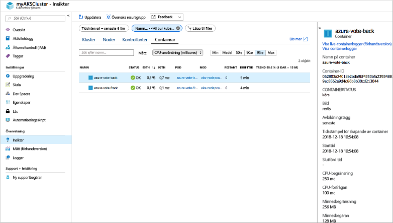
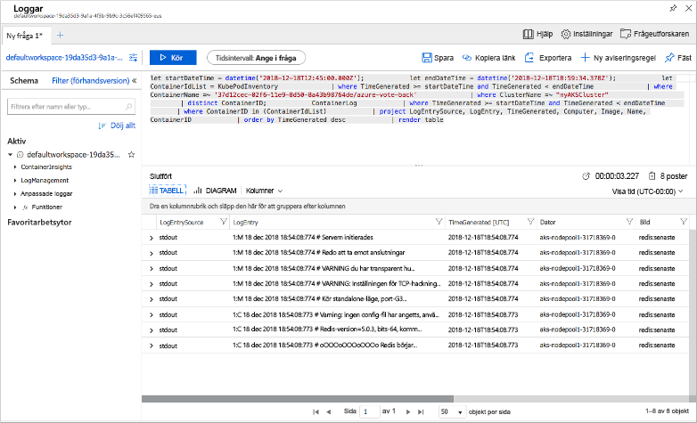

# <a name="quickstart-deploy-an-azure-kubernetes-service-aks-cluster-using-the-azure-cli"></a>Snabbstart: Distribuera ett kluster med Azure Kubernetes Service (AKS) med hjälp av Azure CLI

Azure Kubernetes Service (AKS) är en hanterad Kubernetes-tjänst som gör att du snabbt kan distribuera och hantera kluster. I den här snabbstarten ska du distribuera ett AKS-kluster med hjälp av Azure CLI. Ett flerbehållarprogram som består av en webbklientdel och en Redis-instans körs sedan i klustret. Då ser du hur du övervakar hälsotillståndet för klustret och poddar som kör programmet.


Den här snabbstarten förutsätter grundläggande kunskaper om Kubernetes-begrepp. Mer information finns i [Viktiga koncept för Azure Kubernetes Service (AKS)][kubernetes-concepts].

Om du inte har en Azure-prenumeration kan du skapa ett [kostnadsfritt konto](https://azure.microsoft.com/free/?WT.mc_id=A261C142F) innan du börjar.

[!INCLUDE [cloud-shell-try-it.md](../../includes/cloud-shell-try-it.md)]

Om du väljer att installera och använda CLI lokalt måste du köra Azure CLI version 2.0.52 eller senare. Kör `az --version` för att hitta versionen. Om du behöver installera eller uppgradera kan du läsa [Installera Azure CLI][azure-cli-install].

## <a name="create-a-resource-group"></a>Skapa en resursgrupp

En Azure-resursgrupp är en logisk grupp där Azure-resurser distribueras och hanteras. När du skapar en resursgrupp uppmanas du att ange en plats. Den här platsen är där dina resurser körs i Azure. Skapa en resursgrupp med hjälp av kommandot [az group create][az-group-create].

I följande exempel skapas en resursgrupp med namnet *myAKSCluster* på platsen *eastus*.

```azurecli-interactive
az group create --name myResourceGroup --location eastus
```

Följande exempelutdata visar den resursgrupp som skapats:

```json
{
  "id": "/subscriptions/<guid>/resourceGroups/myResourceGroup",
  "location": "eastus",
  "managedBy": null,
  "name": "myResourceGroup",
  "properties": {
    "provisioningState": "Succeeded"
  },
  "tags": null
}
```

## <a name="create-aks-cluster"></a>Skapa AKS-kluster

Använd kommandot [az aks create] [ az-aks-create] för att skapa ett AKS-kluster. I följande exempel skapas ett kluster med namnet *myAKSCluster* och en enda nod. Azure Monitor för containrar aktiveras också med hjälp av parametern *--enable-addons monitoring*.

```azurecli-interactive
az aks create \
    --resource-group myResourceGroup \
    --name myAKSCluster \
    --node-count 1 \
    --enable-addons monitoring \
    --generate-ssh-keys
```

Efter några minuter slutförs kommandot och returnerar JSON-formaterad information om klustret.

## <a name="connect-to-the-cluster"></a>Anslut till klustret

För att hantera Kubernetes-kluster använder du [kubectl][kubectl], Kubernetes kommandoradsklient. Om du använder Azure Cloud Shell är `kubectl` redan installerat. För att installera `kubectl` lokalt använder du kommandot [az aks install-cli][az-aks-install-cli]:

```azurecli
az aks install-cli
```

För att konfigurera `kubectl` till att ansluta till ditt Kubernetes-kluster använder du kommandot [az aks get-credentials][az-aks-get-credentials]. Det här kommandot laddar ned autentiseringsuppgifter och konfigurerar Kubernetes CLI för att använda dem.

```azurecli-interactive
az aks get-credentials --resource-group myResourceGroup --name myAKSCluster
```

Du kan kontrollera anslutningen till klustret genom att köra kommandot [kubectl get][kubectl-get] för att returnera en lista över klusternoderna.

```azurecli-interactive
kubectl get nodes
```

Följande exempelutdata visar den enskilda nod som skapades i föregående steg. Kontrollera att status för noden är *Klar*:

```
NAME                       STATUS   ROLES   AGE     VERSION
aks-nodepool1-31718369-0   Ready    agent   6m44s   v1.9.11
```

## <a name="run-the-application"></a>Köra programmet

En Kubernetes-manifestfil definierar ett önskat tillstånd för klustret, till exempel vilka containeravbildningar som ska köras. I den här snabbstarten används ett manifest för att skapa alla objekt som behövs för att köra Azure Vote-programmet. Det här manifestet innehåller två [Kubernetes-distributioner][kubernetes-deployment] – en för exemplet på Azure Vote Python-program och den andra för en Redis-instans. Två [Kubernetes-tjänster][kubernetes-service] skapas också – en intern tjänst för Redis-instansen och en extern tjänst för att komma åt Azure Vote-programmet från Internet.

> [!TIP]
> I den här snabbstarten skapar och distribuerar du manuellt applikationsmanifest till AKS-klustret. I verkliga scenarier kan du använda [Azure Dev Spaces][azure-dev-spaces] för att snabbt iterera och felsöka koden direkt i AKS-klustret. Du kan använda Dev Spaces på olika OS-plattformar och i olika utvecklingsmiljöer samt arbeta tillsammans med andra i ditt team.

Skapa en fil med namnet `azure-vote.yaml` och kopiera följande YAML-definition. Om du använder Azure Cloud Shell, kan du skapa filen med `vi` eller `nano` som om du arbetar i ett virtuellt eller fysiskt system:

```yaml
apiVersion: apps/v1
kind: Deployment
metadata:
  name: azure-vote-back
spec:
  replicas: 1
  selector:
    matchLabels:
      app: azure-vote-back
  template:
    metadata:
      labels:
        app: azure-vote-back
    spec:
      containers:
      - name: azure-vote-back
        image: redis
        resources:
          requests:
            cpu: 100m
            memory: 128Mi
          limits:
            cpu: 250m
            memory: 256Mi
        ports:
        - containerPort: 6379
          name: redis
---
apiVersion: v1
kind: Service
metadata:
  name: azure-vote-back
spec:
  ports:
  - port: 6379
  selector:
    app: azure-vote-back
---
apiVersion: apps/v1
kind: Deployment
metadata:
  name: azure-vote-front
spec:
  replicas: 1
  selector:
    matchLabels:
      app: azure-vote-front
  template:
    metadata:
      labels:
        app: azure-vote-front
    spec:
      containers:
      - name: azure-vote-front
        image: microsoft/azure-vote-front:v1
        resources:
          requests:
            cpu: 100m
            memory: 128Mi
          limits:
            cpu: 250m
            memory: 256Mi
        ports:
        - containerPort: 80
        env:
        - name: REDIS
          value: "azure-vote-back"
---
apiVersion: v1
kind: Service
metadata:
  name: azure-vote-front
spec:
  type: LoadBalancer
  ports:
  - port: 80
  selector:
    app: azure-vote-front
```

Distribuera programmet med kommandot [kubectl apply][kubectl-apply] och ange namnet på ditt YAML-manifest:

```azurecli-interactive
kubectl apply -f azure-vote.yaml
```

Följande exempelutdata visar de distributioner och tjänster som skapats:

```
deployment "azure-vote-back" created
service "azure-vote-back" created
deployment "azure-vote-front" created
service "azure-vote-front" created
```

## <a name="test-the-application"></a>Testa programmet

När programmet körs så exponerar en Kubernetes-tjänst programmets klientdel mot Internet. Den här processen kan ta ett par minuter att slutföra.

Du kan övervaka förloppet genom att använda kommandot [kubectl get service][kubectl-get] med argumentet `--watch`.

```azurecli-interactive
kubectl get service azure-vote-front --watch
```

Till en början visas *EXTERNAL-IP* för *azure-vote-front*-tjänsten som *väntande*.

```
NAME               TYPE           CLUSTER-IP   EXTERNAL-IP   PORT(S)        AGE
azure-vote-front   LoadBalancer   10.0.37.27   <pending>     80:30572/TCP   6s
```

När *EXTERNAL-IP*-adressen ändras från *väntande* till en faktisk offentlig IP-adress använder du `CTRL-C` för att stoppa `kubectl`-övervakningsprocessen. Följande exempelutdata visar en giltig offentlig IP-adress som har tilldelats tjänsten:

```
azure-vote-front   LoadBalancer   10.0.37.27   52.179.23.131   80:30572/TCP   2m
```

Om du vill se hur Azure Vote-appen fungerar i praktiken så öppnar du en webbläsare till den externa IP-adressen för din tjänst.


## <a name="monitor-health-and-logs"></a>Övervaka hälsotillstånd och loggar

När AKS-klustret skapades aktiverades Azure Monitor för containrar för att registrera hälsomått för både klusternoderna och poddarna. De här hälsomåtten är tillgängliga i Azure-portalen.

Om du vill se aktuell status, drifttid och resursanvändning för Azure Vote-poddarna slutför du följande steg:

1. Öppna en webbläsare till Azure-portalen [https://portal.azure.com][azure-portal].
1. Välj din resursgrupp, till exempel *myResourceGroup*, och välj sedan ditt AKS-kluster, till exempel *myAKSCluster*.
1. Under **Övervakning** väljer du **Insights**  på vänster sida
1. Överst väljer du **+ Lägg till filter**
1. Välj *Namnrymd* som egenskapen, och välj sedan *\<Alla förutom kube-system\>*
1. Välja att visa **containrarna**.

Containrarna *bak-azure-vote* och *azure-vote-front* visas enligt följande exempel:



Om du vill se loggar för podden `azure-vote-front` väljer du länken **Visa containerloggar** på höger sida av listan över containrar. Loggarna inkluderar strömmarna *stdout* och *stderr* från containern.



## <a name="delete-cluster"></a>Ta bort klustret

När klustret inte längre behövs kan du använda kommandot [az group delete][az-group-delete] för att ta bort resursgruppen, containertjänsten och alla relaterade resurser.

```azurecli-interactive
az group delete --name myResourceGroup --yes --no-wait
```

> [!NOTE]
> När du tar bort klustret tas Azure Active Directory-tjänstens huvudnamn, som används av AKS-klustret, inte bort. Stegvisa instruktioner om hur du tar bort tjänstens huvudnamn finns i dokumentationen om [viktiga överväganden och borttagning av AKS-tjänsten][sp-delete].

## <a name="get-the-code"></a>Hämta koden

I den här snabbstarten har fördefinierade containeravbildningar användes för att skapa en Kubernetes-distribution. Den tillhörande programkoden, Dockerfile och Kubernetes-manifestfilen finns på GitHub.

[https://github.com/Azure-Samples/azure-voting-app-redis][azure-vote-app]

## <a name="next-steps"></a>Nästa steg

I den här snabbstartsguiden distribuerade du ett Kubernetes-kluster och distribuerade sedan ett flerbehållarprogram till det.

Om du vill lära dig mer om AKS, och gå igenom ett exempel med fullständig distributionskod, fortsätter du till självstudiekursen om Kubernetes-kluster.

> [!div class="nextstepaction"]
> [Självstudiekurs om AKS][aks-tutorial]

<!-- LINKS - external -->
[azure-vote-app]: https://github.com/Azure-Samples/azure-voting-app-redis.git
[kubectl]: https://kubernetes.io/docs/user-guide/kubectl/
[kubectl-apply]: https://kubernetes.io/docs/reference/generated/kubectl/kubectl-commands#apply
[kubectl-get]: https://kubernetes.io/docs/reference/generated/kubectl/kubectl-commands#get
[azure-dev-spaces]: https://docs.microsoft.com/azure/dev-spaces/

<!-- LINKS - internal -->
[kubernetes-concepts]: concepts-clusters-workloads.md
[aks-monitor]: https://aka.ms/coingfonboarding
[aks-tutorial]: ./tutorial-kubernetes-prepare-app.md
[az-aks-browse]: /cli/azure/aks?view=azure-cli-latest#az-aks-browse
[az-aks-create]: /cli/azure/aks?view=azure-cli-latest#az-aks-create
[az-aks-get-credentials]: /cli/azure/aks?view=azure-cli-latest#az-aks-get-credentials
[az-aks-install-cli]: /cli/azure/aks?view=azure-cli-latest#az-aks-install-cli
[az-group-create]: /cli/azure/group#az-group-create
[az-group-delete]: /cli/azure/group#az-group-delete
[azure-cli-install]: /cli/azure/install-azure-cli
[sp-delete]: kubernetes-service-principal.md#additional-considerations
[azure-portal]: https://portal.azure.com
[kubernetes-deployment]: concepts-clusters-workloads.md#deployments-and-yaml-manifests
[kubernetes-service]: concepts-network.md#services
