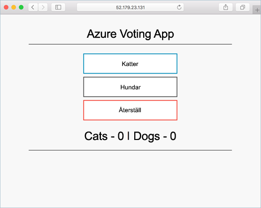

# <a name="tutorial-prepare-application-for-azure-container-service-aks"></a>Självstudier: Förbereda ett program för Azure Container Service (AKS)

I den här självstudien, som är del ett av åtta, förbereds ett program med flera behållare för användning i Kubernetes. Det här är några av stegen:  

> [!div class="checklist"]
> * Klona programkällan från GitHub  
> * Skapa en behållaravbildning från programkällan
> * Testa programmet i en lokal Docker-miljö

När den är slutförd är följande program tillgängligt i din lokala utvecklingsmiljö.



I efterföljande självstudier har behållaravbildningen laddats upp till ett Azure Container Registry och körs sedan i ett AKS-kluster.

## <a name="before-you-begin"></a>Innan du börjar

Den här självstudien förutsätter grundläggande kunskaper om grundläggande Docker-begrepp som behållare, behållaravbildningar och grundläggande docker-kommandon. Om det behövs kan du läsa om hur du [kommer igång med Docker][docker-get-started] och få en genomgång om behållare. 

För att slutföra den här självstudien behöver du en Docker-utvecklingsmiljö. Docker innehåller paket som enkelt kan konfigurera Docker på en [Mac][docker-for-mac]-, [Windows][docker-for-windows]- eller [Linux][docker-for-linux]-dator.

Azure Cloud Shell inkluderar inte de Docker-komponenter som krävs för att slutföra stegen i den här självstudien. Därför rekommenderar vi att du använder en fullständig Docker-utvecklingsmiljö.

## <a name="get-application-code"></a>Hämta programkod

Exempelprogrammet som används i den här självstudien är en enkel röstningsapp. Programmet består av en webbkomponent på klientsidan och en Redis-instans på serversidan. Webbkomponenten paketeras i en anpassad behållaravbildning. Redis-instansen använder en oförändrad avbildning från Docker Hub.  

Använd git och ladda ned en kopia av programmet till utvecklingsmiljön.

```console
git clone https://github.com/Azure-Samples/azure-voting-app-redis.git
```

Ändra katalogerna så att du arbetar från den klonade katalogen.

```console
cd azure-voting-app-redis
```

Inuti katalogen finns programmets källkod, en förskapad Docker Compose-fil och en Kubernetes-manifestfil. De här filerna används i hela självstudien. 

## <a name="create-container-images"></a>Skapa behållaravbildningar

[Docker Compose][docker-compose] kan användas för att automatisera kompilering från behållaravbildningar och distribution av program med flera behållare.

Kör filen `docker-compose.yaml` för att skapa behållaravbildningen, ladda ned Redis-avbildningen och starta programmet.

```console
docker-compose up -d
```

När kommandot har körts kan du använda kommandot [docker images][docker-images] till att se de avbildningar som skapats.

```console
docker images
```

Observera att tre avbildningar har laddats ned eller skapats. `azure-vote-front`-avbildningen innehåller programmet och använder `nginx-flask`-avbildningen som bas. `redis`-avbildningen används för att starta en Redis-instans.

```
REPOSITORY                   TAG        IMAGE ID            CREATED             SIZE
azure-vote-front             latest     9cc914e25834        40 seconds ago      694MB
redis                        latest     a1b99da73d05        7 days ago          106MB
tiangolo/uwsgi-nginx-flask   flask      788ca94b2313        9 months ago        694MB
```

Kör kommandot [docker ps][docker-ps] för att se de behållare som körs.

```console
docker ps
```

Resultat:

```
CONTAINER ID        IMAGE             COMMAND                  CREATED             STATUS              PORTS                           NAMES
82411933e8f9        azure-vote-front  "/usr/bin/supervisord"   57 seconds ago      Up 30 seconds       443/tcp, 0.0.0.0:8080->80/tcp   azure-vote-front
b68fed4b66b6        redis             "docker-entrypoint..."   57 seconds ago      Up 30 seconds       0.0.0.0:6379->6379/tcp          azure-vote-back
```

## <a name="test-application-locally"></a>Testa programmet lokalt

Gå till http://localhost:8080 om du vill se det program som körs.


## <a name="clean-up-resources"></a>Rensa resurser

Nu när programfunktionen har verifierats, kan behållarna som körs stoppas och tas bort. Ta inte bort behållaravbildningarna. `azure-vote-front`-avbildningen överförs till en Azure Container Registry-instans i nästa självstudie.

Kör följande för att stoppa de behållare som körs.

```console
docker-compose stop
```

Ta bort stoppade behållare och resurser med följande kommando.

```console
docker-compose down
```

När du är klar har du en behållaravbildning som innehåller programmet Azure Vote.

## <a name="next-steps"></a>Nästa steg

I den här självstudien testades ett program och behållaravbildningar skapades för programmet. Följande steg har slutförts:

> [!div class="checklist"]
> * Klona programkällan från GitHub  
> * Skapade en behållaravbildning från programkällan
> * Testade programmet i en lokal Docker-miljö

Fortsätt till nästa självstudie och lär dig om att lagra behållaravbildningar i ett Azure Container Registry.

> [!div class="nextstepaction"]
> [Push-överföra avbildningar till Azure Container Registry][aks-tutorial-prepare-acr]

<!-- LINKS - external -->
[docker-compose]: https://docs.docker.com/compose/
[docker-for-linux]: https://docs.docker.com/engine/installation/#supported-platforms
[docker-for-mac]: https://docs.docker.com/docker-for-mac/
[docker-for-windows]: https://docs.docker.com/docker-for-windows/
[docker-get-started]: https://docs.docker.com/get-started/
[docker-images]: https://docs.docker.com/engine/reference/commandline/images/
[docker-ps]: https://docs.docker.com/engine/reference/commandline/ps/

<!-- LINKS - internal -->
[aks-tutorial-prepare-acr]: ./tutorial-kubernetes-prepare-acr.md