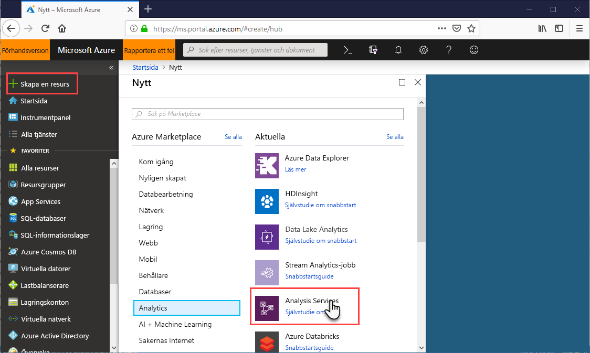
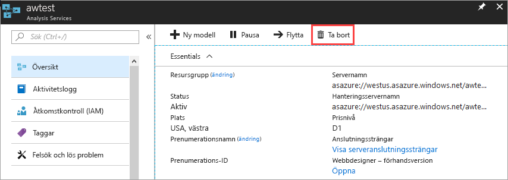

# Snabbstart: Skapa en server – portalen

Den här snabbstarten beskriver hur du skapar en Analysis Services-serverresurs i Azure-prenumerationen med hjälp av portalen.

## Nödvändiga komponenter 

* **Azure-prenumeration**: Gå till [Kostnadsfri utvärderingsversion av Azure](https://azure.microsoft.com/offers/ms-azr-0044p/) för att skapa ett konto.
* **Azure Active Directory**: Prenumerationen måste vara kopplad till en Azure Active Directory-klientorganisation. Och du måste vara inloggad på Azure med ett konto i den Azure Active Directory. Mer information finns i [Autentisering och användarbehörigheter](analysis-services-manage-users.md).

## Logga in på Azure Portal 

[Logga in på portalen](https://portal.azure.com)

## Skapa en server

1. Klicka på **+ Skapa en resurs** > **Analys** > **Analysis Services**.

    

2. I **Analysis Services** fyller du i de fält som krävs och trycker sedan på **Skapa**.
   
   * **Servernamn**: Skriv ett unikt namn som används för att referera till servern.
   * **Prenumeration**: Välj den prenumeration som den här servern ska associeras med.
   * **Resursgrupp**: Skapa en ny resursgrupp eller välj en som du redan har. Resursgrupper är utformade för att hjälpa dig hantera en samling Azure-resurser. Mer information finns i [resursgrupper](../azure-resource-manager/resource-group-overview.md).
   * **Plats**: Den här Azure-datacenterplatsen är värd för servern. Välj en plats närmast din största användarbas.
   * **Prisnivå**: Välj en prisnivå. Om du testar och vill installera exempelmodelldatabasen väljer du den kostnadsfria **D1**-nivån. Mer information finns i [Priser för Azure Analysis Services](https://azure.microsoft.com/pricing/details/analysis-services/). 
   * **Administratör**: Som standard blir det här det konto som du loggas in med. Du kan välja ett annat konto från din Azure Active Directory.
   * **Inställning för lagring av säkerhetskopior**: Valfri. Om du redan har ett [lagringskonto](../storage/common/storage-introduction.md) kan du ange det som standard för modelldatabasens säkerhetskopia. Du kan även ange inställningar för [säkerhetskopia och återställning](analysis-services-backup.md) senare.
   * **Upphörande av lagringsnyckel**: Valfri. Ange en upphörandeperiod för lagringsnyckeln.

Det tar vanligtvis mindre än en minut att skapa servern. Om du valde **Lägg till i portalen** går du till din portal för att se den nya servern. Eller så kan du gå till **Alla tjänster** > **Analysis Services** för att se om servern är klar. Servrar som stöder tabellmodeller på kompatibilitetsnivå 1200 och högre. Modellen kompatibilitetsnivån har angetts i SSDT eller SSMS.

## Rensa resurser

Ta bort servern när den inte längre behövs. I serverns **Översikt** klickar du på **Ta bort**. 

 

## Nästa steg
I den här snabbstarten har du lärt dig hur du skapar en server i Azure-prenumerationen. Nu när du har en server kan du skydda den genom att konfigurera en serverbrandvägg (valfritt). Du kan även lägga till en grundläggande exempeldatamodell till servern direkt från portalen. Att använda en exempelmodell är en bra idé om du vill lära dig mer om hur man konfigurerar modelldatabasroller och testar klientanslutningar. Fortsätt till och lägg till en exempelmodell om du vill lära dig mer.

> [!div class="nextstepaction"]
> [Snabbstart: Konfigurera serverbrandväggen – portalen](analysis-services-qs-firewall.md)   
> [!div class="nextstepaction"]
> [Självstudie: Lägg till en exempelmodell på servern](analysis-services-create-sample-model.md)
