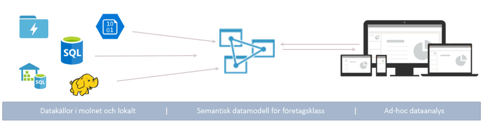
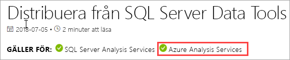

# Vad är Azure Analysis Services?

Azure Analysis Services är en fullständigt hanterad plattform som tjänst (PaaS) som tillhandahåller datamodeller i företagsklass i molnet. Använd avancerade kombinations- och modelleringsfunktioner för att kombinera data från flera datakällor, definiera mätvärden och skydda dina data i en enda tillförlitlig tabellsemantisk datamodell. Data modellen är ett enklare och snabbare sätt för användare att utföra ad hoc-dataanalys med hjälp av verktyg som Power BI och Excel.

**Video:** Se [översikt av Azure Analysis Services](https://sec.ch9.ms/ch9/d6dd/a1cda46b-ef03-4cea-8f11-68da23c5d6dd/AzureASoverview_high.mp4) för mer information om hur Azure Analysis Services passar in med Microsofts övergripande BI-funktioner.

## Kom igång snabbt

På Azure Portal kan du [skapa en server](analysis-services-create-server.md) på några minuter. Och du kan skapa servrar med hjälp av en deklarativ mall med Azure Resource Manager-[mallar](../azure-resource-manager/templates/quickstart-create-templates-use-the-portal.md) och PowerShell. Du kan distribuera serverresurser tillsammans med andra Azure-komponenter såsom lagringskonton och Azure Functions, med en enda mall. 

**Video:** Se [Automatiseringsdistribution](https://channel9.msdn.com/series/Azure-Analysis-Services/AzureAnalysisServicesAutomation) för mer information om hur du kan använda Azure Automation för att snabbare skapa servrar.

Azure Analysis Services integreras med många Azure-tjänster vilket gör att du kan skapa lösningar för avancerade analyser. Integreringen med [Azure Active Directory](../active-directory/fundamentals/active-directory-whatis.md) ger dig säker, rollbaserad åtkomst till dina viktiga data. Integrera i en [Azure Data Factory](../data-factory/introduction.md)-pipeline genom att omfatta en aktivitet som läser in data i modellen. [Azure Automation](../automation/automation-intro.md) och [Azure Functions](../azure-functions/functions-overview.md) kan användas för att utföra enkel orkestrering av modeller med anpassad kod. 

## Rätt nivå när du behöver den

Azure Analysis Services är tillgängligt på nivåerna **Developer**, **Basic** och **Standard**. På varje nivå varierar plan kostnaderna beroende på processor kraft, Qpu: er (Query Processing units) och minnes storlek. När du skapar en server kan välja du en plan inom en nivå. Du kan ändra planer uppåt eller nedåt i samma nivå eller uppgradera till en högre nivå, men det går inte att nedgradera från en högre nivå till en lägre nivå.

### Developer-nivå

Den här nivån rekommenderas för utvärderings-, utvecklings- och testscenarier. En enskild plan inkluderar samma funktioner som på Standard-nivån, men funktionerna för processorkraft, QPU:er och minnesstorlek är begränsade. Utskalning av frågans replik *är inte tillgängligt* för den här nivån. Den här nivån omfattas inte av något serviceavtal.

|Planera  |QPU:er  |Minne (GB)  |
|---------|---------|---------|
|D1    |    20     |    3     |

### Basic-nivå

Den här nivån rekommenderas för produktions lösningar med mindre tabell modeller, begränsad användar samtidighet och enkla data uppdaterings krav. Utskalning av frågans replik *är inte tillgängligt* för den här nivån. Perspektiv, flera partitioner och DirectQuery-funktioner för tabellmodeller *stöds inte* på den här nivån.  

|Planera  |QPU:er  |Minne (GB)  |
|---------|---------|---------|
|B1    |    40     |    10     |
|B2    |    80     |    16     |

### Standard-nivå

Den här nivån passar bäst för verksamhetskritiska produktionsprogram som kräver elastisk användarsamtidighet och har snabbväxande datamodeller. Den har stöd för avancerad datauppdatering för datamodellsuppdateringar i nära realtid och stöder alla funktioner för tabellmodeller.

|Planera  |QPU:er  |Minne (GB)  |
|---------|---------|---------|
|S0    |    40     |    10     |
|S1    |    100     |    25     |
|S2    |    200     |    50     |
|S4    |    400     |    100     |
|S8 [1](#naar), [2](#rec)   |    320    |    200     |
|S9 [1](#naar), [2](#rec)    |    640    |    400     |
|S8v2  [1](#naar)   |    640     |    200     |
|S9v2  [1](#naar)    |    1280    |    400     |

<a name="naar">1</a> – inte tillgängligt i alla regioner.   
<a name="rec">2</a> -S8 och S9 är [föråldrade](https://azure.microsoft.com/updates/azure-s8-and-s9-analysis-services-skus-retiring-on-31-august-2023/). v2 rekommenderas. 

## Tillgänglighet efter region

Azure Analysis Services stöds i regioner över hela världen. Planer som stöds och tillgänglighet för frågereplik är beroende av den region som väljs. Tillgänglighet för plan och frågereplik kan ändras beroende på behov och tillgängliga resurser för varje region. 

### Nord- och Sydamerika

|Region  | Planer som stöds | Frågerepliker (endast standardplaner) |
|---------|---------|:---------:|
|Brasilien, södra     |    B1, B2, S0, S1, S2, S4, D1     |     1    |
|Kanada, centrala    |     B1, B2, S0, S1, S2, S4, D1    |     1    |
|East US     |     B1, B2, S0, S1, S2, S4, D1    |    1     |
|USA, östra 2     |     B1, B2, S0, S1, S2, S4, D1   |    7    |
|USA, östra 2     |     S8v2, S9v2   |    1    |
|USA, norra centrala     |     B1, B2, S0, S1, S2, S4, D1     |    1     |
|USA, norra centrala     |     S8v2, S9v2    |    1     |
|Central US     |    B1, B2, S0, S1, S2, S4, D1     |    1     |
|Central US     |    S8v2, S9v2     |    1     |
|USA, södra centrala     |    B1, B2, S0, S1, S2, S4, D1     |    1     |
|USA, västra centrala   |     B1, B2, S0, S1, S2, S4, D1    |    3     |
|USA, västra     |    B1, B2, S0, S1, S2, S4, D1    |    7   |
|USA, västra     |    S8v2, S9v2   |    2  |
|USA, västra 2    |    B1, B2, S0, S1, S2, S4, D1    |    3   |
|USA, västra 2    |    S8v2, S9v2  |    1     |

### Europe

|Region  | Planer som stöds | Frågerepliker (endast standardplaner) |
|---------|---------|:---------:|
|Norra Europa     |    B1, B2, S0, S1, S2, S4, D1      |    7     |
|Norra Europa     |    S8v2, S9v2      |    3     |
|Storbritannien, södra     |    B1, B2, S0, S1, S2, S4, D1      |     1    |
|Europa, västra     |    B1, B2, S0, S1, S2, S4, D1   |    7    |
|Europa, västra    |   S8v2, S9v2  |  1  |

### Asien och stillahavsområdet 

|Region  | Planer som stöds | Frågerepliker (endast standardplaner) |
|---------|---------|:---------:|
|Australien, östra     |    B1, B2, S0, S1, S2, S4, D1     |    3     |
|Australien, östra     |    S8v2, S9v2    |    1     |
|Australien, sydöstra     | B1, B2, S0, S1, S2, S4, D1       |    1     |
|Japan, östra     |   B1, B2, S0, S1, S2, S4, D1       |    1     |
|Sydostasien     |     B1, B2, S0, S1, S2, S4, D1     |   1      |
|Sydostasien     |     S8v2, S9v2     |   1      |
|Indien, västra     |    B1, B2, S0, S1, S2, S4, D1     |    1     |

## Skala efter behov

### Skala upp\ner, pausa och återuppta

Gå upp, ned eller pausa din server. Använd Azure Portal eller få fullständig kontroll direkt med hjälp av PowerShell. Betala endast för det du använder.  

### Skala ut resurser för snabba frågesvar

Med skalning distribueras klientfrågor över flera *frågerepliker* i en frågepool. Frågerepliker har synkroniserade kopior av dina tabellmodeller. Genom att sprida frågearbetsbelastningen kan svarstiderna minskas under stora frågearbetsbelastningar. Modellbearbetning kan separeras från frågepoolen. Det här säkerställer att klientfrågor inte påverkas negativt av bearbetningsåtgärder. 

Du kan skapa en frågepool med upp till sju ytterligare frågerepliker (åtta totalt, inklusive din server). Antalet frågerepliker som du kan ha i din pool beror på den valda planen och regionen. Frågerepliker kan inte spridas utanför din serverregion. Frågerepliker debiteras med samma avgift som din server.

Du kan skala ut frågerepliker efter dina behov, precis som för att ändra nivån. Konfigurera skalning i portalen eller med hjälp av REST API: er. Läs mer i [Skalning av Azure Analysis Services](analysis-services-scale-out.md).

## Prissättning

Totalkostnaden är beroende av ett antal faktorer. Till exempel din valda region, nivå, fråga om repliker och paus/återuppta. Använd [Azure Analysis Services pris](https://azure.microsoft.com/pricing/details/analysis-services/)-kalkylator för att fastställa vanlig prissättning för din region. Det här verktyget beräknar prissättning för en enskild serverinstans för en enskild region. Tänk på att frågerepliker debiteras med samma avgift som servern. 

## Bygger på SQL Server Analysis Services

Azure Analysis Services är kompatibelt med många fantastiska funktioner som redan finns i SQL Server Analysis Services Enterprise. Azure Analysis Services stöder tabellmodeller på [kompatibilitetsnivå](/analysis-services/tabular-models/compatibility-level-for-tabular-models-in-analysis-services) 1200 eller högre. Tabellmodeller är relationsbaserade modelleringskonstruktioner (modeller, tabeller, kolumner), som uttrycks i objektdefinitioner för tabellmetadata i TMSL-kod (Tabular Model Scripting Language) och TOM-kod (Tabular Object Model). Partitioner, perspektiv, säkerhet på radnivå, dubbelriktade relationer och översättningar stöds\*. Flerdimensionella modeller och PowerPivot för SharePoint stöds *inte* i Azure Analysis Services.

Tabellmodeller både i minnet och DirectQuery-lägena stöds. Tabellmodeller i InMemory-läge (standard) har stöd för flera datakällor. Eftersom modelldata är mycket komprimerat och cachelagrade i minnet ger det här läget snabbast frågesvar över stora mängder data. Det ger också störst flexibilitet för komplexa datauppsättningar och frågor. 

Partitionering möjliggör stegvis inläsning, ökar parallellisering och minskar minnesanvändningen. Andra avancerade funktioner för datamodeller såsom beräknade tabeller samt alla DAX-funktioner stöds. InMemory-modeller måste uppdateras (bearbetas) för att uppdatera cachelagrade data från datakällor. Med stöd för Azure-tjänstens huvud namn kan oövervakade uppdaterings åtgärder med PowerShell, TOM, TMSL och REST erbjuda flexibilitet i att se till att dina modell data alltid är uppdaterade. 

DirectQuery-läget* använder serverdelens relationsdatabas för lagring och frågekörning. Mycket stora data mängder i enkla SQL Server, SQL Server informations lager, Azure SQL Database, Azure Synapse Analytics, Oracle och Teradata data källor stöds. Serverdelens datauppsättningar kan överskrida tillgängligt resursminne för servern. Det behövs inga avancerade uppdateringsscenarier för datamodeller. Det finns även vissa begränsningar, till exempel begränsade typer av data källor, begränsningar för DAX-formler och vissa avancerade data modellerings funktioner stöds inte. Se [Direkt frågeläge](/analysis-services/tabular-models/directquery-mode-ssas-tabular) innan du bestämmer det bästa läget för dig.

\* Funktionstillgänglighet beror på nivån.

## Datakällor som stöds

Tabellmodeller i Azure Analysis Services stöder en mängd olika datakällor från enkla textfiler till stordata i Azure Data Lake Store. Läs mer i avsnittet [Datakällor som stöds i Azure Analysis Services](analysis-services-datasource.md).

## Efterlevnadsnivå

Kompatibilitetsnivån avser release-/regionsspecifika beteenden i Analysis Services-motorn. Azure Analysis Services stöder tabellmodeller på kompatibilitetsnivå 1200 eller högre. Mer information finns i [kompatibilitetsnivån för tabell modeller](/analysis-services/tabular-models/compatibility-level-for-tabular-models-in-analysis-services).

## Dina data är skyddade

Azure Analysis Services tillhandahåller säkerhet för känsliga data på flera nivåer. Som en Azure-tjänst innehåller Analysis Services den **grundläggande** nivån för distribuerade överbelastningsattacker, vilken aktiveras automatiskt som en del av Azure-plattformen. Mer information finns i [Översikt över Azure DDoS Protection Standard](../ddos-protection/ddos-protection-overview.md). 

På servernivå har Analysis Services en brandvägg, Azure-autentisering, serveradministratörsroller och kryptering för serversidan. På datamodellnivå säkerställer användarroller, säkerhet på radnivå och säkerhet på objektnivå att dina data är säkra och endast ses av de användare som är avsedda att se den.

### Brandvägg

Azure Analysis Services brandvägg blockerar alla klientanslutningar förutom IP-adresserna som anges i regler. Som standard aktiveras inte brandväggsskydd för nya servrar. Vi rekommenderar att brandväggsskyddet är aktiverat och att regler konfigureras som en del av serverns etableringsskript eller i portalen omedelbart efter att servern har skapats. Konfigurera regler för tillåtna IP-adresser av enskilda klient-IP-adresser eller av intervaller. Power BI (service)-anslutningar kan också tillåtas eller blockeras. Konfigurera brandväggen och regler i portalen eller med hjälp av PowerShell. Läs mer i [Konfigurera en serverbrandvägg](analysis-services-qs-firewall.md).

### Autentisering

Användarautentisering hanteras av [Azure Active Directory (AAD)](../active-directory/fundamentals/active-directory-whatis.md). Vid inloggning använder användare en organisationskontoidentitet med rollbaserad åtkomst till databasen. Användaridentiteter måste vara medlemmar i standard-Azure Active Directory för den prenumeration som servern finns i. Mer information finns i [Autentisering och användarbehörigheter](analysis-services-manage-users.md).

### Datasäkerhet

Azure Analysis Services använder Azure Blob Storage för lagring och metadata för Analysis Services-databaser. Datafiler i BLOB krypteras med hjälp av [Azure Blob Server Side Encryption (SSE)](../storage/common/storage-service-encryption.md). När du använder läget Direct Query lagras endast metadata. Faktiska data hämtas via krypterade protokoll från datakällan när frågan körs.

Du kan skydda åtkomsten till datakällor lokalt inom din organisation genom att installera och konfigurera en [Lokal datagateway](analysis-services-gateway.md). Gateways ger åtkomst till data för både DirectQuery- och InMemory-läget.

### Roller

Analysis Services använder [rollbaserad auktorisering](/analysis-services/tabular-models/roles-ssas-tabular) som ger åtkomst till servern och åtgärder, objekt och data för modelldatabaser. Alla användare som har åtkomst till en server eller databas gör detta med sina Azure AD-användarkonto i en tilldelad roll. Serveradministratörsrollen är på serverresursnivå. Som standard ingår det konto som används när du skapar en server automatiskt i administratörsrollen för servern. Ytterligare användar- och gruppkonton har lagts till med hjälp av portalen, SSMS eller PowerShell.
  
Icke-administrativa slutanvändare som frågar efter data beviljas åtkomst genom databasroller. En databasroll skapas som ett separat objekt i databasen och gäller endast för databasen som rollen har skapats i. Databasroller definieras av (databasens) administratörs-, läs- och läs- och processbehörigheter. Användar- och gruppkonton läggs till med hjälp av SSMS eller PowerShell.

### Säkerhet på radnivå

Tabellmodeller på alla kompatibilitetsnivåer har stöd för säkerhet på radnivå. Säkerhet på radnivå konfigureras i modellen med hjälp av DAX-uttryck som definierar raderna i en tabell och alla rader i många riktningar i en relaterad tabell som en användare kan fråga. Radfilter som använder DAX-uttryck definieras för läs- och läs- och processbehörigheter. 

### Säkerhet på objektnivå 

Tabellmodeller på kompatibilitetsnivån 1400 stöder säkerhet på objektnivå, vilket inkluderar säkerhet på tabellnivå och säkerhet på kolumnnivå. Säkerhet på objektnivå anges i JSON-baserad metadata i Model.bim-filen med hjälp av TMSL eller TOM. Läs mer i [Säkerhet på objektnivå](/analysis-services/tabular-models/object-level-security).

### Automation via tjänsthuvudnamn

Tjänstens huvudnamn är en programresurs för Azure Active Directory som du skapar i din klient för att utföra obevakade åtgärder på resurs- och tjänstnivå. Tjänstens huvudnamn används med Azure Automation, obevakat läge i PowerShell, anpassade klientprogram och webbprogram för att automatisera vanliga uppgifter som datauppdatering, skala upp/ned och pausa/återuppta. Behörigheter tilldelas till tjänstens huvudnamn via rollmedlemskap. Läs mer i [Automatisering med tjänstens huvudnamn](analysis-services-service-principal.md).

### Azure-styrning

Azure Analysis Services lyder under [villkoren för Microsoft Online Services](https://www.microsoftvolumelicensing.com/DocumentSearch.aspx?Mode=3&DocumentTypeId=31) och [Microsofts sekretesspolicy](https://privacy.microsoft.com/privacystatement).
Mer information om säkerhet i Azure finns på [Microsoft Trust Center](https://www.microsoft.com/trustcenter).

## Använd de verktyg som du är van vid

### Visual Studio

Utveckla och distribuera modeller med Visual Studio med Analysis Services projekt. Tillägget Analysis Services projekt innehåller mallar och guider som hjälper dig att komma igång snabbt. Modell redigerings miljön i Visual Studio innehåller nu en modern get data source-fråga och kombinations funktioner för tabell 1400 och högre modeller. Om du är bekant med Hämta data i Power BI Desktop och Excel 2016 vet du redan hur lätt det är att skapa välanpassade datakällfrågor. 

Microsoft Analysis Services-projekt finns som ett kostnads fritt installerbart VSIX-paket. [Ladda ned från Marketplace](https://marketplace.visualstudio.com/items?itemName=ProBITools.MicrosoftAnalysisServicesModelingProjects). Tillägget fungerar med valfri version av Visual Studio 2017 och senare, inklusive den kostnads fria community-versionen.

### SQL Server Management Studio

Hantera dina servrar och modelldatabaser med hjälp av [SQL Server Management Studio (SSMS)](/sql/ssms/download-sql-server-management-studio-ssms). Ansluta till servrar i molnet. Kör TMSL-skript direkt från XMLA-frågefönstret och automatisera uppgifter med hjälp av TMSL-skript och PowerShell. Nya funktioner och funktionaliteter införs snabbt och SSMS uppdateras varje månad.

### Verktyg med öppen källkod

Analysis Services har en levande grupp utvecklare som skapar verktyg. Se till att titta i [tabell redigeraren](https://tabulareditor.github.io/), ett verktyg med öppen källkod för att skapa, underhålla och hantera tabell modeller med en intuitiv, förenklad redigerare. [DAX Studio](https://daxstudio.org/)är ett utmärkt verktyg med öppen källkod för DAX-redigering, diagnos, prestanda justering och analys.

### PowerShell

Under hanteringsaktiviteter för serverresurser såsom att skapa serverresurser, pausa eller återuppta serveråtgärder eller ändra servicenivån använder du Azure PowerShell-cmdletar. Under andra aktiviteter för hantering av databaser, till exempel att lägga till eller ta bort rollmedlemmar, behandla eller köra TMSL-skript, används cmdletar i SqlServer-modulen. Se [Hantera Azure Analysis Services med PowerShell](analysis-services-powershell.md) för mer information.

### Objektmodell och skript

Tabellmodeller ger snabb utveckling och är mycket anpassningsbara. Tabellmodeller innehåller en [TOM](/analysis-services/tom/introduction-to-the-tabular-object-model-tom-in-analysis-services-amo) (Tabular Object Model) som används för att beskriva modellobjekt. TOM exponeras i JSON via [TMSL (Tabular Model Scripting Language)](/analysis-services/tmsl/tabular-model-scripting-language-tmsl-reference) och datadefinitionsspråket AMO via namnområdet [Microsoft.AnalysisServices.Tabular](/dotnet/api/microsoft.analysisservices.tabular). 

## Stöder de senaste klientverktygen

Moderna datautforsknings- och visualiseringsverktyg som Power BI, Excel, Reporting Services och verktyg från tredje part stöds och ger användarna interaktiva och högvisuella insikter om dina modelldata. 

## Övervakning och diagnostik

Azure Analysis Services är integrerat med Azure Monitor Mät värden, vilket ger en omfattande mängd resursbaserade mått som hjälper dig att övervaka serverns prestanda och hälsa. Läs [Övervaka servermått](analysis-services-monitor.md) för mer information. Registrera mått med [resurs plattforms loggar](../azure-monitor/platform/platform-logs-overview.md). Övervaka och skicka loggar till [Azure Storage](https://azure.microsoft.com/services/storage/), strömma dem till [Azure Event Hubs](https://azure.microsoft.com/services/event-hubs/) och exportera dem till [Azure Monitor-loggar](https://azure.microsoft.com/services/log-analytics/), en tjänst från [Azure](https://www.microsoft.com/cloud-platform/operations-management-suite). Läs mer i [Konfigurera diagnostisk loggning](analysis-services-logging.md).

Azure Analysis Services stöder även [dynamiska hanteringsvyer (DMV: er)](/analysis-services/instances/use-dynamic-management-views-dmvs-to-monitor-analysis-services). DMV:s gränssnitt baseras på SQL-syntax och har en schemaraduppsättning som returnerar metadata samt övervakar information om serverinstanser.

## Dokumentation

Dokumentation specifik för Azure Analysis Services ingår. Använd innehållsförteckningen på vänster sida av webbläsarskärmen för att hitta artiklar. 

Eftersom tabell modeller i Azure Analysis Services är mycket samma som tabell modeller i SQL Server Analysis Services och Power BI Premium data uppsättningar, finns det ett omfattande bibliotek med självstudier för delade data modeller, konceptuella, procedur mässiga, utvecklings-och referens artiklar i [Analysis Services dokumentation](/analysis-services/?view=azure-analysis-services-current). Artiklar i den delade Analysis Services-dokumentationen visar om de också gäller för Azure Analysis Services av ett tillägg till banderollen under rubriken. Du kan också använda versions väljaren ovanför innehålls förteckningen om du bara vill se de artiklar som gäller den plattform som du använder.

### Bidra!

Analysis Services dokumentation, till exempel den här artikeln, är öppen källkod. Mer information om hur du kan bidra finns i Guide för [dokument bidrag](/contribute/). 

Dokumentation för Azure Analysis Services använder också [GitHub-problem](/teamblog/a-new-feedback-system-is-coming-to-docs). Du kan lämna feedback om produkten eller dokumentationen. Använd **Feedback** längst ned i en artikel. GitHub-problem har inte Aktiver ATS för den delade Analysis Services-dokumentationen. 

## Bloggar

Saker och ting ändras snabbt. Få den senaste informationen om [Power BI blogg](https://powerbi.microsoft.com/blog/category/analysis-services/) och [Azure-bloggen](https://azure.microsoft.com/blog/).

## Community

Analysis Services har ett levande användarforum. Delta i konversationen i [Azure Analysis Services-forumet](https://aka.ms/azureanalysisservicesforum).

## Nästa steg

> [!div class="nextstepaction"]
> [Registrera dig för en kostnadsfri utvärderingsversion av Azure](https://azure.microsoft.com/offers/ms-azr-0044p/)   

> [!div class="nextstepaction"]
> [Snabbstart: Skapa en server – portalen](analysis-services-create-server.md)   

> [!div class="nextstepaction"]
> [Snabbstart: Skapa en server – PowerShell](analysis-services-create-powershell.md)