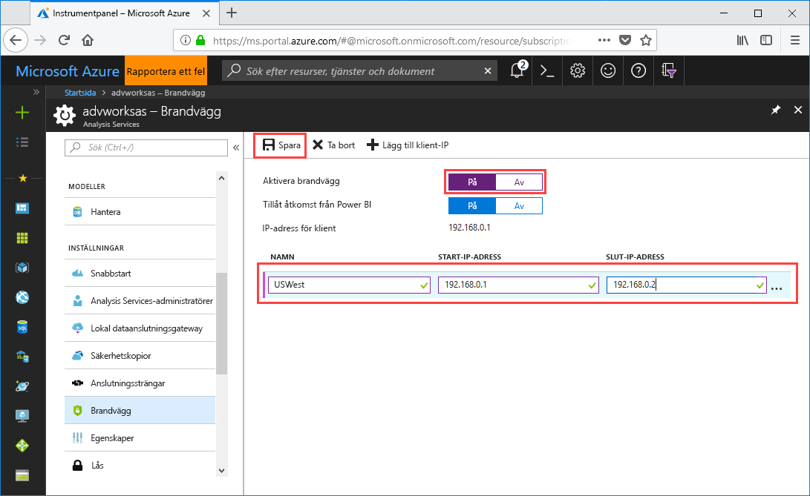

# Snabbstart: Konfigurera serverbrandvägg – portalen

Den här snabbstarten hjälper dig att konfigurera en brandvägg för Azure Analysis Services-servern. Att kunna aktivera en brandvägg och konfigurera IP-adressintervall enbart för de datorer som har åtkomst till servern är en viktig del i skyddet av din server och dina data.

## Nödvändiga komponenter

- En Analysis Services-server i din prenumeration. Mer information finns i [Snabbstart: Skapa en server – Portal](analysis-services-create-server.md) eller [Snabbstart: Skapa en server – PowerShell](analysis-services-create-powershell.md)
- Ett eller flera IP-adressintervall för klientdatorer (om så behövs).

## Logga in på Azure-portalen 

[Logga in på portalen](https://portal.azure.com)

## Konfigurera en brandvägg

1. Öppna sidan Översikt genom att klicka på servern. 
2. Klicka på **På** i **INSTÄLLNINGAR** > **Brandvägg** > **Aktivera brandvägg**.
3. Klicka på **På** i **Tillåt åtkomst från Power BI** om du vill ge DirectQuery åtkomst från Power BI-tjänsten.  
4. (Valfritt) Ange ett eller flera IP-adressintervall. Ange ett namn, och start- och slut-IP-adress för varje intervall. 
5. Klicka på **Spara**.

     

## Rensa resurser

Ta bort IP-adressintervallen eller inaktivera brandväggen när behovet inte längre finns.

## Nästa steg
I den här snabbstarten du har lärt dig hur du konfigurerar en brandvägg för servern. Nu när du har en server och har skyddat den med en brandvägg kan du lägga till en grundläggande exempeldatamodell till den från portalen. Att använda en exempelmodell är en bra idé om du vill lära dig mer om hur man konfigurerar modelldatabasroller och testar klientanslutningar. Fortsätt till och lägg till en exempelmodell om du vill lära dig mer.

> [!div class="nextstepaction"]
> [Självstudier: Lägg till en exempelmodell till servern](analysis-services-create-sample-model.md)
