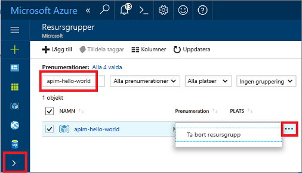

# Skapa en ny Azure API Management-tjänstinstans

Azure API Management (APIM) hjälper organisationer att publicera API:er till externa partner och interna utvecklare så att de kan få ut maximalt av sina data och tjänster. API Management lägger grunden till ett effektivt API-program genom engagerade utvecklare, affärsinsikter, analyser, hög säkerhet och skydd. Med APIM kan du skapa och hantera moderna API-gatewayer för befintliga serverdeltjänster som ligger var som helst. Mer information finns i ämnet [Översikt](api-management-key-concepts.md).

I den här snabbstarten beskrivs stegen för att skapa en ny API Management-instans med Azure-portalen.

[!INCLUDE [quickstarts-free-trial-note](../../includes/quickstarts-free-trial-note.md)]

## Logga in på Azure

Logga in på Azure Portal på http://portal.azure.com.

## Skapa en ny tjänst

1. I [Azure-portalen](https://portal.azure.com/) väljer du **Skapa en resurs** > **Enterprise-integration** > **API Management**.

    Du kan även välja **New** (Nytt), skriva `API management` i sökrutan och trycka på RETUR. Klicka på **Skapa**.

2. I fönstret för **API Management-tjänsten** anger du inställningar.

    

    | Inställning      | Föreslaget värde  | Beskrivning              |
    | ------------ |  ------- | ---------------------------------|
    |**Namn**|Ett unikt namn för din API Management-tjänst| Namnet kan inte ändras senare. Tjänstens namn används för att generera en ett standarddomännamn med formatet of *{name}.azure-api.net.* Om du vill använda ett anpassat domännamn läser du [Konfigurera ett anpassat domännamn](configure-custom-domain.md).   Tjänstens namn används för att referera till tjänsten och motsvarande Azure-resurs.|
    |**Prenumeration**|Din prenumeration | Den prenumeration som den här nya tjänstinstansen kommer att skapas för. Du kan välja prenumeration bland de olika Azure-prenumerationer som du har åtkomst till.|
    |**Resursgrupp**|*apimResourceGroup*|Du kan välja en ny eller befintlig resurs. En resursgrupp är en samling resurser som delar livscykel, behörigheter och principer. Lär dig mer [här](../azure-resource-manager/resource-group-overview.md#resource-groups).|
    |**Plats**|*USA, västra*|Välj den geografiska regionen närmast dig. Endast de tillgängliga API Management-regionerna visas i listrutan. |
    |**Organisationens namn**|Namnet på din organisation|Namnet används på ett antal platser, däribland titeln på utvecklarportalen och avsändaren av e-postmeddelanden.|
    |**E-postadress för administratör**|*admin@org.com*|Ange den e-postadress som alla meddelanden från **API Management** ska skickas från.|
    |**prisnivå**|*Developer*|Ställ in nivån **Developer** för att utvärdera tjänsten. Den här nivån ska inte användas för produktion. Mer information om att skala API Management-nivåerna finns i avsnittet [Uppgradera och skala](upgrade-and-scale.md).|
3. Välj **Skapa**.

    > [!TIP]
    > Det tar vanligtvis mellan 20 och 30 minuter att skapa en API Management-tjänst. Om du väljer **Fäst vid instrumentpanelen** blir det enklare att hitta en nyligen skapad tjänst.

[!INCLUDE [api-management-navigate-to-instance.md](../../includes/api-management-navigate-to-instance.md)]

## Rensa resurser

När den inte längre behövs kan följande steg användas för att ta bort resursgruppen och alla relaterade resurser:

1. I Azure-portalen väljer du .
2. Välj **Resursgrupper**.
3. Leta upp din resursgrupp.
4. Klicka på ”. . ." och ta bort gruppen.

## Nästa steg

> [!div class="nextstepaction"]
> [Importera och publicera ditt första API](import-and-publish.md)
