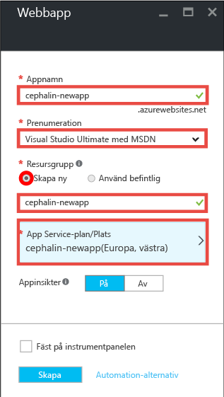
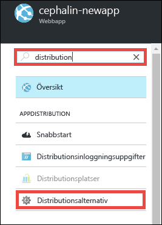
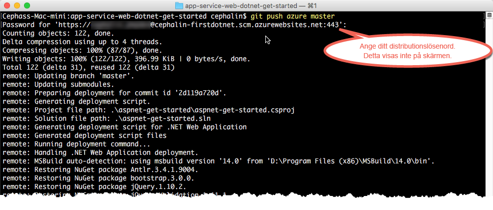

# Distribuera din första .NET-webbapp via Azure på fem minuter
I de här självstudierna lär du dig hur du distribuerar en enkel webbapp med .NET via [Azure App Service](../app-service/app-service-value-prop-what-is.md).
Du kan använda App Service för att skapa webbappar, [serverdelar för mobilappar](/documentation/learning-paths/appservice-mobileapps/) och [API Apps](../app-service-api/app-service-api-apps-why-best-platform.md).

Du kommer att: 

* Skapa en webbapp i Azure App Service.
* Distribuera ASP.NET-exempelkod.
* Se hur din kod körs live i produktionen.
* Uppdatera webbappen på samma sätt som du [skickar Git-skrivningar](https://git-scm.com/docs/git-push).

## Krav
* [Installera Git](http://www.git-scm.com/downloads). Kontrollera att installationen har utförts genom att köra `git --version` från en ny Windows-kommandotolk, PowerShell-fönster, Linux-gränssnittet eller OS X-terminal.
* Skaffa ett Microsoft Azure-konto. Om du inte har ett konto kan du [registrera dig för en kostnadsfri utvärderingsversion](/pricing/free-trial/?WT.mc_id=A261C142F) eller [aktivera Visual Studio-prenumerantförmåner](/pricing/member-offers/msdn-benefits-details/?WT.mc_id=A261C142F).

> [!NOTE]
> Du kan [Prova App Service](http://go.microsoft.com/fwlink/?LinkId=523751) utan ett Azure-konto. Skapa en startapp och testa den i upp till en timme – inget kreditkort behövs, inga åtaganden.
> 
> 

## Skapa en webbapp
1. Logga in på [Azure Portal](https://portal.azure.com) med ditt Azure-konto.
2. I den vänstra menyn klickar du på **Ny** > **Webb + Mobilt** > **Webbapp**.
   
    
3. Använd följande inställningar för din nya app i bladet där appen skapas:
   
   * **Appnamn**: Skriv ett unikt namn.
   * **Resursgrupp**: Välj **Skapa ny** och ge resursgruppen ett namn.
   * **App Service-plan/plats**: Klicka om du vill konfigurera och klicka sedan på **Skapa ny** för att ställa in namn, plats och prisnivå för App Service-planen. Använd gärna den **Kostnadsfria** prisnivån.
     
     När du är klar bör bladet där du skapar din app se ut så här:
     
     
4. Klicka på **Skapa** längst ned. Du kan klicka på ikonen **Meddelande** överst för att se förloppet.
   
    
5. Du bör se detta meddelande när distributionen är klar. Klicka på meddelandet för att öppna bladet för din distribution.
   
    
6. I bladet **Distributionen lyckades** klickar du på länken **Resurs** för att öppna bladet för din nya webbapp.
   
    

## Distribuera kod till din webbapp
Nu ska vi distribuera kod till Azure med Git.

1. Rulla ner till **Distributionsalternativ** i bladet webbapp eller leta efter den, och klicka sedan på den. 
   
    
2. Klicka på **Välj källa** > **Lokal Git-lagringsplats** > **OK**.
3. Gå tillbaka till bladet webbapp och klicka på **Autentiseringsuppgifter för distribution**.
4. Ange dina autentiseringsuppgifter för distribution och klicka på **Spara**.
5. Gå tillbaka till bladet webbapp, rulla ner till **Egenskaper** eller sök efter dem och klicka sedan på dem. Klicka på knappen **Kopiera** bredvid **Git URL**.
   
    
   
    Nu är du redo att distribuera din kod med Git.
6. Ändra till en arbetskatalog i din kommandoradsterminal (`CD`) och klona exempelappen så här:
   
        git clone https://github.com/Azure-Samples/app-service-web-dotnet-get-started.git
   
    
7. Ändra till lagringsplatsen för din exempelapp. Exempel: 
   
        cd app-service-web-dotnet-get-started
8. Konfigurera din fjärranslutna Git för din Azure-app med dess Git-URL som du kopierade från portalen några steg tidigare.
   
        git remote add azure <giturlfromportal>
9. Distribuera din exempelkod till din Azure-app på samma sätt som du skickar annan kod med Git:
   
        git push azure master
   
        
   
    `git push` inte bara lägger in kod i Azure, utan återställer också de nödvändiga paketen och skapar ASP.NET-binärfiler. 

Klart! Nu körs din kod live i Azure. Navigera till http://*&lt;appnamn >*.azurewebsites.net i din webbläsare för att se hur det fungerar. 

## Göra appuppdateringar
Nu kan du använda Git och skicka skrivningar från projektroten (databasen) när som helst för att uppdatera liveplatsen. Du gör på samma sätt som när du distribuerade din kod första gången. Exempelvis kör du bara följande kommandon från projektroten (databasen) varje gång du vill skicka in en ny ändring som du har testat lokalt:

    git add .
    git commit -m "<your_message>"
    git push azure master

## Nästa steg
Ta reda på hur du skapar, utvecklar och distribuerar .NET-webbappar via Azure direkt i Visual Studio i [Distribuera en ASP.NET-webbapp till Azure App Service med Visual Studio](web-sites-dotnet-get-started.md).

Eller gör mer med din första webbapp. Exempel:

* Prova [andra sätt att distribuera din kod till Azure](web-sites-deploy.md). Markera till exempel **GitHub** istället för **Lokal Git-lagringsplats** i **Distributionsalternativ** för att distribuera från någon av dina GitHub-lagringsplatser.
* Ta din Azure-app till nästa nivå. Autentisera användarna. Skala den på begäran. Konfigurera prestandavarningar. Allt med några få klickningar. Mer information finns i [Lägga till funktioner till din första webbapp](app-service-web-get-started-2.md).

<!--HONumber=Sep16_HO3-->

