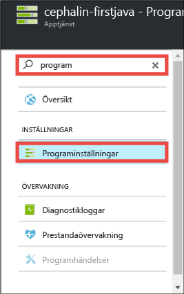
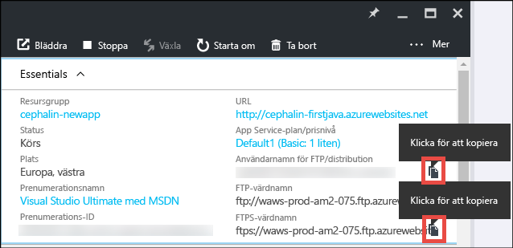
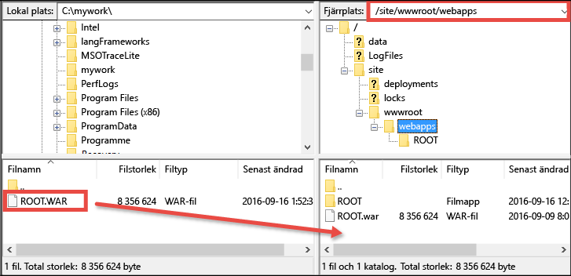

# Distribuera din första Java-webbapp till Azure på fem minuter (CLI 2.0 Preview)
[!INCLUDE [app-service-web-selector-get-started](../../includes/app-service-web-selector-get-started.md)]

I de här självstudierna lär du dig hur du distribuerar en enkel webbapp med Java via [Azure App Service](../app-service/app-service-value-prop-what-is.md).
Du kan använda App Service för att skapa webbappar, [serverdelar för mobilappar](/documentation/learning-paths/appservice-mobileapps/) och [API Apps](../app-service-api/app-service-api-apps-why-best-platform.md).

Du kommer att: 

* Skapa en webbapp i Azure App Service.
* Distribuera en Java-exempelapp.
* Se hur din kod körs live i produktionen.

## Krav
* Hämta en FTP/FTPS-klient som t.ex. [FileZilla](https://filezilla-project.org/).
* Skaffa ett Microsoft Azure-konto. Om du inte har ett konto kan du [registrera dig för en kostnadsfri utvärderingsversion](https://azure.microsoft.com/pricing/free-trial/?WT.mc_id=A261C142F) eller [aktivera Visual Studio-prenumerantförmåner](https://azure.microsoft.com/pricing/member-offers/msdn-benefits-details/?WT.mc_id=A261C142F).

> [!NOTE]
> Du kan [Prova App Service](https://azure.microsoft.com/try/app-service/) utan ett Azure-konto. Skapa en startapp och testa den i upp till en timme – inget kreditkort behövs, inga åtaganden.
> 
> 

## Skapa en webbapp
1. Logga in på [Azure Portal](https://portal.azure.com) med ditt Azure-konto.
2. I den vänstra menyn klickar du på **Ny** > **Webb + Mobilt** > **Webbapp**.
   
    
3. Använd följande inställningar för din nya app i bladet där appen skapas:
   
   * **Appnamn**: Skriv ett unikt namn.
   * **Resursgrupp**: Välj **Skapa ny** och ge resursgruppen ett namn.
   * **App Service-plan/plats**: Klicka om du vill konfigurera och klicka sedan på **Skapa ny** för att ställa in namn, plats och prisnivå för App Service-planen. Använd gärna den **Kostnadsfria** prisnivån.
     
     När du är klar bör bladet där du skapar din app se ut så här:
     
     
4. Klicka på **Skapa** längst ned. Du kan klicka på ikonen **Meddelande** överst för att se förloppet.
   
    
5. Du bör se detta meddelande när distributionen är klar. Klicka på meddelandet för att öppna bladet för din distribution.
   
    
6. I bladet **Distributionen lyckades** klickar du på länken **Resurs** för att öppna bladet för din nya webbapp.
   
    

## Distribuera en Java-app via din webbapp
Nu ska vi distribuera en Java-app via Azure med FTPS.

1. Gå till webbappsbladet, rulla ned till **Programinställningar** eller sök och klicka på dem. 
   
    
2. Som **Java-version** väljer du **Java 8** och klickar på **Spara**.
   
    
   
    När meddelandet **Webbappinställningarna har uppdaterats** visas navigerar du till http://*&lt;appname>*.azurewebsites.net för att se JSP-standardservleten i arbete.
3. Gå tillbaka till webbappsbladet, rulla ned till **Autentiseringsuppgifter för distribution** eller sök och klicka på dem.
4. Ange dina autentiseringsuppgifter för distribution och klicka på **Spara**.
5. I webbappsbladet klickar du på **Översikt**. Bredvid **Användarnamn för FTP/distribution** och **FTPS-värdnamn** klickar du på knappen **Kopiera** för att kopiera dessa värden.
   
    
   
    Nu är du redo att distribuera din Java-app med FTPS.
6. Använd FTP/FTPS-klienten, logga in på din Azure-webbapps FTP-server med hjälp av värdena som du kopierade i det föregående steget. Använd distributionslösenordet som du skapade tidigare.
   
    I följande skärmbild visas inloggning med FileZilla.
   
    
   
    Du kan se säkerhetsvarningar för okända SSL-certifikat från Azure. Gå vidare och fortsätt.
7. Klicka på [den här länken](https://github.com/Azure-Samples/app-service-web-java-get-started/raw/master/webapps/ROOT.war) för att hämta WAR-filen till den lokala datorn.
8. Använd FTP/FTPS-klienten, gå till **/site/wwwroot/webapps** på fjärrplatsen och dra den nedladdade WAR-filen på din lokala dator till fjärrkatalogen.
   
    
   
    Klicka på **OK** för att åsidosätta filen i Azure.
   
   > [!NOTE]
   > I enlighet med Tomcats standardbeteende kommer filnamn av typen **ROOT.war** i /site/wwwroot/webapps att generera en webbappsrot (http://*&lt;appname>*.azurewebsites.net), medan filnamn av typen ***&lt;anyname>*.war** genererar en namngiven webbapp (http://*&lt;appname>*.azurewebsites.net/*&lt;anyname>*).
   > 
   > 

Klart! Nu körs din Java-app live i Azure. Navigera till http://*&lt;appnamn >*.azurewebsites.net i din webbläsare för att se hur det fungerar. 

## Göra appuppdateringar
När du behöver göra en uppdatering överför du den nya WAR-filen till samma fjärrkatalog med FTP/FTPS-klienten.

## Nästa steg
[Skapa en Java-webbapp från en mall i Azure Marketplace](web-sites-java-get-started.md#marketplace). Du kan hämta en egen, helt anpassningsbar Tomcat-behållare och det välbekanta Manager-användargränssnittet. 

Felsök din Azure-webbapp direkt i [IntelliJ](app-service-web-debug-java-web-app-in-intellij.md) eller [Eclipse](app-service-web-debug-java-web-app-in-eclipse.md).

Eller gör mer med din första webbapp. Exempel:

* Prova [andra sätt att distribuera din kod till Azure](web-sites-deploy.md). 
* Ta din Azure-app till nästa nivå. Autentisera användarna. Skala den på begäran. Konfigurera prestandavarningar. Allt med några få klickningar. Mer information finns i [Lägga till funktioner till din första webbapp](app-service-web-get-started-2.md).

