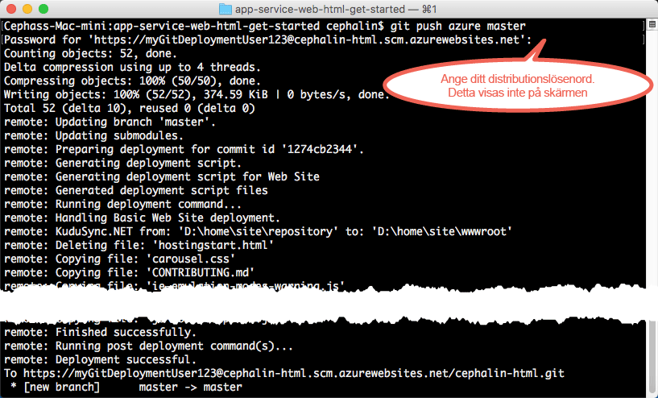

# Distribuera din första webbapp till Azure på fem minuter
I den här kursen lär du dig hur du distribuerar din första webbapp till [Azure App Service](../app-service/app-service-value-prop-what-is.md).
Du kan använda App Service för att skapa webbappar, [serverdelar för mobilappar](/documentation/learning-paths/appservice-mobileapps/) och [API Apps](../app-service-api/app-service-api-apps-why-best-platform.md).

Du kommer att: 

* Skapa en webbapp i Azure App Service.
* Distribuera exempelkod (välj mellan ASP.NET, PHP, Node.js, Java och Python).
* Se hur din kod körs live i produktionen.
* Uppdatera webbappen på samma sätt som du [skickar Git-skrivningar](https://git-scm.com/docs/git-push).

[!INCLUDE [app-service-linux](../../includes/app-service-linux.md)]

## CLI-versioner för att slutföra uppgiften

Du kan slutföra uppgiften med någon av följande CLI-versioner:

- [Azure CLI 1.0](app-service-web-get-started-cli-nodejs.md) – vår CLI för distributionsmodellerna klassisk och resurshantering
- [Azure CLI 2.0 (förhandsversion)](app-service-web-get-started.md) –vår nästa generations CLI för distributionsmodellen resurshantering

## Krav
* [Git](http://www.git-scm.com/downloads).
* [Förhandsversion av Azure CLI 2.0](/cli/azure/install-az-cli2).
* Ett Microsoft Azure-konto. Om du inte har ett konto kan du [registrera dig för en kostnadsfri utvärderingsversion](https://azure.microsoft.com/pricing/free-trial/?WT.mc_id=A261C142F) eller [aktivera Visual Studio-prenumerantförmåner](https://azure.microsoft.com/pricing/member-offers/msdn-benefits-details/?WT.mc_id=A261C142F).

> [!NOTE]
> Du kan [Prova App Service](http://go.microsoft.com/fwlink/?LinkId=523751) utan ett Azure-konto. Skapa en startapp och testa den i upp till en timme – inget kreditkort behövs, inga åtaganden.
> 
> 

## Distribuera en webbapp
Nu ska vi distribuera en webbapp till Azure App Service.

1. Öppna en ny Windows-kommandotolk, ett PowerShell-fönster, Linux-gränssnittet eller en OS X-terminal. Kör `git --version` och `azure --version` för att kontrollera att Git och Azure CLI är installerade på datorn.
   
    
   
    Om du inte har installerat verktygen använder du nedladdningslänkarna under [Krav](#Prerequisites).

2. Logga in i Azure så här:
   
        az login
   
    Fortsätt inloggningen genom att följa anvisningarna i hjälpmeddelandet.
   
    

3. Ange distributionsanvändare för App Service. Du distribuerar kod med dessa autentiseringsuppgifterna senare.
   
        az appservice web deployment user set --user-name <username> --password <password>

3. Skapa en ny [resursgrupp](../azure-resource-manager/resource-group-overview.md). För denna första App Service-självstudie behöver du egentligen inte veta vad det är.

        az group create --location "<location>" --name my-first-app-group

    För att se vilka möjliga värden du kan använda för `<location>`, använd CLI-kommandot `az appservice list-locations`.

3. Skapa en ny, ”kostnadsfri” [App Service-plan](../app-service/azure-web-sites-web-hosting-plans-in-depth-overview.md). För denna första App Service-självstudie är det bra att veta att du inte kommer att debiteras för webbappar i den här planen.

        az appservice plan create --name my-free-appservice-plan --resource-group my-first-app-group --sku FREE

4. Skapa en ny webbapp med ett unikt namn i `<app_name>`.

        az appservice web create --name <app_name> --resource-group my-first-app-group --plan my-free-appservice-plan

4. Därefter får du exempelkod som du kan vilja distribuera. Ändra till en arbetskatalog (`CD`) och klona exempelappen så här:
   
        cd <working_directory>
        git clone <github_sample_url>
   
    För *&lt;github_sample_url>* använder du någon av följande webbadresser, beroende på vilket ramverk du föredrar:
   
   * HTML+CSS+JS: [https://github.com/Azure-Samples/app-service-web-html-get-started.git](https://github.com/Azure-Samples/app-service-web-html-get-started.git)
   * ASP.NET: [https://github.com/Azure-Samples/app-service-web-dotnet-get-started.git](https://github.com/Azure-Samples/app-service-web-dotnet-get-started.git)
   * PHP (CodeIgniter): [https://github.com/Azure-Samples/app-service-web-php-get-started.git](https://github.com/Azure-Samples/app-service-web-php-get-started.git)
   * Node.js (Express): [https://github.com/Azure-Samples/app-service-web-nodejs-get-started.git](https://github.com/Azure-Samples/app-service-web-nodejs-get-started.git)
   * Java: [https://github.com/Azure-Samples/app-service-web-java-get-started.git](https://github.com/Azure-Samples/app-service-web-java-get-started.git)
   * Python (Django): [https://github.com/Azure-Samples/app-service-web-python-get-started.git](https://github.com/Azure-Samples/app-service-web-python-get-started.git)

    
   
5. Ändra till lagringsplatsen för din exempelapp. Exempel:
   
        cd app-service-web-html-get-started

5. Konfigurera lokal Git-distribution för din App Service-webbapp med följande kommando:

        az appservice web source-control config-local-git --name <app_name> --resource-group my-first-app-group

    Du får JSON-utdata som den här, vilket innebär att Git-lagringsplatsen är konfigurerad:

        {
        "url": "https://<deployment_user>@<app_name>.scm.azurewebsites.net/<app_name>.git"
        }

6. Lägg till URL:en i JSON som en fjärransluten Git för din lokala lagringsplats (kallas `azure` för enkelhets skull).

        git remote add azure https://<deployment_user>@<app_name>.scm.azurewebsites.net/<app_name>.git
   
7. Distribuera din exempelkod till fjärransluten Git `azure`. När du uppmanas använder du de autentiseringsuppgifter för distribution som du tidigare har konfigurerat.
   
        git push azure master
   
    
   
    Om du använde något av språkramverken ser resultatet annorlunda ut. `git push` placerar inte bara kod i Azure, utan utlöser även distributionsuppgifter i distributionsmotorn. Om det finns en package.json- (Node.js) eller requirements.txt-fil (Python) i projektroten (lagerplatsen) eller om det finns en packages.config-fil i ASP.NET-projektet så återställer distributionsskriptet de nödvändiga paketen åt dig. Du kan också [aktivera tillägget Composer](web-sites-php-mysql-deploy-use-git.md#composer) om du vill att composer.json-filer i din PHP-app ska bearbetas automatiskt.

Grattis, du har distribuerat din app till Azure App Service.

## Köra appen live

Kör det här kommandot för att köra din app live i Azure:

    az appservice web browse --name <app_name> --resource-group my-first-app-group

## Göra appuppdateringar

Nu kan du använda Git och skicka skrivningar från projektroten (databasen) när som helst för att uppdatera liveplatsen. Du gör på samma sätt som när du distribuerade din kod första gången. Exempelvis kör du bara följande kommandon från projektroten (databasen) varje gång du vill skicka in en ny ändring som du har testat lokalt:

    git add .
    git commit -m "<your_message>"
    git push azure master

## Nästa steg

Hitta de rekommenderade utvecklings- och distributionsanvisningarna för ditt språkramverk:

* [.NET](web-sites-dotnet-get-started.md)
* [PHP](app-service-web-php-get-started.md)
* [Node.js](app-service-web-nodejs-get-started.md)
* [Python](web-sites-python-ptvs-django-mysql.md)
* [Java](web-sites-java-get-started.md)

Eller gör mer med din första webbapp. Exempel:

* Prova [andra sätt att distribuera din kod till Azure](web-sites-deploy.md). Markera till exempel **GitHub** istället för **Lokal Git-lagringsplats** i **Distributionsalternativ** för att distribuera från någon av dina GitHub-lagringsplatser.
* Ta din Azure-app till nästa nivå. Autentisera användarna. Skala den på begäran. Konfigurera prestandavarningar. Allt med några få klickningar. Mer information finns i [Lägga till funktioner till din första webbapp](app-service-web-get-started-2.md).

<!--HONumber=Dec16_HO3-->

