# <a name="create-an-aspnet-framework-web-app-in-azure"></a>Skapa en ASP.NET Framework-webbapp i Azure

Med [Azure Web Apps](app-service-web-overview.md) får du en mycket skalbar och automatiskt uppdaterad webbvärdtjänst.  Den här snabbstarten visar hur du distribuerar din första ASP.NET-webbapp till Azure Web Apps. När du är klar har du en resursgrupp som består av en App Service-plan och en Azure-webbapp med en distribuerad webbapp.

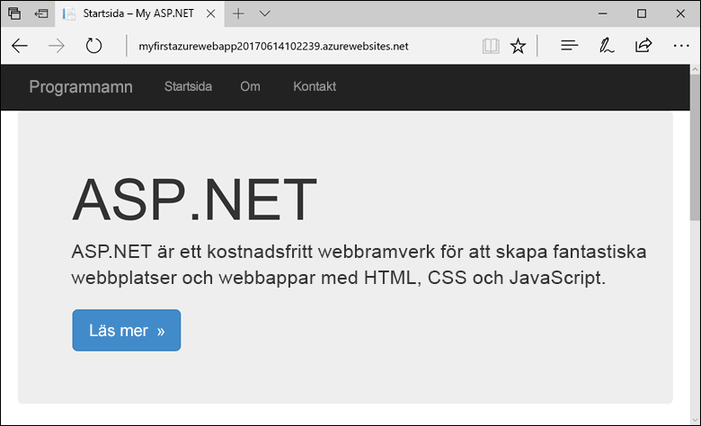

[!INCLUDE [quickstarts-free-trial-note](../../includes/quickstarts-free-trial-note.md)]

## <a name="prerequisites"></a>Nödvändiga komponenter

För att slutföra självstudien installerar du <a href="https://www.visualstudio.com/downloads/" target="_blank">Visual Studio 2017</a> med arbetsbelastningen **ASP.NET och webbutveckling**.

Om du redan har installerat Visual Studio 2017:

- Installera de senaste uppdateringarna i Visual Studio genom att klicka på **Hjälp** > **Sök efter uppdateringar**.
- Lägg till arbetsbelastningen genom att klicka på **Verktyg** > **Skaffa verktyg och funktioner**.

## <a name="create-an-aspnet-web-app"></a>Skapa en ASP.NET-webbapp

Skapa ett nytt projekt i Visual Studio genom att välja **Arkiv > Nytt > Projekt**. 

I dialogrutan **Nytt projekt** väljer du **Visual C# > Webb > ASP.NET-webbtillämpningsprogram (.NET Framework)**.

Ge programmet namnet _myFirstAzureWebApp_ och välj **OK**.
   


Du kan distribuera alla typer av ASP.NET-webbappar till Azure. I den här snabbstarten väljer du **MVC**-mallen och ser till att autentiseringen är inställd på **Ingen autentisering**.
      
Välj **OK**.

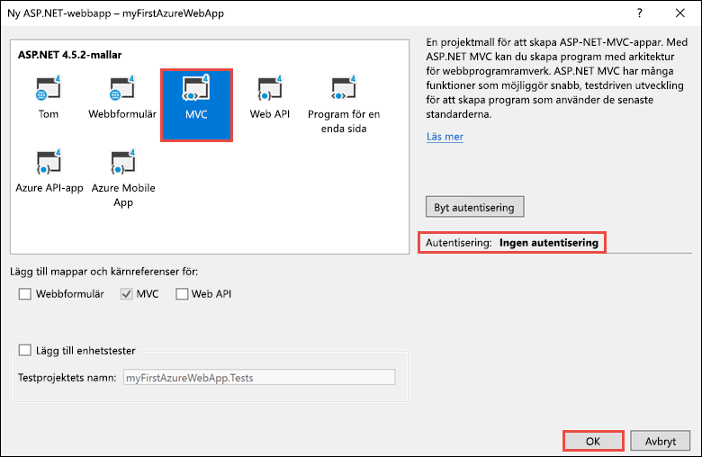

På menyn väljer du **Felsöka > Starta utan felsökning** för att köra webbappen lokalt.


## <a name="launch-the-publish-wizard"></a>Starta publiceringsguiden

Högerklicka på projektet **myFirstAzureWebApp** i **Solution Explorer** och välj **Publicera**.

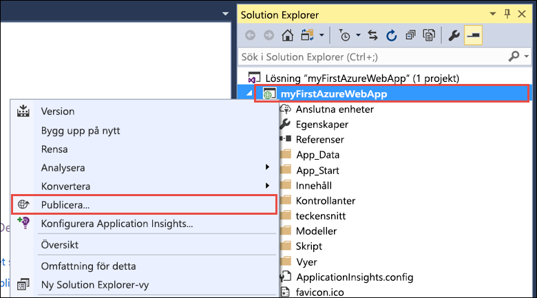

Publiceringsguiden startas automatiskt. Välj **App Service** > **Publicera** och öppna dialogrutan **Skapa App Service**.

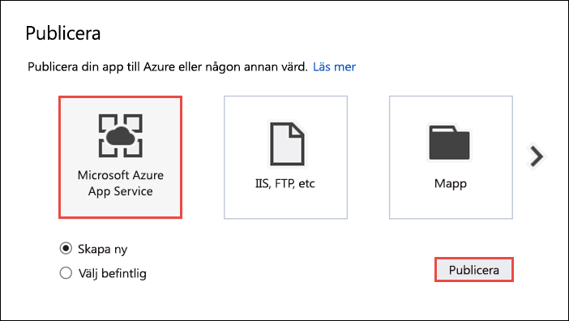

## <a name="sign-in-to-azure"></a>Logga in på Azure

I dialogrutan **Skapa App Service** väljer du **Lägg till ett konto** och loggar sedan in med din Azure-prenumeration. Välj det konto som innehåller den önskade prenumerationen i listrutan om du redan är inloggad.

> [!NOTE]
> Välj inte **Skapa** ännu om du redan är inloggad.
>
>
   
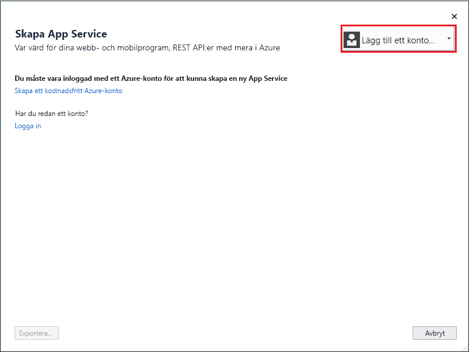

## <a name="create-a-resource-group"></a>Skapa en resursgrupp

[!INCLUDE [resource group intro text](../../includes/resource-group.md)]

Välj **Ny** bredvid **Resursgrupp**.

Ge resursgruppen namnet **myResourceGroup** och välj **OK**.

## <a name="create-an-app-service-plan"></a>Skapa en App Service-plan

[!INCLUDE [app-service-plan](../../includes/app-service-plan.md)]

Bredvid **Värdplan** väljer du **Ny**. 

I dialogrutan **Konfigurera värdplan** använder du inställningarna i tabellen som följer skärmbilden.

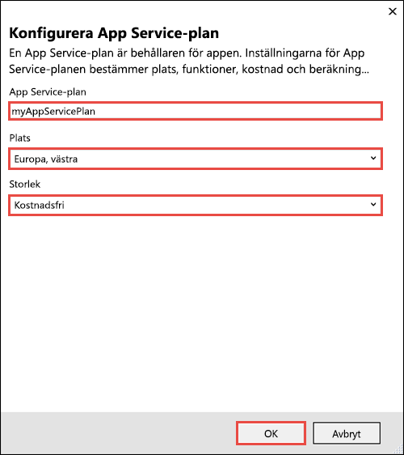

| Inställning | Föreslaget värde | Beskrivning |
|-|-|-|
|App Service-plan| myAppServicePlan | Namnet på App Service-planen. |
| Plats | Västra Europa | Datacenter som är värd för webbappen. |
| Storlek | Kostnadsfri | [Prisnivån](https://azure.microsoft.com/pricing/details/app-service/?ref=microsoft.com&utm_source=microsoft.com&utm_medium=docs&utm_campaign=visualstudio) avgör tillgängliga värdfunktioner. |

Välj **OK**.

## <a name="create-and-publish-the-web-app"></a>Skapa och publicera webbappen

I **Appnamn** skriver du ett unikt appnamn (giltiga tecken är `a-z`, `0-9` och `-`) eller accepterar det automatiskt genererade unika namnet. Webbadressen till webbappen är `http://<app_name>.azurewebsites.net`, där `<app_name>` är appens namn.

Välj **Skapa** för att börja skapa Azure-resurser.

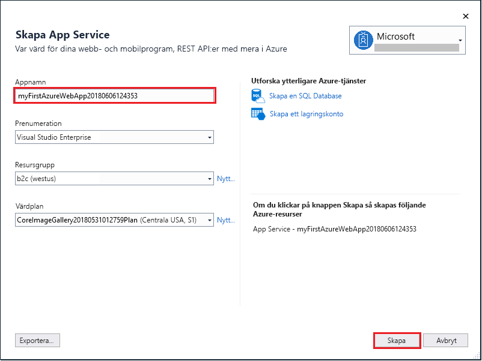

När guiden slutförs publiceras ASP.NET-webbappen till Azure och sedan öppnas appen i standardwebbläsaren.


Appnamnet som anges i steget [skapa och publicera](#create-and-publish-the-web-app) används som URL-prefixet i formatet `http://<app_name>.azurewebsites.net`.

Grattis, din ASP.NET-webbapp körs live i Azure App Service.

## <a name="update-the-app-and-redeploy"></a>Uppdatera och distribuera om appen

Öppna _Views\Home\Index.cshtml_ från **Solution Explorer**.

Leta reda på HTML-taggen `<div class="jumbotron">` längst upp på sidan och ersätt hela elementet med följande kod:

```HTML
<div class="jumbotron">
    <h1>ASP.NET in Azure!</h1>
    <p class="lead">This is a simple app that we’ve built that demonstrates how to deploy a .NET app to Azure App Service.</p>
</div>
```

Högerklicka på projektet **myFirstAzureWebApp** i **Solution Explorer** och välj **Publicera** för att distribuera om appen till Azure.

Välj **Publicera** på publiceringssidan.
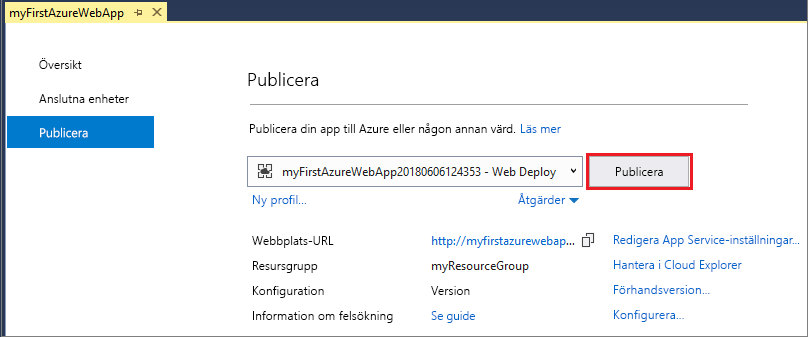

När publiceringen är klar startar Visual Studio en webbläsare till webbappens URL.

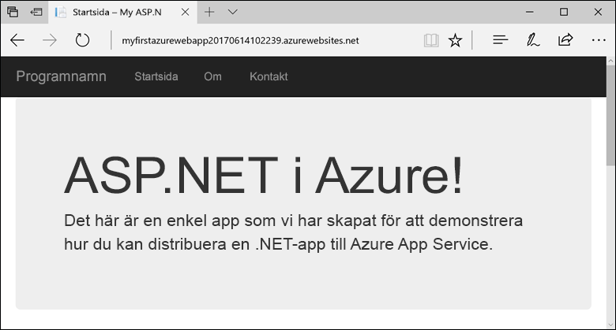

## <a name="manage-the-azure-web-app"></a>Hantera Azure-webbappen

Gå till <a href="https://portal.azure.com" target="_blank">Azure Portal</a> för att hantera webbappen.

Klicka på **App Services** på menyn till vänster och välj sedan namnet på din Azure-webbapp.

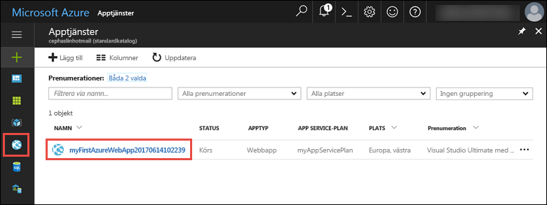

Nu visas sidan Översikt för din webbapp. Här kan du utföra grundläggande hanteringsåtgärder som att bläddra, stoppa, starta, starta om och ta bort. 

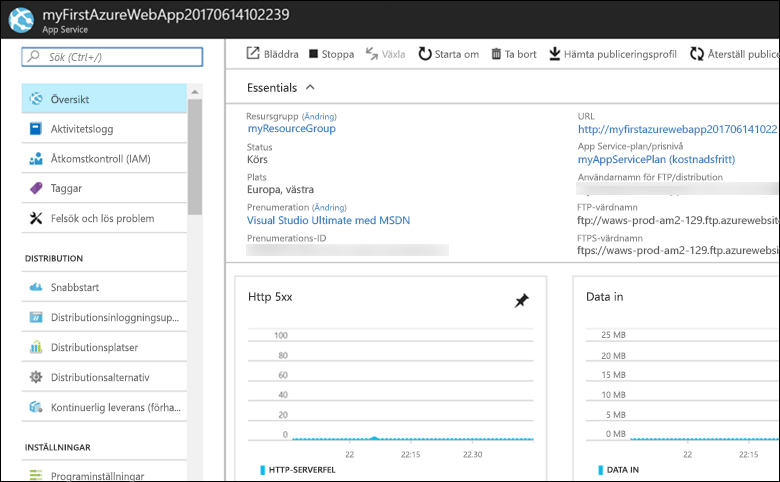

Menyn till vänster innehåller olika sidor för att konfigurera appen. 

## <a name="video"></a>Video

Titta på videon som beskriver den här snabbstarten och följ sedan stegen för att publicera din första .NET-app i Azure.

> [!VIDEO https://channel9.msdn.com/Shows/Azure-for-NET-Developers/Create-a-NET-app-in-Azure-Quickstart/player]

[!INCLUDE [Clean-up section](../../includes/clean-up-section-portal.md)]

## <a name="next-steps"></a>Nästa steg

> [!div class="nextstepaction"]
> [ASP.NET med SQL Database](app-service-web-tutorial-dotnet-sqldatabase.md)
