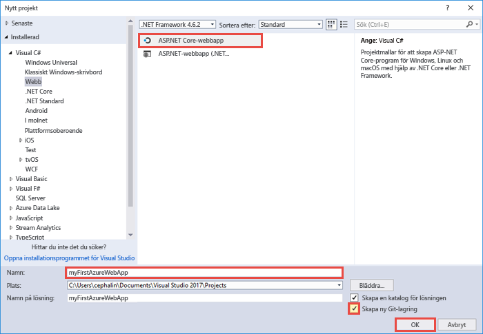
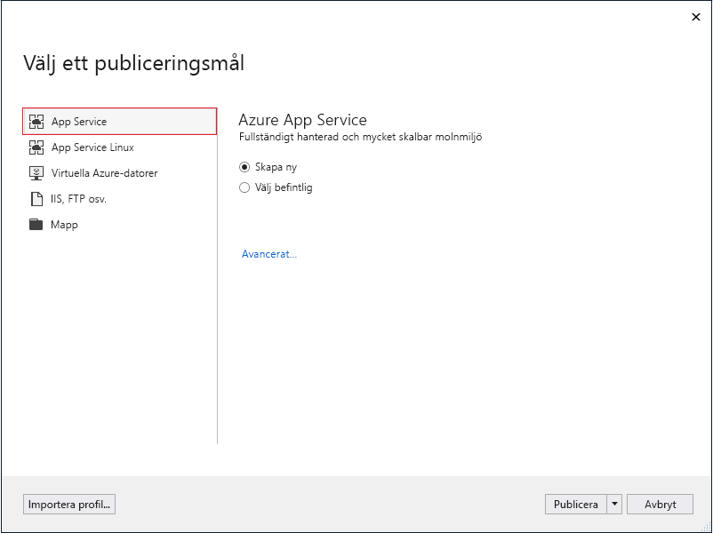
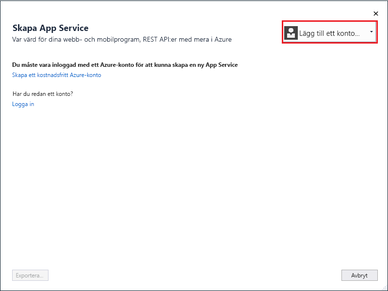
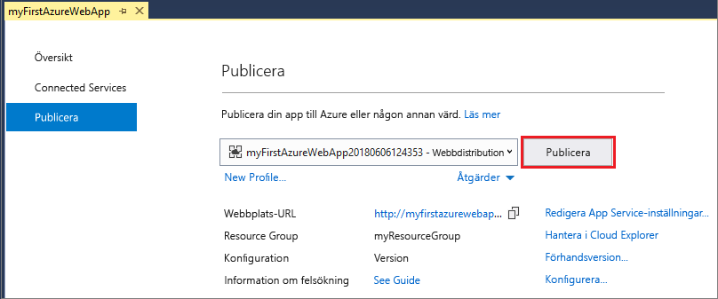
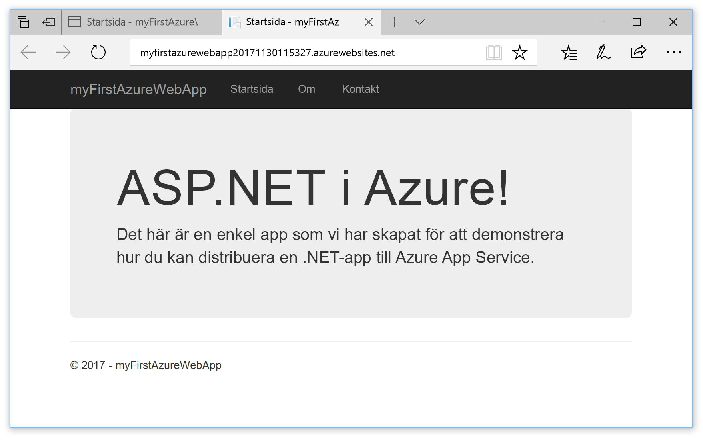
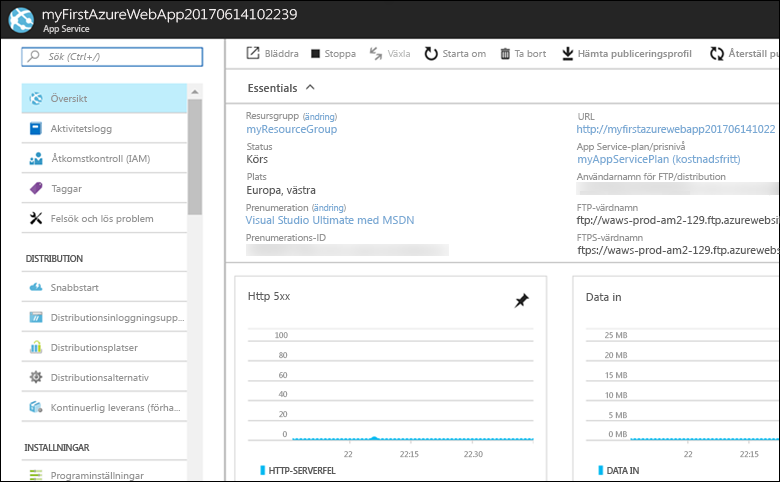

# <a name="create-an-aspnet-core-web-app-in-azure"></a>Skapa en ASP.NET Core-webbapp i Azure

> [!NOTE]
> I den här artikeln distribueras en app till App Service i Windows. Om du vill distribuera en app till App Service i _Linux_ kan du läsa [Skapa en .NET Core-webbapp i App Service på Linux](./containers/quickstart-dotnetcore.md).
>

Med [Azure Web Apps](app-service-web-overview.md) får du en mycket skalbar och automatiskt uppdaterad webbvärdtjänst.  Den här snabbstarten visar hur du distribuerar din första ASP.NET Core-webbapp till Azure Web Apps. När du är klar har du en resursgrupp som består av en App Service-plan och en Azure-webbapp med en distribuerad webbapp.

> [!NOTE]
> Om du vill veta hur man skapar och distribuerar en ASP.NET Framework-webbapp finns den artikeln [här](app-service-web-get-started-dotnet-framework.md). 
>

[!INCLUDE [quickstarts-free-trial-note](../../includes/quickstarts-free-trial-note.md)]

## <a name="prerequisites"></a>Nödvändiga komponenter

För att slutföra den här självstudien behöver du:

Installera <a href="https://www.visualstudio.com/downloads/" target="_blank">Visual Studio 2017</a> med arbetsbelastningen **ASP.NET och webbutveckling**.

Om du redan har installerat Visual Studio lägger du till arbetsbelastningen i Visual Studio genom att klicka på **Tools (Verktyg)** > **Get Tools and Features (Skaffa verktyg och funktioner)**.

## <a name="create-an-aspnet-core-web-app"></a>Skapa en ASP.NET Core-webbapp

Skapa ett nytt projekt i Visual Studio genom att välja **Arkiv > Nytt > Projekt**. 

I dialogrutan **Nytt projekt** väljer du **Visual C# > Webb > ASP.NET Core-webbtillämpningsprogram**.

Ge programmet namnet _myFirstAzureWebApp_ och välj **OK**.
   


Du kan distribuera alla typer av ASP.NET Core-webbappar till Azure. I den här snabbstarten väljer du mallen **Webbprogram** och ser till att autentiseringen är inställd på **Ingen autentisering**.
      
Välj **OK**.


På menyn väljer du **Felsöka > Starta utan felsökning** för att köra webbappen lokalt.


## <a name="publish-to-azure"></a>Publicera till Azure

Högerklicka på projektet **myFirstAzureWebApp** i **Solution Explorer** och välj **Publicera**.


Se till att **Microsoft Azure App Service** är markerat och välj **Publicera**.



Dialogrutan **Create App Service** (Skapa apptjänst) öppnas, där du kan skapa alla Azure-resurser som du behöver för att köra ASP.NET Core-webbappen i Azure.

## <a name="sign-in-to-azure"></a>Logga in på Azure

I dialogrutan **Skapa App Service** klickar du på **Lägg till ett konto** och loggar in till din Azure-prenumeration. Välj det konto som innehåller den önskade prenumerationen i listrutan om du redan är inloggad.

> [!NOTE]
> Välj inte **Skapa** ännu om du redan är inloggad.
>
   


## <a name="create-a-resource-group"></a>Skapa en resursgrupp

[!INCLUDE [resource group intro text](../../includes/resource-group.md)]

Välj **Ny** bredvid **Resursgrupp**.

Ge resursgruppen namnet **myResourceGroup** och välj **OK**.

## <a name="create-an-app-service-plan"></a>Skapa en App Service-plan

[!INCLUDE [app-service-plan](../../includes/app-service-plan.md)]

Välj **Ny** bredvid **App Service-plan**. 

I dialogrutan **Configure App Service Plan** (Konfigurera App Service-plan) använder du inställningarna i tabellen som följer skärmbilden.


| Inställning | Föreslaget värde | Beskrivning |
|-|-|-|
|App Service-plan| myAppServicePlan | Namnet på App Service-planen. |
| Plats | Västra Europa | Datacenter som är värd för webbappen. |
| Storlek | Kostnadsfri | [Prisnivån](https://azure.microsoft.com/pricing/details/app-service/?ref=microsoft.com&utm_source=microsoft.com&utm_medium=docs&utm_campaign=visualstudio) avgör tillgängliga värdfunktioner. |

Välj **OK**.

## <a name="create-and-publish-the-web-app"></a>Skapa och publicera webbappen

I **Webbprogramnamnet** skriver du ett unikt appnamn (giltiga tecken är `a-z`, `0-9` och `-`) eller acceptera det automatiskt genererade unika namnet. Webbadressen till webbappen är `http://<app_name>.azurewebsites.net`, där `<app_name>` är webbappens namn.

Välj **Skapa** för att börja skapa Azure-resurser.


När guiden slutförs publiceras ASP.NET Core-webbappen till Azure och sedan öppnas appen i standardwebbläsaren.


Webbprogramnamnet som anges i steget [skapa och publicera](#create-and-publish-the-web-app) används som URL-prefixet i formatet `http://<app_name>.azurewebsites.net`.

Grattis, din ASP.NET Core-webbapp körs live i Azure App Service.

## <a name="update-the-app-and-redeploy"></a>Uppdatera och distribuera om appen

Öppna _Pages/Index.cshtml_ från **Solution Explorer**.

Leta reda på HTML-taggen `<div id="myCarousel" class="carousel slide" data-ride="carousel" data-interval="6000">` längst upp på sidan och ersätt hela elementet med följande kod:

```HTML
<div class="jumbotron">
    <h1>ASP.NET in Azure!</h1>
    <p class="lead">This is a simple app that we’ve built that demonstrates how to deploy a .NET app to Azure App Service.</p>
</div>
```

Högerklicka på projektet **myFirstAzureWebApp** i **Solution Explorer** och välj **Publicera** för att distribuera om appen till Azure.

Välj **Publicera** på sammanfattningssidan för publicering.


När publiceringen är klar startar Visual Studio en webbläsare till webbappens URL.



## <a name="manage-the-azure-web-app"></a>Hantera Azure-webbappen

Gå till <a href="https://portal.azure.com" target="_blank">Azure Portal</a> för att hantera webbappen.

Klicka på **App Services** på menyn till vänster och välj sedan namnet på din Azure-webbapp.


Nu visas sidan Översikt för din webbapp. Här kan du utföra grundläggande hanteringsåtgärder som att bläddra, stoppa, starta, starta om och ta bort. 



Menyn till vänster innehåller olika sidor för att konfigurera appen. 

[!INCLUDE [Clean-up section](../../includes/clean-up-section-portal.md)]

## <a name="next-steps"></a>Nästa steg

> [!div class="nextstepaction"]
> [ASP.NET Core med SQL Database](app-service-web-tutorial-dotnetcore-sqldb.md)
