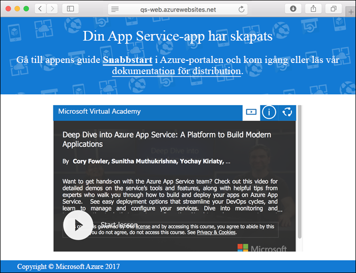
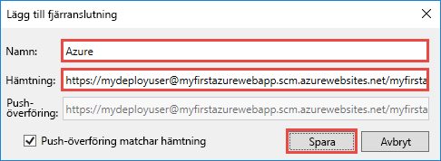

# <a name="create-an-aspnet-core-web-app-in-azure"></a>Skapa en ASP.NET Core-webbapp i Azure

> [!NOTE]
> I den här artikeln distribueras en app till App Service i Windows. Om du vill distribuera en app till App Service i _Linux_ kan du läsa [Skapa en .NET Core-webbapp i App Service på Linux](./containers/quickstart-dotnetcore.md).
>
> Instruktioner för en ASP.NET Framework-app finns i [Skapa en ASP.NET Framework-webbapp i Azure](app-service-web-get-started-dotnet-framework.md). 
>

Med [Azure Web Apps](app-service-web-overview.md) får du en mycket skalbar och automatiskt uppdaterad webbvärdtjänst.  Den här snabbstarten visar hur du distribuerar din första ASP.NET Core-webbapp till Azure Web Apps. När du är klar har du en resursgrupp som består av en App Service-plan och en Azure-webbapp med en distribuerad webbapp.

[!INCLUDE [quickstarts-free-trial-note](../../includes/quickstarts-free-trial-note.md)]

## <a name="prerequisites"></a>Nödvändiga komponenter

För att slutföra den här självstudien behöver du:

* Installera <a href="https://www.visualstudio.com/downloads/" target="_blank">Visual Studio 2017</a> med följande arbetsbelastningar:
    - **ASP.NET och webbutveckling**
    - **Azure Development**

    

## <a name="create-an-aspnet-core-web-app"></a>Skapa en ASP.NET Core-webbapp

Skapa ett nytt projekt i Visual Studio genom att välja **Arkiv > Nytt > Projekt**. 

I dialogrutan **Nytt projekt** väljer du **Visual C# > Webb > ASP.NET Core-webbtillämpningsprogram**.

Ge appen namnet _myFirstAzureWebApp_, välj **Create new Git repository** (Skapa en ny Git-lagringsplats) och välj sedan **OK**.
   


Du kan distribuera alla typer av ASP.NET Core-webbappar till Azure. I den här snabbstarten väljer du mallen **Webbprogram** och ser till att autentiseringen är inställd på **Ingen autentisering**.
      
Välj **OK**.


När ASP.NET Core-projektet har skapats visas välkomstsidan för ASP.NET Core med ett antal länkar till resurser som hjälper dig att komma igång. 


På menyn väljer du **Felsöka > Starta utan felsökning** för att köra webbappen lokalt.


[!INCLUDE [cloud-shell-try-it.md](../../includes/cloud-shell-try-it.md)]

[!INCLUDE [Configure deployment user](../../includes/configure-deployment-user.md)] 

[!INCLUDE [Create resource group](../../includes/app-service-web-create-resource-group.md)] 

[!INCLUDE [Create app service plan](../../includes/app-service-web-create-app-service-plan.md)] 

[!INCLUDE [Create web app](../../includes/app-service-web-create-web-app.md)] 



## <a name="push-to-azure-from-visual-studio"></a>Gör en push till Azure från Visual Studio

Gå tillbaka till Visual Studio och klicka på **Team Explorer** på **Visa**-menyn. **Team Explorer** visas.

I vyn **Home** (Start) klickar du på **Settings** (Inställningar)  > **Repository Settings** (Inställningar för lagringsplats).


I avsnittet **Remotes** (Fjärrplatser) i **Repository Settings** (Inställningar för lagringsplatser) väljer du **Add** (Lägg till). Dialogrutan **Add Remote** (Lägg till fjärrplats) visas.

Ange _Azure_ i fältet **Name** (Namn) och ange URL:en som du sparade i [Skapa en webbapp](#create-a-web-app) i fältet **Fetch** (Hämta). Klicka på **Spara**.



Den här inställningen motsvarar Git-kommandot `git remote add Azure <URL>`.

Klicka på knappen **Home** (Start) längst upp.

Välj **Settings** (Inställningar)  > **Global Settings** (Globala inställningar). Kontrollera att namnet och e-postadressen har angetts. Välj **Update** (Uppdatera) om det behövs.

Visual Studio har redan checkat in alla filer på Git-lagringsplatsen när projektet skapades. Allt du behöver göra är att push-överföra filerna till Azure.

Klicka på knappen **Home** (Start) längst upp. Välj **Sync** (Synkronisering)  > **Actions** (Åtgärder)  > **Open Command Prompt** (Öppna kommandotolken). 

Ange följande kommando i kommandofönstret och ange distributionslösenordet när du uppmanas att göra det:

```
git push Azure master
```

Det kan ett par minuter att köra kommandot. Medan det körs visas information liknande den i följande exempel:

```
Counting objects: 4, done.
Delta compression using up to 8 threads.
Compressing objects: 100% (4/4), done.
Writing objects: 100% (4/4), 349 bytes | 349.00 KiB/s, done.
Total 4 (delta 3), reused 0 (delta 0)
remote: Updating branch 'master'.
remote: Updating submodules.
remote: Preparing deployment for commit id '9e20345e9c'.
remote: Generating deployment script.
remote: Project file path: .\myFirstAzureWebApp\myFirstAzureWebApp.csproj
remote: Solution file path: .\myFirstAzureWebApp.sln
remote: Generated deployment script files
remote: Running deployment command...
remote: Handling ASP.NET Core Web Application deployment.
remote:   Restoring packages for D:\home\site\repository\myFirstAzureWebApp\myFirstAzureWebApp.csproj...
remote:   Restoring packages for D:\home\site\repository\myFirstAzureWebApp\myFirstAzureWebApp.csproj...
...
remote: Finished successfully.
remote: Running post deployment command(s)...
remote: Deployment successful.
To https://<app_name>.scm.azurewebsites.net/<app_name>.git
 * [new branch]      master -> master
```

## <a name="browse-to-the-app"></a>Bläddra till appen

Navigera till Azure-webbappens URL i en webbläsare: `http://<app_name>.azurewebsites.net`.

Sidan körs som en Azure App Service-webbapp.


Grattis, din ASP.NET Core-webbapp körs live i Azure App Service.

## <a name="update-the-app-and-redeploy"></a>Uppdatera och distribuera om appen

Öppna _Pages/Index.cshtml_ från **Solution Explorer**.

Leta reda på HTML-taggen `<div id="myCarousel" class="carousel slide" data-ride="carousel" data-interval="6000">` längst upp på sidan och ersätt hela elementet med följande kod:

```HTML
<div class="jumbotron">
    <h1>ASP.NET in Azure!</h1>
    <p class="lead">This is a simple app that we’ve built that demonstrates how to deploy a .NET app to Azure App Service.</p>
</div>
```

I **Solution Explorer** högerklickar du på _Pages/Index.cshtml_ och klickar på **Commit** (Genomför). Ange ett meddelande för dina ändringar och klicka på **Commit All** (Genomför alla).

Push-överför sedan kodändringarna till Azure i kommandotolksfönstret.

```bash
git push Azure master
```

När distributionen är klar navigerar du till `http://<app_name>.azurewebsites.net` igen.


## <a name="manage-the-azure-web-app"></a>Hantera Azure-webbappen

Gå till <a href="https://portal.azure.com" target="_blank">Azure Portal</a> för att hantera webbappen.

Klicka på **Apptjänster** på menyn till vänster och välj sedan namnet på din Azure-webbapp.


Nu visas sidan Översikt för din webbapp. Här kan du utföra grundläggande hanteringsåtgärder som att bläddra, stoppa, starta, starta om och ta bort. 


Menyn till vänster innehåller olika sidor för att konfigurera appen. 

[!INCLUDE [Clean-up section](../../includes/clean-up-section-portal.md)]

## <a name="next-steps"></a>Nästa steg

> [!div class="nextstepaction"]
> [ASP.NET Core med SQL Database](app-service-web-tutorial-dotnetcore-sqldb.md)
