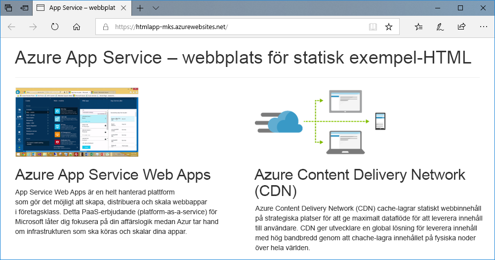
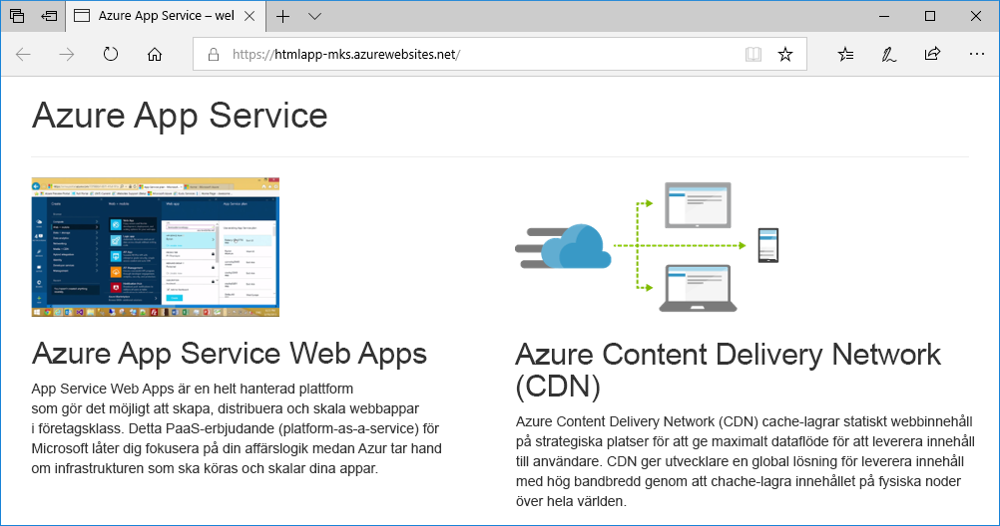
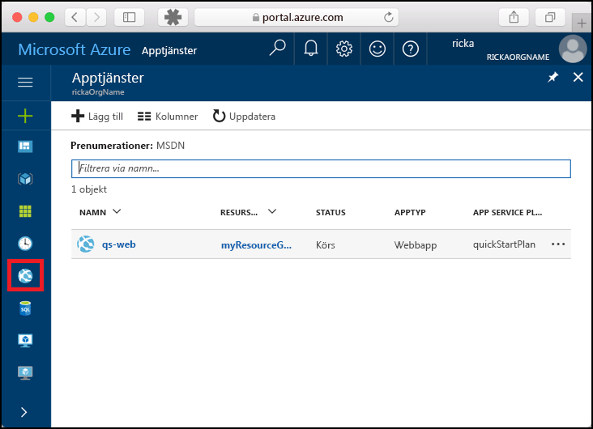
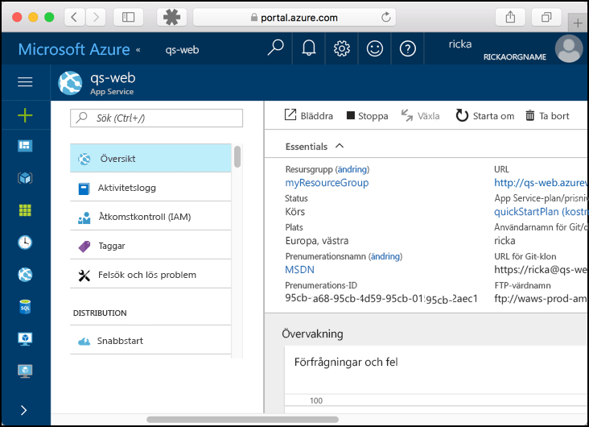

# <a name="create-a-static-html-web-app-in-azure"></a>Skapa en statisk HTML-webbapp i Azure

Med [Azure Web Apps](app-service-web-overview.md) får du en mycket skalbar och automatiskt uppdaterad webbvärdtjänst. Den här snabbstarten visar hur du distribuerar en enkel HTML+CSS-webbplats till Azure Web Apps. Du måste slutföra denna snabbstart i [Cloud Shell](https://docs.microsoft.com/azure/cloud-shell/overview), men du kan också köra dessa kommandon lokalt med [Azure CLI](/cli/azure/install-azure-cli).



[!INCLUDE [quickstarts-free-trial-note](../../includes/quickstarts-free-trial-note.md)]

[!INCLUDE [cloud-shell-try-it.md](../../includes/cloud-shell-try-it.md)]

## <a name="install-web-app-extension-for-cloud-shell"></a>Installera webbprogramtillägget för Cloud Shell

För att slutföra den här snabbstarten måste du lägga till [az-webbprogramtillägget](https://docs.microsoft.com/cli/azure/extension?view=azure-cli-latest#az-extension-add). Om tillägget redan är installerat måste du uppdatera det till den senaste versionen. Skriv `az extension update -n webapp` för att uppdatera webbprogramtillägget.

Kör följande kommando om du vill installera webbprogramtillägget:

```bash
az extension add --name webapp
```

När du har installerat tillägget visar Cloud Shell information i följande exempel:

```bash
The installed extension 'webapp' is in preview.
```

## <a name="download-the-sample"></a>Hämta exemplet

Skapa en snabbstartskatalog i Cloud Shell och ändra sedan till den.

```bash
mkdir quickstart

cd quickstart
```

Kör sedan följande kommando för att klona lagringsplatsen för exempelprogrammet till din snabbstartskatalog.

```bash
git clone https://github.com/Azure-Samples/html-docs-hello-world.git
```

## <a name="create-a-web-app"></a>Skapa en webbapp

Ändra till den katalog som innehåller exempelkoden och kör `az webapp up` kommandot.

Ersätt <app_name> med ett unikt programnamn i följande exempel.

```bash
cd html-docs-hello-world

az webapp up --location westeurope --name <app_name>
```

Kommandot `az webapp up` utför följande åtgärder:

- Skapa en standardresursgrupp.

- Skapa en standard App Service-plan.

- Skapa ett program med det givna namnet.

- [Zip-distribuera](https://docs.microsoft.com/azure/app-service/app-service-deploy-zip) filer från den aktuella arbetskatalogen till webbprogrammet.

Det kan ett par minuter att köra kommandot. Medan det körs visas information liknande den i följande exempel:

```json
{
  "app_url": "https://<app_name>.azurewebsites.net",
  "location": "westeurope",
  "name": "<app_name>",
  "os": "Windows",
  "resourcegroup": "appsvc_rg_Windows_westeurope",
  "serverfarm": "appsvc_asp_Windows_westeurope",
  "sku": "FREE",
  "src_path": "/home/<username>/quickstart/html-docs-hello-world ",
  < JSON data removed for brevity. >
}
```

Anteckna `resourceGroup`-värdet. Du behöver den för avsnittet [rensa resurser](#clean-up-resources).

## <a name="browse-to-the-app"></a>Bläddra till appen

Gå till Azure-webbappens URL i en webbläsare: `http://<app_name>.azurewebsites.net`.

Sidan körs som en Azure App Service-webbapp.


**Grattis!** Du har distribuerat din första HTML-app till App Service.

## <a name="update-and-redeploy-the-app"></a>Uppdatera och distribuera om appen

I Cloud Shell skriver du `nano index.html` för att öppna nanotextredigerare. I rubriktaggen `<h1>` ändrar du "Azure App Service – Sample Static HTML Site" till "Azure App Service" enligt nedan.


Spara dina ändringar och avsluta nano. Använd kommandot `^O` för att spara och `^X` för att avsluta.

Du kan nu distribuera appen med samma `az webapp up`-kommando.

```bash
az webapp up --location westeurope --name <app_name>
```

När distributionen är klar går du tillbaka till webbläsarfönstret som öppnades när du skulle **söka efter appen** och klickar på knappen för att uppdatera sidan.



## <a name="manage-your-new-azure-web-app"></a>Hantera din nya Azure-webbapp

Gå till <a href="https://portal.azure.com" target="_blank">Azure Portal</a> för att hantera den webbapp som du skapade.

Klicka på **App Services** i menyn till vänster och sedan på namnet på din Azure-webbapp.



Nu visas sidan Översikt för din webbapp. Här kan du utföra grundläggande hanteringsåtgärder som att bläddra, stoppa, starta, starta om och ta bort.



Menyn till vänster innehåller olika sidor för att konfigurera appen.

## <a name="clean-up-resources"></a>Rensa resurser

I de föregående stegen skapade du Azure-resurser i en resursgrupp. Om du inte tror att du behöver dessa resurser i framtiden tar du bort resursgruppen genom att köra följande kommando i Cloud Shell. Kom ihåg att resursgruppens namn har genererats automatiskt för dig i steget [skapa en webbapp](#create-a-web-app).

```bash
az group delete --name appsvc_rg_Windows_westeurope
```

Det kan några minuter att köra kommandot.

## <a name="next-steps"></a>Nästa steg

> [!div class="nextstepaction"]
> [Mappa anpassad domän](app-service-web-tutorial-custom-domain.md)
