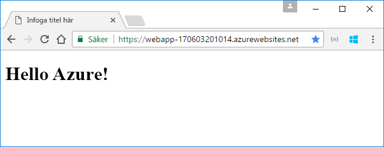
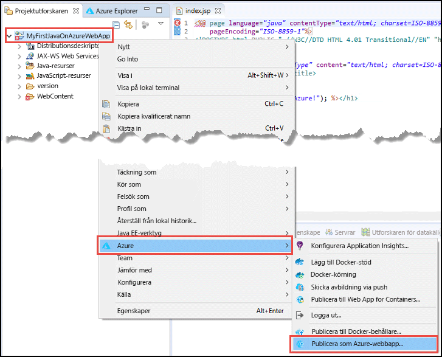
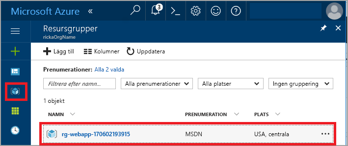
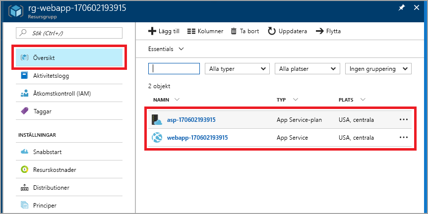
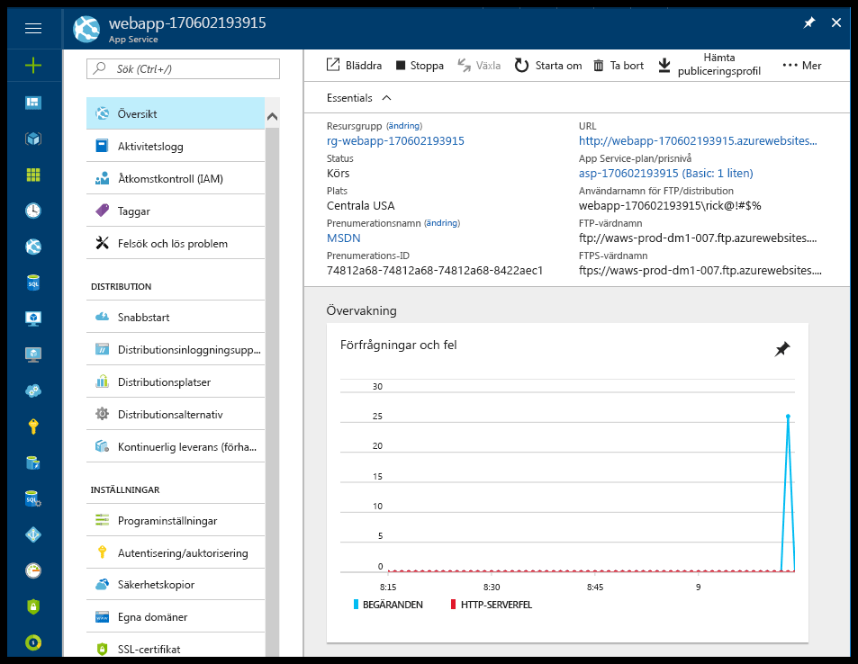

# <a name="create-your-first-java-web-app-in-azure"></a>Skapa din första Java-webbapp i Azure

Med Azure App Service får du en automatiskt uppdaterad webbvärdtjänst med hög skalbarhet. Den här snabbstarten visar hur du distribuerar en Java-webbapp till App Service med hjälp av Eclipse IDE för Java EE-utvecklare.

> [!IMPORTANT]
> Azure App Service i Linux är också ett alternativ för att värden Java-webbappar internt i Linux med hanterade Tomcat och Java SE WildFly erbjudanden. Om du är intresserad av att komma igång med App Service i Linux, se [snabbstarten: Skapa en Java-app i App Service i Linux](containers/quickstart-java.md).

När du har slutfört den här snabbstarten ser din app ut ungefär som på följande bild när du visar den i en webbläsare:



[!INCLUDE [quickstarts-free-trial-note](../../includes/quickstarts-free-trial-note.md)]

> [!NOTE]
>
> Stegen i den här snabbstarten visar hur du använder Eclipse IDE för att publicera en Java-webbapp till App Service, men du kan använda IntelliJ IDEA Ultimate Edition eller Community Edition. Mer information finns i [Create a Hello World web app for Azure using IntelliJ](/java/azure/intellij/azure-toolkit-for-intellij-create-hello-world-web-app) (Skapa en Hello World-webbapp för Azure med IntelliJ).
>

## <a name="prerequisites"></a>Nödvändiga komponenter

Installera följande för att slutföra den här snabbstarten:

* Kostnadsfria <a href="https://www.eclipse.org/downloads/" target="_blank">Eclipse IDE för Java EE-utvecklare</a>. Den här snabbstarten använder Eclipse Neon.
* <a href="/java/azure/eclipse/azure-toolkit-for-eclipse-installation" target="_blank">Azure Toolkit för Eclipse</a>.

> [!NOTE]
>
> Du måste logga in på ditt Azure-konto med hjälp av Azure-verktygen för Eclipse för att slutföra stegen i den här snabbstarten. För att göra det läser du [inloggningsinstruktionerna för Azure Toolkit för Eclipse](/java/azure/eclipse/azure-toolkit-for-eclipse-sign-in-instructions).
>

## <a name="create-a-dynamic-web-project-in-eclipse"></a>Skapa ett dynamiskt webbprojekt i Eclipse

Välj **Arkiv** > **Nytt** > **Dynamic Web Project** (Dynamiskt webbprojekt) Eclipse.

I dialogrutan **New Dynamic Web Project** (Nytt dynamiskt webbprojekt) ger du projektet namnet **MyFirstJavaOnAzureWebApp** och väljer **Slutför**.
   


### <a name="add-a-jsp-page"></a>Lägg till en JSP-sida

Om projektutforskaren inte visas kan du återställa den.


Expandera projektet **MyFirstJavaOnAzureWebApp** i projektutforskaren.
Högerklicka på **Webbinnehåll** och välj sedan **Ny** > **JSP-fil**.


I dialogrutan **Ny JSP-fil**:

* Namnge filen **index.jsp**.
* Välj **Slutför**.

  

I filen index.jsp ersätter du elementet `<body></body>` med följande kod:

```jsp
<body>
<h1><% out.println("Hello Azure!"); %></h1>
</body>
```

Spara ändringarna.

> [!NOTE]
>
> Om du ser ett fel på rad 1 som hänvisar till att en Java Servlet-klass saknas kan du ignorera det.
> 
> 
>

## <a name="publish-the-web-app-to-azure"></a>Publicera webbappen i Azure

Högerklicka på projektet i projektutforskaren och välj sedan **Azure** > **Publicera som Azure Web App**.



Om du uppmanas via dialogrutan för **Azure-inloggning** måste du följa stegen i [inloggningsinstruktionerna för Azure Toolkit för Eclipse](/java/azure/eclipse/azure-toolkit-for-eclipse-sign-in-instructions) för att ange dina autentiseringsuppgifter.

### <a name="deploy-web-app-dialog-box"></a>Dialogrutan Distribuera webbapp

När du har loggats in på Azure-kontot visas dialogrutan **Distribuera webbapp**.

Välj **Skapa**.


### <a name="create-app-service-dialog-box"></a>Dialogrutan Skapa App Service

Dialogrutan **Skapa App Service** visas med standardvärden. Numret **170602185241** som visas i följande bild skiljer sig från vad som visas i din dialogruta.


I dialogrutan **Skapa App Service**:

* Ange ett unikt namn för din webbapp eller behåll det genererade namnet. Användarnamnet måste vara unikt inom Azure. Namnet är en del av URL-adressen för webbappen. Exempel: om webbappens namn är **MyJavaWebApp** så är URL-adressen *myjavawebapp.azurewebsites.net*.
* Behåll webbcontainern som är standard för den här snabbstarten.
* Välj en Azure-prenumeration.
* På fliken **App Service-plan**:

  * **Skapa ny**: Behåll standardvärdet, som är namnet på App Service-planen.
  * **Plats**: Välj **Europa, västra** eller en plats nära dig.
  * **Prisnivå**: Markera det kostnadsfria alternativet. Se [Priser för App Service](https://azure.microsoft.com/pricing/details/app-service/?ref=microsoft.com&utm_source=microsoft.com&utm_medium=docs&utm_campaign=visualstudio) för funktioner.

    

[!INCLUDE [app-service-plan](../../includes/app-service-plan.md)]

### <a name="resource-group-tab"></a>Flik för resursgrupp

Välj fliken **Resursgrupp**. Behåll det genererade standardvärdet för resursgruppen.


[!INCLUDE [resource-group](../../includes/resource-group.md)]

Välj **Skapa**.

<!--
### The JDK tab

Select the **JDK** tab. Keep the default, and then select **Create**.


-->

Webbappen skapas av Azure Toolkit och en dialogruta med en förloppsindikator visas.


### <a name="deploy-web-app-dialog-box"></a>Dialogrutan Distribuera webbapp

I dialogrutan **Distribuera webbapp** väljer du **Distribuera till rot**. Om du har en apptjänst på *wingtiptoys.azurewebsites.net* och inte distribuerar webbappen till roten så distribueras webbappen med namnet **MyFirstJavaOnAzureWebApp** till *wingtiptoys.azurewebsites.net/MyFirstJavaOnAzureWebApp*.


Dialogrutan visar valen för Azure, JDK och webbcontainer.

Välj **Distribuera** för att publicera webbappen i Azure.

När publiceringen är klar väljer du länken **Publicerade** i dialogrutan **Azure-aktivitetsloggen**.


Grattis! Din webbapp har distribuerats till Azure. 


## <a name="update-the-web-app"></a>Uppdatera webbappen

Ändra JSP-exempelkod till ett annat meddelande.

```jsp
<body>
<h1><% out.println("Hello again Azure!"); %></h1>
</body>
```

Spara ändringarna.

Högerklicka på projektet i projektutforskaren och välj sedan **Azure** > **Publicera som Azure Web App**.

Dialogrutan **Distribuera webbapp** visas med apptjänsten som du skapade tidigare. 

> [!NOTE] 
> Välj **Distribuera till rot** varje gång du publicerar. 
> 

Välj webbappen och sedan **Distribuera**. Då publiceras ändringarna.

När länken **Publicering** visas väljer du den för att bläddra till webbappen och se ändringarna.

## <a name="manage-the-web-app"></a>Hantera webbappen

Gå till <a href="https://portal.azure.com" target="_blank">Azure Portal</a> för att se den webbapp som du skapade.

Välj **Resursgrupper** på den vänstra menyn.



Välj resursgruppen. På sidan visas resurserna som du skapade i den här snabbstarten.



Välj webbappen (**webbapp-170602193915** i den föregående bilden).

Sidan **Översikt** visas. Den här sidan ger dig en översikt över hur det går för appen. Här kan du utföra grundläggande hanteringsåtgärder som att bläddra, stoppa, starta, starta om och ta bort. På flikarna till vänster på sidan kan du se olika konfigurationer som du kan öppna. 



[!INCLUDE [clean-up-section-portal-web-app](../../includes/clean-up-section-portal-web-app.md)]

## <a name="next-steps"></a>Nästa steg

> [!div class="nextstepaction"]
> [Mappa anpassad domän](app-service-web-tutorial-custom-domain.md)
