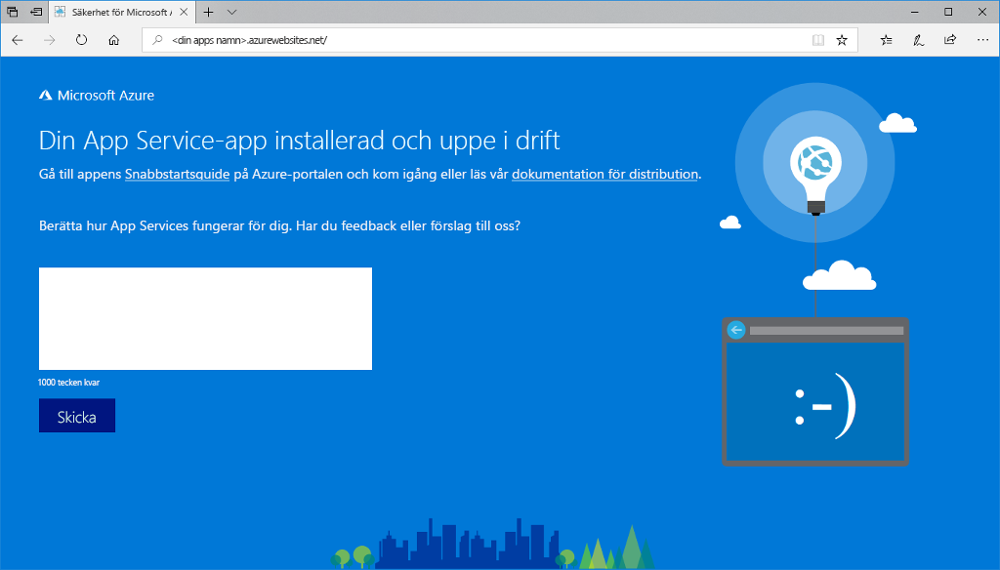
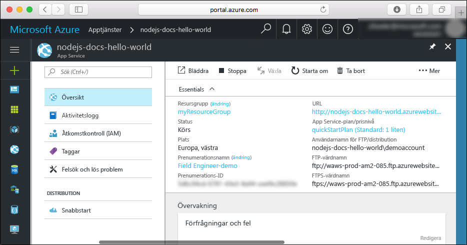

# <a name="create-a-nodejs-web-app-in-azure"></a>Skapa en Node.js-webbapp i Azure

> [!NOTE]
> I den här artikeln distribueras en app till App Service i Windows. Om du vill distribuera en app till App Service i _Linux_ kan du läsa [Skapa en Node.js-webbapp i Azure App Service på Linux](./containers/quickstart-nodejs.md).
>

Med [Azure App Service](overview.md) får du en automatiskt uppdaterad webbvärdtjänst med hög skalbarhet.  Den här snabbstarten visar hur du distribuerar en Node.js-app till Azure App Service. Du skapar webbappen med [Azure CLI](https://docs.microsoft.com/cli/azure/get-started-with-azure-cli) och använder ZipDeploy för att distribuera Node.js-exempelkoden till webbappen.


Du kan följa stegen här på en Mac-, Windows- eller Linux-dator. Det tar cirka fem minuter att slutföra självstudiekursen när de nödvändiga komponenterna har installerats.   

[!INCLUDE [quickstarts-free-trial-note](../../includes/quickstarts-free-trial-note.md)]

## <a name="prerequisites"></a>Nödvändiga komponenter

För att slutföra den här snabbstarten behöver du:

* <a href="https://nodejs.org/" target="_blank">Installera Node.js och NPM</a>

## <a name="download-the-sample"></a>Hämta exemplet

Ladda ned exempelprojektet för Node.js från [https://github.com/Azure-Samples/nodejs-docs-hello-world/archive/master.zip](https://github.com/Azure-Samples/nodejs-docs-hello-world/archive/master.zip) och extrahera ZIP-arkivet.

Öppna _index.js_ och leta reda på följande rad:

```javascript
var port = process.env.PORT || 1337;
```

App Service lägger in process.env.PORT i ditt program, så att koden använder variabeln för att veta vilken port som ska lyssna. 

Navigera till rotkatalogen för Node.js-exempelprojektet i ett terminalfönster (det som innehåller _index.js_).

## <a name="run-the-app-locally"></a>Köra appen lokalt

Kör programmet lokalt så att du ser hur det ska se ut när du distribuerar det till Azure. Öppna ett terminalfönster och använd skriptet `npm start` för att starta den inbyggda HTTP-servern för Node.js.

```bash
npm start
```

Öppna en webbläsare och navigera till exempelappen på `http://localhost:1337`.

Nu kan du se **Hello World**-meddelandet från exempelappen på sidan.


Tryck på **Ctrl+C** i terminalfönstret för att avsluta webbservern.

> [!NOTE]
> I Azure App Service körs appen i IIS med [iisnode](https://github.com/Azure/iisnode). Om du vill att appen ska kunna köras med iisnode finns det en web.config-fil i appens rotkatalog. Filen kan läsas av IIS, och iisnode-relaterade inställningar dokumenteras i [iisnode GitHub-lagringsplatsen](https://github.com/Azure/iisnode/blob/master/src/samples/configuration/web.config).

[!INCLUDE [Create ZIP file](../../includes/app-service-web-create-zip.md)]

[!INCLUDE [cloud-shell-try-it.md](../../includes/cloud-shell-try-it.md)]

[!INCLUDE [Create resource group](../../includes/app-service-web-create-resource-group-scus.md)] 

[!INCLUDE [Create app service plan](../../includes/app-service-web-create-app-service-plan-scus.md)] 

## <a name="create-a-web-app"></a>Skapa en webbapp

Skapa i Cloud Shell en webbapp i `myAppServicePlan` App Service-planen med kommandot [`az webapp create`](/cli/azure/webapp?view=azure-cli-latest#az-webapp-create). 

Ersätt `<app_name>` med ett globalt unikt appnamn (giltiga tecken är `a-z`, `0-9` och `-`) i följande exempel.

```azurecli-interactive
# Bash and Powershell
az webapp create --resource-group myResourceGroup --plan myAppServicePlan --name <app_name>
```

När webbappen har skapats visar Azure CLI utdata liknande den i följande exempel:

```json
{
  "availabilityState": "Normal",
  "clientAffinityEnabled": true,
  "clientCertEnabled": false,
  "cloningInfo": null,
  "containerSize": 0,
  "dailyMemoryTimeQuota": 0,
  "defaultHostName": "<app_name>.azurewebsites.net",
  "enabled": true,
  < JSON data removed for brevity. >
}
```

### <a name="set-nodejs-runtime"></a>Ange Node.js-körning

Ange Node-körningen till 8.11.1. Om du vill se alla körningar som stöds ska du köra [`az webapp list-runtimes`](/cli/azure/webapp?view=azure-cli-latest#az-webapp-list-runtimes).

```azurecli-interactive
# Bash and Powershell
az webapp config appsettings set --resource-group myResourceGroup --name <app_name> --settings WEBSITE_NODE_DEFAULT_VERSION=8.11.1
```

Bläddra till webbappen som precis skapades. Ersätt `<app_name>` med ett unikt appnamn.

```bash
http://<app_name>.azurewebsites.net
```

Så här bör din nya webbapp se ut:



[!INCLUDE [Deploy ZIP file](../../includes/app-service-web-deploy-zip.md)]

## <a name="browse-to-the-app"></a>Bläddra till appen

Bläddra till den distribuerade appen via webbläsaren.

```
http://<app_name>.azurewebsites.net
```

Node.js-exempelkoden körs i en Azure App Service-webbapp.


**Grattis!** Du har distribuerat din första Node.js-app till App Service.

## <a name="update-and-redeploy-the-code"></a>Uppdatera och distribuera om koden

Öppna filen `index.js` i Node.js-appen med ett textredigeringsprogram och gör små ändringar i texten i anropet till `response.end`:

```nodejs
response.end("Hello Azure!");
```

I det lokala terminalfönstret navigerar du till programmets rotkatalog och skapar en ny ZIP-fil för det uppdaterade projektet.

```
# Bash
zip -r myUpdatedAppFiles.zip .

# PowerShell
Compress-Archive -Path * -DestinationPath myUpdatedAppFiles.zip
```

Distribuera den nya ZIP-filen till App Service med samma steg som i [Distribuera ZIP-fil](#deploy-zip-file).

Gå tillbaka till webbläsarfönstret som öppnades när du skulle **söka efter appen** och klicka på knappen för att uppdatera sidan.


## <a name="manage-your-new-azure-app"></a>Hantera din nya Azure-app

Gå till <a href="https://portal.azure.com" target="_blank">Azure Portal</a> för att hantera den webbapp som du skapade.

I den vänstra menyn klickar du på **App Services** och därefter på namnet på din Azure-app.


Nu visas sidan Översikt för din webbapp. Här kan du utföra grundläggande hanteringsåtgärder som att bläddra, stoppa, starta, starta om och ta bort. 



Menyn till vänster innehåller olika sidor för att konfigurera appen. 

## <a name="video"></a>Video

Titta på videon för att se snabbstarten och följ sedan anvisningarna för att publicera din första Node.js-app i Azure.

> [!VIDEO https://channel9.msdn.com/Shows/Azure-for-Node-Developers/Create-a-Nodejs-app-in-Azure-Quickstart/player]   

[!INCLUDE [cli-samples-clean-up](../../includes/cli-samples-clean-up.md)]

## <a name="next-steps"></a>Nästa steg

> [!div class="nextstepaction"]
> [Node.js med MongoDB](app-service-web-tutorial-nodejs-mongodb-app.md)
