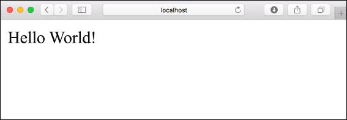
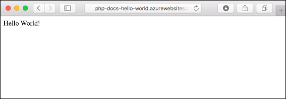
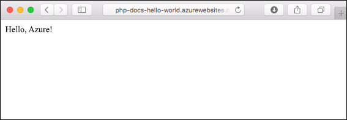
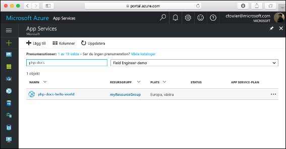
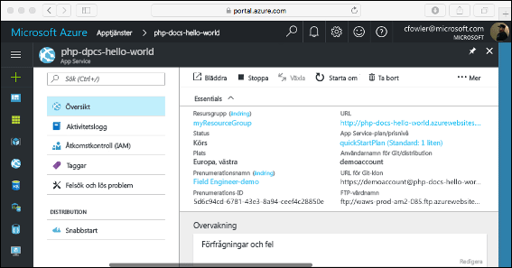

# <a name="create-a-php-web-app-in-azure"></a>Skapa en PHP-webbapp i Azure

Med [Azure Web Apps](app-service-web-overview.md) får du en mycket skalbar och automatiskt uppdaterad webbvärdtjänst.  Den här snabbstartskursen visar hur du distribuerar en PHP-app till Azure Web Apps. Du skapar webbappen med [Azure CLI](https://docs.microsoft.com/cli/azure/get-started-with-azure-cli) i Cloud Shell och använder Git för att distribuera PHP-exempelkoden till webbappen.

![Sample app running in Azure]](media/app-service-web-get-started-php/hello-world-in-browser.png)

Du kan följa stegen nedan på en Mac-, Windows- eller Linux-dator. Det tar cirka fem minuter att slutföra självstudiekursen när de nödvändiga komponenterna har installerats.

## <a name="prerequisites"></a>Krav

För att slutföra den här snabbstarten behöver du:

* <a href="https://git-scm.com/" target="_blank">Installera Git</a>
* <a href="https://php.net" target="_blank">Installera PHP</a>

[!INCLUDE [quickstarts-free-trial-note](../../includes/quickstarts-free-trial-note.md)]

## <a name="download-the-sample-locally"></a>Ladda ned exemplet lokalt

Kör följande kommandon i ett terminalfönster. Exempelprogrammet klonas då till din lokala dator och du kommer till katalogen med exempelkoden.

```bash
git clone https://github.com/Azure-Samples/php-docs-hello-world
cd php-docs-hello-world
```

## <a name="run-the-app-locally"></a>Köra appen lokalt

Kör programmet lokalt genom att öppna ett terminalfönster och använda kommandot `php` för att starta den inbyggda PHP-webbservern.

```bash
php -S localhost:8080
```

Öppna en webbläsare och gå till exempelapp på `http://localhost:8080`.

Du ser meddelandet **Hello World!** från exempelappen på sidan.



Tryck på **Ctrl+C** i terminalfönstret för att avsluta webbservern.

[!INCLUDE [cloud-shell-try-it.md](../../includes/cloud-shell-try-it.md)]

[!INCLUDE [Configure deployment user](../../includes/configure-deployment-user.md)]

[!INCLUDE [Create resource group](../../includes/app-service-web-create-resource-group.md)]

[!INCLUDE [Create app service plan](../../includes/app-service-web-create-app-service-plan.md)]

## <a name="create-a-web-app"></a>Skapa en webbapp

[!INCLUDE [Create web app](../../includes/app-service-web-create-web-app-php-no-h.md)]

Bläddra till den nya webbappen. Ersätt  _&lt;appnamn >_ med ett unikt appnamn.

```bash
http://<app name>.azurewebsites.net
```


[!INCLUDE [Push to Azure](../../includes/app-service-web-git-push-to-azure.md)] 

```bash
Counting objects: 2, done.
Delta compression using up to 4 threads.
Compressing objects: 100% (2/2), done.
Writing objects: 100% (2/2), 352 bytes | 0 bytes/s, done.
Total 2 (delta 1), reused 0 (delta 0)
remote: Updating branch 'master'.
remote: Updating submodules.
remote: Preparing deployment for commit id '25f18051e9'.
remote: Generating deployment script.
remote: Running deployment command...
remote: Handling Basic Web Site deployment.
remote: Kudu sync from: '/home/site/repository' to: '/home/site/wwwroot'
remote: Copying file: '.gitignore'
remote: Copying file: 'LICENSE'
remote: Copying file: 'README.md'
remote: Copying file: 'index.php'
remote: Ignoring: .git
remote: Finished successfully.
remote: Running post deployment command(s)...
remote: Deployment successful.
To https://<app_name>.scm.azurewebsites.net/<app_name>.git
   cc39b1e..25f1805  master -> master
```

## <a name="browse-to-the-app-locally"></a>Bläddra till appen lokalt

Bläddra till den distribuerade appen via webbläsaren.

```bash
http://<app_name>.azurewebsites.net
```

PHP-exempelkoden körs i en Azure App Service-webbapp.



**Grattis!** Du har distribuerat din första PHP-app till App Service.

## <a name="update-locally-and-redeploy-the-code"></a>Uppdatera lokalt och distribuera om koden

Öppna filen `index.php` i PHP-appen med ett lokalt textredigeringsprogram och gör små ändringar i texten i strängen bredvid `echo`:

```php
echo "Hello Azure!";
```

Genomför ändringarna i Git i lokala terminalfönster och sedan genomför kodändringarna i Azure.

```bash
git commit -am "updated output"
git push azure master
```

När distributionen är klar går du tillbaka till webbläsarfönstret som öppnades när du skulle **söka efter appen** och klickar på knappen för att uppdatera sidan.



## <a name="manage-your-new-azure-web-app"></a>Hantera din nya Azure-webbapp

Gå till <a href="https://portal.azure.com" target="_blank">Azure Portal</a> för att hantera den webbapp som du skapade.

Klicka på **Apptjänster** i menyn till vänster och sedan på namnet på din Azure-webbapp.



Nu visas sidan Översikt för din webbapp. Här kan du utföra grundläggande hanteringsåtgärder som att bläddra, stoppa, starta, starta om och ta bort.



Menyn till vänster innehåller olika sidor för att konfigurera appen. 

[!INCLUDE [cli-samples-clean-up](../../includes/cli-samples-clean-up.md)]

## <a name="next-steps"></a>Nästa steg

> [!div class="nextstepaction"]
> [PHP med MySQL](app-service-web-tutorial-php-mysql.md)
