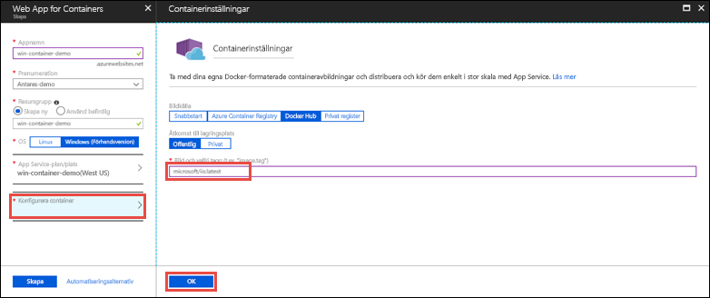

# <a name="run-a-custom-windows-container-in-azure-preview"></a>Köra en anpassad Windows-container i Azure (förhandsversion)

[Azure App Service](app-service-web-overview.md) har fördefinierade programstackar i Windows som ASP.NET eller Node.js, som körs i IIS. Den förkonfigurerade Windows-miljön låser operativsystemet från administrativ åtkomst, programinstallationer, ändringar av den globala sammansättningscachen och så vidare (se [Operativsystemfunktioner i Azure App Service](web-sites-available-operating-system-functionality.md)). Om programmet kräver mer åtkomst än den förkonfigurerade miljön tillåter kan du istället distribuera en anpassad Windows-container. Den här snabbstarten visar hur du distribuerar en anpassad IIS-avbildning till Azure App Service från [Docker Hub](https://hub.docker.com/).


## <a name="sign-in-to-azure"></a>Logga in på Azure

Logga in på Azure Portal på https://portal.azure.com.

## <a name="create-a-windows-container-app"></a>Skapa en Windows-containerapp

1. Välj **Skapa en resurs** längst upp till vänster i Azure Portal.

2. I sökrutan ovanför listan över resurser i Azure Marketplace söker du efter och väljer **Web App for Containers**.

3. Ange ett namn på appen, till exempel *mywebapp*, acceptera standardinställningarna för att skapa en ny resursgrupp och klicka på **Windows (förhandsversion)** i rutan **OS**.

    

4. Skapa en App Service-plan genom att klicka på **App Service-plan/Plats** > **Skapa ny**. Namnge den nya planen, acceptera standardinställningarna och klicka på **OK**.

    

5. Klicka på **Konfigurera container**, skriv _microsoft/iis:latest_ i **Avbildning och valfri tagg** och klicka på **OK**.

    

    I den här artikeln använder du den offentliga Docker Hub-avbildningen [microsoft/iis:latest](https://hub.docker.com/r/microsoft/iis/). Om du har en anpassad avbildning någon annanstans för ditt webbprogram, till exempel i [Azure Container Registry](/azure/container-registry/) eller på en annan privat lagringsplats, kan du konfigurera den här.

6. Klicka på **Skapa** och vänta på att Azure skapar resurserna som krävs.

## <a name="browse-to-the-container-app"></a>Bläddra till containerappen

När Azure-åtgärden är klar visas ett meddelande.


1. Klicka på **Gå till resurs**.

2. På appsidan klickar du på länken under **URL**.

En ny webbläsarsida öppnas på följande sida:


Vänta några minuter och försök igen, tills du kommer till välkomstsidan för IIS:


**Grattis!** Du kör din första anpassade Windows-container i Azure App Service.

## <a name="see-container-start-up-logs"></a>Se containerns startloggar

Det kan ta lite tid för Windows-containern att läsas in. Om du vill se förloppet går du till följande URL genom att ersätta *\<app_name>* med namnet på din app.
```
https://<app_name>.scm.azurewebsites.net/api/logstream
```

De strömmade loggarna ser ut så här:

```
2018-07-27T12:03:11  Welcome, you are now connected to log-streaming service.
27/07/2018 12:04:10.978 INFO - Site: win-container-demo - Start container succeeded. Container: facbf6cb214de86e58557a6d073396f640bbe2fdec88f8368695c8d1331fc94b
27/07/2018 12:04:16.767 INFO - Site: win-container-demo - Container start complete
27/07/2018 12:05:05.017 INFO - Site: win-container-demo - Container start complete
27/07/2018 12:05:05.020 INFO - Site: win-container-demo - Container started successfully
```

## <a name="use-a-different-docker-image"></a>Använda en annan Docker-avbildning

Du kan använda en annan anpassad Docker-avbildning för att köra appen. Men du måste välja rätt [överordnad avbildning](https://docs.docker.com/develop/develop-images/baseimages/) för det ramverk du vill använda: 

- Om du vill distribuera .NET Framework-appar använder du en överordnad avbildning baserad på Windows Server Core 2016-versionen av [Long-Term Servicing kanal (LTSC)](https://docs.microsoft.com/windows-server/get-started/semi-annual-channel-overview#long-term-servicing-channel-ltsc). 
- Om du vill distribuera .NET Core-appar använder du en överordnad avbildning baserad på Windows Server Nano 2016-versionen av [Long-Term Servicing kanal (LTSC)](https://docs.microsoft.com/windows-server/get-started/semi-annual-channel-overview#long-term-servicing-channel-ltsc). 

Det tar lite tid att ladda ned en överordnad avbildning när appen startas. Men du kan minska starttiden genom att använda någon av följande överordnade avbildningar som redan har cachelagrats i Azure App Service:

- [microsoft/iis](https://hub.docker.com/r/microsoft/iis/):windowsservercore-ltsc2016, latest
- [microsoft/iis](https://hub.docker.com/r/microsoft/iis/):nanoserver-sac2016
- [microsoft/aspnet](https://hub.docker.com/r/microsoft/aspnet/):4.7.2-windowsservercore-ltsc2016, 4.7.2, latest
- [microsoft/dotnet](https://hub.docker.com/r/microsoft/dotnet/):2.1-aspnetcore-runtime
- [microsoft/dotnet](https://hub.docker.com/r/microsoft/dotnet/):2.1-sdk
