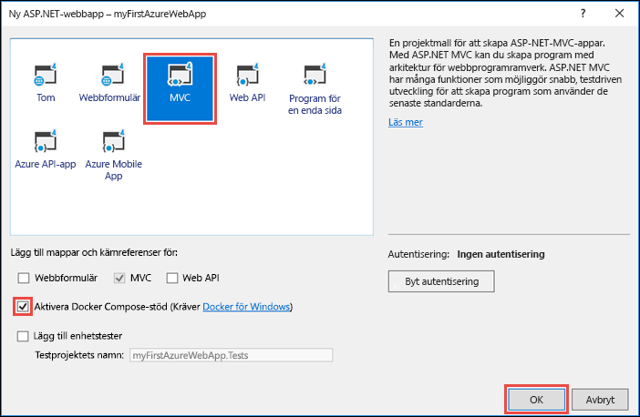
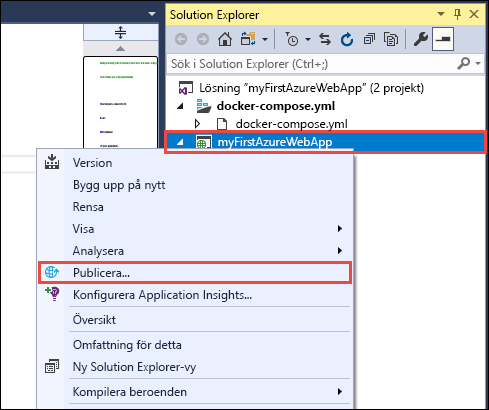
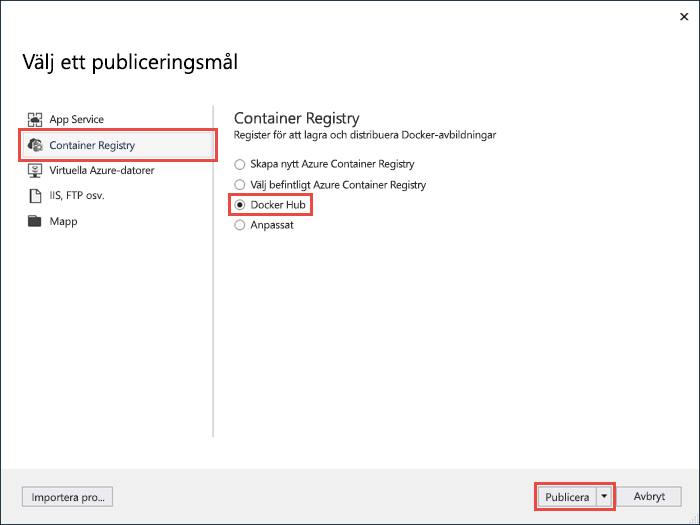
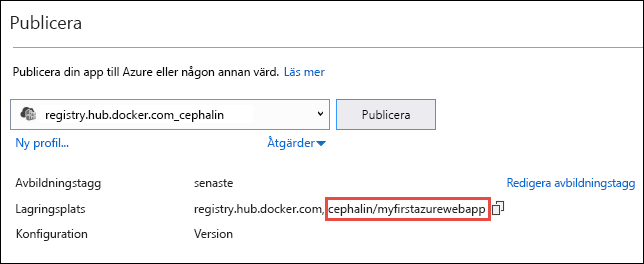
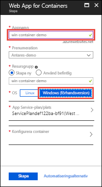
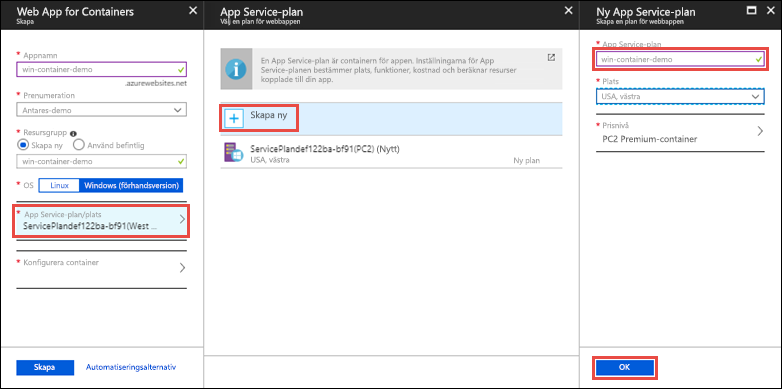
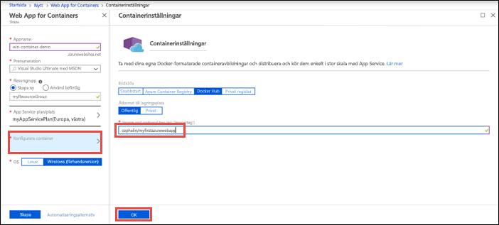
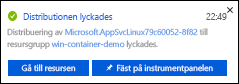
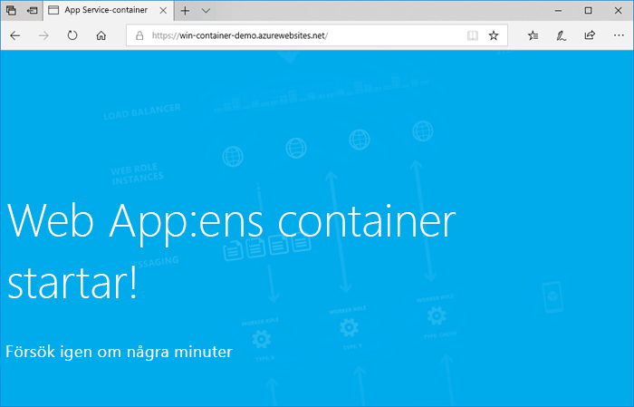

# <a name="run-a-custom-windows-container-in-azure-preview"></a>Köra en anpassad Windows-container i Azure (förhandsversion)

[Azure App Service](overview.md) har fördefinierade programstackar i Windows som ASP.NET eller Node.js, som körs i IIS. Den förkonfigurerade Windows-miljön låser operativsystemet från administrativ åtkomst, programinstallationer, ändringar av den globala sammansättningscachen och så vidare (se [Operativsystemfunktioner i Azure App Service](operating-system-functionality.md)). Om programmet kräver mer åtkomst än den förkonfigurerade miljön tillåter kan du istället distribuera en anpassad Windows-container. Den här snabbstarten visar hur du distribuerar en ASP.NET-app i en Windows-avbildning till [Docker Hub](https://hub.docker.com/) från Visual Studio och kör den i en anpassad container i Azure App Service.


## <a name="prerequisites"></a>Nödvändiga komponenter

För att slutföra den här självstudien behöver du:

- <a href="https://hub.docker.com/" target="_blank">Registrera dig för ett Docker Hub-konto</a>
- <a href="https://docs.docker.com/docker-for-windows/install/" target="_blank">Installera Docker för Windows</a>.
- <a href="https://docs.microsoft.com/virtualization/windowscontainers/quick-start/quick-start-windows-10" target="_blank">Växla Docker för att köra Windows-containrar</a>.
- <a href="https://www.visualstudio.com/downloads/" target="_blank">Installera Visual Studio 2017</a> med arbetsbelastningarna **ASP.NET och webbutveckling** och **Azure-utveckling**. Om du redan har installerat Visual Studio 2017:
    - Installera de senaste uppdateringarna i Visual Studio genom att klicka på **Hjälp** > **Sök efter uppdateringar**.
    - Lägg till arbetsbelastningarna i Visual Studio genom att klicka på **Verktyg** > **Hämta verktyg och funktioner**.

## <a name="create-an-aspnet-web-app"></a>Skapa en ASP.NET-webbapp

Skapa ett nytt projekt i Visual Studio genom att välja **Arkiv > Nytt > Projekt**. 

I dialogrutan **Nytt projekt** väljer du **Visual C# > Webb > ASP.NET-webbtillämpningsprogram (.NET Framework)**.

Ge programmet namnet _myFirstAzureWebApp_ och välj **OK**.
   


Du kan distribuera alla typer av ASP.NET-webbappar till Azure. I den här snabbstarten väljer du **MVC**-mallen och ser till att autentiseringen är inställd på **Ingen autentisering**.

Välj **Enable Docker Compose support** (Aktivera stöd för Docker Compose).

Välj **OK**.



Om filen _Dockerfile_ inte öppnas automatiskt öppnar du den från **Solution Explorer**.

Du måste använda en [överordnad avbildning som stöds](#use-a-different-parent-image). Ändra den överordnade avbildningen genom att ersätta raden `FROM` med följande kod och spara filen:

```Dockerfile
FROM mcr.microsoft.com/dotnet/framework/aspnet:4.7.2-windowsservercore-ltsc2019
```

På menyn väljer du **Felsöka > Starta utan felsökning** för att köra webbappen lokalt.


## <a name="publish-to-docker-hub"></a>Publicera till Docker Hub

Högerklicka på projektet **myFirstAzureWebApp** i **Solution Explorer** och välj **Publicera**.



Publiceringsguiden startas automatiskt. Välj **Container Registry** > **Docker Hub** > **Publicera**.



Ange autentiseringsuppgifterna för ditt Docker Hub-konto och klicka på **Spara**. 

Vänta tills distributionen har slutförts. Sidan **Publicera** visar nu namnet på lagringsplatsen som du ska använda senare i App Service.



Kopiera namnet på lagringsplatsen för senare bruk.

## <a name="sign-in-to-azure"></a>Logga in på Azure

Logga in på Azure Portal på https://portal.azure.com.

## <a name="create-a-windows-container-app"></a>Skapa en Windows-containerapp

1. Välj **Skapa en resurs** längst upp till vänster i Azure Portal.

2. I sökrutan ovanför listan över resurser i Azure Marketplace söker du efter och väljer **Web App for Containers**.

3. Ange ett namn på appen, till exempel *win-container-demo*, acceptera standardinställningarna för att skapa en ny resursgrupp och klicka på **Windows (förhandsversion)** i rutan **OS**.

    

4. Skapa en App Service-plan genom att klicka på **App Service-plan/Plats** > **Skapa ny**. Namnge den nya planen, acceptera standardinställningarna och klicka på **OK**.

    

5. Klicka på **Konfigurera container**. I **Image and optional tag** (Avbildning och valfri tagg) använder du namnet på lagringsplatsen som du kopierade i [Publicera till Docker Hub](#publish-to-docker-hub) och klickar sedan på **OK**.

    

    Om du har en anpassad avbildning någon annanstans för ditt webbprogram, till exempel i [Azure Container Registry](/azure/container-registry/) eller på en annan privat lagringsplats, kan du konfigurera den här.

6. Klicka på **Skapa** och vänta på att Azure skapar resurserna som krävs.

## <a name="browse-to-the-container-app"></a>Bläddra till containerappen

När Azure-åtgärden är klar visas ett meddelande.



1. Klicka på **Gå till resurs**.

2. På appsidan klickar du på länken under **URL**.

En ny webbläsarsida öppnas på följande sida:



Vänta några minuter och försök igen, tills du kommer till standardvälkomstsidan för ASP.NET:


**Grattis!** Du kör din första anpassade Windows-container i Azure App Service.

## <a name="see-container-start-up-logs"></a>Se containerns startloggar

Det kan ta lite tid för Windows-containern att läsas in. Om du vill se förloppet går du till följande URL genom att ersätta *\<app_name>* med namnet på din app.
```
https://<app_name>.scm.azurewebsites.net/api/logstream
```

De strömmade loggarna ser ut så här:

```
2018-07-27T12:03:11  Welcome, you are now connected to log-streaming service.
27/07/2018 12:04:10.978 INFO - Site: win-container-demo - Start container succeeded. Container: facbf6cb214de86e58557a6d073396f640bbe2fdec88f8368695c8d1331fc94b
27/07/2018 12:04:16.767 INFO - Site: win-container-demo - Container start complete
27/07/2018 12:05:05.017 INFO - Site: win-container-demo - Container start complete
27/07/2018 12:05:05.020 INFO - Site: win-container-demo - Container started successfully
```

## <a name="update-locally-and-redeploy"></a>Uppdatera lokalt och omdistribuera

Öppna _Views\Home\Index.cshtml_ från **Solution Explorer**.

Leta reda på HTML-taggen `<div class="jumbotron">` längst upp på sidan och ersätt hela elementet med följande kod:

```HTML
<div class="jumbotron">
    <h1>ASP.NET in Azure!</h1>
    <p class="lead">This is a simple app that we’ve built that demonstrates how to deploy a .NET app to Azure App Service.</p>
</div>
```

Högerklicka på projektet **myFirstAzureWebApp** i **Solution Explorer** och välj **Publicera** för att distribuera om appen till Azure.

På publiceringssidan väljer du **Publicera** och väntar tills publiceringen ska slutföras.

Om du vill uppmana App Service att hämta den nya avbildningen från Docker Hub startar du om appen. På appsidan i portalen klickar du på **Starta om** > **Ja**.


[Bläddra till container](#browse-to-the-container-app) igen. När du uppdaterar webbsidan ska appen återgå till sidan ”Startar” först och sedan visa den uppdaterade igen efter några minuter.


## <a name="use-a-different-parent-image"></a>Använd en annan överordnad avbildning

Du kan använda en annan anpassad Docker-avbildning för att köra appen. Men du måste välja rätt [överordnad avbildning](https://docs.docker.com/develop/develop-images/baseimages/) för det ramverk du vill använda: 

- Om du vill distribuera appar med .NET Framework, använder du en överordnad avbildning baserat på Windows Server Core 2019 [Long-Term Servicing kanal (LTSC)](https://docs.microsoft.com/windows-server/get-started/semi-annual-channel-overview#long-term-servicing-channel-ltsc) versionen. 
- Om du vill distribuera .NET Core-appar använder du en överordnad avbildning baserat på Windows Server Nano 1809 [Halvårskanal Servicing kanal SAC ()](https://docs.microsoft.com/windows-server/get-started-19/servicing-channels-19#semi-annual-channel) versionen. 

Det tar lite tid att ladda ned en överordnad avbildning när appen startas. Men du kan minska starttiden genom att använda någon av följande överordnade avbildningar som redan har cachelagrats i Azure App Service:

- [mcr.microsoft.com/dotnet/framework/aspnet](https://hub.docker.com/_/microsoft-dotnet-framework-aspnet/):4.7.2-windowsservercore-ltsc2019
- [MCR.microsoft.com/Windows/nanoserver](https://hub.docker.com/_/microsoft-windows-nanoserver/): 1809 – detta är grundläggande behållaren som används i Microsoft [ASP.NET Core](https://hub.docker.com/_microsoft-dotnet-cores-aspnet) Microsoft Windows Nano Server-avbildningar.

## <a name="next-steps"></a>Nästa steg

> [!div class="nextstepaction"]
> [Migrera till Windows-container i Azure](app-service-web-tutorial-windows-containers-custom-fonts.md)
