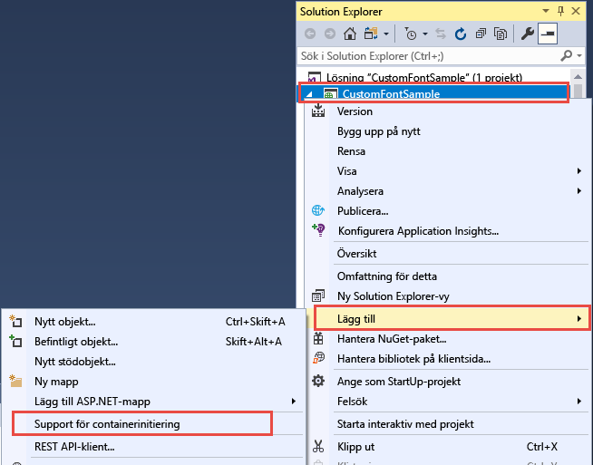
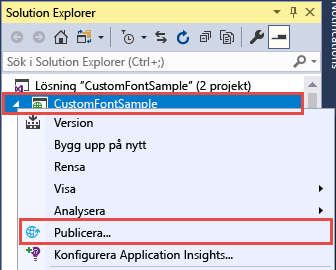
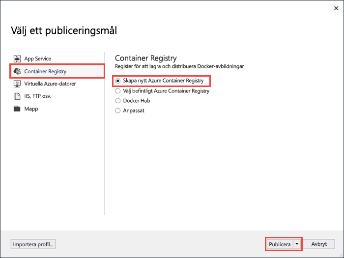
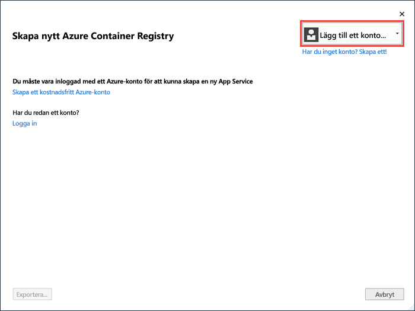
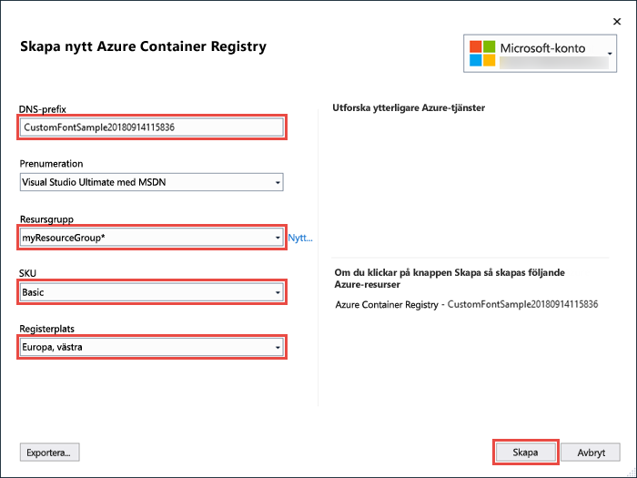
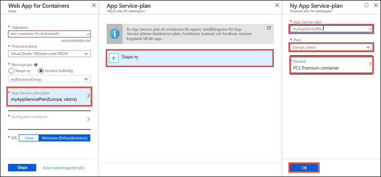
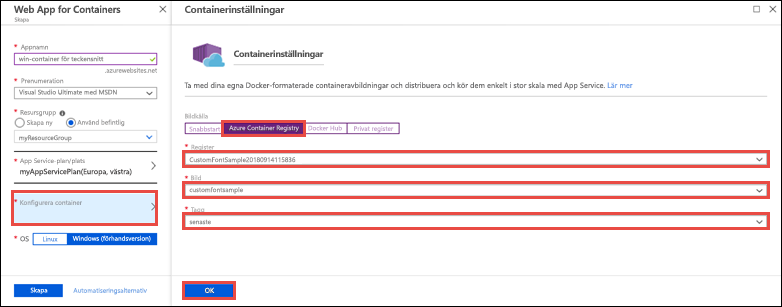
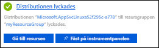

# <a name="migrate-an-aspnet-app-to-azure-app-service-using-a-windows-container-preview"></a>Migrera en ASP.NET-app till Azure App Service med hjälp av en Windows-container (förhandsversion)

[Azure App Service](app-service-web-overview.md) har fördefinierade programstackar i Windows som ASP.NET eller Node.js, som körs i IIS. Den förkonfigurerade Windows-miljön låser operativsystemet från administrativ åtkomst, programinstallationer, ändringar av den globala sammansättningscachen och så vidare (se [Operativsystemfunktioner i Azure App Service](operating-system-functionality.md)). Men genom att använda en anpassad Windows-container i App Service kan du göra nödvändiga operativsystemändringar som appen behöver, vilket gör det enkelt att migrera en lokal app som kräver en anpassad operativsystem- och programvarukonfiguration. Den här kursen beskriver hur du migrerar en ASP.NET-app till App Service som använder anpassade teckensnitt som installeras i Windows-teckensnittsbiblioteket. Du distribuerar en Windows-avbildning med en anpassad konfiguration från Visual Studio till [Azure Container Registry](https://docs.microsoft.com/azure/container-registry/) och kör den sedan i App Service.


## <a name="prerequisites"></a>Nödvändiga komponenter

För att slutföra den här självstudien behöver du:

- <a href="https://hub.docker.com/" target="_blank">Registrera dig för ett Docker Hub-konto</a>
- <a href="https://docs.docker.com/docker-for-windows/install/" target="_blank">Installera Docker för Windows</a>.
- <a href="https://docs.microsoft.com/virtualization/windowscontainers/quick-start/quick-start-windows-10#2-switch-to-windows-containers" target="_blank">Växla Docker för att köra Windows-containrar</a>.
- <a href="https://www.visualstudio.com/downloads/" target="_blank">Installera Visual Studio 2017</a> med arbetsbelastningarna **ASP.NET och webbutveckling** och **Azure-utveckling**. Om du redan har installerat Visual Studio 2017:
    - Installera de senaste uppdateringarna i Visual Studio genom att klicka på **Hjälp** > **Sök efter uppdateringar**.
    - Lägg till arbetsbelastningarna i Visual Studio genom att klicka på **Verktyg** > **Hämta verktyg och funktioner**.

## <a name="set-up-the-app-locally"></a>Konfigurera appen lokalt

### <a name="download-the-sample"></a>Hämta exemplet

I det här steget konfigurerar du det lokala .NET-projektet.

- [Ladda ned exempelprojektet](https://github.com/Azure-Samples/custom-font-win-container/archive/master.zip).
- Extrahera (packa upp) filen *custom-font-win-container.zip*.

Exempelprojektet innehåller ett enkelt ASP.NET-program som använder ett anpassat teckensnitt som installeras i Windows-teckensnittsbiblioteket. Det är inte nödvändigt att installera teckensnitt, men det är ett exempel på en app som är integrerad med det underliggande operativsystemet. För att migrera den här typen av app till App Service måste du antingen omorganisera din kod för att ta bort integrationen eller migrera den som den är i en anpassad Windows-container.

### <a name="install-the-font"></a>Installera teckensnittet

I Utforskaren navigerar du till _custom-font-win-container-master/CustomFontSample_, högerklickar på _FrederickatheGreat-Regular.ttf_ och väljer **Installera**.

Det här teckensnittet är offentligt tillgängligt från [Google Fonts](https://fonts.google.com/specimen/Fredericka+the+Great).

### <a name="run-the-app"></a>Kör appen

Öppna filen *custom-font-win-container/CustomFontSample.sln* i Visual Studio. 

Skriv `Ctrl+F5` för att köra appen utan felsökning. Appen visas i din standardwebbläsare. 


Eftersom den använder ett installerat teckensnitt kan inte appen köras i sandbox-miljön för App Service. Du kan dock distribuera den med hjälp av en Windows-container i stället, eftersom du kan installera teckensnittet i Windows-containern.

### <a name="configure-windows-container"></a>Konfigurera Windows-containern

I Solution Explorer högerklickar du på projektet **CustomFontSample** och väljer **Lägg till** > **Container Orchestration Support** (Stöd för containerorkestrering).



Välj **Docker Compose** > **OK**.

Nu har projektet konfigurerats för att köra i en Windows-container. En _Dockerfile_ läggs till i **CustomFontSample**-projektet och ett **docker-compose**-projekt läggs till i lösningen. 

Från Solution Explorer öppnar du **Dockerfile**.

Du måste använda en [överordnad avbildning som stöds](app-service-web-get-started-windows-container.md#use-a-different-parent-image). Ändra den överordnade avbildningen genom att ersätta raden `FROM` med följande kod:

```Dockerfile
FROM microsoft/aspnet:4.7.1
```

Lägg till följande rad i slutet av filen och spara filen:

```Dockerfile
RUN ${source:-obj/Docker/publish/InstallFont.ps1}
```

Du hittar _InstallFont.ps1_ i projektet **CustomFontSample**. Det är ett enkelt skript som installerar teckensnittet. Du hittar en mer komplex version av skriptet i [Skriptcenter](https://gallery.technet.microsoft.com/scriptcenter/fb742f92-e594-4d0c-8b79-27564c575133).

## <a name="publish-to-azure-container-registry"></a>Publicera till Azure Container Registry

[Azure Container Registry](https://docs.microsoft.com/azure/container-registry/) kan lagra dina avbildningar för containerdistribution. Du kan konfigurera App Service att använda avbildningar i Azure Container Registry.

### <a name="open-publish-wizard"></a>Öppna publiceringsguiden

I Solution Explorer högerklickar du på projektet **CustomFontSample** och väljer **Publicera**.



### <a name="create-registry-and-publish"></a>Skapa register och publicera

I publiceringsguiden väljer du **Containerregister** > **Create New Azure Container Registry (Skapa nytt Azure-containerregister)** > **Publicera**.



### <a name="sign-in-with-azure-account"></a>Logga in med Azure-konto

I dialogrutan **Create a new Azure Container Registry** (Skapa nytt Azure-containerregister) väljer du **Lägg till ett konto** och loggar in till din Azure-prenumeration. Välj det konto som innehåller den önskade prenumerationen i listrutan om du redan är inloggad.



### <a name="configure-the-registry"></a>Konfigurera registret

Konfigurera det nya containerregistret baserat på de föreslagna värdena i tabellen nedan. Klicka på **Skapa** när du är klar.

| Inställning  | Föreslaget värde | Mer information |
| ----------------- | ------------ | ----|
|**DNS-prefix**| Behåll det genererade registernamnet eller ändra det till ett annat unikt namn. |  |
|**Resursgrupp**| Klicka på **Nytt**, skriv **myResourceGroup** och klicka på **OK**. |  |
|**SKU**| Basic | [Prisnivåer](https://azure.microsoft.com/pricing/details/container-registry/)|
|**Registerplats**| Västra Europa | |



Ett terminalfönster öppnas och visar förloppet för avbildningsdistributionen. Vänta tills distributionen har slutförts.

## <a name="sign-in-to-azure"></a>Logga in på Azure

Logga in på Azure Portal på https://portal.azure.com.

## <a name="create-a-web-app"></a>Skapa en webbapp

På den vänstra menyn väljer du **Skapa en resurs** > **Webb** > **Webbapp för containrar**.

### <a name="configure-the-new-web-app"></a>Konfigurera den nya webbappen

I gränssnittet konfigurerar du inställningarna enligt tabellen nedan:

| Inställning  | Föreslaget värde | Mer information |
| ----------------- | ------------ | ----|
|**Appnamn**| Skriv ett unikt namn. | Webbadressen till webbappen är `http://<app_name>.azurewebsites.net`, där `<app_name>` är appens namn. |
|**Resursgrupp**| Välj **Använd befintlig** och skriv **myResourceGroup**. |  |
|**OS**| Windows (förhandsversion) | |

### <a name="configure-app-service-plan"></a>Konfigurera App Service-plan

Klicka på **App Service plan/plats** > **Skapa ny**. Namnge den nya planen, välj **Europa, västra** som plats och klicka på **OK**.



### <a name="configure-container"></a>Konfigurera container

Klicka på **Konfigurera container** > **Azure Container Registry**. Välj registret, avbildningen och taggen som du skapade tidigare i [Publicera till Azure Container Registry](#publish-to-azure-container-registry) och klicka på **OK**.



### <a name="complete-app-creation"></a>Slutför appgenereringen

Klicka på **Skapa** och vänta på att Azure skapar resurserna som krävs.

## <a name="browse-to-the-web-app"></a>Bläddra till webbappen

När Azure-åtgärden är klar visas ett meddelande.



1. Klicka på **Gå till resurs**.

2. På appsidan klickar du på länken under **URL**.

En ny webbläsarsida öppnas på följande sida:


Vänta några minuter och försök igen tills startsidan visas med det snygga teckensnitt du förväntar dig:


**Grattis!** Du har migrerat ett ASP.NET-program till Azure App Service i en Windows-container.

## <a name="see-container-start-up-logs"></a>Se containerns startloggar

Det kan ta lite tid för Windows-containern att läsas in. Om du vill se förloppet går du till följande URL genom att ersätta *\<app_name>* med namnet på din app.
```
https://<app_name>.scm.azurewebsites.net/api/logstream
```

De strömmade loggarna ser ut så här:

```
14/09/2018 23:16:19.889 INFO - Site: fonts-win-container - Creating container for image: customfontsample20180914115836.azurecr.io/customfontsample:latest.
14/09/2018 23:16:19.928 INFO - Site: fonts-win-container - Create container for image: customfontsample20180914115836.azurecr.io/customfontsample:latest succeeded. Container Id 329ecfedbe370f1d99857da7352a7633366b878607994ff1334461e44e6f5418
14/09/2018 23:17:23.405 INFO - Site: fonts-win-container - Start container succeeded. Container: 329ecfedbe370f1d99857da7352a7633366b878607994ff1334461e44e6f5418
14/09/2018 23:17:28.637 INFO - Site: fonts-win-container - Container ready
14/09/2018 23:17:28.637 INFO - Site: fonts-win-container - Configuring container
14/09/2018 23:18:03.823 INFO - Site: fonts-win-container - Container ready
14/09/2018 23:18:03.823 INFO - Site: fonts-win-container - Container start-up and configuration completed successfully
```

