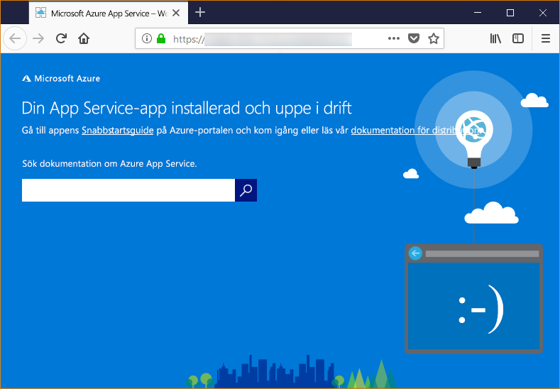

# <a name="configure-a-linux-python-app-for-azure-app-service"></a>Konfigurera en Linux-Python-app för Azure App Service

Den här artikeln beskriver hur [Azure App Service](app-service-linux-intro.md) kör Python-appar och hur du kan anpassa beteendet för App Service när det behövs. Python-appar måste distribueras med alla de nödvändiga [pip](https://pypi.org/project/pip/) moduler.

App Service-distributionsmotorn aktiverar en virtuell miljö och körs automatiskt `pip install -r requirements.txt` åt dig när du distribuerar en [Git-lagringsplats](../deploy-local-git.md?toc=%2fazure%2fapp-service%2fcontainers%2ftoc.json), eller en [Zip-paketet](../deploy-zip.md?toc=%2fazure%2fapp-service%2fcontainers%2ftoc.json) med produktionsprocesser påslaget.

Den här guiden innehåller huvudbegrepp och anvisningar om hur Python-utvecklare som använder en inbyggd Linux-behållare i App Service. Om du aldrig har använt Azure App Service ska du följa den [Python-quickstart](quickstart-python.md) och [Python med PostgreSQL självstudien](tutorial-python-postgresql-app.md) första.

> [!NOTE]
> Linux är för tillfället det rekommenderade alternativet för att köra Python-appar i App Service. Mer information om Windows-alternativet finns i [Python på Windows-smak i App Service](https://docs.microsoft.com/visualstudio/python/managing-python-on-azure-app-service).
>

## <a name="show-python-version"></a>Visa Python-version

För att visa den aktuella versionen av Python kör du följande kommando i [Cloud Shell](https://shell.azure.com):

```azurecli-interactive
az webapp config show --resource-group <resource-group-name> --name <app-name> --query linuxFxVersion
```

För att visa alla versioner av Python som stöds kör du följande kommando i [Cloud Shell](https://shell.azure.com):

```azurecli-interactive
az webapp list-runtimes --linux | grep PYTHON
```

Du kan köra en version av Python genom att skapa en egen containeravbildning i stället. Mer information finns i [Använda anpassad Docker-avbildning](tutorial-custom-docker-image.md).

## <a name="set-python-version"></a>Ange Python-version

Kör följande kommando i [Cloud Shell](https://shell.azure.com) för att ställa in Python-versionen på 3.7:

```azurecli-interactive
az webapp config set --resource-group <resource-group-name> --name <app-name> --linux-fx-version "PYTHON|3.7"
```

## <a name="container-characteristics"></a>Containeregenskaper

Python-appar som distribueras till App Service i Linux körs i en Docker-container som har definierats på GitHub-lagringsplatsen, [Python 3.6](https://github.com/Azure-App-Service/python/tree/master/3.6.6) eller [Python 3.7](https://github.com/Azure-App-Service/python/tree/master/3.7.0).

Den här containern har följande egenskaper:

- Appar körs med hjälp av [Gunicorn WSGI HTTP Server](https://gunicorn.org/), med de ytterligare argumenten `--bind=0.0.0.0 --timeout 600`.

- Som standard innehåller basavbildningen Flask-webbramverket, men containern har stöd för andra ramverk som är WSGI-kompatibla och kompatibla med Python 3.7, till exempel Django.

- Om du vill installera ytterligare paket, till exempel Django, skapar du en [*requirements.txt*](https://pip.pypa.io/en/stable/user_guide/#requirements-files)-fil i roten av projektet med hjälp av `pip freeze > requirements.txt`. Sedan publicerar du ditt projekt till App Service med hjälp av Git-distribution, som automatiskt kör `pip install -r requirements.txt` i containern för att installera din apps beroenden.

## <a name="container-startup-process"></a>Startprocessen för container

Under starten kör App Service i Linux-containern följande steg:

1. Använd ett [anpassat startkommando](#customize-startup-command) om sådant tillhandahålls.
2. Kontrollera om finns en [Django-app](#django-app), och starta Gunicorn för den om det finns.
3. Kontrollera om finns en [Flask-app](#flask-app), och starta Gunicorn för den om det finns.
4. Om ingen annan app hittas startar du en standardapp som är inbyggd i containern.

Följande avsnitt innehåller ytterligare information om varje alternativ.

### <a name="django-app"></a>Django-app

För Django-appar letar App Service efter en fil med namnet `wsgi.py` i din appkod och kör sedan Gunicorn med hjälp av följande kommando:

```bash
# <module> is the path to the folder that contains wsgi.py
gunicorn --bind=0.0.0.0 --timeout 600 <module>.wsgi
```

Om du vill ha mer specifik kontroll över startkommandot använder du ett [anpassat startkommando](#customize-startup-command) och ersätter `<module>` med namnet på den modul som innehåller *wsgi.py*.

### <a name="flask-app"></a>Flask-app

För Flask letar App Service efter en fil med namnet *application.py* eller *app.py* och startar Gunicorn enligt följande:

```bash
# If application.py
gunicorn --bind=0.0.0.0 --timeout 600 application:app
# If app.py
gunicorn --bind=0.0.0.0 --timeout 600 app:app
```

Om din huvudappmodul finns i en annan fil använder du ett annat namn för appobjektet, eller om du vill ange ytterligare argument till Gunicorn så använder du ett [anpassat startkommando](#customize-startup-command).

### <a name="default-behavior"></a>Standardbeteende

Om App Service inte hittar något anpassat kommando, någon Django-app eller någon Flask-app kör den en skrivskyddad standardapp som finns i mappen _opt/defaultsite_. Standardappen visas på följande sätt:



## <a name="customize-startup-command"></a>Anpassa startkommando

Du kan styra containerns startbeteende genom att ange ett anpassat Gunicorn-startkommando. Gör detta genom att köra följande kommando den [Cloud Shell](https://shell.azure.com):

```azurecli-interactive
az webapp config set --resource-group <resource-group-name> --name <app-name> --startup-file "<custom-command>"
```

Till exempel om du har en app i Flask vars huvudsakliga modulen är *hello.py* och Flask-app-objektet i filen heter `myapp`, sedan  *\<anpassat kommando >* är följande:

```bash
gunicorn --bind=0.0.0.0 --timeout 600 hello:myapp
```

Om din huvudmodul är i en undermapp, till exempel `website`, anger du den mappen med argumentet `--chdir`:

```bash
gunicorn --bind=0.0.0.0 --timeout 600 --chdir website hello:myapp
```

Du kan också lägga till några ytterligare argument för Gunicorn till  *\<anpassat kommando >*, till exempel `--workers=4`. Mer information finns i [Köra Gunicorn](https://docs.gunicorn.org/en/stable/run.html) (docs.gunicorn.org).

Att använda en icke-Gunicorn-server, till exempel [aiohttp](https://aiohttp.readthedocs.io/en/stable/web_quickstart.html), du kan ersätta  *\<anpassat kommando >* med ungefär så här:

```bash
python3.7 -m aiohttp.web -H localhost -P 8080 package.module:init_func
```

> [!Note]
> App Service ignorerar eventuella fel som inträffar vid bearbetning av en fil med anpassat kommando och fortsätter sedan med startprocessen genom att söka efter Django- och Flask-appar. Om du inte ser det beteende du förväntar dig kontrollerar du att din startfil distribueras till App Service och att den inte innehåller några fel.

## <a name="access-environment-variables"></a>Få åtkomst till miljövariabler

I App Service kan du [konfigurera appinställningar](../web-sites-configure.md?toc=%2fazure%2fapp-service%2fcontainers%2ftoc.json#app-settings) utanför din Appkod. Du kan använda dem med hjälp av standardmönstret [os.environ](https://docs.python.org/3/library/os.html#os.environ). Om du till exempel vill få åtkomst till en appinställning med namnet `WEBSITE_SITE_NAME` använder du följande kod:

```python
os.environ['WEBSITE_SITE_NAME']
```

## <a name="detect-https-session"></a>Identifiera HTTPS-sessionen

I App Service sker [SSL-avslutning](https://wikipedia.org/wiki/TLS_termination_proxy) på lastbalanserare för nätverk, så alla HTTPS-begäranden når din app som okrypterade HTTP-begäranden. Om din applogik behöver kontrollera om användarbegäranden är krypterade eller inte kan du kontrollera `X-Forwarded-Proto`-rubriken.

```python
if 'X-Forwarded-Proto' in request.headers and request.headers['X-Forwarded-Proto'] == 'https':
# Do something when HTTPS is used
```

Med populära ramverk får du åtkomst till `X-Forwarded-*` information i standardappens mönster. I [CodeIgniter](https://codeigniter.com/) kontrollerar [is_https()](https://github.com/bcit-ci/CodeIgniter/blob/master/system/core/Common.php#L338-L365) värdet för `X_FORWARDED_PROTO` som standard.

## <a name="access-diagnostic-logs"></a>Få åtkomst till diagnostikloggar

[!INCLUDE [Access diagnostic logs](../../../includes/app-service-web-logs-access-no-h.md)]

## <a name="open-ssh-session-in-browser"></a>Öppna SSH-session i webbläsare

[!INCLUDE [Open SSH session in browser](../../../includes/app-service-web-ssh-connect-builtin-no-h.md)]

## <a name="troubleshooting"></a>Felsökning

- **Du ser standardappen när du har distribuerat din egen appkod.** Standardappen visas eftersom du antingen inte har distribuerat din kod till App Service eller för att App Service inte kunde hitta din appkod och körde standardappen i stället.
- Starta om App Service, vänta 15–20 sekunder och kontrollera appen igen.
- Se till att du använder App Service för Linux i stället för en Windows-baserad instans. Från Azure-CLI kör du kommandot `az webapp show --resource-group <resource_group_name> --name <app_service_name> --query kind`. Byt ut `<resource_group_name>` och `<app_service_name>` därefter. Du bör se `app,linux` som utdata; annars återskapar du App Service och väljer Linux.
- Använd SSH- eller Kudu-konsolen för att ansluta direkt till App Service och kontrollera att dina filer finns under *site/wwwroot*. Om filerna inte finns granskar du din distributionsprocess och distribuerar appen på nytt.
- Om filerna finns kunde App Service inte identifiera din specifika startfil. Kontrollera att din app är strukturerad på det sätt som App Service förväntar sig för [Django](#django-app) eller [Flask](#flask-app), eller använd ett [anpassat startkommando](#customize-startup-command).
- **Du ser meddelandet ”Service Unavailable” (Tjänsten är ej tillgänglig) i webbläsaren.** Webbläsaren nådde tidsgränsen i väntan på svar från App Service, vilket indikerar att App Service startade Gunicorn-servern, men de argument som specificerar appkoden är felaktiga.
- Uppdatera webbläsaren, särskilt om du använder de lägsta prisnivåerna i din App Service-plan. Till exempel kan appen ta längre tid att starta om du använder de kostnadsfria nivåerna och blir tillgänglig när du uppdaterar webbläsaren.
- Kontrollera att din app är strukturerad på det sätt som App Service förväntar sig för [Django](#django-app) eller [Flask](#flask-app), eller använd ett [anpassat startkommando](#customize-startup-command).
- [Få åtkomst till loggström](#access-diagnostic-logs).

## <a name="next-steps"></a>Nästa steg

Den inbyggda Python-avbildningen i App Service på Linux är nu i förhandsversion, och du kan anpassa kommandot används för att påbörja din app. Du kan även skapa Python-appar för produktion med en anpassad container istället.

> [!div class="nextstepaction"]
> [Självstudier: Python-app med PostgreSQL](tutorial-python-postgresql-app.md)

> [!div class="nextstepaction"]
> [Självstudier: Distribuera från privata lagringsplats](tutorial-custom-docker-image.md)

> [!div class="nextstepaction"]
> [App Service Linux vanliga frågor och svar](app-service-linux-faq.md)