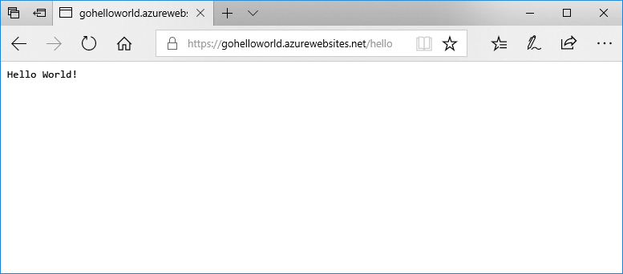

# <a name="deploy-a-dockergo-web-app-in-web-app-for-containers"></a>Distribuera en Docker-/Go-webbapp i Web App for Containers

[App Service Linux](app-service-linux-intro.md) tillhandahåller fördefinierade programstackar i Linux med stöd för språk som .NET, PHP, Node.js med flera. Du kan också använda en anpassad Docker-avbildning för att köra din webbapp på en programstack som inte redan har definierats i Azure. I den här snabbstarten får du lära dig hur man skapar en webbapp och distribuerar en Go-avbildning från Docker Hub. Du skapar webbappen med [Azure CLI](https://docs.microsoft.com/cli/azure/get-started-with-azure-cli).



[!INCLUDE [quickstarts-free-trial-note](../../../includes/quickstarts-free-trial-note.md)]

[!INCLUDE [cloud-shell-try-it.md](../../../includes/cloud-shell-try-it.md)]

[!INCLUDE [Configure deployment user](../../../includes/configure-deployment-user.md)]

[!INCLUDE [Create resource group](../../../includes/app-service-web-create-resource-group.md)]

[!INCLUDE [Create app service plan](../../../includes/app-service-web-create-app-service-plan-linux.md)]

## <a name="create-a-web-app"></a>Skapa en webbapp

Skapa en [webbapp](../app-service-web-overview.md) i `myAppServicePlan` App Service-planen med kommandot [az webapp create](/cli/azure/webapp?view=azure-cli-latest#az_webapp_create). Glöm inte att ersätta `<app name>` med ett globalt unikt programnamn.

```azurecli-interactive
az webapp create --resource-group myResourceGroup --plan myAppServicePlan --name <app name> --deployment-container-image-name microsoft/azure-appservices-go-quickstart
```

I det föregående kommandot pekar `--deployment-container-image-name` på den offentliga Docker Hub-avbildningen [microsoftazure-appservices-go-quickstart](https://hub.docker.com/r/microsoft/azure-appservices-go-quickstart/).

När webbappen har skapats visar Azure CLI utdata liknande den i följande exempel:

```json
{
  "availabilityState": "Normal",
  "clientAffinityEnabled": true,
  "clientCertEnabled": false,
  "cloningInfo": null,
  "containerSize": 0,
  "dailyMemoryTimeQuota": 0,
  "defaultHostName": "<app name>.azurewebsites.net",
  "deploymentLocalGitUrl": "https://<username>@<app name>.scm.azurewebsites.net/<app name>.git",
  "enabled": true,
  < JSON data removed for brevity. >
}
```

## <a name="browse-to-the-app"></a>Bläddra till appen

```bash
http://<app_name>.azurewebsites.net/hello
```


**Grattis!** Du har distribuerat en anpassad Docker-avbildning som kör ett Go-program i Web App for Containers.

[!INCLUDE [Clean-up section](../../../includes/cli-script-clean-up.md)]

## <a name="next-steps"></a>Nästa steg

> [!div class="nextstepaction"]
> [Använda anpassad Docker-avbildning](tutorial-custom-docker-image.md)
