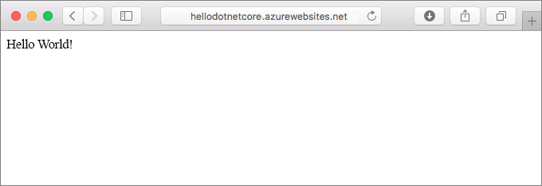
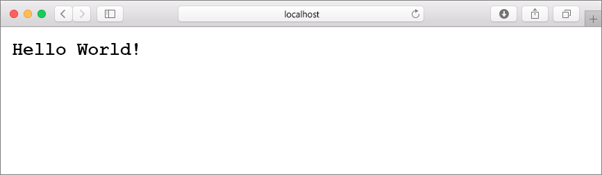
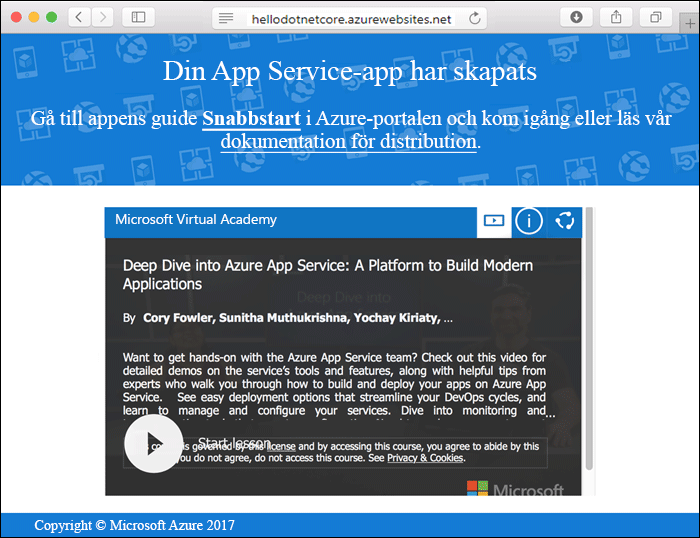
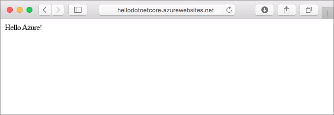
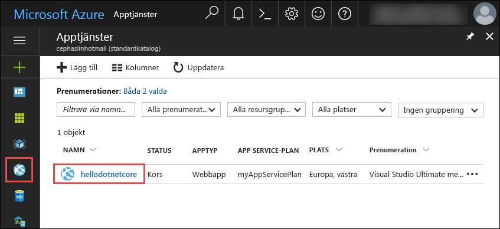
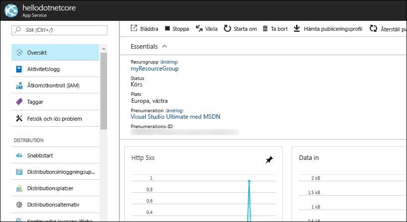

# <a name="create-a-net-core-web-app-in-app-service-on-linux"></a>Skapa en .NET Core-webbapp i App Service på Linux

> [!NOTE]
> I den här artikeln distribueras en app till App Service i Linux. Om du vill distribuera en app till App Service i _Windows_ kan du läsa [Skapa en ASP.NET Core-webbapp i Azure](../app-service-web-get-started-dotnet.md).
>

Med [App Service i Linux](app-service-linux-intro.md) får du en mycket skalbar och automatiskt uppdaterad webbvärdtjänst som utgår från operativsystemet Linux. Den här snabbstarten visar hur du skapar en [.NET Core](https://docs.microsoft.com/aspnet/core/)-app med App Service på Linux. Du skapar webbappen med [Azure CLI](https://docs.microsoft.com/cli/azure/get-started-with-azure-cli) och använder Git för att distribuera .NET Core-koden till webbappen.



Du kan följa stegen nedan på en Mac-, Windows- eller Linux-dator.

## <a name="prerequisites"></a>Nödvändiga komponenter

För att slutföra den här snabbstarten behöver du:

* <a href="https://git-scm.com/" target="_blank">Installera Git</a>
* <a href="https://github.com/dotnet/core/blob/master/release-notes/download-archives/1.1.6-sdk-download.md" target="_blank">Installera .NET Core SDK 1.1</a>

[!INCLUDE [quickstarts-free-trial-note](../../../includes/quickstarts-free-trial-note.md)]

## <a name="create-the-app-locally"></a>Skapa appen lokalt

I ett terminalfönster på datorn skapar du en katalog med namnet `hellodotnetcore` och ändrar katalogen till den.

```bash
md hellodotnetcore
cd hellodotnetcore
```

Skapa en ny .NET Core-webbapp.

```bash
dotnet new web
```

## <a name="run-the-app-locally"></a>Köra appen lokalt

Återställ NuGet-paketen och kör appen.

```bash
dotnet restore
dotnet run
```

Öppna webbläsaren och navigera till appen på `http://localhost:5000`.

Nu kan du se **Hello World**-meddelandet från exempelappen på sidan.



Tryck på **Ctrl+C** i terminalfönstret för att avsluta webbservern. Initiera en Git-lagringsplats för .NET Core-projektet.

```bash
git init
git add .
git commit -m "first commit"
```

[!INCLUDE [cloud-shell-try-it.md](../../../includes/cloud-shell-try-it.md)]

[!INCLUDE [Configure deployment user](../../../includes/configure-deployment-user.md)]

[!INCLUDE [Create resource group](../../../includes/app-service-web-create-resource-group.md)]

[!INCLUDE [Create app service plan](../../../includes/app-service-web-create-app-service-plan-linux.md)]

## <a name="create-a-web-app"></a>Skapa en webbapp

[!INCLUDE [Create web app](../../../includes/app-service-web-create-web-app-dotnetcore-no-h.md)]

Bläddra till webbappen som precis skapades. Ersätt _&lt;app name>_ med namnet på din webbapp.

```bash
http://<app name>.azurewebsites.net
```



[!INCLUDE [Push to Azure](../../../includes/app-service-web-git-push-to-azure.md)] 

```bash
Counting objects: 22, done.
Delta compression using up to 8 threads.
Compressing objects: 100% (18/18), done.
Writing objects: 100% (22/22), 51.21 KiB | 3.94 MiB/s, done.
Total 22 (delta 1), reused 0 (delta 0)
remote: Updating branch 'master'.
remote: Updating submodules.
remote: Preparing deployment for commit id '741f16d1db'.
remote: Generating deployment script.
remote: Project file path: ./hellodotnetcore.csproj
remote: Generated deployment script files
remote: Running deployment command...
remote: Handling ASP.NET Core Web Application deployment.
remote: ...............................................................................................
remote:   Restoring packages for /home/site/repository/hellodotnetcore.csproj...
remote: ....................................
remote:   Installing System.Xml.XPath 4.0.1.
remote:   Installing System.Diagnostics.Tracing 4.1.0.
remote:   Installing System.Threading.Tasks.Extensions 4.0.0.
remote:   Installing System.Reflection.Emit.ILGeneration 4.0.1.
remote:   ...
remote: Finished successfully.
remote: Running post deployment command(s)...
remote: Deployment successful.
To https://cephalin-dotnetcore.scm.azurewebsites.net/cephalin-dotnetcore.git
 * [new branch]      master -> master
```

## <a name="browse-to-the-app"></a>Bläddra till appen

Bläddra till den distribuerade appen via webbläsaren.

```bash
http://<app_name>.azurewebsites.net
```

Exempelkoden för .NET Core körs i en webbapp med en inbyggd avbildning.


**Grattis!** Nu har du distribuerat din första .NET Core-app till App Service i Linux.

## <a name="update-and-redeploy-the-code"></a>Uppdatera och distribuera om koden

Öppna filen _Startup.cs_ i den lokala katalogen. Göra en mindre ändring i texten i metodanropet `context.Response.WriteAsync`:

```csharp
await context.Response.WriteAsync("Hello Azure!");
```

Spara ändringarna på Git och skicka sedan kodändringarna till Azure.

```bash
git commit -am "updated output"
git push azure master
```

När distributionen är klar går du tillbaka till webbläsarfönstret som öppnades när du skulle **söka efter appen** och klickar på knappen för att uppdatera.



## <a name="manage-your-new-azure-web-app"></a>Hantera din nya Azure-webbapp

Gå till <a href="https://portal.azure.com" target="_blank">Azure Portal</a> för att hantera den webbapp som du skapade.

Klicka på **Apptjänster** i menyn till vänster och sedan på namnet på din Azure-webbapp.



Nu visas sidan Översikt för din webbapp. Här kan du utföra grundläggande hanteringsåtgärder som att bläddra, stoppa, starta, starta om och ta bort. 



Menyn till vänster innehåller olika sidor för att konfigurera appen. 

[!INCLUDE [cli-samples-clean-up](../../../includes/cli-samples-clean-up.md)]

## <a name="next-steps"></a>Nästa steg

> [!div class="nextstepaction"]
> [Skapa en .NET Core- och SQL Database-webbapp i Azure App Service på Linux](tutorial-dotnetcore-sqldb-app.md)
