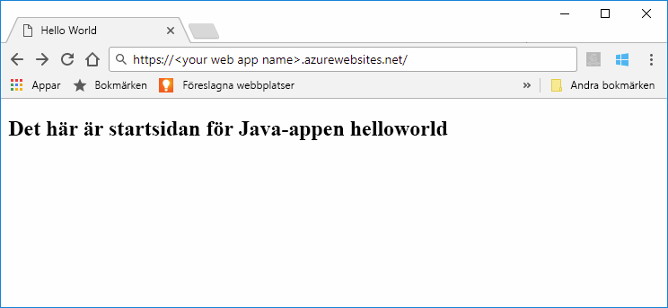
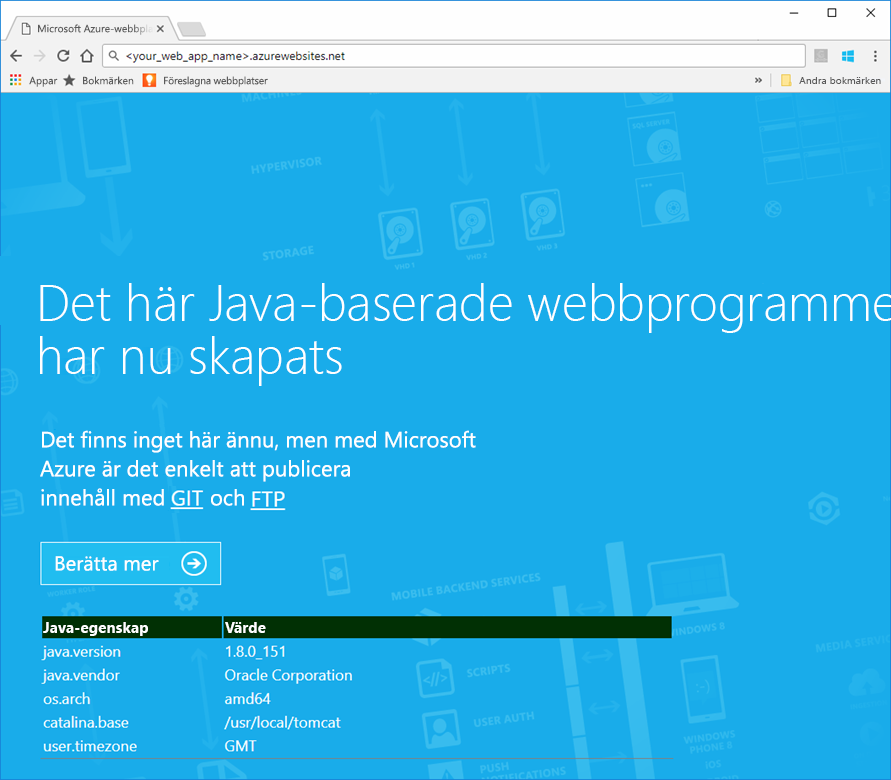
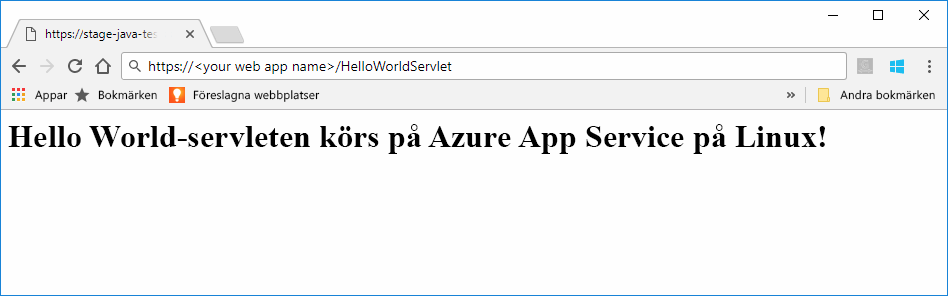
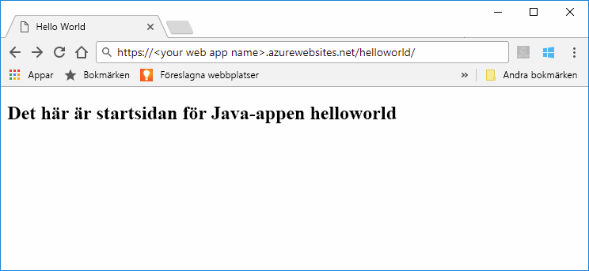
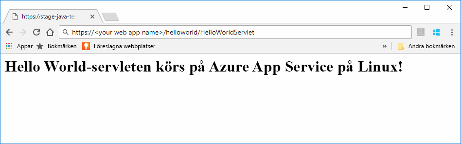

# <a name="preview-create-a-java-web-app-in-app-service-on-linux"></a>Förhandstitt: Skapa en Java-webbapp i App Service i Linux

App Service i Linux erbjuder nu en förhandsvisningsfunktion för att stödja webbappar i Java. Mer information om förhandsversioner finns i [de kompletterande villkoren för användning av Microsoft Azure-förhandsversioner](https://azure.microsoft.com/support/legal/preview-supplemental-terms/). [Distribuera Java-webbappar till en Linux-behållare i molnet med Azure-verktyget för IntelliJ](https://docs.microsoft.com/java/azure/intellij/azure-toolkit-for-intellij-hello-world-web-app-linux) är en alternativ metod för att distribuera Java-appen till din egen behållare.

> [!NOTE]
> I den här artikeln distribueras en Java-webbapp till App Service i Linux.
>

Med [App Service i Linux](app-service-linux-intro.md) får du en mycket skalbar och automatiskt uppdaterad webbvärdtjänst som utgår från operativsystemet Linux. Den här snabbstarten visar hur du distribuerar en Java-app till App Service i Linux med hjälp av en inbyggd avbildning. Du skapar webbappen med inbyggd avbildning med hjälp av [Azure CLI](https://docs.microsoft.com/cli/azure/get-started-with-azure-cli), och distribuerar Java-appen till webbappen.



[!INCLUDE [quickstarts-free-trial-note](../../../includes/quickstarts-free-trial-note.md)]


## <a name="prerequisites"></a>Nödvändiga komponenter

För att slutföra den här snabbstarten behöver du: 

* Du måste ha en Azure-prenumeration. Om du inte har en Azure-prenumeration kan du skapa ett [kostnadsfritt konto](https://azure.microsoft.com/free/?ref=microsoft.com&utm_source=microsoft.com&utm_medium=docs&utm_campaign=visualstudio) innan du börjar.
* [Installera Git](https://git-scm.com/).
* Installera [Eclipse](https://www.eclipse.org/downloads/).


[!INCLUDE [cloud-shell-try-it.md](../../../includes/cloud-shell-try-it.md)]

[!INCLUDE [Configure deployment user](../../../includes/configure-deployment-user.md)]

[!INCLUDE [Create resource group](../../../includes/app-service-web-create-resource-group-linux.md)]

[!INCLUDE [Create app service plan](../../../includes/app-service-web-create-app-service-plan-linux.md)]


## <a name="create-a-web-app"></a>Skapa en webbapp

Skapa i Cloud Shell en [webbapp](../app-service-web-overview.md) i `myAppServicePlan` App Service-planen. Du kan göra det med hjälp av kommandot [ `az webapp create` ](/cli/azure/webapp?view=azure-cli-latest#az_webapp_create). Ersätt *\<app_name>* med ett globalt unikt appnamn (giltiga tecken är `a-z`, `0-9` och `-`) i följande exempel. 

```azurecli-interactive
az webapp create --name <app_name> --resource-group myResourceGroup --plan myAppServicePlan --runtime "TOMCAT|8.5-jre8"
```

För parametern **runtime** använder du någon av följande körningar:
 * TOMCAT|8.5-jre8
 * TOMCAT|9.0-jre8


När webbappen har skapats visar Azure CLI information liknande den i följande exempel:

```json
{
  "additionalProperties": {},
  "availabilityState": "Normal",
  "clientAffinityEnabled": true,
  "clientCertEnabled": false,
  "cloningInfo": null,
  "containerSize": 0,
  "dailyMemoryTimeQuota": 0,
  "defaultHostName": "<your web app name>.azurewebsites.net",
  "enabled": true,
  "enabledHostNames": [
    "<your web app name>.azurewebsites.net",
    "<your web app name>.scm.azurewebsites.net"
  ],
  "ftpPublishingUrl": "ftp://<your ftp URL>",  
  < JSON data removed for brevity. >
}
```

Kopiera värdet för **ftpPublishingUrl**. Du behöver det senare om du väljer FTP-distribution.

Bläddra till webbappen som precis skapades.

```
http://<app_name>.azurewebsites.net
```

Om webbappen är igång bör du få en standardskärm som liknar följande bild:




## <a name="download-the-sample-java-app"></a>Ladda ned Java-exempelappen

Kör följande kommando i ett terminalfönster på din dator för att klona databasen för exempelappen till den lokala datorn. Exempelappen ska distribueras i ett senare steg.

```bash
git clone https://github.com/Azure-Samples/java-docs-hello-world
```


## <a name="deploying-the-java-app-to-app-service-on-linux"></a>Distribuera Java-appen till App Service på Linux

Öppna exempelprojektet i [Eclipse](https://www.eclipse.org/downloads/) och [exportera java-appen till en fil för Web Arkiv (WAR)](http://help.eclipse.org/kepler/index.jsp?topic=%2Forg.eclipse.wst.webtools.doc.user%2Ftopics%2Ftwcrewar.html) med namnet `helloworld.war`.

Vill du distribuera WAR-filen för Java-appen kan du använda WarDeploy (för närvarande som [förhandsversion](https://azure.microsoft.com/support/legal/preview-supplemental-terms/)) eller FTP.

Den relativa sökvägen för att bläddra till Java-webbappen kommer att variera beroende på vilken metod för distribution du använder.

### <a name="deploy-with-wardeploy"></a>Distribuera med WarDeploy 

Vill du distribuera WAR-filen med WarDeploy använder du följande cURL-exempelkommandorad för att skicka en POST-begäran till *https://<your app name>.scm.azurewebsites.net/api/wardeploy*. Din POST-begäran måste innehålla .war-filen i meddelandetexten. Autentiseringsuppgifterna för distribution för din app tillhandahålls i begäran med hjälp av grundläggande HTTP-autentisering. Mer information om WarDeploy finns i [Distribuera din app till Azure App Service med en ZIP- eller WAR-fil](../app-service-deploy-zip.md).

```bash
curl -X POST -u <username> --data-binary @"<war_file_path>" https://<app_name>.scm.azurewebsites.net/api/wardeploy
```

Uppdatera följande:

* `username` – Använd användarnamnet från autentiseringsuppgifterna för distribution som du skapade tidigare.
* `war_file_path` – Använd den lokala sökvägen för WAR-filen.
* `app_name` – Använd appnamnet du skapade tidigare.

Kör kommandot. När du uppmanas av cURL anger du lösenordet från dina autentiseringsuppgifter för distribution.

Bläddra till den distribuerade tillämpningen med hjälp av följande webbadress i webbläsaren.

```bash
http://<app_name>.azurewebsites.net
```

Java-exempelkoden körs i en webbapp med inbyggd avbildning.


Bläddra till servleten med hjälp av webbläsaren.

```bash
http://<app_name>.azurewebsites.net/HelloWorldServlet
```

Servleten körs i en webbapp med inbyggd avbildning.




**Grattis!** Du har distribuerat din första Java-app till App Service på Linux.


### <a name="ftp-deployment"></a>FTP-distribution

Du kan också använda FTP för att distribuera WAR-filen. 

Skicka filen via FTP till katalogen */home/site/wwwroot/webapps* för ditt webbprogram. Följande exempelkommandorad använder cURL:

```bash
curl -T war_file_path -u "app_name\username" ftp://webappFTPURL/site/wwwroot/webapps/
```

Uppdatera följande:

* `war_file_path` – Använd den lokala sökvägen för WAR-filen.
* `app_name` – Använd appnamnet du skapade tidigare.
* `username` – Använd användarnamnet från autentiseringsuppgifterna för distribution som du skapade tidigare.
* `webappFTPURL` – Använd värdet från **FTP-värdnamnet** för webbappen som du kopierade tidigare. FTP-värdnamnet visas också på bladet **Översikt** för din webbapp på [Azure-portalen](https://portal.azure.com/).

Kör kommandot. När du uppmanas av cURL anger du lösenordet från dina autentiseringsuppgifter för distribution.


Bläddra till den distribuerade tillämpningen med hjälp av följande webbadress i webbläsaren.

```bash
http://<app_name>.azurewebsites.net/helloworld
```

Java-exempelkoden körs i en webbapp med inbyggd avbildning.



Bläddra till servleten med hjälp av webbläsaren.

```bash
http://<app_name>.azurewebsites.net/helloworld/HelloWorldServlet
```

Java-exempelkoden körs i en webbapp med inbyggd avbildning.




**Grattis!** Du har distribuerat din första Java-app till App Service på Linux.


[!INCLUDE [cli-samples-clean-up](../../../includes/cli-samples-clean-up.md)]


## <a name="next-steps"></a>Nästa steg

Mer information om hur du använder Java med Azure finns via följande länkar:

* [Azure för Java-utvecklare](https://docs.microsoft.com/java/azure/)
* [Distribuera en Hello World-webbapp till en Linux-behållare i molnet med hjälp av Azure-verktygen för IntelliJ](https://docs.microsoft.com/java/azure/intellij/azure-toolkit-for-intellij-hello-world-web-app-linux)
* [Java-verktyg för Visual Studio Team Services](https://java.visualstudio.com/)
