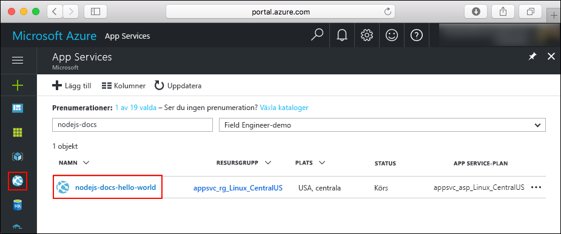
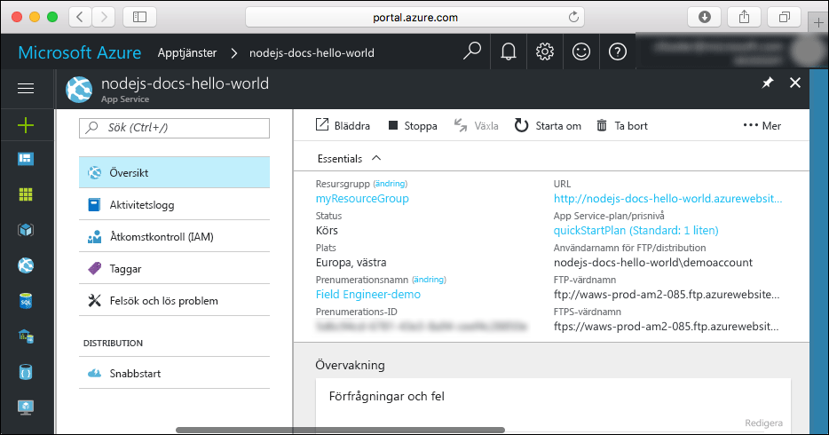

# <a name="create-a-nodejs-web-app-in-azure-app-service-on-linux"></a>Skapa en Node.js-webbapp i Azure App Service i Linux

> [!NOTE]
> I den här artikeln distribueras en app till App Service i Linux. Om du vill distribuera en app till App Service i _Windows_ kan du läsa [Skapa en Node.js-webbapp i Azure](../app-service-web-get-started-nodejs.md).
>

Med [App Service i Linux](app-service-linux-intro.md) får du en mycket skalbar och automatiskt uppdaterad webbvärdtjänst som utgår från operativsystemet Linux. Den här snabbstarten visar hur du distribuerar en Node.js-app till App Service i Linux med hjälp av en inbyggd avbildning. Du skapar webbappen med inbyggd avbildning med hjälp av [Azure CLI](https://docs.microsoft.com/cli/azure/get-started-with-azure-cli). Använd Git för att distribuera Node.js-koden till webbappen.


Du kan följa stegen nedan på en Mac-, Windows- eller Linux-dator.

[!INCLUDE [quickstarts-free-trial-note](../../../includes/quickstarts-free-trial-note.md)]

## <a name="prerequisites"></a>Nödvändiga komponenter

För att slutföra den här snabbstarten behöver du:

* <a href="https://git-scm.com/" target="_blank">Installera Git</a>
* <a href="https://nodejs.org/" target="_blank">Installera Node.js och NPM</a>

## <a name="download-the-sample"></a>Hämta exemplet

Kör följande kommando i ett terminalfönster på din dator för att klona databasen för exempelappen till den lokala datorn.

```bash
git clone https://github.com/Azure-Samples/nodejs-docs-hello-world
```

Du använder det här terminalfönstret för att köra alla kommandon i den här snabbstarten.

Ändra till den katalog som innehåller exempelkoden.

```bash
cd nodejs-docs-hello-world
```

## <a name="run-the-app-locally"></a>Köra appen lokalt

Kör programmet lokalt genom att öppna ett terminalfönster och använda `npm start`-skriptet för att starta den inbyggda Node.js HTTP-servern.

```bash
npm start
```

Öppna en webbläsare och navigera till exempelappen på `http://localhost:1337`.

Nu kan du se **Hello World**-meddelandet från exempelappen på sidan.


Tryck på **Ctrl+C** i terminalfönstret för att avsluta webbservern.

[!INCLUDE [cloud-shell-try-it.md](../../../includes/cloud-shell-try-it.md)]

[!INCLUDE [Configure deployment user](../../../includes/configure-deployment-user.md)]

[!INCLUDE [Create resource group](../../../includes/app-service-web-create-resource-group.md)]

[!INCLUDE [Create app service plan](../../../includes/app-service-web-create-app-service-plan-linux.md)]

## <a name="create-a-web-app"></a>Skapa en webbapp

[!INCLUDE [Create web app](../../../includes/app-service-web-create-web-app-nodejs-no-h.md)]

Bläddra till webbappen som precis skapades. Ersätt _&lt;app name>_ med namnet på din webbapp.

```bash
http://<app name>.azurewebsites.net
```


[!INCLUDE [Push to Azure](../../../includes/app-service-web-git-push-to-azure.md)]

```bash
Counting objects: 23, done.
Delta compression using up to 4 threads.
Compressing objects: 100% (21/21), done.
Writing objects: 100% (23/23), 3.71 KiB | 0 bytes/s, done.
Total 23 (delta 8), reused 7 (delta 1)
remote: Updating branch 'master'.
remote: Updating submodules.
remote: Preparing deployment for commit id 'bf114df591'.
remote: Generating deployment script.
remote: Generating deployment script for node.js Web Site
remote: Generated deployment script files
remote: Running deployment command...
remote: Handling node.js deployment.
remote: Kudu sync from: '/home/site/repository' to: '/home/site/wwwroot'
remote: Copying file: '.gitignore'
remote: Copying file: 'LICENSE'
remote: Copying file: 'README.md'
remote: Copying file: 'index.js'
remote: Copying file: 'package.json'
remote: Copying file: 'process.json'
remote: Deleting file: 'hostingstart.html'
remote: Ignoring: .git
remote: Using start-up script index.js from package.json.
remote: Node.js versions available on the platform are: 4.4.7, 4.5.0, 6.2.2, 6.6.0, 6.9.1.
remote: Selected node.js version 6.9.1. Use package.json file to choose a different version.
remote: Selected npm version 3.10.8
remote: Finished successfully.
remote: Running post deployment command(s)...
remote: Deployment successful.
To https://<app_name>.scm.azurewebsites.net:443/<app_name>.git
 * [new branch]      master -> master
```

## <a name="browse-to-the-app"></a>Bläddra till appen

Bläddra till den distribuerade appen via webbläsaren.

```bash
http://<app_name>.azurewebsites.net
```

Node.js-exempelkoden körs i en webbapp med inbyggd avbildning.


**Grattis!** Nu har du distribuerat din första Node.js-app till App Service i Linux.

## <a name="update-and-redeploy-the-code"></a>Uppdatera och distribuera om koden

Öppna filen `index.js` i Node.js-appen i den lokala katalogen och gör små ändringar i texten i anropet till `response.end`:

```nodejs
response.end("Hello Azure!");
```

Spara ändringarna på Git och skicka sedan kodändringarna till Azure.

```bash
git commit -am "updated output"
git push azure master
```

När distributionen är klar går du tillbaka till webbläsarfönstret som öppnades när du skulle **söka efter appen** och klickar på knappen för att uppdatera.


## <a name="manage-your-new-azure-web-app"></a>Hantera din nya Azure-webbapp

Gå till <a href="https://portal.azure.com" target="_blank">Azure Portal</a> för att hantera den webbapp som du skapade.

Klicka på **Apptjänster** i menyn till vänster och sedan på namnet på din Azure-webbapp.



Nu visas sidan Översikt för din webbapp. Här kan du utföra grundläggande hanteringsåtgärder som att bläddra, stoppa, starta, starta om och ta bort. 



Menyn till vänster innehåller olika sidor för att konfigurera appen. 

[!INCLUDE [cli-samples-clean-up](../../../includes/cli-samples-clean-up.md)]

## <a name="next-steps"></a>Nästa steg

> [!div class="nextstepaction"]
> [Node.js med MongoDB](tutorial-nodejs-mongodb-app.md)
