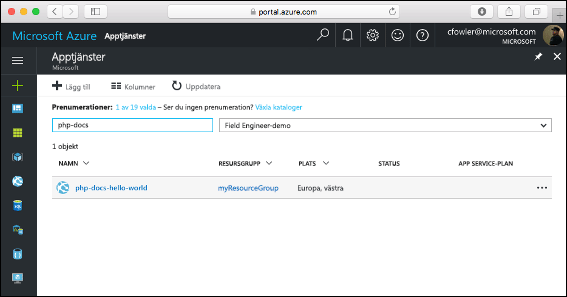

# <a name="create-a-php-app-in-app-service-on-linux"></a>Skapa en PHP-app i App Service på Linux

> [!NOTE]
> I den här artikeln distribueras en app till App Service i Linux. Om du vill distribuera en app till App Service i _Windows_ kan du läsa [Skapa en PHP-app i Azure](../app-service-web-get-started-php.md).
>

Med [App Service i Linux](app-service-linux-intro.md) får du en mycket skalbar och automatiskt uppdaterad webbvärdtjänst som utgår från operativsystemet Linux. Den här snabbstartskursen visar hur du distribuerar en PHP-app till Azure App Service on Linux. Du skapar appen med en inbyggd avbildning med [Azure CLI](https://docs.microsoft.com/cli/azure/get-started-with-azure-cli) i Cloud Shell och använder Git för att distribuera PHP-koden till App Service-appen.


Du kan följa stegen i den här artikeln på en Mac-, Windows- eller Linux-dator.

[!INCLUDE [quickstarts-free-trial-note](../../../includes/quickstarts-free-trial-note.md)]

## <a name="prerequisites"></a>Nödvändiga komponenter

För att slutföra den här snabbstarten behöver du:

* <a href="https://git-scm.com/" target="_blank">Installera Git</a>
* <a href="https://php.net" target="_blank">Installera PHP</a>

## <a name="download-the-sample"></a>Hämta exemplet

I terminalfönstret kör du följande kommandon för att klona exempelappen till din lokala dator och navigerar till katalogen som innehåller exempelkoden.

```bash
git clone https://github.com/Azure-Samples/php-docs-hello-world
cd php-docs-hello-world
```

## <a name="run-the-app-locally"></a>Köra appen lokalt

Kör programmet lokalt så att du ser hur det ska se ut när du distribuerar det till Azure. Öppna ett terminalfönster och använd kommandot `php` för att starta den inbyggda PHP-webbservern.

```bash
php -S localhost:8080
```

Öppna en webbläsare och navigera till exempelappen på `http://localhost:8080`.

Du ser meddelandet **Hello World!** från exempelappen på sidan.


Tryck på **Ctrl+C** i terminalfönstret för att avsluta webbservern.

[!INCLUDE [cloud-shell-try-it.md](../../../includes/cloud-shell-try-it.md)]

[!INCLUDE [Configure deployment user](../../../includes/configure-deployment-user.md)]

[!INCLUDE [Create resource group](../../../includes/app-service-web-create-resource-group-linux.md)]

[!INCLUDE [Create app service plan](../../../includes/app-service-web-create-app-service-plan-linux.md)]

## <a name="create-a-web-app"></a>Skapa en webbapp

[!INCLUDE [Create web app](../../../includes/app-service-web-create-web-app-php-linux-no-h.md)] 

Gå till webbplatsen för att se din nyligen skapade app med inbyggd avbildning. Ersätt _&lt;<app_name>_ med namnet på din app.

```bash
http://<app_name>.azurewebsites.net
```

Så här bör din nya app se ut:


[!INCLUDE [Push to Azure](../../../includes/app-service-web-git-push-to-azure.md)] 

```bash
Counting objects: 2, done.
Delta compression using up to 4 threads.
Compressing objects: 100% (2/2), done.
Writing objects: 100% (2/2), 352 bytes | 0 bytes/s, done.
Total 2 (delta 1), reused 0 (delta 0)
remote: Updating branch 'master'.
remote: Updating submodules.
remote: Preparing deployment for commit id '25f18051e9'.
remote: Generating deployment script.
remote: Running deployment command...
remote: Handling Basic Web Site deployment.
remote: Kudu sync from: '/home/site/repository' to: '/home/site/wwwroot'
remote: Copying file: '.gitignore'
remote: Copying file: 'LICENSE'
remote: Copying file: 'README.md'
remote: Copying file: 'index.php'
remote: Ignoring: .git
remote: Finished successfully.
remote: Running post deployment command(s)...
remote: Deployment successful.
To https://<app_name>.scm.azurewebsites.net/<app_name>.git
   cc39b1e..25f1805  master -> master
```

## <a name="browse-to-the-app"></a>Bläddra till appen

Bläddra till den distribuerade appen via webbläsaren.

```bash
http://<app_name>.azurewebsites.net
```

PHP-exempelkoden körs i App Service på Linux med en inbyggd avbildning.


**Grattis!** Du har distribuerat din första PHP-app till App Service on Linux.

## <a name="update-locally-and-redeploy-the-code"></a>Uppdatera lokalt och distribuera om koden

Öppna filen `index.php` i PHP-appen i den lokala katalogen och gör små ändringar i texten i strängen bredvid `echo`:

```php
echo "Hello Azure!";
```

Spara ändringarna på Git och skicka sedan kodändringarna till Azure.

```bash
git commit -am "updated output"
git push azure master
```

När distributionen är klar går du tillbaka till webbläsarfönstret som öppnades när du skulle **söka efter appen** och klickar på knappen för att uppdatera sidan.


## <a name="manage-your-new-azure-app"></a>Hantera din nya Azure-app

Gå till <a href="https://portal.azure.com" target="_blank">Azure Portal</a> för att hantera den app som du skapade.

I den vänstra menyn, klickar du på **App Services** och därefter på namnet på din Azure-app.



Du ser din apps översiktssida. Här kan du utföra grundläggande hanteringsåtgärder som att bläddra, stoppa, starta, starta om och ta bort.


Menyn till vänster innehåller olika sidor för att konfigurera appen. 

[!INCLUDE [cli-samples-clean-up](../../../includes/cli-samples-clean-up.md)]

## <a name="next-steps"></a>Nästa steg

> [!div class="nextstepaction"]
> [Självstudie: PHP-app med MySQL](tutorial-php-mysql-app.md)

> [!div class="nextstepaction"]
> [Konfigurera PHP-app](configure-language-php.md)
