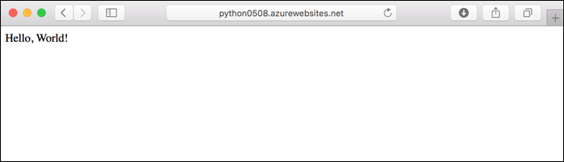
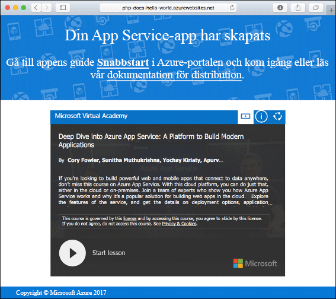
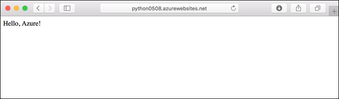
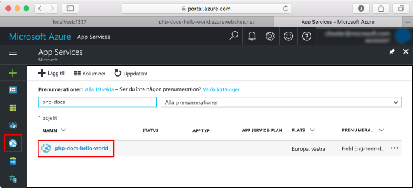
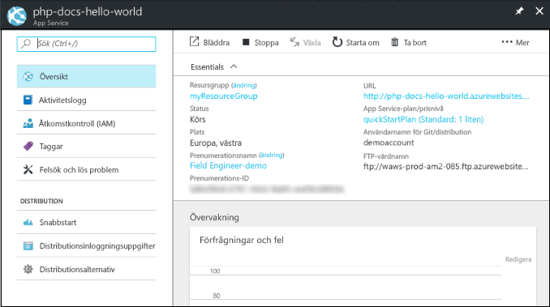

# <a name="create-a-python-app-in-azure-app-service-on-linux-preview"></a>Skapa en Python-app i Azure App Service i Linux (förhandsversion)

Med [App Service i Linux](app-service-linux-intro.md) får du en mycket skalbar och automatiskt uppdaterad webbvärdtjänst som utgår från operativsystemet Linux. Den här snabbstarten visar hur du distribuerar en Python-app ovanpå den inbyggda Python-avbildningen (förhandsversion) i App Service i Linux med hjälp av [Azure-CLI:t](/cli/azure/install-azure-cli).

Du kan följa stegen i den här artikeln på en Mac-, Windows- eller Linux-dator.



[!INCLUDE [quickstarts-free-trial-note](../../../includes/quickstarts-free-trial-note.md)]

## <a name="prerequisites"></a>Nödvändiga komponenter

För att slutföra den här snabbstarten behöver du:

* <a href="https://www.python.org/downloads/" target="_blank">Installera Python 3.7</a>
* <a href="https://git-scm.com/" target="_blank">Installera Git</a>

## <a name="download-the-sample"></a>Hämta exemplet

I terminalfönstret kör du följande kommandon för att klona exempelappen till din lokala dator. Navigera sedan till katalogen som innehåller exempelkoden.

```bash
git clone https://github.com/Azure-Samples/python-docs-hello-world
cd python-docs-hello-world
```

Lagringsplatsen innehåller en *application.py* som informerar App Service om att lagringsplatsen innehåller en Flask-app. Mer information finns i [Containerns startprocess och anpassningar](how-to-configure-python.md).

## <a name="run-the-app-locally"></a>Köra appen lokalt

Kör programmet lokalt så att du ser hur det ska se ut när du distribuerar det till Azure. Öppna ett terminalfönster och använd kommandona nedan till att installera de nödvändiga beroendena och starta den inbyggda utvecklingsservern. 

```bash
# In Bash
python3 -m venv venv
source venv/bin/activate
pip install -r requirements.txt
FLASK_APP=application.py flask run

# In PowerShell
py -3 -m venv env
env\scripts\activate
pip install -r requirements.txt
Set-Item Env:FLASK_APP ".\application.py"
flask run
```

Öppna en webbläsare och navigera till exempelappen på `http://localhost:5000/`.

Du ser meddelandet **Hello World!** från exempelappen på sidan.


Tryck på **Ctrl+C** i terminalfönstret för att avsluta webbservern.

[!INCLUDE [cloud-shell-try-it.md](../../../includes/cloud-shell-try-it.md)]

[!INCLUDE [Configure deployment user](../../../includes/configure-deployment-user.md)]

[!INCLUDE [Create resource group](../../../includes/app-service-web-create-resource-group-linux.md)]

[!INCLUDE [Create app service plan](../../../includes/app-service-web-create-app-service-plan-linux.md)]

## <a name="create-a-web-app"></a>Skapa en webbapp

[!INCLUDE [Create web app](../../../includes/app-service-web-create-web-app-python-linux-no-h.md)]

Gå till webbplatsen för att se din nyligen skapade app med inbyggd avbildning. Ersätt _&lt;<app_name>_ med namnet på din app.

```bash
http://<app_name>.azurewebsites.net
```

Så här bör din nya app se ut:



[!INCLUDE [Push to Azure](../../../includes/app-service-web-git-push-to-azure.md)] 

```bash
Counting objects: 42, done.
Delta compression using up to 8 threads.
Compressing objects: 100% (39/39), done.
Writing objects: 100% (42/42), 9.43 KiB | 0 bytes/s, done.
Total 42 (delta 15), reused 0 (delta 0)
remote: Updating branch 'master'.
remote: Updating submodules.
remote: Preparing deployment for commit id 'c40efbb40e'.
remote: Generating deployment script.
remote: Generating deployment script for python Web Site
.
.
.
remote: Finished successfully.
remote: Running post deployment command(s)...
remote: Deployment successful.
remote: App container will begin restart within 10 seconds.
To https://user2234@cephalin-python.scm.azurewebsites.net/cephalin-python.git
 * [new branch]      master -> master
 ```

## <a name="browse-to-the-app"></a>Bläddra till appen

Bläddra till den distribuerade appen via webbläsaren.

```bash
http://<app_name>.azurewebsites.net
```

Python-exempelkoden körs i App Service på Linux med en inbyggd avbildning.


**Grattis!** Du har distribuerat din första Python-app till App Service i Linux.

## <a name="update-locally-and-redeploy-the-code"></a>Uppdatera lokalt och distribuera om koden

Öppna filen `application.py` i den lokala katalogen och gör en liten ändring i texten på den sista raden:

```python
return "Hello Azure!"
```

Spara ändringarna på Git och skicka sedan kodändringarna till Azure.

```bash
git commit -am "updated output"
git push azure master
```

När distributionen är klar går du tillbaka till webbläsarfönstret som öppnades när du skulle **söka efter appen** och klickar på knappen för att uppdatera sidan.



## <a name="manage-your-new-azure-app"></a>Hantera din nya Azure-app

Gå till <a href="https://portal.azure.com" target="_blank">Azure Portal</a> för att hantera den app som du skapade.

I den vänstra menyn, klickar du på **App Services** och därefter på namnet på din Azure-app.



Du ser din apps översiktssida. Här kan du utföra grundläggande hanteringsåtgärder som att bläddra, stoppa, starta, starta om och ta bort.



Menyn till vänster innehåller olika sidor för att konfigurera appen. 

[!INCLUDE [cli-samples-clean-up](../../../includes/cli-samples-clean-up.md)]

## <a name="next-steps"></a>Nästa steg

Den inbyggda Python-avbildningen i App Service på Linux är nu i förhandsversion, och du kan anpassa kommandot som används för att starta appen. Du kan även skapa Python-appar för produktion med en anpassad container istället.

> [!div class="nextstepaction"]
> [Python med PostgreSQL](tutorial-python-postgresql-app.md)

> [!div class="nextstepaction"]
> [Konfigurera ett anpassat startkommando](how-to-configure-python.md#custom-startup-command)

> [!div class="nextstepaction"]
> [Felsökning](how-to-configure-python.md#troubleshooting)

> [!div class="nextstepaction"]
> [Använda anpassade avbildningar](tutorial-custom-docker-image.md)
