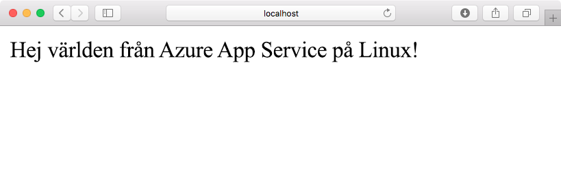
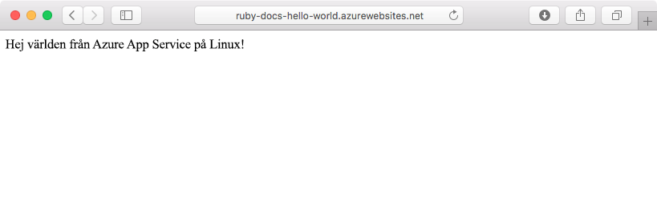
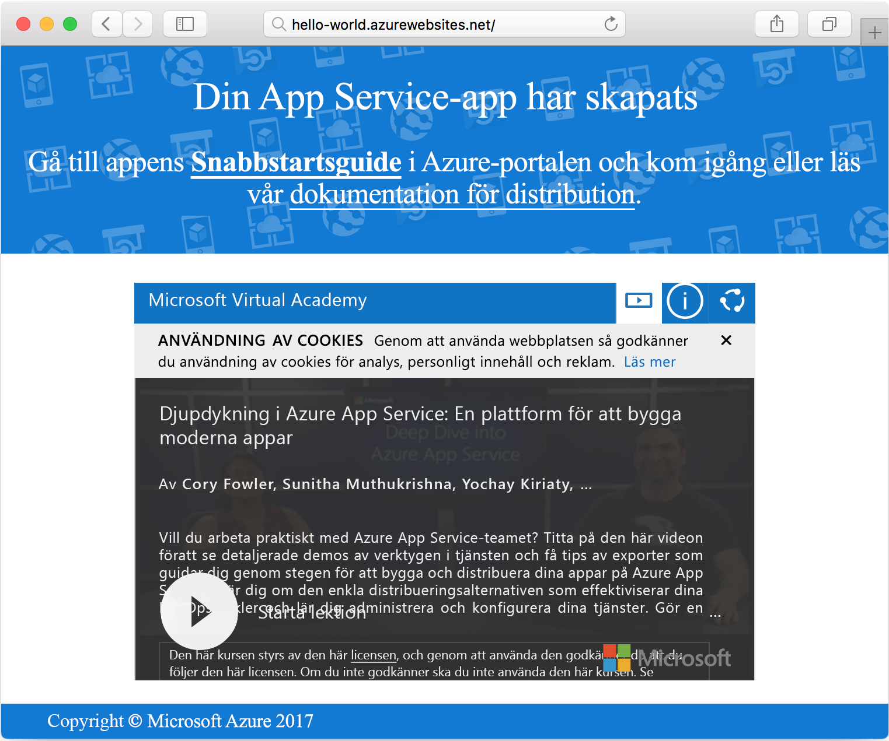

# <a name="create-a-ruby-app-in-app-service-on-linux"></a>Skapa en Ruby-app i App Service on Linux

Med [Azure App Service on Linux](app-service-linux-intro.md) får du en automatiskt uppdaterad webbvärdtjänst med hög skalbarhet. Den här snabbstarten visar hur du skapar en grundläggande [Ruby on Rails](https://rubyonrails.org/)-app som sedan kan distribueras till Azure som en Web App on Linux.



[!INCLUDE [quickstarts-free-trial-note](../../../includes/quickstarts-free-trial-note.md)]

## <a name="prerequisites"></a>Nödvändiga komponenter

* <a href="https://www.ruby-lang.org/en/documentation/installation/#rubyinstaller" target="_blank">Installera Ruby 2.3 eller senare</a>
* <a href="https://git-scm.com/" target="_blank">Installera Git</a>

## <a name="download-the-sample"></a>Hämta exemplet

Kör följande kommando i ett terminalfönster för att klona databasen för exempelappen till den lokala datorn:

```bash
git clone https://github.com/Azure-Samples/ruby-docs-hello-world
```

## <a name="run-the-application-locally"></a>Kör programmet lokalt

Rails-servern måste köras för att programmet ska fungera. Ändra till katalogen `hello-world` och använd kommandot `rails server` för att starta servern.

```bash
cd hello-world\bin
rails server
```

Navigera till `http://localhost:3000` i webbläsaren om du vill testa appen lokalt.



[!INCLUDE [Try Cloud Shell](../../../includes/cloud-shell-try-it.md)]

[!INCLUDE [Configure deployment user](../../../includes/configure-deployment-user.md)]

[!INCLUDE [Create resource group](../../../includes/app-service-web-create-resource-group-linux.md)]

[!INCLUDE [Create app service plan](../../../includes/app-service-web-create-app-service-plan-linux.md)]

## <a name="create-a-web-app"></a>Skapa en webbapp

[!INCLUDE [Create web app](../../../includes/app-service-web-create-web-app-ruby-linux-no-h.md)] 

Gå till webbplatsen för att se din nya webbapp med den inbyggda avbildningen. Ersätt _&lt;app name>_ med namnet på din webbapp.

```bash
http://<app_name>.azurewebsites.net
```

Så här bör din nya webbapp se ut:



## <a name="deploy-your-application"></a>Distribuera appen

Kör följande kommandon för att distribuera den lokala appen till din Azure-webbplats:

```bash
git remote add azure <Git deployment URL from above>
git add -A
git commit -m "Initial deployment commit"
git push azure master
```

Bekräfta att fjärrdistributionsåtgärderna lyckades. Kommandona producerar utdata som liknar följande:

```bash
remote: Using sass-rails 5.0.6
remote: Updating files in vendor/cache
remote: Bundle gems are installed into ./vendor/bundle
remote: Updating files in vendor/cache
remote: ~site/repository
remote: Finished successfully.
remote: Running post deployment command(s)...
remote: Deployment successful.
To https://<your web app name>.scm.azurewebsites.net/<your web app name>.git
  579ccb....2ca5f31  master -> master
myuser@ubuntu1234:~workspace/<app name>$
```

När distributionen är klar startar du om webbappen så att distributionen börjar gälla med hjälp av kommandot [`az webapp restart`](/cli/azure/webapp?view=azure-cli-latest#az_webapp_restart):

```azurecli-interactive
az webapp restart --name <app name> --resource-group myResourceGroup
```

Gå till din webbplats och kontrollera resultatet.

```bash
http://<app name>.azurewebsites.net
```


> [!NOTE]
> Försök att bläddra på webbplatsen medan appen startas om resulterar i HTTP-statuskoden `Error 503 Server unavailable`. Det kan ett par minuter att slutföra omstarten.
>

[!INCLUDE [Clean-up section](../../../includes/cli-script-clean-up.md)]

## <a name="next-steps"></a>Nästa steg

> [!div class="nextstepaction"]
> [Ruby on Rails med MySQL](tutorial-ruby-postgres-app.md)
