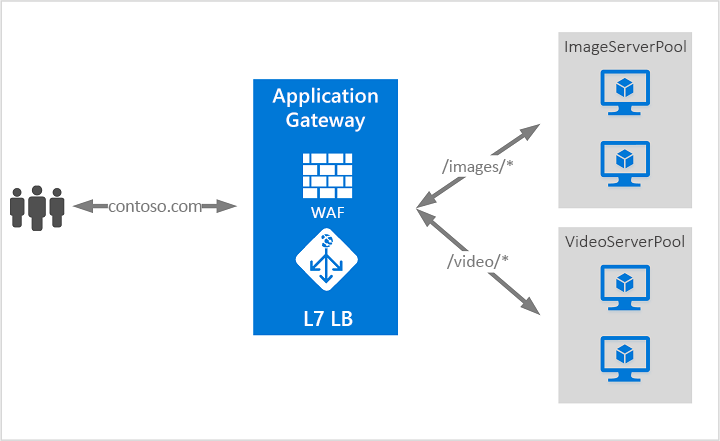

# Vad är Azure Application Gateway?

Azure Application Gateway är en lastbalanserare för webbtrafik som gör det möjligt för dig att hantera trafik till dina webbappar. Traditionella lastbalanserare fungerar med transportlagret (OSI lager 4 – TCP och UDP) och dirigera trafik baserat på källans IP-adress och port till en mål-IP-adress och -port.

Application Gateway kan fatta beslut om routning baserat på ytterligare attribut för en HTTP-begäran, till exempel URI-sökväg eller värd rubriker. Du kan till exempel dirigera trafik baserat på inkommande URL. Så om `/images` finns i inkommande URL kan du dirigera trafik till en specifik uppsättning servrar (kallas även pool) som har konfigurerats för avbildningar. Om `/video` finns i URL dirigeras trafiken till en annan pool som är optimerad för videor.

Den här typen av routning kallas belastningsutjämning för programlager (OSI lager 7). Azure Application Gateway kan göra URL-baserad routning med mera.

>[!NOTE]
> Med Azure har du tillgång till en uppsättning fullständigt hanterade belastningsutjämningslösningar för dina scenarier. Om du behöver hög prestanda, låg latens, Layer-4 belastnings utjämning, se [Vad är Azure Load Balancer?](../load-balancer/load-balancer-overview.md) Om du letar efter global belastnings utjämning för DNS, se [Vad är Traffic Manager?](../traffic-manager/traffic-manager-overview.md) Dina scenarier från slut punkt till slut punkt kan dra nytta av att kombinera dessa lösningar.
>
> En alternativ jämförelse för Azure-belastnings utjämning finns i [Översikt över belastnings Utjämnings alternativ i Azure](/azure/architecture/guide/technology-choices/load-balancing-overview).

## Funktioner

Mer information om Application Gateway funktioner finns i [Azure Application Gateway-funktioner](features.md).

## Priser och service nivå avtal

Application Gateway pris information finns i [Application Gateway prissättning](https://azure.microsoft.com/pricing/details/application-gateway/).

Application Gateway SLA-information finns i [Application Gateway Service avtal](https://azure.microsoft.com/support/legal/sla/application-gateway/v1_2/).

## Nyheter

Information om vad som är nytt med Azure Application Gateway finns i [Azure updates](https://azure.microsoft.com/updates/?category=networking&query=Application%20Gateway).

## Nästa steg

Beroende på dina krav och din miljö kan du skapa ett test Application Gateway med hjälp av antingen Azure Portal, Azure PowerShell eller Azure CLI.

- [Snabbstart: Dirigera webbtrafik med Azure Application Gateway – Azure Portal](quick-create-portal.md)
- [Snabbstart: Dirigera webbtrafik med Azure Application Gateway – Azure PowerShell](quick-create-powershell.md)
- [Snabbstart: Dirigera webbtrafik med Azure Application Gateway – Azure CLI](quick-create-cli.md)