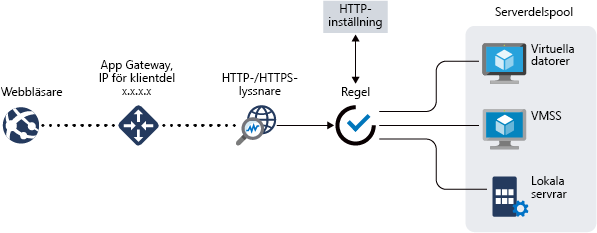

# Vad är Azure Application Gateway?

Azure Application Gateway är en lastbalanserare för webbtrafik som gör det möjligt för dig att hantera trafik till dina webbappar. Traditionella lastbalanserare fungerar med transportlagret (OSI lager 4 – TCP och UDP) och dirigera trafik baserat på källans IP-adress och port till en mål-IP-adress och -port.

Men med Application Gateway kan du vara ännu mer specifik. Du kan till exempel dirigera trafik baserat på inkommande URL. Så om `/images` finns i inkommande URL kan du dirigera trafik till en specifik uppsättning servrar (kallas även pool) som har konfigurerats för avbildningar. Om `/video` finns i URL:en dirigeras trafiken dirigeras till en annan adresspool som har optimerats för videor.

Den här typen av routning kallas belastningsutjämning för programlager (OSI lager 7). Azure Application Gateway kan göra URL-baserad routning med mera. 

Följande funktioner ingår med Azure Application Gateway:

## Offentlig förhandsversion av autoskalning

Utöver de funktioner som beskrivs i den här artikeln erbjuder Application Gateway även en offentlig förhandsversion av en ny SKU [Standard_V2], som erbjuder autoskalning och andra viktiga prestandaförbättringar.

- **Autoskalning** – Application Gateway- eller WAF-distributioner under autoskalnings-SKU kan skala upp eller ned baserat på föränderliga mönster i trafikbelastning. Automatisk skalning tar även bort behovet av att välja distributionsstorlek eller instansantal under etablering. 

- **Zonredundans** – en Application Gateway- eller WAF-distribution kan sträcka sig över flera tillgänglighetszoner, vilket tar bort behovet av att etablera och skapa separata Application Gateway-instanser i varje zon med hjälp av en Traffic Manager.

- **Statiskt VIP** – Application Gateway-VIP har nu stöd för den statiska VIP-typen exklusivt. Detta säkerställer att det VIP som är associerat med Application Gateway inte ändras även efter en omstart.

- **Snabbare distributions och uppdateringstid** jämfört med den allmänt tillgängliga SKU:n. 

- **5x bättre prestanda för SSL-avlastning** jämfört med den allmänt tillgängliga SKU:n.

Mer information om funktionerna i den offentliga förhandsversionen av Application Gateway finns i avsnittet om [autoskalning och zonredundant Application Gateway (offentlig förhandsversion)](application-gateway-autoscaling-zone-redundant.md).

## Secure Sockets Layer-avslutning (SSL)

Application Gateway stöder SSL-terminering vid gatewayen. Därefter flödar trafiken vanligtvis okrypterat fram till serverdels-servrarna. Den här funktionen bidrar till att befria webbservrarna från kostsam kryptering och dekryptering. Men ibland är inte okrypterad kommunikation till servrarna en acceptabel lösning. Det kan bero på säkerhetskrav eller efterföljandekrav eller att programmet bara accepterar säkra anslutningar. För de här programmen stöder Application Gateway slutpunkt till slutpunkt-SSL-kryptering.

## Förhandsversion av Azure Kubernetes Service (AKS) Ingress-kontrollant 

Application Gateway Ingress-kontrollanten körs som en pod i AKS-klustret och gör så att Application Gateway kan fungera som ingress för ett AKS-kluster. 

Mer information finns i avsnittet om [Azure Application Gateway Ingress-kontrollant](https://azure.github.io/application-gateway-kubernetes-ingress/).

## Anslutningstömning

Anslutningstömning hjälper dig att få korrekt borttagning av medlemmar i serverdelspoolen under planerade serviceuppdateringar. Den här inställningen aktiveras via serverdelens http-inställning och kan tillämpas på alla medlemmar i en serverdelspool i samband med regelskapandet. När den har aktiverats ser Application Gateway till att alla avregistreringsinstanser av en serverdelspool inte får någon ny begäran samtidigt som befintliga begäranden tillåts slutföras inom en konfigurerad tid. Detta gäller såväl serverdelsinstanser som uttryckligen tas bort från serverdelspoolen med hjälp av ett API-anrop som serverdelsinstanser som rapporteras som skadade enligt hälsoavsökningarna.

## Anpassade felsidor
Med Application Gateway kan du skapa anpassade felsidor i stället för att visa standardmässiga felsidor. Du kan använda din egen varumärkesanpassning och layout med hjälp av en anpassad felsida.

Mer information finns i [Skapa anpassade felsidor i Application Gateway](custom-error.md).

## Brandvägg för webbaserade program

Brandvägg för webbaserade program (WAF) är en funktion i Application Gateway som ger ett centraliserat skydd för dina webbappar mot vanliga kryphål och säkerhetsproblem. WAF baseras på regler från [OWASP-kärnregeluppsättningarna (Open Web Application Security Project)](https://www.owasp.org/index.php/Category:OWASP_ModSecurity_Core_Rule_Set_Project) 3.0 eller 2.2.9. 

Webbprogram blir i allt större utsträckning föremål för attacker där kända svagheter i programmen utnyttjas. Bland annat är SQL-inmatningsattacker och skriptangrepp mellan webbplatser vanliga. Det kan vara svårt att förhindra sådana attacker i programkoden och kräver ofta omfattande underhåll, korrigeringar och övervakning av många skikt i programtopologin. Med en centraliserad brandvägg för webbaserade program blir det enklare att hantera säkerheten och programadministratörer får bättre möjligheter skydda mot intrång. En brandväggslösning för webbaserade program kan även reagera snabbare på ett säkerhetshot genom att åtgärda en känd svaghet på en central plats jämfört med om korrigeringar ska utföras i varje enskilt webbprogram. Befintliga programgatewayer kan enkelt konverteras till en Application Gateway med brandväggen för webbprogram.

## URL-baserad routning

URL-sökvägsbaserad routning låter dig routa trafik till serverdels-serverpooler baserat på URL-sökvägen till begäranden. Ett av scenarierna är att dirigera begäranden för olika innehållstyper till olika pooler.

Till exempel dirigeras begäranden för `http://contoso.com/video/*` till VideoServerPool och `http://contoso.com/images/*` dirigeras till ImageServerPool. DefaultServerPool väljs om inget av sökvägsmönstren matchar.

## Värd för flera platser

Om du har flera webbplatser så kan du konfigurera fler än en webbplats inom samma programgateway-instans. Den här funktionen låter dig konfigurera en mer effektiv topologi för dina distributioner genom att lägga till upp till 20 webbplatser till en programgateway. Varje webbplats kan dirigeras till en egen programpool. Till exempel kan programgatewayen hantera trafik för `contoso.com` och `fabrikam.com` från två serverpooler som kallas ContosoServerPool och FabrikamServerPool.

Begäranden för `http://contoso.com` dirigeras till ContosoServerPool och `http://fabrikam.com` dirigeras till FabrikamServerPool.

På samma sätt kan två underdomäner i samma överordnade domän finnas på samma distribution av en programgateway. Exempel på användning av underdomäner kan vara `http://blog.contoso.com` och `http://app.contoso.com` på samma distribution av en programgateway.

## Omdirigering

Ett vanligt scenario för många webbappar är att stödja automatisk HTTP till HTTPS-omdirigering för att säkerställa att all kommunikation mellan en app och dess användare sker via en krypterad sökväg. 

Tidigare kan du har använt tekniker som att skapa en dedikerad pool vars syfte är att omdirigera begäranden den tar emot via HTTP till HTTPS. Application Gateway stöder möjligheten att omdirigera trafik på programgatewayen. Detta förenklar programkonfigurationen, optimerar resursanvändningen och stöder nya omdirigeringsscenarier, inklusive global och sökvägsbaserade omdirigering. Stöd för Application Gateway-omdirigering är inte begränsat till enbart HTTPS till HTTP-omdirigering. Det här är en allmän mekanism för omdirigering, så du kan omdirigera från och till valfri port som du anger med regler. Den har även stöd för omdirigering till en extern plats.

Stöd för Application Gateway-stöd har följande funktioner:

- Global omdirigering från en port till en annan port på gatewayen. Det möjliggör HTTP till HTTPS-omdirigering på en webbplats.
- Sökvägsbaserad omdirigering. Den här typen av omdirigering möjliggör bara HTTP till HTTPS-omdirigering på ett specifikt webbplatsområde, till exempel en kundvagn som betecknas av `/cart/*`.
- Omdirigera till en extern webbplats.

## Sessionstillhörighet

Den cookie-baserade sessionstillhörighetsfunktionen är användbar när du vill behålla en användarsession på samma server. Genom att använda gatewayhanterade cookies kan Application Gateway dirigera efterföljande trafik från en användarsession till samma serverdel för bearbetning. Det här är viktigt i de fall där sessionstillstånd har sparats lokalt på servern för en användarsession.

## Websocket- och HTTP/2-trafik

Application Gateway har inbyggt stöd för WebSocket- och HTTP/2-protokoll. Det finns inga inställningar som kan konfigureras av användaren för att selektivt aktivera eller inaktivera WebSocket-stöd. Stöd för HTTP-2 kan aktiveras med hjälp av Azure PowerShell.

WebSocket- och HTTP/2-protokollen aktiverar full duplex-kommunikation mellan en server och en klient över en tidskrävande TCP-anslutning. Det här tillåter en mer interaktiv kommunikation mellan webbservern och klienten, som kan vara dubbelriktad utan att behöva avsökning som krävs i HTTP-baserade implementeringar. Dessa protokoll har låg omkostnader, till skillnad från HTTP, och kan återanvända samma TCP-anslutning för flera begäranden/svar, vilket resulterar i ett mer effektivt utnyttjande av resurser. Dessa protokoll är utformade att fungera via de traditionella HTTP-portarna 80 och 443.

## Skriva om HTTP-huvuden (offentlig förhandsversion)

Med HTTP-huvuden kan klienten och servern skicka ytterligare information med begäran eller svaret. Genom att skriva om dessa HTTP-huvuden kan du åstadkomma flera viktiga scenarier, till exempel att lägga till säkerhetsrelaterade rubrikfält som HSTS/X-XSS skydd eller ta bort svarshuvudfält som kan visa känslig information som backend-serverns namn. 

Application Gateway stöder nu möjligheten att skriva om rubrikerna för inkommande HTTP-begäran samt utgående HTTP-svar. Du kommer att kunna lägga till, ta bort eller uppdatera HTTP-huvuden för begäran och svar när begäran-/svarspaketen flyttas mellan klientens och serverdelens pooler. Du kan skriva om både standardmässiga huvudfält (definieras i [RFC 2616](https://www.ietf.org/rfc/rfc2616.txt)) och ej standardmässiga huvudfält.  

Läs mer om den här offentliga förhandsgranskningsfunktionen i [Skriva om HTTP-huvuden](rewrite-http-headers.md).

## Nästa steg

Beroende på dina krav och din miljö kan du skapa en testprogramgateway med Azure Portal, Azure PowerShell eller Azure CLI:

- [Snabbstart: Dirigera webbtrafik med Azure Application Gateway – Azure Portal](quick-create-portal.md).
- [Snabbstart: Dirigera webbtrafik med Azure Application Gateway – Azure PowerShell](quick-create-powershell.md)
- [Snabbstart: Dirigera webbtrafik med Azure Application Gateway – Azure CLI](quick-create-cli.md)
