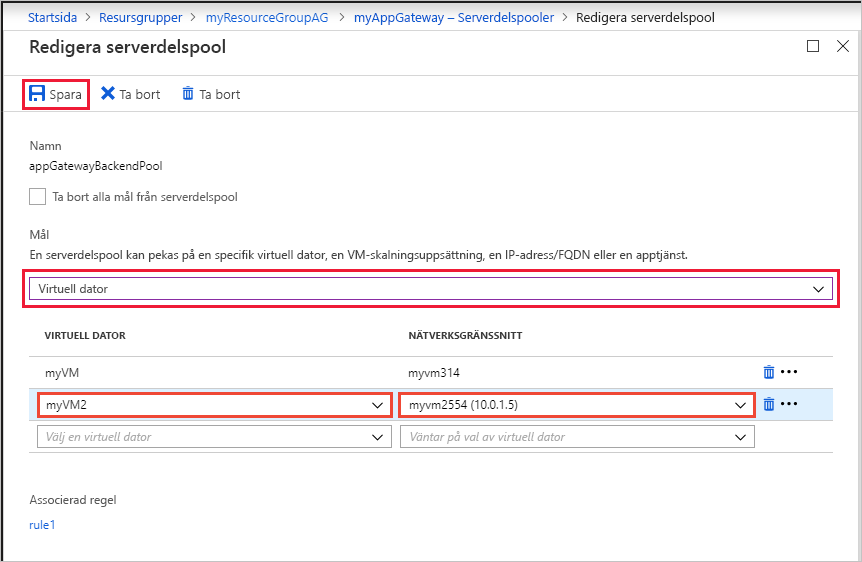
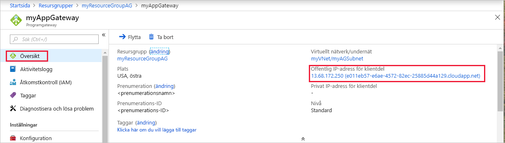

# <a name="quickstart-direct-web-traffic-with-azure-application-gateway---azure-portal"></a>Snabbstart: Dirigera webbtrafik med Azure Application Gateway – Azure Portal

I den här snabb starten använder du Azure Portal för att skapa en Programgateway. Sedan testar du det för att kontrol lera att det fungerar korrekt. 

Application Gateway dirigerar program webb trafik till specifika resurser i en backend-pool. Du tilldelar lyssnare till portar, skapar regler och lägger till resurser i en backend-pool. För enkelhetens skull använder den här artikeln en enkel installation med en offentlig frontend-IP, en grundläggande lyssnare som är värd för en enda plats på programgatewayen, en grundläggande regel för routning av begäran och två virtuella datorer i backend-poolen.

Du kan också slutföra den här snabb starten med [Azure PowerShell](quick-create-powershell.md) eller [Azure CLI](quick-create-cli.md).

[!INCLUDE [updated-for-az](../../includes/updated-for-az.md)]

## <a name="prerequisites"></a>Krav

- Ett Azure-konto med en aktiv prenumeration. [Skapa ett konto kostnads fritt](https://azure.microsoft.com/free/?WT.mc_id=A261C142F).

## <a name="sign-in-to-the-azure-portal"></a>Logga in på Azure Portal

Logga in på [Azure-portalen](https://portal.azure.com) med ditt Azure-konto.

## <a name="create-an-application-gateway"></a>Skapa en programgateway

Du skapar programgatewayen med hjälp av flikarna på sidan **skapa en Application Gateway** .

1. I menyn i Azure-portalen eller på sidan **Start** väljer du **Skapa en resurs**. Fönstret **Nytt** visas.

2. Välj **nätverk** och välj sedan **Application Gateway** i listan **aktuella** .

### <a name="basics-tab"></a>Fliken Grundläggande

1. På fliken **grundläggande** anger du dessa värden för följande Programgateway-inställningar:

   - **Resurs grupp**: Välj **myResourceGroupAG** för resurs gruppen. Om den inte finns väljer du **Skapa ny** för att skapa den.
   - **Namn på Application Gateway**: ange *myAppGateway* som namn på Application Gateway.

     

2. För att Azure ska kunna kommunicera mellan resurserna som du skapar krävs ett virtuellt nätverk. Du kan antingen skapa ett nytt virtuellt nätverk eller använda ett befintligt. I det här exemplet ska du skapa ett nytt virtuellt nätverk på samma tidpunkt som du skapar programgatewayen. Application Gateway instanser skapas i separata undernät. Du skapar två undernät i det här exemplet: ett för programgatewayen och ett för backend-servrarna.

    > [!NOTE]
    > [Slut punkts principer för virtuella nätverk](../virtual-network/virtual-network-service-endpoint-policies-overview.md) stöds för närvarande inte i ett Application Gateway-undernät.

    Under **Konfigurera virtuellt nätverk** skapar du ett nytt virtuellt nätverk genom att välja **Skapa nytt**. I fönstret **Skapa virtuellt nätverk** som öppnas anger du följande värden för att skapa det virtuella nätverket och två undernät:

    - **Namn**: ange *myVNet* som namn på det virtuella nätverket.

    - **Under näts namn** (Application Gateway undernät): **under nätets** rutnät visas ett undernät med namnet *default*. Ändra namnet på det här under nätet till *myAGSubnet*.<br>Undernätet för en programgateway kan endast innehålla programgatewayer. Inga andra resurser är tillåtna.

    - **Under näts namn** (backend-serverns undernät): i den andra raden i rutnätet för **undernät** anger du *myBackendSubnet* i kolumnen **under nät namn** .

    - **Adress intervall** (backend-serverns undernät): Ange ett adress intervall som inte överlappar adress intervallet för *myAGSubnet* på den andra raden i **under nätets** rutnät. Om adress intervallet för *myAGSubnet* till exempel är 10.0.0.0/24, anger du *10.0.1.0/24* för adress intervallet för *myBackendSubnet*.

    Välj **OK** för att stänga fönstret **Skapa virtuellt nätverk** och spara inställningarna för det virtuella nätverket.

     
    
3. På fliken **grundläggande** accepterar du standardvärdena för de andra inställningarna och väljer sedan **Nästa: frontend**-klienter.

### <a name="frontends-tab"></a>Fliken frontend

1. På fliken **klient** delar kontrollerar du att **IP-adress typen för klient delen** är **offentlig**. <br>Du kan konfigurera klient delens IP-adress så att den är offentlig eller privat per användnings fall. I det här exemplet väljer du en offentlig IP-adress för klient delen.
   > [!NOTE]
   > För Application Gateway v2 SKU måste det finnas en **offentlig** IP-konfiguration för klient delen. Du kan fortfarande ha både en offentlig och en privat klient dels-IP-konfiguration, men endast privat IP-konfiguration för klient delen (endast ILB läge) är inte aktive rad för v2-SKU: n. 

2. Välj **Skapa ny** för den **offentliga IP-adressen** och ange *myAGPublicIPAddress* för den offentliga IP-adressen och välj sedan **OK**. 

     

3. Välj **Nästa:** Server delar.

### <a name="backends-tab"></a>Fliken Server delar

Backend-poolen används för att dirigera begär anden till backend-servrar som hanterar begäran. Backend-pooler kan bestå av nätverkskort, skalnings uppsättningar för virtuella datorer, offentliga IP-adresser, interna IP-adresser, fullständigt kvalificerade domän namn (FQDN) och backend-ändar för flera klienter som Azure App Service. I det här exemplet ska du skapa en tom backend-pool med din Application Gateway och sedan lägga till Server dels mål i backend-poolen.

1. **På fliken Server** delar väljer du **+ Lägg till en backend-pool**.

2. I fönstret **Lägg till en server dels grupp** som öppnas anger du följande värden för att skapa en tom backend-pool:

    - **Namn**: ange *myBackendPool* som namn på backend-poolen.
    - **Lägg till backend-pool utan mål**: Välj **Ja** om du vill skapa en backend-pool utan mål. Du kommer att lägga till Server dels mål när du har skapat programgatewayen.

3. I fönstret **Lägg till en server dels grupp** väljer du **Lägg till** för att spara konfigurationen av backend-poolen och återgår till fliken back **ändar** .

     

4. **På fliken Server** delar väljer du **Nästa: konfiguration**.

### <a name="configuration-tab"></a>Fliken konfiguration

På fliken **konfiguration** ansluter du klient dels-och backend-poolen som du skapade med en regel för routning.

1. Välj **Lägg till en regel** i kolumnen **routningsregler** .

2. I fönstret **Lägg till regel för routning** som öppnas anger du *myRoutingRule* som **regel namn**.

3. En regel för routning kräver en lyssnare. Ange följande värden för lyssnaren på fliken **lyssnare** i fönstret **Lägg till regel för vidarebefordran** :

    - **Namn på lyssnare**: *Ange en lyssnare* för namnet på lyssnaren.
    - **IP-adress för klient** del: Välj **offentlig** för att välja den offentliga IP-adress som du skapade för klient delen.
  
      Acceptera standardvärdena för de andra inställningarna på fliken **lyssnare** och välj sedan fliken **backend-mål** för att konfigurera resten av regeln.

   

4. På fliken **backend-mål** väljer du **MyBackendPool** för **Server dels målet**.

5. För **http-inställningen** väljer du **Skapa ny** för att skapa en ny http-inställning. HTTP-inställningen avgör hur routningsregler fungerar. I fönstret **Lägg till en HTTP-inställning** som öppnas anger du *MyHTTPSetting* som **http-inställnings namn** och *80* för **backend-porten**. Acceptera standardvärdena för de andra inställningarna i fönstret **Lägg till en HTTP-inställning** och välj sedan **Lägg till** för att återgå till fönstret **Lägg till regel för routning** . 

     

6. I fönstret **Lägg till regel för routning** väljer du **Lägg till** för att spara regeln för Routning och återgå till fliken **konfiguration** .

     

7. Välj **Nästa: Taggar** och **Nästa: granska + skapa**.

### <a name="review--create-tab"></a>Granska + fliken Skapa

Granska inställningarna på fliken **Granska + skapa** och välj sedan **skapa** för att skapa det virtuella nätverket, den offentliga IP-adressen och programgatewayen. Det kan ta flera minuter för Azure att skapa programgatewayen. Vänta tills distributionen har slutförts innan du går vidare till nästa avsnitt.

## <a name="add-backend-targets"></a>Lägg till Server dels mål

I det här exemplet ska du använda virtuella datorer som mål Server del. Du kan antingen använda befintliga virtuella datorer eller skapa nya. Du skapar två virtuella datorer som backend-servrar för programgatewayen.

Det gör du genom att:

1. Skapa två nya virtuella datorer, *myVM* och *myVM2*, som ska användas som backend-servrar.
2. Installera IIS på de virtuella datorerna för att kontrol lera att Application Gateway har skapats.
3. Lägg till backend-servrarna i backend-poolen.

### <a name="create-a-virtual-machine"></a>Skapa en virtuell dator

1. I menyn i Azure-portalen eller på sidan **Start** väljer du **Skapa en resurs**. Fönstret **Nytt** visas.
2. Välj **Windows Server 2016 Data Center** i listan **populär** . Sidan **Skapa en virtuell dator** visas.<br>Application Gateway kan dirigera trafik till vilken typ av virtuell dator som helst som används i dess backend-pool. I det här exemplet använder du ett Windows Server 2016 Data Center.
3. Ange dessa värden på fliken **Grundläggande inställningar** för följande inställningar för virtuella datorer:

    - **Resurs grupp**: Välj **myResourceGroupAG** som resurs grupps namn.
    - **Namn på virtuell dator**: ange *myVM* som namn på den virtuella datorn.
    - **Region**: Välj samma region där du skapade Application Gateway.
    - **Användar** namn: Ange ett namn för administratörs användar namnet.
    - **Lösen ord**: Ange ett lösen ord.
    - **Offentliga inkommande portar**: ingen.
4. Godkänn de andra standardinställningarna och välj sedan **Nästa: diskar**.  
5. Godkänn standardvärdena på fliken **diskar** och välj sedan **Nästa: nätverk**.
6. På fliken **Nätverk** kontrollerar du att **myVNet** har valts för **Virtuellt nätverk** och att **Undernät** är inställt på **myBackendSubnet**. Godkänn de andra standardinställningarna och välj sedan **Nästa: hantering**.<br>Application Gateway kan kommunicera med instanser utanför det virtuella nätverk som det finns i, men du måste se till att det finns en IP-anslutning.
7. På fliken **hantering** ställer du in **startdiagnostik** som ska **inaktive ras**. Acceptera de övriga standardinställningarna och välj sedan **Granska + skapa**.
8. Gå igenom inställningarna på fliken **Granska + skapa** och åtgärda eventuella verifieringsfel och välj sedan **Skapa**.
9. Vänta på att skapandet av den virtuella datorn är klart innan du fortsätter.

### <a name="install-iis-for-testing"></a>Installera IIS för testning

I det här exemplet installerar du bara IIS på de virtuella datorerna för att kontrol lera att Azure har skapat programgatewayen.

1. Öppna Azure PowerShell. Välj **Cloud Shell** i det övre navigerings fältet i Azure Portal och välj sedan **PowerShell** i list rutan. 

    

2. Kör följande kommando för att installera IIS på den virtuella datorn. Ändra *plats* parametern om det behövs: 

    ```azurepowershell
    Set-AzVMExtension `
      -ResourceGroupName myResourceGroupAG `
      -ExtensionName IIS `
      -VMName myVM `
      -Publisher Microsoft.Compute `
      -ExtensionType CustomScriptExtension `
      -TypeHandlerVersion 1.4 `
      -SettingString '{"commandToExecute":"powershell Add-WindowsFeature Web-Server; powershell Add-Content -Path \"C:\\inetpub\\wwwroot\\Default.htm\" -Value $($env:computername)"}' `
      -Location EastUS
    ```

3. Skapa en andra virtuell dator och installera IIS genom att följa stegen som du utförde tidigare. Använd *myVM2* för det virtuella dator namnet och **VMName** -inställningen för cmdleten **set-AzVMExtension** .

### <a name="add-backend-servers-to-backend-pool"></a>Lägg till backend-servrar i backend-poolen

1. Välj **alla resurser** på Azure Portal-menyn eller Sök efter och välj *alla resurser*. Välj sedan **myAppGateway**.

2. Välj **Serverdelspooler** på den vänstra menyn.

3. Välj **myBackendPool**.

4. Under **backend-mål**, **måltyp** väljer du **virtuell dator** i den nedrullningsbara listan.

5. Under **mål** väljer du de virtuella **MyVM** -och **myVM2** -datorerna och deras associerade nätverks gränssnitt från List rutorna.

   > [!div class="mx-imgBorder"]
   > 

6. Välj **Spara**.

7. Vänta tills distributionen har slutförts innan du fortsätter till nästa steg.

## <a name="test-the-application-gateway"></a>Testa programgatewayen

Även om IIS inte krävs för att skapa programgatewayen installerar du den i den här snabb starten för att kontrol lera om Azure har skapat programgatewayen. Använd IIS för att testa programgatewayen:

1. Hitta den offentliga IP-adressen för Application Gateway på sidan **Översikt** .  eller Välj **alla resurser**, ange *myAGPublicIPAddress* i sökrutan och välj sedan den i Sök resultaten. Azure visar den offentliga IP-adressen på sidan **Översikt**.
2. Kopiera den offentliga IP-adressen och klistra in den i adress fältet i webbläsaren för att söka efter IP-adressen.
3. Kontrol lera svaret. Ett giltigt svar verifierar att Application Gateway har skapats och kan ansluta till Server delen.

   

   Uppdatera webbläsaren flera gånger och du bör se anslutningar till både myVM och myVM2.

## <a name="clean-up-resources"></a>Rensa resurser

När du inte längre behöver de resurser som du skapade med Application Gateway, tar du bort resurs gruppen. När du tar bort resurs gruppen tar du även bort programgatewayen och alla relaterade resurser.

Så här tar du bort resursgruppen:

1. På Azure Portal-menyn väljer du **resurs grupper** eller söker efter och väljer *resurs grupper*.
2. På sidan **Resursgrupper** söker du efter och väljer **myResourceGroupAG**.
3. Välj **Ta bort resursgrupp** på sidan **Resursgrupp**.
4. Ange *myResourceGroupAG* för **Skriv resursgruppens namn** och välj sedan **Ta bort**

## <a name="next-steps"></a>Nästa steg

> [!div class="nextstepaction"]
> [Självstudie: Konfigurera en Programgateway med TLS-avslutning med hjälp av Azure Portal](create-ssl-portal.md)
