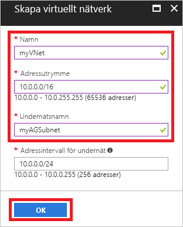
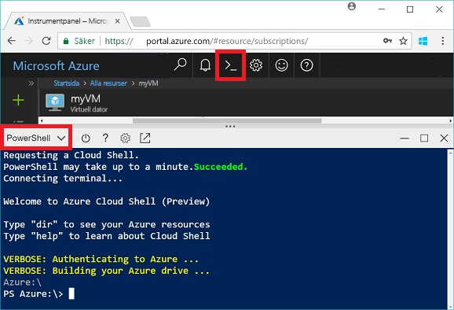
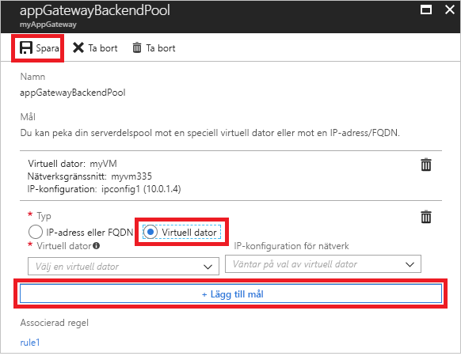
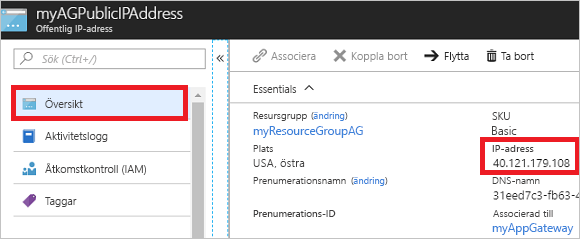

# <a name="quickstart-direct-web-traffic-with-azure-application-gateway---azure-portal"></a>Snabbstart: Dirigera webbtrafik med Azure Application Gateway – Azure Portal

Med Azure Application Gateway kan du dirigera programmets webbtrafik till specifika resurser genom att tilldela lyssnare till portar, skapa regler och att lägga till resurser i en serverdelspool.

Den här snabbstarten visar hur du använder Azure Portal för att snabbt skapa programgatewayen med två virtuella datorer i dess serverdelspool. Därefter testar du den och kontrollerar att den fungerar korrekt.

Om du inte har en Azure-prenumeration kan du skapa ett [kostnadsfritt konto](https://azure.microsoft.com/free/?WT.mc_id=A261C142F) innan du börjar.

## <a name="log-in-to-azure"></a>Logga in på Azure

Logga in på Azure Portal på [http://portal.azure.com](http://portal.azure.com)

## <a name="create-an-application-gateway"></a>Skapa en programgateway

Du måste skapa ett virtuellt nätverk för att programgatewayen ska kunna kommunicera med andra resurser. Du kan skapa ett virtuellt nätverk samtidigt som du skapar programgatewayen. Två undernät skapas i det här exemplet: ett för programgatewayen och ett för de virtuella datorerna. 

1. Klicka på **Skapa en resurs** längst upp till vänster i Azure Portal.
2. Välj **Nätverk** och sedan **Application Gateway** i listan Aktuella.
3. Ange följande värden för programgatewayen:

    - *myAppGateway* – Namnet på programgatewayen.
    - *myResourceGroupAG* – Den nya resursgruppen.

    

4. Godkänn standardvärdena för de andra inställningarna och klicka sedan på **OK**.
5. Klicka på **Välj ett virtuellt nätverk** > **Skapa nytt** och ange sedan följande värden för det virtuella nätverket:

    - *myVnet* – Det virtuella nätverkets namn.
    - *10.0.0.0/16* – Det virtuella nätverkets adressutrymme.
    - *myBackendSubnet* – Undernätsnamnet.
    - *10.0.0.0/24* – Undernätets adressutrymme.

    

6. Klicka på **OK** för att skapa det virtuella nätverket och undernätet.
6. Klicka på **Välj en offentlig IP-adress** > **Skapa nytt** och ange sedan namnet på den offentliga IP-adressen. I det här exemplet heter den offentliga IP-adressen *myAGPublicIPAddress*. Godkänn standardvärdena för de andra inställningarna och klicka sedan på **OK**.
8. Godkänn standardvärdena för lyssnarkonfigurationen, lämna brandväggen för webbaserade program inaktiverad och klicka sedan på **OK**.
9. Granska inställningarna på sammanfattningssidan och klicka sedan på **OK** för att skapa det virtuella nätverket, den offentliga IP-adressen och programgatewayen. Det kan ta upp till 30 minuter att skapa programgatewayen. Vänta tills distributionen har slutförts innan du går vidare till nästa avsnitt.

### <a name="add-a-subnet"></a>Lägga till ett undernät

1. Klicka på **Alla resurser** i den vänstra menyn och klicka sedan på **myVNet** i resurslistan.
2. Klicka på **Undernät** > **Undernät**.

    

3. Ange *myBackendSubnet* som namn på undernätet och klicka sedan på **OK**.

## <a name="create-backend-servers"></a>Skapa serverdelsservrar

I det här exemplet skapar du två virtuella datorer som ska användas som serverdelsservrar för programgatewayen. 

### <a name="create-a-virtual-machine"></a>Skapa en virtuell dator

1. Klicka på **Ny**.
2. Välj **Compute** och sedan **Windows Server 2016 Datacenter** i listan Aktuella.
3. Ange följande värden för den virtuella datorn:

    - *myVM* – Namnet på den virtuella datorn.
    - *azureuser* – för administratörens användarnamn.
    - *Azure123456!* som lösenord.
    - Välj **Använd befintlig** och sedan *myResourceGroupAG*.

4. Klicka på **OK**.
5. Välj **DS1_V2** som storlek på den virtuella datorn och klicka sedan på **Välj**.
6. Kontrollera att **myVNet** har valts för det virtuella nätverket och att undernätet är **myBackendSubnet**. 
7. Inaktivera startdiagnostikinställningar genom att klicka på **Inaktiverad**.
8. Klicka på **OK**, granska inställningarna på sammanfattningssidan och klicka sedan på **Skapa**.

### <a name="install-iis"></a>Installera IIS

Du kan installera IIS på de virtuella datorerna om du vill kontrollera att programgatewayen har skapats.

1. Öppna det interaktiva gränssnittet och kontrollera att det är inställt på **PowerShell**.

    

2. Kör följande kommando för att installera IIS på den virtuella datorn: 

    ```azurepowershell-interactive
    Set-AzureRmVMExtension `
      -ResourceGroupName myResourceGroupAG `
      -ExtensionName IIS `
      -VMName myVM `
      -Publisher Microsoft.Compute `
      -ExtensionType CustomScriptExtension `
      -TypeHandlerVersion 1.4 `
      -SettingString '{"commandToExecute":"powershell Add-WindowsFeature Web-Server; powershell Add-Content -Path \"C:\\inetpub\\wwwroot\\Default.htm\" -Value $($env:computername)"}' `
      -Location EastUS
    ```

3. Skapa en andra virtuell dator och installera IIS med hjälp av de steg som du just har slutfört. Ange *myVM2* som namn och VMName i Set-AzureRmVMExtension.

### <a name="add-backend-servers"></a>Lägga till serverdelsservrar

När du skapar virtuella datorer måste du lägga till dem i serverdelspoolen i programgatewayen.

1. Klicka på **Alla resurser** > **myAppGateway**.
2. Klicka på **Serverdelspooler**. En standardpool skapades automatiskt med programgatewayen. Klicka på **appGatewayBackendPool**.
3. Klicka på **Lägg till mål** > **Virtuell dator** och välj sedan *myVM*. Välj **Lägg till mål** > **Virtuell dator** och välj sedan *myVM2*.

    

4. Klicka på **Spara**.

## <a name="test-the-application-gateway"></a>Testa programgatewayen

Du behöver inte installera IIS för att skapa programgatewayen, men du har installerat det i den här snabbstarten för att kunna kontrollera om programgatewayen har skapats.

1. Leta reda på den offentliga IP-adressen för programgatewayen på skärmen Översikt. Klicka på **Alla resurser** > **myAGPublicIPAddress**.

    

2. Kopiera den offentliga IP-adressen och klistra in den i webbläsarens adressfält.

    

Du bör se namnet på den andra virtuella datorn när du uppdaterar webbläsaren.

## <a name="clean-up-resources"></a>Rensa resurser

Granska först de resurser som skapades med programgatewayen. När de inte längre behövs kan du ta bort resursgruppen, programgatewayen och alla relaterade resurser. Gör detta genom att markera den resursgrupp som innehåller programgatewayen och sedan klicka på **Ta bort**.

## <a name="next-steps"></a>Nästa steg

> [!div class="nextstepaction"]
> [Hantera webbtrafik med en programgateway som använder Azure CLI](./tutorial-manage-web-traffic-cli.md)
