# Översikt över Application Insights för DevOps

Med [Programinsikter](app-insights-overview.md), du snabbt få reda på hur din app har dålig och som används när den är aktiv. Om det finns ett problem, får du reda på om den, kan du utvärdera effekten och hjälper dig att avgöra orsaken.

Här är ett konto från ett team som utvecklar webbprogram:

* *”Ett par dagar sedan, distribuerade vi en” mindre ”snabbkorrigering. Det gick inte att köra en bred testet, men vissa oväntad ändring har tyvärr samman i nyttolasten orsakar inkompatibilitet mellan främre och bakre slutar. Direkt undantag ökade kraftigt, vår aviseringen utlöses och vi har gjorts medveten om situationen. Några få klick bort på Application Insights-portalen kan vi har fått tillräckligt med information från undantag callstacks att begränsa problemet. Vi återställde omedelbart och begränsad skadan. Application Insights har gjort den här delen av devops växla mycket enkel och tillförlitlig ”.*

Vi följer ett team i Fabrikam Bank som utvecklar onlinebank system (OBS) för att se hur de använder Application Insights och snabbt svara på kunder göra uppdateringar i den här artikeln.  

Teamet fungerar på en DevOps cykel avbildade i följande bild:

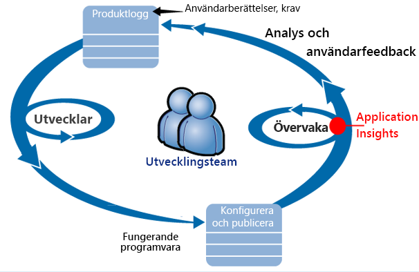

Krav som matas in deras utveckling eftersläpning (uppgiftslista). De fungerar i korthet sprints, vilket ofta ger fungerande programvara - vanligtvis i form av förbättringar och tillägg till det befintliga programmet. Appen live uppdateras regelbundet med nya funktioner. När den är aktiv övervakar den om prestanda och användning med hjälp av Application Insights i teamet. APM-data feeds tillbaka till deras utveckling eftersläpning.

Application Insights använder teamet för att övervaka webbprogrammet live nära för:

* Prestanda. De vill förstå hur svarstiderna varierar beroende på antalet begäranden; hur mycket CPU, nätverk, disk och andra resurser som används; vilka programkod långsam prestanda. och om flaskhalsarna.
* Fel. Om det finns undantag eller misslyckade begäranden, eller om en prestandaräknare går utanför räckvidd föredrar, måste teamet känner snabbt så att de kan vidta åtgärder.
* Användning. När en ny funktion släpps, vill teamet vet i vilken utsträckning används, och om användarna har problem med den.

Nu ska vi fokusera på den feedback-delen av cykeln:

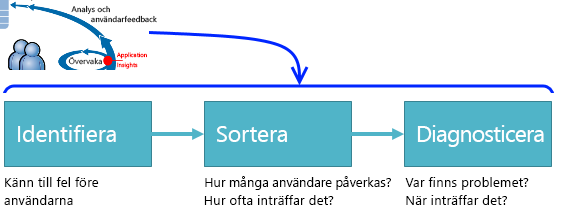

## Identifiera dålig tillgänglighet
Marcela Markova är en erfaren utvecklare i OBS teamet och tar lead på övervaka online prestanda. Hon konfigurerar flera [tillgänglighetstester](app-insights-monitor-web-app-availability.md):

* En enskild URL-test för huvudsakliga Landningssida för appen, http://fabrikambank.com/onlinebanking/. Hon anger kriterierna för HTTP-kod 200 och text Välkommen!. Om det här testet misslyckas är något allvarligt fel på nätverket eller servrar eller kan vara ett distributionsproblem med. (Eller någon har ändrat Välkommen! meddelande på sidan utan att låta hennes informerad).
* En djupare flera steg testet som loggar in och hämtar en aktuella kontot lista, kontrollera några viktiga uppgifter på varje sida. Det här testet kontrollerar att en länk till databasen med användarkonton i fungerar. Hon använder fiktiva kund-id: några av dem bevaras för testning.

Med dessa tester som ställer in är Marcela säker på att teamet snabbt se om några avbrott.  

Fel visas som röda punkter på webben test diagrammet:

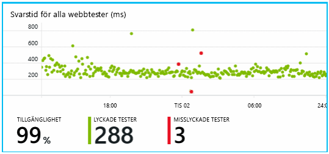

Men viktigare är en avisering om ett fel med e-post till Utvecklingsteamet. På så sätt kan känner de till den innan du nästan alla kunder.

## Övervaka prestanda
Det finns ett diagram som visar olika på översiktssidan i Application Insights [nyckeln mått](app-insights-web-monitor-performance.md).

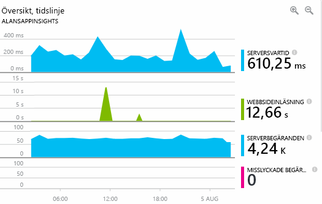

Sidhämtningstid härleds från telemetri skickas direkt från webbsidor. Serversvarstid, antalet för server-begäran och antalet misslyckade begäranden alla mätt i webbservern och skickas till Application Insights därifrån.

Marcela är något berörda med server svar graph. Det här diagrammet visar den genomsnittliga tiden mellan när servern tar emot en HTTP-begäran från en användares webbläsare och när den returnerar svaret. Det är inte ovanligt att finns en ändring i det här diagrammet eftersom belastningen på systemet varierar. Men i detta fall det verkar vara en korrelation mellan små ökar i antal begäranden, och stor stiger i svarstiden. Som kan tyda på att systemet fungerar bara vid gränsen.

Hon öppnar servrar diagram:

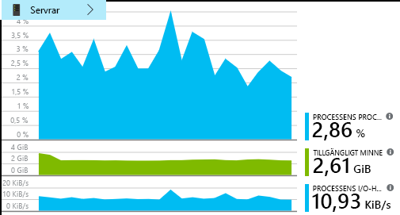

Det verkar inte några tecken på begränsade resurser, kanske skumpiga server svar diagram är bara en plötslig.

## Ange aviseringar för att uppfylla mål
Dock vill hon hålla koll på svarstider. Om de reser för hög vill hon veta om det direkt.

Så hon anger ett [avisering](app-insights-metrics-explorer.md), för svarstider som är större än ett tröskelvärde för vanliga. Detta ger sitt förtroende som hon vet om det. Om svarstider är långsam.

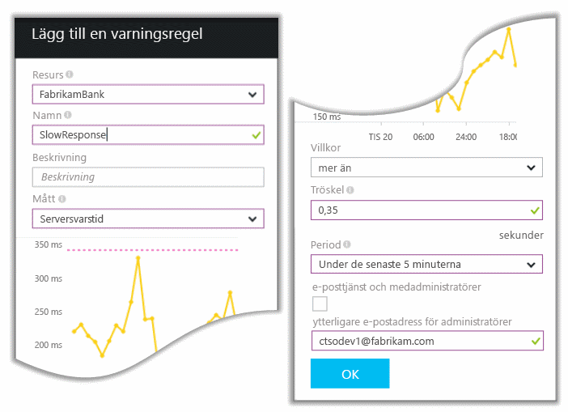

Aviseringar kan ställas in på en mängd andra mått. Du kan till exempel ta emot e-postmeddelanden om antalet undantag blir hög eller det tillgängliga minnet går låg, eller om det är en topp klientbegäranden.

## Håll dig informerad med aviseringar för Smart identifiering
Nästa dag, en varning e-post tas emot från Application Insights. Men när hon öppnas hon hittar inte svar tid aviseringen som hon har angetts. I stället den information om det har en plötslig ökning av misslyckade begäranden – det vill säga begäranden som har returnerats felkoder på 500 eller mer.

Misslyckade förfrågningar är där användare har sett ett fel - vanligtvis efter ett undantag uppstod i koden. Kanske ser de ett meddelande om ”tyvärr vi inte kunde uppdatera din information just nu”. Eller absolut onödiga sämsta en stackdump visas på användarens skärm kommer från webbservern.

Den här aviseringen är en oväntat eftersom senast hon tittar på det, antalet misslyckade begäranden har encouragingly låg. Ett litet antal fel förväntas kan i en upptagen server.

Det har också en oväntat för henne lite eftersom hon inte behöver konfigurera den här aviseringen. Application Insights innehålla smarta identifiering. Den automatiskt anpassar sig till din app mönster av vanliga fel och ”hämtar används för att” fel på en viss sida eller under hög belastning eller länkade till andra mått. Den genererar larm om det finns en överstiga vad det gäller förväntar dig.

Det här är en användbar e-post. Den öka inte bara larm. Det har mycket prioritering och diagnostik arbete för.

Den visar hur många kunder påverkas, och vilka webbsidor eller åtgärder. Marcela kan bestämma om hon vill hämta hela teamet arbetar på detta som en ökad fire eller om den kan ignoreras tills nästa vecka.

E-postmeddelandet visar också att en viss undantag uppstod och - även mer intressant - att felet är associerad med misslyckade anrop till en viss databas. Det förklarar varför felet plötsligt fanns även om Marcela's team inte har distribuerats eventuella uppdateringar nyligen.

Marcella pingar ledande i databas-teamet baserat på den här e-post. Hon lär sig de tillgängliga snabbkorrigering under den senaste timmen halv; och OJ, kanske kan har en mindre schemaändring...

Så att problemet är på väg att fastställs, även innan du undersöker loggar och inom 15 minuter från det som följer. Dock klickar Marcela på länken om du vill öppna Application Insights. Öppnas direkt till en misslyckad begäran och hon kan se misslyckade databasen anropa i associerade listan över beroendeanrop.

## Identifiera undantag
Med lite installationen [undantag](app-insights-asp-net-exceptions.md) har rapporterats till Application Insights automatiskt. De kan också läggas till explicit genom att infoga anrop till [TrackException()](app-insights-api-custom-events-metrics.md#trackexception) i koden:  

    var telemetry = new TelemetryClient();
    ...
    try
    { ...
    }
    catch (Exception ex)
    {
       // Set up some properties:
       var properties = new Dictionary <string, string>
         {{"Game", currentGame.Name}};

       var measurements = new Dictionary <string, double>
         {{"Users", currentGame.Users.Count}};

       // Send the exception telemetry:
       telemetry.TrackException(ex, properties, measurements);
    }

Fabrikam Bank-teamet har utvecklats av alltid skicka telemetri vid ett undantag såvida det inte finns en tydlig återställning.  

I själva verket sina strategin är även bredare än: de skicka telemetri i samtliga fall där kunden är frustrerade i vad de ville göra om det motsvarar ett undantag i koden eller inte. Till exempel om överföring av externa mellan bank-system returnerar meddelandet ”Det går inte att slutföra den här transaktionen” önskemål operativa (inga fel på kundens) spåra sedan de händelsen.

    var successCode = AttemptTransfer(transferAmount, ...);
    if (successCode < 0)
    {
       var properties = new Dictionary <string, string>
            {{ "Code", returnCode, ... }};
       var measurements = new Dictionary <string, double>
         {{"Value", transferAmount}};
       telemetry.TrackEvent("transfer failed", properties, measurements);
    }

TrackException används för att rapportera undantag eftersom den skickar en kopia av stacken. TrackEvent används för att rapportera andra händelser. Du kan koppla eventuella egenskaper som kan vara användbar vid diagnos.

Undantag och händelser som visas i den [diagnostiska Sök](app-insights-diagnostic-search.md) bladet. Detaljer om dem finns ytterligare egenskaper och stackspårning.

## Övervaka proaktivt
Marcela sitta inte bara runt väntar på aviseringar. Strax efter varje Omdistributionen hon tar en titt på [svarstider](app-insights-web-monitor-performance.md) -både den övergripande figuren och tabell långsammaste begäranden samt antalet undantag.  

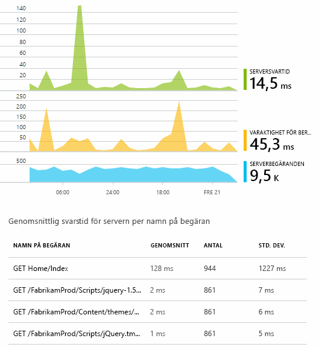

Hon kan bedöma påverkar prestanda för varje distribution vanligtvis jämföra varje vecka med senaste. Om det finns en plötslig försämras, genererar hon som med relevanta utvecklare.

## Prioritering problem
Prioritering - utvärdering allvarlighetsgrad och omfattningen av ett problem - är det första steget efter identifiering. Ska vi kallar ut teamet vid midnatt? Eller kan den finnas kvar tills nästa praktiskt lucka i eftersläpningen? Det finns några viktiga frågor i prioritering.

Hur ofta det händer? Diagrammen i bladet översikt ge vissa perspektiv på ett problem. Fabrikam-programmet genereras till exempel fyra web test varningar en natt. Titta på diagrammet på morgonen, teamet kan få se att det fanns verkligen vissa röda punkter om fortfarande de flesta av testerna som var grön. Vidaresökning i Tillgänglighetsdiagrammet var det tydligt att alla dessa återkommande problem var från ett test-plats. Detta var naturligtvis ett nätverksproblem som påverkar endast en och troligen avmarkerar sig själv.  

Däremot kommer är en dramatisk och stabil ökning i diagrammet för undantag räknas eller svar gånger givetvis något oroa dig om.

En användbar prioritering skräpposten är försök den själv. Om du stöter på samma problem, vet du att det är verkliga.

Vilken del av användare som påverkas? Dela fel för att erhålla en grov svar med Sessionsantal.

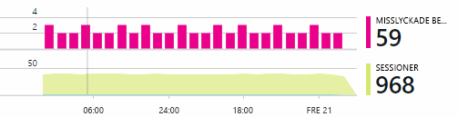

När det finns långsamt svar, jämför tabellen långsammaste svarar på begäranden med frekvensen för användning av varje sida.

Hur viktigt är blockerade scenario? Om det här är ett funktionellt problem som blockerar en viss användare artikel spelar det roll mycket? Om kunder inte kan betala för sina växlar, är det allvarliga; Om de inte kan ändra preferenser skärmen färg, kan kanske den vänta. Information om händelsen eller undantag eller identiteten för långsam sida visas där kunder har problem med.

## Diagnostisera problem
Diagnostik är inte helt felsökning. Innan du börjar spårning genom kod som du bör ha en grov uppfattning om varför, var och när problemet inträffar.

**När sker det?** Historiska vyn i diagrammen händelser och mått gör det enkelt att korrelera effekter med möjliga orsaker. Om det finns återkommande toppar i svaret tid eller undantag priser, titta på antalet begäranden: om den toppar som pekar åt på samma gång, så att det ser ut som ett resursproblem. Behöver du tilldela fler CPU eller minne? Eller är ett beroende som inte kan hantera belastningen?

**Är det oss?**  Om du har en plötslig nedgång i prestanda för en viss typ av begäran - till exempel när kunden vill uttrycket konto - och sedan är möjligheten kan det vara ett externt undersystem i stället för ditt webbprogram. Välj beroendefel frekvens och varaktighet för beroende priser och jämför deras historik över tidigare några timmar eller dagar med problemet du identifierade i Metrics Explorer. Om det korrelerar ändringar, kan en extern undersystemet vara kan klandras.  

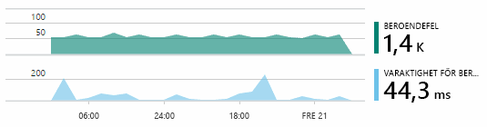

Vissa problem med långsam beroende är geolokalisering problem. Fabrikam banken använder Azure virtuella datorer och identifierade att de hade oavsiktligt finns sina webbservern och kontot server i olika länder. En dramatisk förbättring har medfört genom att migrera en av dem.

**Vad vi?** Om problemet inte verkar vara ett beroende, och om det inte alltid det, beror det förmodligen på en ändring. Historiska perspektiv som tillhandahålls av diagram mått och händelse gör det enkelt att korrelera ändringar plötslig med distributioner. Som begränsas av Sök efter problemet. Aktivera Application Insights Profiler för att identifiera vilka rader i programkoden långsam prestanda. Se [Profiling live Azure-webbappar med Application Insights](./app-insights-profiler.md). När profileraren är aktiverad, visas en spårning som liknar följande. I det här exemplet är det lätt att märka som metoden *GetStorageTableData* orsaken till problemet.  

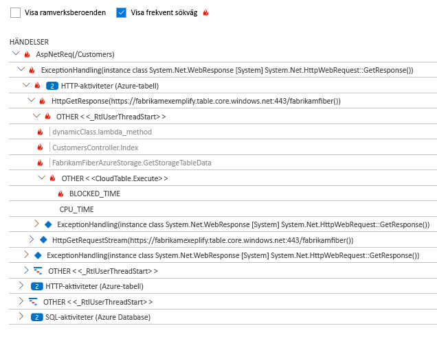

**Vad är det som händer?** Vissa problem inträffar sällan och kan vara svårt att spåra genom att testa offline. Allt vi kan göra är att försöka avbilda programfelet när det uppstår live. Du kan inspektera stackdump i undantag rapporter. Dessutom kan du skriva spårning anrop med din favorit loggningsramverk eller med TrackTrace() eller trackevent ().  

Fabrikam hade ett tillfälligt problem med överföringar mellan kontot, men endast med vissa typer av konton. För att bättre förstå vad som händer, infogas de TrackTrace() samtal vid huvudpunkter i koden, kopplar du kontotypen som en egenskap till varje anrop. Som gjort det enkelt att filtrera ut de spåren i diagnostiska sökning. De kopplade också parametervärden som egenskaper och åtgärder till trace-anrop.

## Svara på identifierade problem
Du kan göra en plan för att åtgärda det när du har diagnostiserats problemet. Du kanske behöver att återställa en ändring i eller kanske du bara gå vidare och rätta till den. När åtgärden är klar anger Application Insights du om du är klar.  

Fabrikam Bank Utvecklingsteamet ta en mer strukturerade hanteringsmetod prestandamått som de brukade innan de används för Application Insights.

* De angetts prestandamål vad gäller särskilda åtgärder på översiktssidan för Application Insights.
* De utforma åtgärderna som utförs av programmet från början, till exempel de mätvärden som mäter användaren förloppet skorstenar.  

## Övervakaren användaraktivitet
När svarstiden är konsekvent bra och få undantag, kan dev-teamet gå vidare till användbarhet. De kan tänka på hur vi kan förbättra användarnas upplevelse och hur du uppmana flera användare att uppnå önskat mål.

Application Insights kan också användas för att lära dig vad användarna göra med en app. När den körs smidigt vill teamet veta vilka funktioner som är den mest populära vad användare gillar och har problem med och hur ofta de kommer tillbaka. Som hjälper dem att prioritera kommande arbetet. Och de kan planerar mäter framgången för varje funktion som en del av utvecklingscykeln.

En typisk användare resa via webbplatsen har till exempel en tydlig ”tratten”. Många kunder titta på av olika typer av lån. Ett mindre antal gå vidare till att fylla i formuläret citattecken. Av de som får en offert några gå vidare och ta ut lånet.

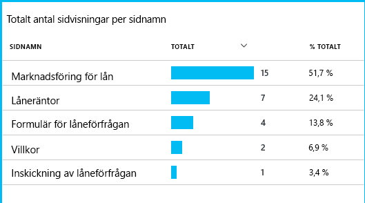

Verksamheten fungerar genom att beakta där det största antalet kunder släppa, reda på hur du får fler användare via längst ned i tratten. Det kan finnas ett user experience (UX) fel i vissa fall – till exempel ' Nästa ' är svårt att hitta eller anvisningarna inte tydligt. Det finns mer sannolikt större affärsskäl för bortfall: kanske lån priser är för högt.

Oavsett skäl, hjälper data teamet arbetar reda på vad användarna gör. Fler spårnings-anrop kan infogas om du vill arbeta mer detaljer. Trackevent () kan användas för att räkna alla användaråtgärder, från detaljnivå enskilda knappen klick till betydande prestationer, till exempel betala av ett lån.

Gruppen används om att ha information om användaraktivitet. Idag används när de utformar en ny funktion, fungerar de reda på hur de ska få feedback om dess användning. De utforma spårning anrop till funktionen från början. De kan använda din feedback för att förbättra funktionen i varje utvecklingscykeln.

[Läs mer om att spåra användning](app-insights-usage-overview.md).

## Tillämpa DevOps-cykel
Det är så hur ett team att använda Application Insights inte bara för enskilda problem, men för att förbättra sina. Jag hoppas det du har fått några tips om hur Application Insights kan hjälpa dig med hantering av prestanda i dina program.

## Video

> [!VIDEO https://channel9.msdn.com/events/Connect/2016/112/player]

## Nästa steg
Du kan komma igång på flera sätt, beroende på egenskaperna för ditt program. Välj vad passar dig bäst:

* [ASP.NET-webbprogram](app-insights-asp-net.md)
* [Java-webbapp](app-insights-java-get-started.md)
* [Node.js-webbapp](app-insights-nodejs.md)
* Redan distribuerade appar, finns på [IIS](app-insights-monitor-web-app-availability.md), [J2EE](app-insights-java-live.md), eller [Azure](app-insights-azure.md).
* [Webbsidor](app-insights-javascript.md) -den enda sidan App eller en vanlig webbsida - använder du informationen på sin egen eller lägga till ett av serveralternativen.
* [Tillgänglighetstester](app-insights-monitor-web-app-availability.md) att testa din app från internet.
