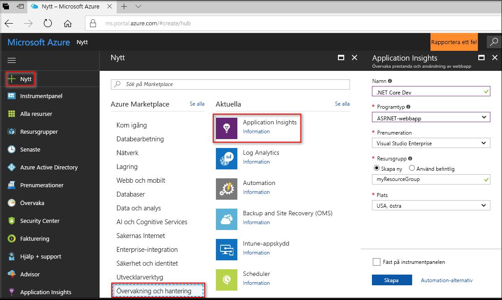
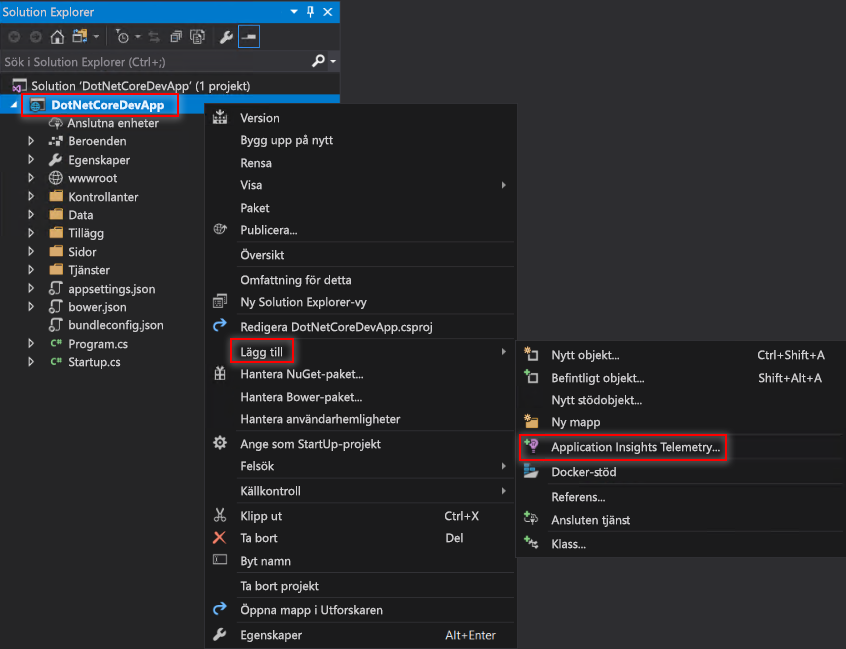
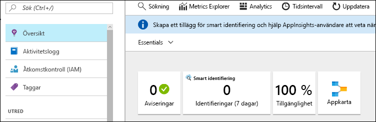
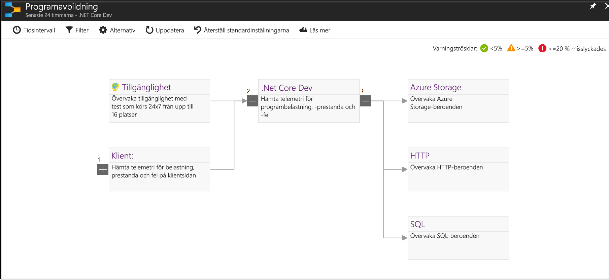
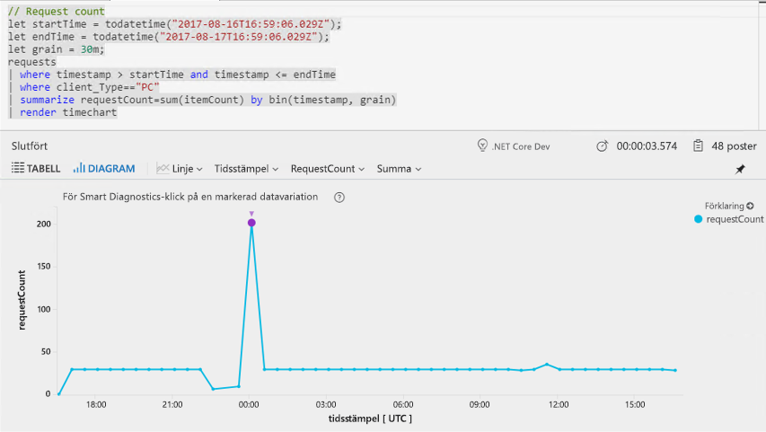
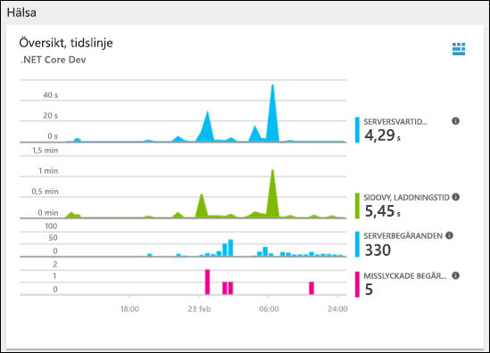
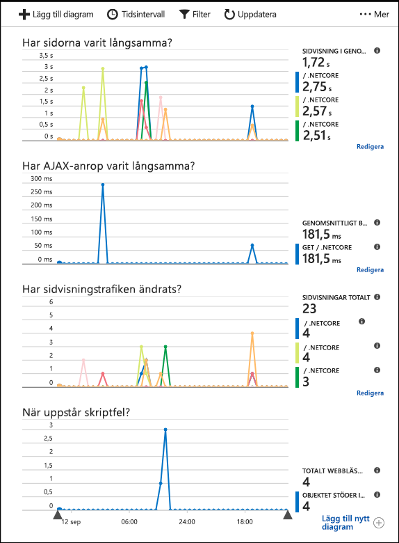

# <a name="start-monitoring-your-aspnet-core-web-application"></a>Börja övervaka din ASP.NET Core-webbapp

Med Azure Application Insights kan du enkelt övervaka en webbapp med avseende på tillgänglighet, prestanda och användning. Du kan också snabbt identifiera och diagnostisera fel i appen utan att vänta på att en användare rapporterar dem. 

Snabbstarten guidar dig genom processen att lägga till Application Insights SDK för en befintlig ASP.Net Core-webbapp. 

## <a name="prerequisites"></a>Krav

För att slutföra den här snabbstarten behöver du:

- [Installera Visual Studio 2017](https://www.visualstudio.com/downloads/) med följande arbetsbelastningar:
  - ASP.NET och webbutveckling
  - Azure Development
- [Installera .NET Core 2.0 SDK](https://www.microsoft.com/net/core)
- Du behöver en Azure-prenumeration och en befintlig .NET Core-webbapp.

Om du inte har en ASP.NET Core-webbapp kan du skapa en genom att följa [guiden för att skapa en ASP.NET Core-webbapp](https://docs.microsoft.com/en-us/aspnet/core/tutorials/publish-to-azure-webapp-using-vs).

Om du inte har en Azure-prenumeration kan du skapa ett [kostnadsfritt](https://azure.microsoft.com/free/) konto innan du börjar.

## <a name="log-in-to-the-azure-portal"></a>Logga in på Azure Portal

Logga in på [Azure-portalen](https://portal.azure.com/).

## <a name="enable-application-insights"></a>Aktivera Application Insights

Application Insights kan samla in telemetridata från alla internetanslutna appar, oavsett om de körs lokalt eller i molnet. Gör så här om du vill börja granska dessa data:

1. Välj **Nytt** > **Övervakning + Hantering** > **Application Insights**.

   

    En konfigurationsruta visas, använd tabellen nedan när du ska fylla i indatafälten.

    | Inställningar        |  Värde           | Beskrivning  |
   | ------------- |:-------------|:-----|
   | **Namn**      | Globalt unikt värde | Namn som identifierar appen du övervakar |
   | **Programtyp** | ASP.NET-webbapp | Typen av app du övervakar |
   | **Resursgrupp**     | myResourceGroup      | Namnet på den nya resursgrupp som är värd för App Insights-data |
   | **Plats** | Östra USA | Välj en plats nära dig eller nära där appen finns |

2. Klicka på **Skapa**.

## <a name="configure-app-insights-sdk"></a>Konfigurera App Insights SDK

1. Öppna **projektet** för ASP.NET Core-webbappen i Visual Studio > högerklicka på appnamnet i **Solution Explorer** > välj **Lägg till** > **Application Insights Telemetry**.

    

2. Klicka på knappen för att **starta kostnadsfritt** > välj den **befintliga resurs** du skapade i Azure-portalen > klicka på **Registrera**.

3. Välj **Felsök** > **Starta utan felsökning** (Ctrl + F5) för att starta appen.

> [!NOTE]
> Det tar 3–5 minuter innan data börjar visas i portalen. Om appen är en testapp för lågtrafik bör du komma ihåg att de flesta mått endast registreras när det finns aktiva begäranden eller åtgärder.

## <a name="start-monitoring-in-the-azure-portal"></a>Börja övervaka i Azure-portalen

1. Nu kan du öppna sidan **Översikt** för Application Insights i Azure-portalen genom att välja **Projekt** > **Application Insights** > **Öppna Application Insights-portalen** och visa information om den app som körs.

   

2. Klicka på **App-karta** om du vill se en layout med beroendena mellan appens komponenter. För varje komponent visas KPI:er som belastning, prestanda, fel och varningar.

   

3. Klicka på **Analys**-ikonen.  Då öppnas **Application Insights Analytics**, med ett funktionsrikt frågespråk för att analysera alla data som samlas in av Application Insights. I det här fallet skapas en fråga som återger antalet begäranden som ett diagram. Du kan skriva egna frågor för att analysera andra data.

   

4. Gå tillbaka till sidan **Översikt** och undersök **hälsotillståndsöversiktens tidslinje**.  På den här instrumentpanelen visas statistik om appens hälsotillstånd, inklusive antalet inkommande begäranden, varaktigheten för dessa begäranden och fel som inträffar. 

   

   Om du vill att diagrammet **Inläsningstid för sidvisning** ska fyllas i med **telemetridata på klientsidan** lägger du till det här skriptet på varje sida du vill spåra:

   ```HTML
   <!-- 
   To collect end-user usage analytics about your application, 
   insert the following script into each page you want to track.
   Place this code immediately before the closing </head> tag,
   and before any other scripts. Your first data will appear 
   automatically in just a few seconds.
   -->
   <script type="text/javascript">
     var appInsights=window.appInsights||function(config){
       function i(config){t[config]=function(){var i=arguments;t.queue.push(function(){t[config].apply(t,i)})}}var t={config:config},u=document,e=window,o="script",s="AuthenticatedUserContext",h="start",c="stop",l="Track",a=l+"Event",v=l+"Page",y=u.createElement(o),r,f;y.src=config.url||"https://az416426.vo.msecnd.net/scripts/a/ai.0.js";u.getElementsByTagName(o)[0].parentNode.appendChild(y);try{t.cookie=u.cookie}catch(p){}for(t.queue=[],t.version="1.0",r=["Event","Exception","Metric","PageView","Trace","Dependency"];r.length;)i("track"+r.pop());return i("set"+s),i("clear"+s),i(h+a),i(c+a),i(h+v),i(c+v),i("flush"),config.disableExceptionTracking||(r="onerror",i("_"+r),f=e[r],e[r]=function(config,i,u,e,o){var s=f&&f(config,i,u,e,o);return s!==!0&&t["_"+r](config,i,u,e,o),s}),t
       }({
           instrumentationKey:"<insert instrumentation key>"
       });
       
       window.appInsights=appInsights;
       appInsights.trackPageView();
   </script>
   ```

5. Klicka på **Webbläsare** under rubriken **Undersök**. Här hittar du prestandamått för appens sidor. Du kan klicka på **Lägg till nytt diagram** om du vill skapa fler anpassade vyer eller välja **Redigera** för att ändra befintliga diagramtyper, höjd, färgpalett, grupperingar och mått.

   

## <a name="clean-up-resources"></a>Rensa resurser

Om du tänker fortsätta med efterföljande snabbstarter eller självstudier ska du inte rensa resurserna du har skapat i den här snabbstarten. Om du inte planerar att fortsätta kan du använda stegen nedan för att ta bort alla resurser som har skapats i den här snabbstarten i Azure Portal.

1. På menyn till vänster i Azure Portal klickar du på **Resursgrupper** och sedan på **myResourceGroup**.
2. På sidan med resursgrupper klickar du på **Ta bort**, skriver **myResourceGroup** i textrutan och klickar sedan på **Ta bort**.

## <a name="next-steps"></a>Nästa steg

> [!div class="nextstepaction"]
> [Hitta och diagnostisera körningsundantag](https://docs.microsoft.com/en-us/azure/application-insights/app-insights-tutorial-runtime-exceptions)
