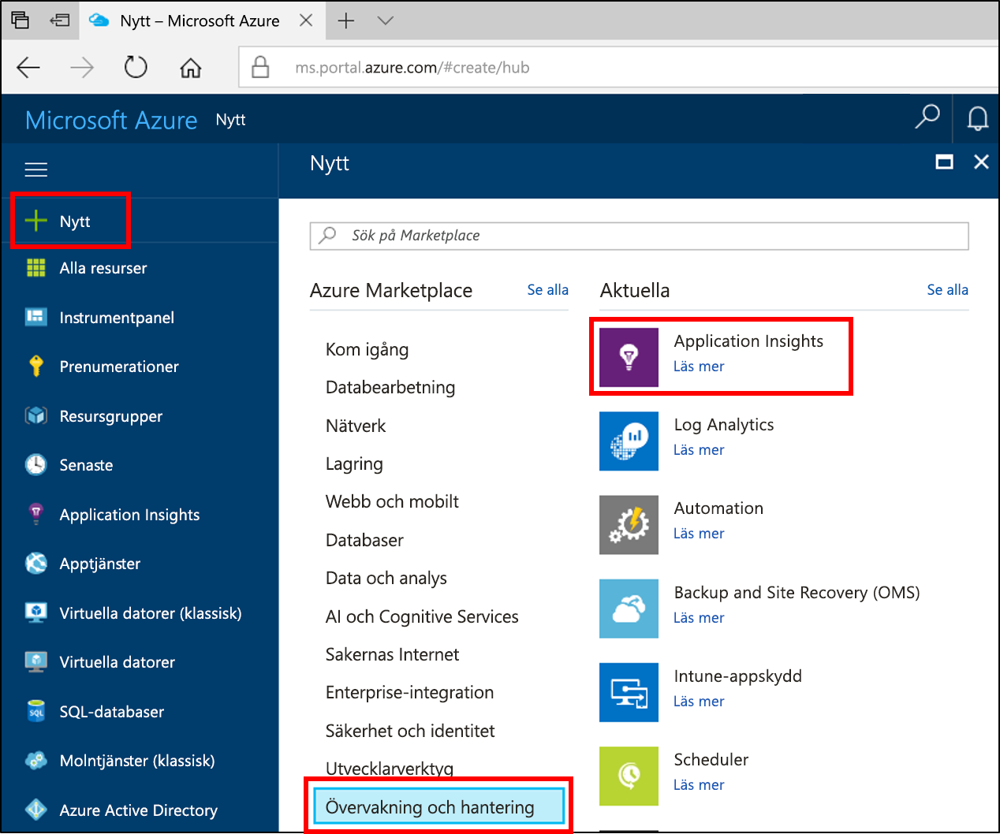
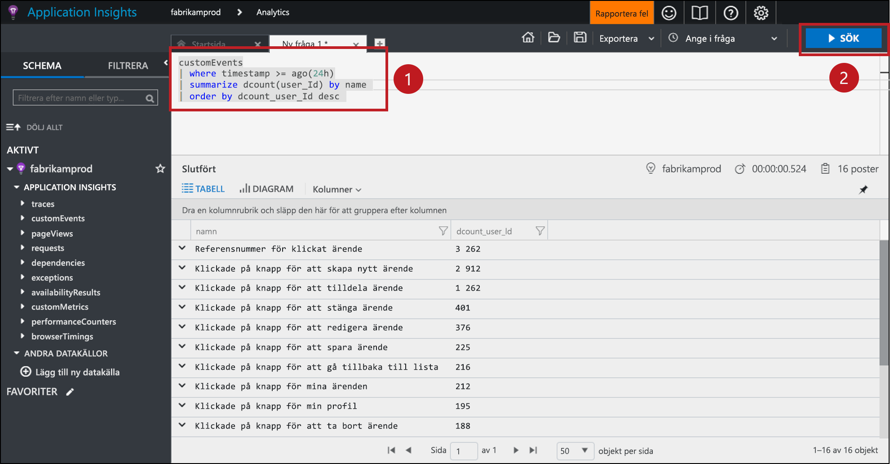
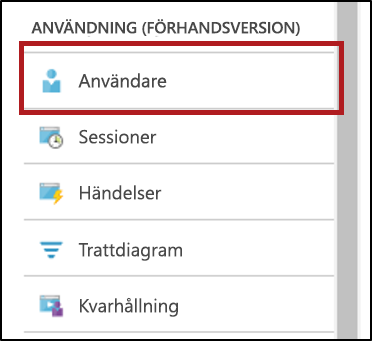
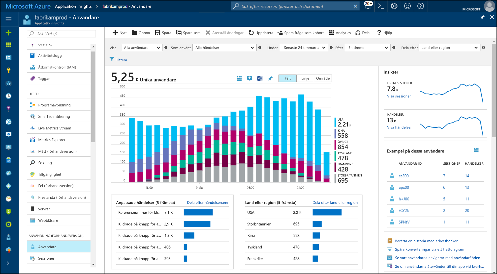
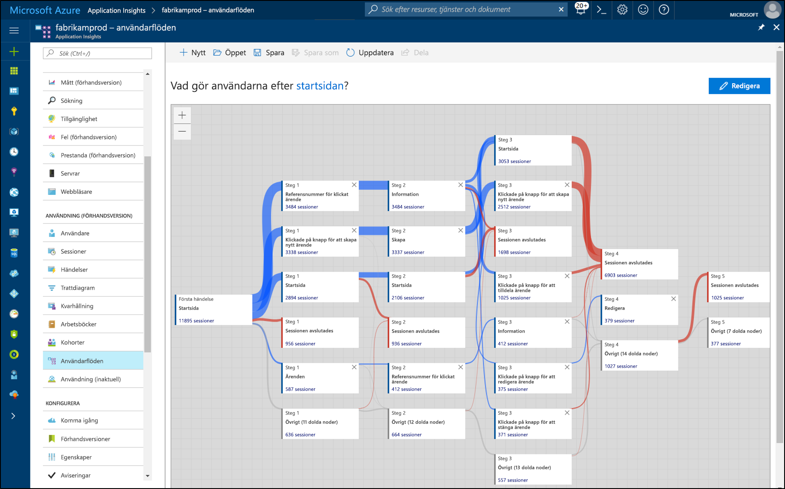

# <a name="start-analyzing-your-mobile-app-with-app-center-and-application-insights"></a>Börja analysera mobilappen med App Center och Application Insights

Den här snabbstarten leder dig genom anslutning av appens App Center-instans till Application Insights. Med Application Insights kan du fråga, segmentera, filtrera och analysera telemetrin med mer kraftfulla verktyg än vad som finns i [Analytics](https://docs.microsoft.com/mobile-center/analytics/)-tjänsten i App Center.

## <a name="prerequisites"></a>Nödvändiga komponenter

Följande krävs för att slutföra den här snabbstarten:

- En Azure-prenumeration.
- En app i iOS, Android, Xamarin, Universal Windows eller React Native.
 
Om du inte har en Azure-prenumeration kan du skapa ett [kostnadsfritt](https://azure.microsoft.com/free/) konto innan du börjar.

## <a name="onboard-to-app-center"></a>Publicera till App Center

Innan du kan använda Application Insights med mobilappen måste du publicera appen i [App Center](https://docs.microsoft.com/mobile-center/). Application Insights tar inte emot telemetri från mobilappen direkt. I stället skickar appen anpassad händelsetelemetri till App Center. Därefter exporterar App Center kontinuerligt kopior av dessa anpassade händelser till Application Insights vartefter händelserna tas emot.

Om du vill publicera din app följer du App Center-snabbstarten för varje plattform som appen har stöd för. Skapa separata App Center-instanser för varje plattform:

* [iOS](https://docs.microsoft.com/mobile-center/sdk/getting-started/ios).
* [Android](https://docs.microsoft.com/mobile-center/sdk/getting-started/android).
* [Xamarin](https://docs.microsoft.com/mobile-center/sdk/getting-started/xamarin).
* [Universell Windows](https://docs.microsoft.com/mobile-center/sdk/getting-started/uwp).
* [React Native](https://docs.microsoft.com/mobile-center/sdk/getting-started/react-native).

## <a name="track-events-in-your-app"></a>Spåra händelser i din app

När appen har publicerats i App Center måste den ändras så att den skickar anpassad händelsetelemetri med App Center SDK. Anpassade händelser är den enda typ av App Center-telemetri som exporteras till Application Insights.

Om du vill skicka anpassade händelser från iOS-appar använder du metoderna `trackEvent` eller `trackEvent:withProperties` i App Center SDK. [Läs mer om spårning av händelser från iOS-appar.](https://docs.microsoft.com/mobile-center/sdk/analytics/ios)

```Swift
MSAnalytics.trackEvent("Video clicked")
```

Om du vill skicka anpassade händelser från Android-appar använder du metoden `trackEvent` i App Center SDK. [Läs mer om spårning av händelser från Android-appar.](https://docs.microsoft.com/mobile-center/sdk/analytics/android)

```Java
Analytics.trackEvent("Video clicked")
```

Om du vill skicka anpassade händelser från andra app-plattformar använder du `trackEvent`-metoderna i deras App Center SDK:er.

Om du vill säkerställa att de anpassade händelserna tas emot går du till fliken **Händelser** i avsnittet **Analys** i App Center. Det kan ta några minuter innan händelser visas efter att de har skickats från appen.

## <a name="create-an-application-insights-resource"></a>Skapa en Application Insights-resurs

När appen skickar anpassade händelser och dessa händelser tas emot av App Center måste du skapa en Application Insights-resurs av App Center-typ i Azure-portalen:

1. Logga in på [Azure-portalen](https://portal.azure.com/).
2. Välj **Skapa en resurs** > **Övervakning och hantering**  > **Application Insights**.

    

    En konfigurationsruta visas. Använd tabellen nedan när du ska fylla i indatafälten.

    | Inställningar        |  Värde           | Beskrivning  |
   | ------------- |:-------------|:-----|
   | **Namn**      | Ett globalt unikt värde, t.ex. ”myApp-iOS” | Namn som identifierar appen du övervakar |
   | **Programtyp** | App Center-program | Typen av app du övervakar |
   | **Resursgrupp**     | En ny resursgrupp eller en befintlig på menyn | Resursgruppen där den nya Application Insights-resursen ska skapas |
   | **Plats** | En plats på menyn | Välj en plats nära dig eller nära där appen finns |

3. Klicka på **Skapa**.

Om appen har stöd för flera plattformar (iOS, Android osv.) är det bäst att skapa separata Application Insights-resurser, en för varje plattform.

## <a name="export-to-application-insights"></a>Exportera till Application Insights

I den nya Application Insights-resursen kopierar du instrumentationsnyckeln för den här resursen på sidan **Översikt** i avsnittet **Grundläggande** längst upp.

I App Center-instansen för appen:

1. På sidan **Inställningar** klickar du på **Exportera**.
2. Välj **Ny export**, välj **Application Insights** och klicka sedan på **Anpassa**.
3. Klistra in Application Insights-instrumenteringsnyckeln i rutan.
4. Godkänn ökning av användningen av Azure-prenumerationen som innehåller Application Insights-resursen. Alla Application Insights-resurser är kostnadsfria under de första 1 GB data som tas emot per månad. [Läs mer om priser för Application Insights.](https://azure.microsoft.com/pricing/details/application-insights/)

Kom ihåg att upprepa den här process för varje plattform som din app har stöd för.

När [exporten](https://docs.microsoft.com/mobile-center/analytics/export) har konfigurerats kopieras varje anpassad händelse som tas emot av App Center till Application Insights. Det kan ta flera minuter innan händelser når Application Insights, så om de inte visas direkt väntar du en stund innan du går vidare med diagnosen.

För att du ska få mer data när du först ansluter exporteras de senaste 48 timmarna med anpassade händelser i App Center automatiskt till Application Insights.

## <a name="start-monitoring-your-app"></a>Börja övervaka din app

Application Insights kan fråga, segmentera, filtrera och analysera den anpassade händelsetelemetrin från dina appar, bortom de analysverktyg som App Center tillhandahåller.

1. **Fråga den anpassade händelsetelemetrin.** Från sidan **Översikt** i Application Insights väljer du **Analys**. 

   

   Application Insights Analytics-portalen som är kopplad till din Application Insights-resurs öppnas. I Analytics-portalen kan du fråga data direkt med hjälp av Log Analytics-frågespråket, så att du kan ställa godtyckligt komplexa frågor om appen och dess användare.
   
   Öppna en ny flik i Analytics-portalen och klistra sedan in följande fråga. Den returnerar det antal distinkta användare som har skickat varje anpassad händelse från appen under de senaste 24 timmarna, sorterat efter dessa distinkta antal.

   ```AIQL
   customEvents
   | where timestamp >= ago(24h)
   | summarize dcount(user_Id) by name 
   | order by dcount_user_Id desc 
   ```

   

   1. Välj frågan genom att klicka var som helst på frågan i textredigeraren.
   2. Klicka sedan på **Kör** för att köra frågan. 

   Läs mer om [Application Insights Analytics](app-insights-analytics.md) och [Log Analytics-frågespråket](https://docs.loganalytics.io/docs/Language-Reference).


2. **Segmentera och filtrera din anpassade händelsetelemetri.** Från sidan **Översikt** i Application Insights väljer du **Användare** i innehållsförteckningen.

   

   Användarverktyget visar hur många av appens användare som har klickat på vissa knappar, besökt vissa skärmar eller utfört någon annan åtgärd som du spårar som en händelse med App Center SDK. Om du är ute efter ett sätt att segmentera och filtrera App Center-händelserna är användarverktyget ett mycket bra val.

    

   Du kan till exempel segmentera användningen efter geografi genom att välja **Land eller region** i listrutan **Dela efter**.

3. **Analysera konverterings-, kvarhållnings- och navigeringsmönster i appen.** Från sidan **Översikt** i Application Insights väljer du **Användarflöden** i innehållsförteckningen.

   

   Verktyget Användarflöden visualiserar vilka händelser användarna skickar efter en viss starthändelse. Det är användbart för att få en övergripande bild av hur användare navigerar i appen. Det kan också avslöja platser där många användare lämnar appen eller upprepar samma åtgärder om och om igen.

   Utöver Användarflöden har Application Insights flera andra verktyg för användningsanalys som kan besvara specifika frågor:

   * **Trattar** som analyserar och övervakar konverteringsfrekvens.
   * **Kvarhållning** som analyserar hur väl appen bibehåller användare med tiden.
   * **Arbetsböcker** som kombinerar grafik och text i en rapport som kan delas.
   * **Kohorter** som namnger och sparar specifika användar- eller händelsegrupper så att det lätt går att hänvisa till dem från andra analysverktyg.

## <a name="clean-up-resources"></a>Rensa resurser

Om du inte vill fortsätta använda Application Insights med App Center stänger du av exporten i App Center och tar bort Application Insights-resursen. Det förhindrar att du debiteras ytterligare av Application Insights för den här resursen.

Stänga av export i App Center:

1. Gå till **Inställningar** i App Center och välj **Exportera**.
2. Klicka på den Application Insights-export som du vill ta bort och klicka sedan på **Ta bort export** längst ned och bekräfta.

Ta bort Application Insights-resursen:

1. Klicka på **Resursgrupper** i den vänstra menyn i Azure-portalen och välj sedan den resursgrupp där Application Insights-resursen skapades.
2. Öppna den Application Insights-resurs du vill ta bort. Klicka sedan på **Ta bort** på menyn överst i resursen och bekräfta. Då raderas kopian av de data som exporterades till Application Insights permanent.

## <a name="next-steps"></a>Nästa steg

> [!div class="nextstepaction"]
> [Förstå hur kunder använder din app](app-insights-usage-overview.md)