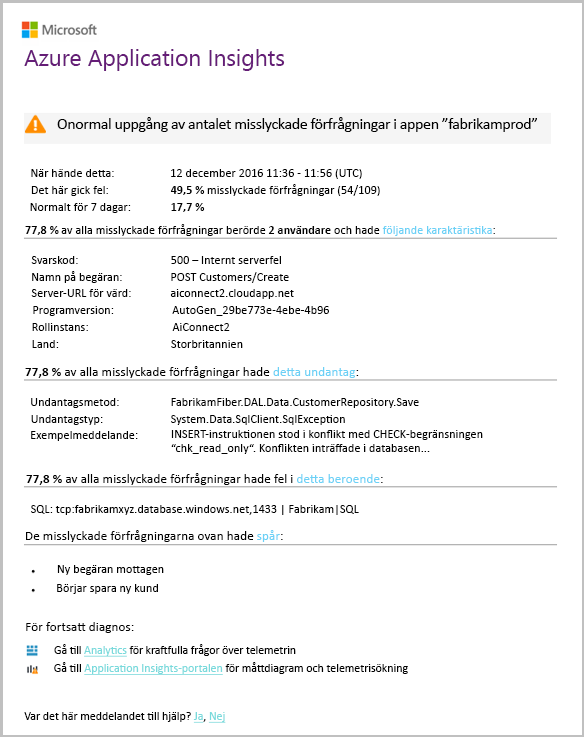

# Identifiering – fel avvikelser för smartkort
[Application Insights](app-insights-overview.md) automatiskt meddelar dig i nära realtid om ditt webbprogram påträffar en onormal ökning av antalet misslyckade förfrågningar. Den identifierar en onormal ökning i frekvensen för HTTP-begäranden eller beroendeanrop som rapporteras som misslyckad. För begäranden är misslyckade begäranden vanligtvis de med svarskoder 400 eller högre. För att hantera och diagnostisera problemet ska ges en analys av egenskaperna hos fel och relaterad telemetri i meddelandet. Det finns även länkar till Application Insights-portalen för ytterligare diagnos. Funktionen behöver ingen installation eller konfiguration, eftersom den använder maskininlärningsalgoritmer för att förutsäga vanliga fel.

Den här funktionen fungerar för Java- och ASP.NET-webbprogram, finns i molnet eller egna servrar. Den fungerar även för alla appar som genererar begäran eller beroende telemetri – till exempel om du har en arbetsroll som anropar [TrackRequest()](app-insights-api-custom-events-metrics.md#trackrequest) eller [TrackDependency()](app-insights-api-custom-events-metrics.md#trackdependency).

När du har installerat [Programinsikter för ditt projekt](app-insights-overview.md), och om din app genererar en viss minsta mängd telemetri, Smart identifiering av fel avvikelser tar 24 timmar för att lära dig normalt för din app, innan den är påslaget och skicka aviseringar.

Här är aviseringen.

> [!NOTE]
> Som standard kan du få ett kortare format e-postmeddelande än det här exemplet. Men du kan [växla till den här detaljerade format](#configure-alerts).
>
>

Observera att du får meddelande:

* Antalet misslyckade jämfört med normala Apps beteende.
* Hur många användare påverkas – så att du vet hur mycket oroa dig.
* Ett servicenivåmått mönster som är kopplade till felen. I det här exemplet finns ett visst svarskod, begäran namn (åtgärden) och programversion. Som anger du omedelbart där du vill börja söka i din kod. Andra möjligheter kan vara ett specifikt operativsystem webbläsare eller klienten.
* Undantag, loggspårningar och beroendefel (databaser eller andra externa komponenter) visas som associeras med utmärkande felen.
* Länkar till relevanta sökningar telemetri i Application Insights.

## Fördelarna med Smart identifiering
Vanlig [mått aviseringar](app-insights-alerts.md) berättar om det kan finnas problem. Men Smart identifiering startar diagnostiska arbete du utför mycket analysen du annars skulle behöva göra själv. Du får resultat snyggt paketeras, vilket hjälper dig att snabbt komma till roten på problemet.

## Hur det fungerar
Smart identifiering övervakar telemetri som tagits emot från din app, särskilt fel priser. Den här regeln är antalet begäranden som den `Successful request` egenskapen är false och antal beroende anrop som den `Successful call` egenskapen är false. För begäranden som standard `Successful request == (resultCode < 400)` (om du har skapat anpassade koden [filter](app-insights-api-filtering-sampling.md#filtering) eller skapa egna [TrackRequest](app-insights-api-custom-events-metrics.md#trackrequest) anrop). 

Prestanda för din app har en typisk beteendemönstret. Vissa begäranden eller beroendeanrop kommer att orsaka fel än andra. och det totala antalet misslyckade kan gå upp när belastningen ökar. Smart identifiering använder maskininlärning att hitta dessa avvikelser.

Som telemetri kommer till Application Insights från ditt webbprogram, jämför identifiering av Smart sätt med de mönster som visas under de senaste dagarna. Om en onormal ökning av antalet misslyckade observeras förhållande tidigare prestanda, utlöses en analys.

När en analys utlöses utför tjänsten en kluster-analys av misslyckade begäranden att identifiera ett mönster av värden som karakteriserar felen. I exemplet ovan identifierade analysen att de flesta fel är om en specifik Resultatkod begäran namn, Server-URL-värden och rollinstans. Däremot har analysen upptäckt att egenskapen client operativsystem distribueras över flera värden och därför det inte visas.

När tjänsten är försett med dessa telemetri anrop, söker mätaren efter ett undantag och ett beroendefel som är associerade med begäranden i klustret har identifierat tillsammans med ett exempel på några loggar som är associerade med begäranden.

Resulterande analysen skickas till dig som aviseringen om du har inte konfigurerat den.

Som det [aviseringar du manuellt ange](app-insights-alerts.md), du kan kontrollera status för aviseringen och konfigurerar det i bladet aviseringar för Application Insights-resurs. Men till skillnad från andra aviseringar, behöver du inte installera eller konfigurera Smart identifiering. Om du vill kan du inaktivera det eller ändra dess mål e-postadresser.

## Konfigurera aviseringar
Du kan inaktivera Smart identifiering, ändra e-postmottagare, skapa en webhook eller välja att mer detaljerad varningsmeddelanden.

Öppna sidan aviseringar. Fel avvikelser ingår tillsammans med eventuella aviseringar som du har angett manuellt och du kan se om den är i tillståndet aviseringar.

Klicka på aviseringen om du vill konfigurera den.

Observera att du kan inaktivera Smart identifiering, men du kan inte ta bort (eller skapa en ny).

#### Detaljerad aviseringar
Om du väljer ”Ta fram mer detaljerad diagnostik” innehåller flera diagnostikinformation e-postmeddelandet. Ibland kommer du att kunna diagnostisera problemet endast från data i e-postmeddelandet.

Det finns en mindre risk att mer detaljerad aviseringen kan innehålla känslig information, eftersom den innehåller undantag och spåra meddelanden. Detta kan dock bara hända om koden möjliggör känslig information i dessa meddelanden.

## Triaging och diagnostisering av en avisering
En avisering som anger att en onormal ökning av misslyckade förfrågningar har identifierats. Det är troligt att det finns problem med din app eller dess miljö.

Du kan bestämma hur brådskande problemet är från procent av begäranden och antal användare som påverkas. I exemplet ovan antalet misslyckade 22,5% Jämför med en normal andel % 1, visar att något händer. Å andra sidan som 11 endast användare påverkats. Om din app, skulle du kunna bedöma hur allvarlig som är.

I många fall kommer du att kunna diagnostisera problemet snabbt från begäran namn, undantag, beroende felet och spåra informationen.

Det finns några andra ledtrådar. Till exempel är felintervall beroende i det här exemplet detsamma som undantag hastighet (89.3%). Detta tyder på att undantaget uppstår direkt från beroendefel - ger en tydlig uppfattning om var du vill börja söka i din kod.

Om du vill undersöka vidare på länkarna i varje avsnitt leder dig direkt till en [söksidan](app-insights-diagnostic-search.md) filtrerats till relevanta begäranden, undantag, beroenden eller spår. Alternativt kan du öppna den [Azure-portalen](https://portal.azure.com), navigera till Application Insights-resurs för din app och öppna bladet fel.

I det här exemplet öppnas att klicka på länken ”Visa information om fel beroende' bladet som Application Insights sökning. Den visar SQL-sats som innehåller ett exempel på den bakomliggande orsaken: null-värden har angetts i obligatoriska fält och klarade inte valideringen under spara igen.

## Granska de senaste aviseringarna

Klicka på **Smart identifiering** till den senaste aviseringen:

## Vad är skillnaden...
Smart identifiering av fel avvikelser kompletterar andra liknande men olika funktioner i Application Insights.

* [Mått aviseringar](app-insights-alerts.md) anges av du och kan övervaka en mängd olika mått, till exempel CPU användandet begäran priser, sidinläsningstider och så vidare. Du kan använda dem för att varna dig, till exempel om du behöver lägga till fler resurser. Däremot omfattar Smart identifiering av fel avvikelser en liten uppsättning viktiga mått (för närvarande endast misslyckade förfrågningar), som utformats för att meddela dig i nära realtid sätt när ditt webbprogram kunde inte begära satsen ökar avsevärt jämfört med webbprogram normalt beteende.

    Smart identifiering justeras automatiskt sitt tröskelvärde som svar på gällande villkor.

    Smart identifiering startar diagnostiska arbetet åt dig.
* [Identifiering av prestandaavvikelser för smartkort](app-insights-proactive-performance-diagnostics.md) också använder datorn tillgångsinformation för att identifiera onormal mönster i din mått och krävs ingen konfiguration av dig. Men till skillnad från Smart identifiering av fel avvikelser syftet med Smart identifiering av prestandaavvikelser är att hitta segment för din användning samlingsrör som felaktigt kan hanteras, till exempel specifika sidor på en viss typ av webbläsare. Analysen utförs varje dag och om något resultat hittas, är det troligt att vara mycket mindre brådskande än en avisering. Däremot utförs analysen efter fel avvikelser kontinuerligt inkommande telemetri och du meddelas inom minuter om priser för server-felet är större än förväntat.

## Om du får en avisering om smarta identifiering
*Varför fått den här aviseringen?*

* Vi har upptäckt en onormal ökning av misslyckade begäranden hastighet jämfört med föregående period normal baslinje. Vi tror att det finns ett problem som bör du fundera på att efter analys av fel och associerade telemetri.

*Betyder meddelandet jag definitivt har problem?*

* Vi försöker varning i appen avbrott eller försämring, men bara du kan förstå semantiken och påverkan på app eller användare.

*Så är fallet bör du guys tittar på Mina data?*

* Nej. Tjänsten är helt automatisk. Bara hämta meddelanden. Dina data är [privata](app-insights-data-retention-privacy.md).

*Måste jag prenumerera på den här aviseringen?*

* Nej. Alla program som skickar begärande telemetri har varningsregeln Smart identifiering.

*Kan jag säga upp prenumerationen eller hämta meddelanden som skickas till min kollegor i stället?*

* Ja, klicka i Alert rules Smart identifieringsregeln konfigureras. Du kan inaktivera aviseringen eller ändra mottagarna för aviseringen.

*E-postmeddelandet gick förlorad. Var hittar jag meddelanden i portalen*

* I aktivitetsloggar. Öppna Application Insights-resursen för din app i Azure, och välj aktivitetsloggar.

*Vissa av aviseringarna är om kända problem och jag vill inte ta emot dem..*

* Vi har aviseringsundertryckning på vår eftersläpning.

## Nästa steg
Dessa verktyg för Nätverksdiagnostik hjälpa dig att inspektera telemetri från din app:

* [Mått explorer](app-insights-metrics-explorer.md)
* [Sök explorer](app-insights-diagnostic-search.md)
* [Analytics - frågespråket kraftfulla](app-insights-analytics-tour.md)

Smart identifieringar är helt automatisk. Men kanske du vill ställa in några fler aviseringar?

* [Manuellt konfigurerade mått aviseringar](app-insights-alerts.md)
* [Tillgänglighetstester för webbprogram](app-insights-monitor-web-app-availability.md)
