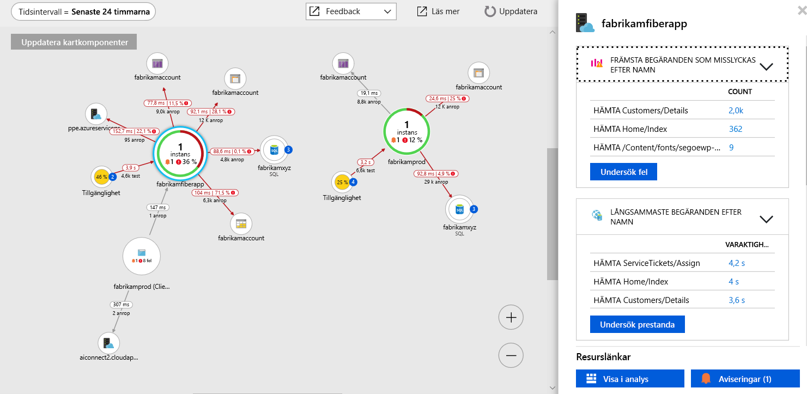

# <a name="collect-distributed-traces-from-go-preview"></a>Samla in distribuerade spårningar från Go (förhandsversion)

Application Insights nu stöder distribuerad spårning av Go-program via integrering med [OpenCensus](https://opencensus.io) och vår nya [lokala vidarebefordrare](./opencensus-local-forwarder.md). Den här artikeln beskriver steg för steg hur du konfigurerar OpenCensus för Go och få din spårningsdata till Application Insights.

## <a name="prerequisites"></a>Förutsättningar

- Du behöver en Azure-prenumeration.
- Go ska installeras, den här artikeln använder version 1.11 [går hämta](https://golang.org/dl/).
- Följ anvisningarna för att installera den [lokala vidarebefordrare som en Windows-tjänst](./opencensus-local-forwarder.md#windows-service).

Om du inte har en Azure-prenumeration kan du skapa ett [kostnadsfritt](https://azure.microsoft.com/free/) konto innan du börjar.

## <a name="sign-in-to-the-azure-portal"></a>Logga in på Azure Portal

Logga in på [Azure-portalen](https://portal.azure.com/).

## <a name="create-application-insights-resource"></a>Skapa Application Insights-källa

Du måste först skapa en Application Insights-resurs som genererar en instrumentationsnyckeln (ikey). Nyckeln används sedan för att konfigurera den lokala vidarebefordraren för att skicka distribuerade spårningar från programmets OpenCensus som instrumenteras till Application Insights.   

1. Välj **skapa en resurs** > **utvecklarverktyg** > **Application Insights**.

   

   En konfigurationsruta visas. Använd följande tabell när du ska fylla i indatafälten.

    | Inställningar        | Värde           | Beskrivning  |
   | ------------- |:-------------|:-----|
   | **Namn**      | Globalt unikt värde | Namn som identifierar appen du övervakar |
   | **Programtyp** | Allmänt | Typen av app du övervakar |
   | **Resursgrupp**     | myResourceGroup      | Namnet på den nya resursgrupp som är värd för App Insights-data |
   | **Plats** | Östra USA | Välj en plats nära dig eller nära där appen finns |

2. Klicka på **Skapa**.

## <a name="configure-local-forwarder"></a>Konfigurera lokala vidarebefordrare

1. Välj **Översikt** > **Essentials** > kopiera appens **instrumenteringsnyckel**.

   

2. Redigera din `LocalForwarder.config` filen och Lägg till din instrumentationsnyckel. Om du har följt anvisningarna i den [installationsprogrammets](./opencensus-local-forwarder.md#windows-service) filen finns på `C:\LF-WindowsServiceHost`

    ```xml
      <OpenCensusToApplicationInsights>
        <!--
          Instrumentation key to track telemetry to.
          -->
        <InstrumentationKey>{enter-instrumentation-key}</InstrumentationKey>
      </OpenCensusToApplicationInsights>
    
      <!-- Describes aspects of processing Application Insights telemetry-->
      <ApplicationInsights>
        <LiveMetricsStreamInstrumentationKey>{enter-instrumentation-key}</LiveMetricsStreamInstrumentationKey>
      </ApplicationInsights>
    </LocalForwarderConfiguration>
    ```

3. Starta om programmet **lokala vidarebefordrare** service.

## <a name="opencensus-go-packages"></a>OpenCensus Go-paket

1. Installera öppen insamlade paket för Go från kommandoraden:

    ```go
    go get -u go.opencensus.io
    go get -u contrib.go.opencensus.io/exporter/ocagent
    ```

2. Lägg till följande kod till en .go-fil och sedan skapa och kör. (Det här exemplet är härlett från officiella OpenCensus vägledningen med har lagts till kod som möjliggör integrering med lokala vidarebefordraren)

     ```go
        // Copyright 2018, OpenCensus Authors
        //
        // Licensed under the Apache License, Version 2.0 (the "License");
        // you may not use this file except in compliance with the License.
        // You may obtain a copy of the License at
        //
        //     http://www.apache.org/licenses/LICENSE-2.0
        //
        // Unless required by applicable law or agreed to in writing, software
        // distributed under the License is distributed on an "AS IS" BASIS,
        // WITHOUT WARRANTIES OR CONDITIONS OF ANY KIND, either express or implied.
        // See the License for the specific language governing permissions and
        // limitations under the License.
        package main
        
        import (
        
            "bytes"
            "fmt"
            "log"
            "net/http"
            os "os"
            
            ocagent "contrib.go.opencensus.io/exporter/ocagent"
            "go.opencensus.io/plugin/ochttp"
            "go.opencensus.io/plugin/ochttp/propagation/tracecontext"
            "go.opencensus.io/trace"
        
        )
        
        func main() {
            // Register stats and trace exporters to export the collected data.
            serviceName := os.Getenv("SERVICE_NAME")
            if len(serviceName) == 0 {
                serviceName = "go-app"
            }
            fmt.Printf(serviceName)
            agentEndpoint := os.Getenv("OCAGENT_TRACE_EXPORTER_ENDPOINT")

            if len(agentEndpoint) == 0 {
                agentEndpoint = fmt.Sprintf("%s:%d", ocagent.DefaultAgentHost, ocagent.DefaultAgentPort)
            }
        
            fmt.Printf(agentEndpoint)
            exporter, err := ocagent.NewExporter(ocagent.WithInsecure(), ocagent.WithServiceName(serviceName), ocagent.WithAddress(agentEndpoint))
        
            if err != nil {
                log.Printf("Failed to create the agent exporter: %v", err)
            }
        
            trace.RegisterExporter(exporter)
        
            trace.ApplyConfig(trace.Config{DefaultSampler: trace.AlwaysSample()})
        
            client := &http.Client{Transport: &ochttp.Transport{Propagation: &tracecontext.HTTPFormat{}}}
        
            http.HandleFunc("/", func(w http.ResponseWriter, req *http.Request) {
                fmt.Fprintf(w, "hello world")
        
                var jsonStr = []byte(`[ { "url": "http://blank.org", "arguments": [] } ]`)
                r, _ := http.NewRequest("POST", "http://blank.org", bytes.NewBuffer(jsonStr))
                r.Header.Set("Content-Type", "application/json")
        
                // Propagate the trace header info in the outgoing requests.
                r = r.WithContext(req.Context())
                resp, err := client.Do(r)
                if err != nil {
                    log.Println(err)
                } else {
                    // TODO: handle response
                    resp.Body.Close()
                }
            })
        
            http.HandleFunc("/call_blank", func(w http.ResponseWriter, req *http.Request) {
                fmt.Fprintf(w, "hello world")
        
                r, _ := http.NewRequest("GET", "http://blank.org", nil)

                // Propagate the trace header info in the outgoing requests.
                r = r.WithContext(req.Context())
                resp, err := client.Do(r)
        
                if err != nil {
                    log.Println(err)
                } else {
                    // TODO: handle response
                    resp.Body.Close()
                }        
            })
        
            log.Fatal(http.ListenAndServe(":50030", &ochttp.Handler{Propagation: &tracecontext.HTTPFormat{}}))
        
        }
        ```

3. Once the simple go app is running navigate to `http://localhost:50030`. Each refresh of the browser will generate the text "hello world" accompanied by corresponding span data that is picked up by the local forwarder.

4. To confirm that the **local forwarder** is picking up the traces check the `LocalForwarder.config` file. If you followed the steps in the [prerequisite](https://docs.microsoft.com/azure/application-insights/local-forwarder#windows-service), it will be located in `C:\LF-WindowsServiceHost`.

    In the image below of the log file, you can see that prior to running the second script where we added an exporter `OpenCensus input BatchesReceived` was 0. Once we started running the updated script `BatchesReceived` incremented equal to the number of values we entered:
    
    

## Start monitoring in the Azure portal

1. You can now reopen the Application Insights **Overview** page in the Azure portal, to view details about your currently running application. Select **Live Metric Stream**.

   

2. If you run the second Go app again and start refreshing the browser for `http://localhost:50030`, you will see live trace data as it arrives in Application Insights from the local forwarder service.

   

3. Navigate back to the **Overview** page and select **Application Map** for a visual layout of the dependency relationships and call timing between your application components.

    

    Since we were only tracing one method call, our application map isn't as interesting. But application map can scale to visualize far more distributed applications:

   

4. Select **Investigate Performance** to perform detailed performance analysis and determine the root cause of slow performance.

    

5. Selecting **Samples** and then clicking on any of the samples that appear in the right-hand pane will launch the end-to-end transaction details experience. While our sample app will just show us a single event, a more complex application would allow you to explore the end-to-end transaction down to level of an individual event's call stack.

     

## OpenCensus trace for Go

We only covered the basics of integrating OpenCensus for Go with the local forwarder and Application Insights. The [official OpenCensus Go usage guidance](https://godoc.org/go.opencensus.io) covers more advanced topics.

## Next steps

* [Application map](./app-insights-app-map.md)
* [End-to-end performance monitoring](./app-insights-tutorial-performance.md)