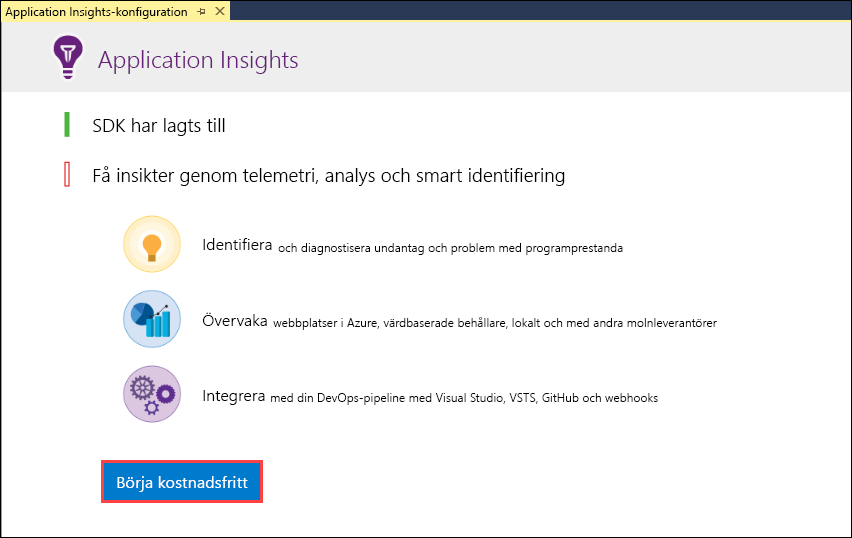
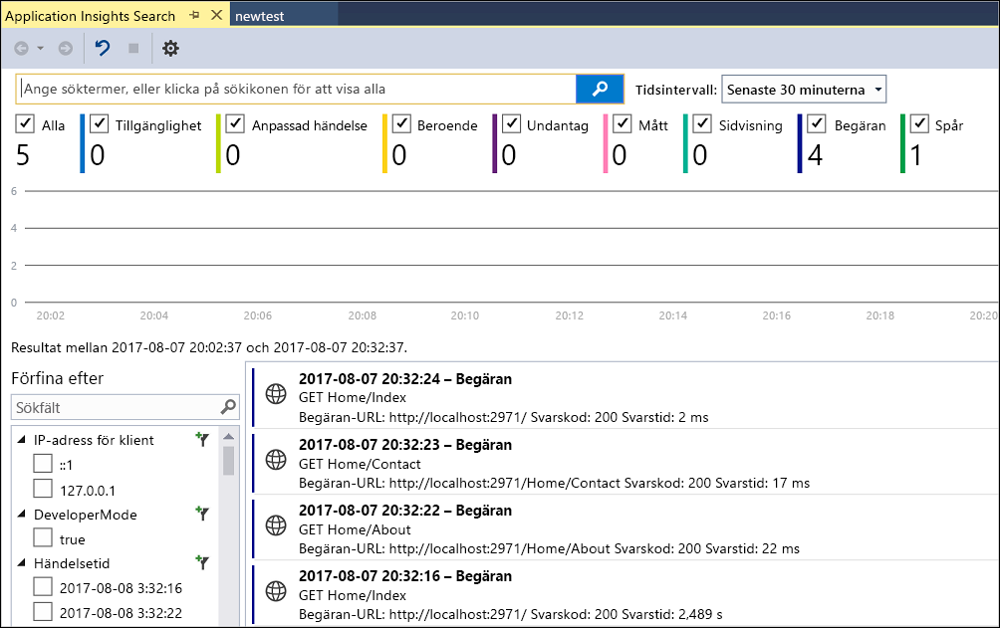
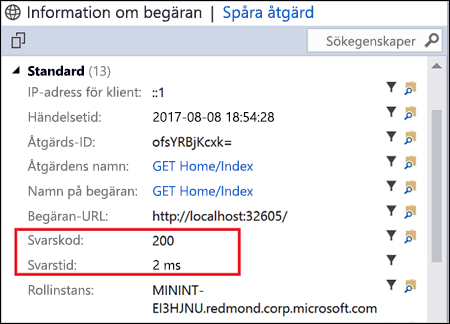
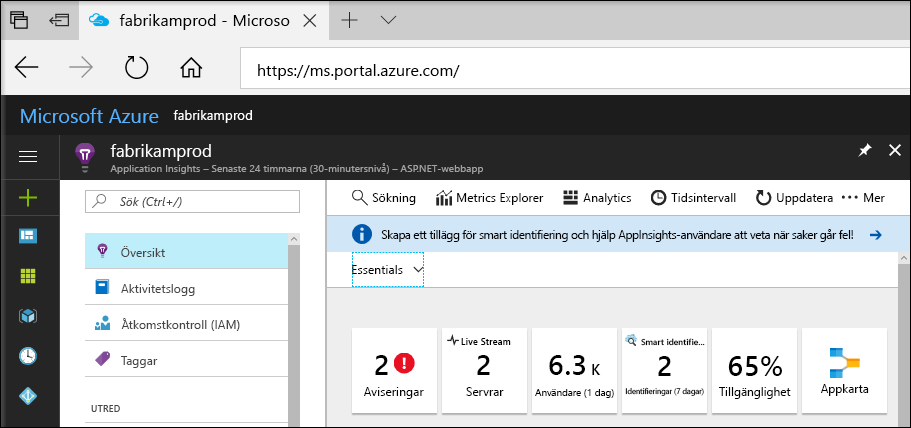
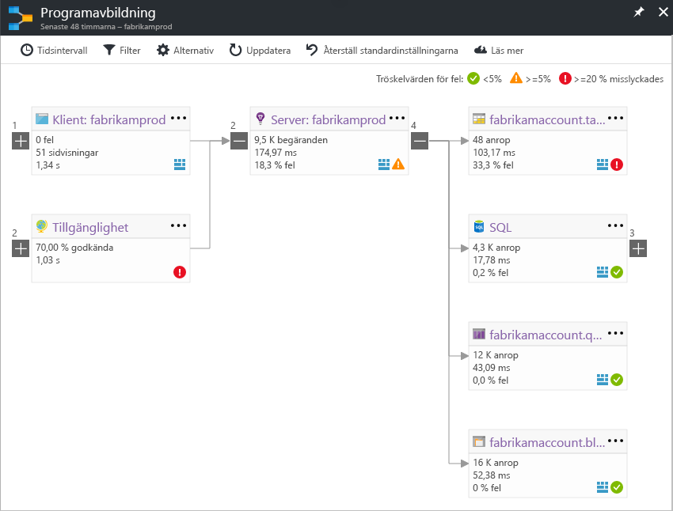
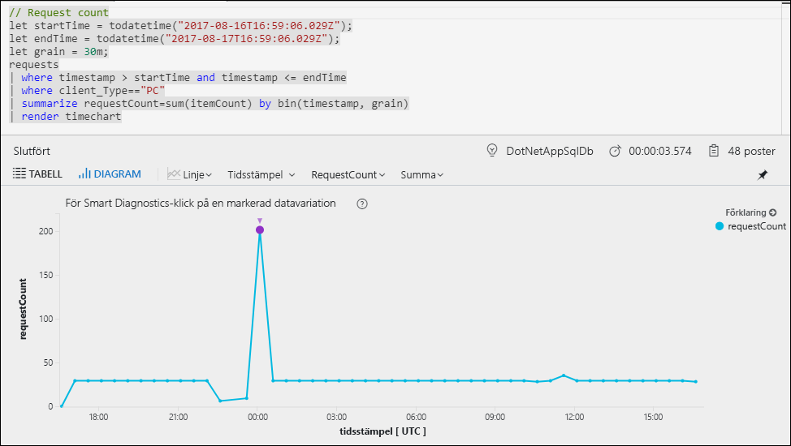
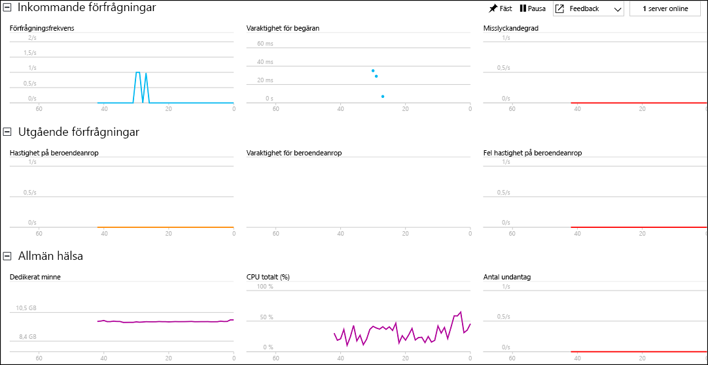

# Börja övervaka din ASP.NET-webbapp

Med Azure Application Insights kan du enkelt övervaka en webbapp för tillgänglighet, prestanda och användning.  Du kan också snabbt identifiera och diagnostisera fel i appen utan att vänta på att en användare rapporterar dem.  Med hjälp av informationen du samlar in från Application Insights om appens prestanda och effektivitet kan du göra välgrundade val för att underhålla och förbättra ditt program.

Den här snabbstarten visar hur du lägger till Application Insights till en befintlig ASP.NET-webbapp och börjar analysera livestatistik. Det är bara en av de olika metoderna du kan använda för att analysera din app. Om du inte har en ASP.NET-webbapp kan du skapa en genom att följa [snabbstarten för att skapa en ASP.NET-webbapp](../app-service/app-service-web-get-started-dotnet.md).

## Krav
För att slutföra den här snabbstarten behöver du:

- Installera [Visual Studio 2017](https://www.visualstudio.com/downloads/) med följande arbetsbelastningar:
    - ASP.NET och webbutveckling
    - Azure Development

Om du inte har en Azure-prenumeration kan du skapa ett [kostnadsfritt](https://azure.microsoft.com/free/) konto innan du börjar.

## Aktivera Application Insights

1. Öppna projektet i Visual Studio 2017.
2. Välj **Configure Application Insights** (Konfigurera Application Insights) på projektmenyn. Visual Studio lägger till Application Insights SDK för programmet.
3. Klicka på **Börja kostnadsfritt**, välj önskat faktureringsavtal och klicka på **Registrera**.

    

4. Kör ditt program genom att antingen välja alternativet för att **starta felsökning** på menyn **Felsök** eller genom att trycka på tangenten F5.

## Bekräfta appkonfiguration

Application Insights samlar in telemetridata för tillämpningsprogrammet oavsett var det körs. Använd följande steg för att börja visa dessa data.

1. Öppna Application Insights genom att klicka på **Projekt** -> **Application Insights** -> **Search Debug Session Telemetry** (Sök felsökningssession för telemetri).  Du kan se telemetrin från den aktuella sessionen.  

2. Klicka på den första begäran i listan (GET Home/Index i det här exemplet) för att se mer information. Observera att både statuskoden och svarstiden ingår tillsammans med annan värdefull information om begäran.  

## Börja övervaka i Azure-portalen

Nu kan du öppna Application Insights i Azure-portalen för att visa olika detaljer om programmet som körs.

1. Högerklicka på mappen **Connected Services Application Insights** i Solution Explorer och klicka på alternativet för att **öppna Application Insights-portalen**.  Du ser viss information om ditt program och många andra alternativ.

    

2. Klicka på **programkartan** för en visuell layout av beroenden mellan appkomponenterna.  För varje komponent visas KPI:er som belastning, prestanda, fel och varningar.

    

3. Klicka på **App Analytics**-ikonen  på någon av programkomponenterna.  Då öppnas **Application Insights Analytics**, med ett funktionsrikt frågespråk för att analysera alla data som samlas in av Application Insights.  I det här fallet skapas en fråga som återger antalet begäranden som ett diagram.  Du kan skriva egna frågor för att analysera andra data.

    

4. Återgå till **översiktssidan** och klicka på **Live Stream**.  Här ser du livestatistik om programmet när medan det körs.  Det innehåller information som antalet inkommande begäranden, varaktigheten för dessa begäranden och fel som inträffar.  Du kan även granska kritiska prestandavärden, till exempel processor och minne.

    

Om du är redo att vara värd för programmet i Azure kan publicera den nu. Följ stegen i informationen om att [skapa en snabbstart för ASP.NET-webbappen](../app-service/app-service-web-get-started-dotnet.md#update-the-app-and-redeploy).

## Nästa steg
Du har aktiverat ditt program för övervakning av Azure Application Insights i den här snabbstartsguiden.  Fortsätt till självstudierna för att lära dig att använda övervakningsstatistik och identifiera problem i programmet.

> [!div class="nextstepaction"]
> [Azure Application Insights-självstudier](app-insights-tutorial-runtime-exceptions.md)