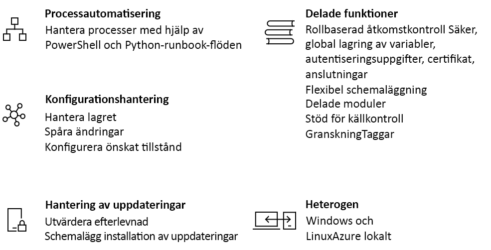

# En introduktion till Azure Automation

Azure Automation levererar en molnbaserad automatiserings-och konfigurations tjänst som stöder konsekvent hantering i dina Azure-och icke-Azure-miljöer. Den omfattar process automatisering, konfigurations hantering, uppdaterings hantering, delade funktioner och heterogena funktioner. Automation ger dig fullständig kontroll under distribution, drift och inaktive ring av arbets belastningar och resurser.

## Processautomatisering

Process automatisering i Azure Automation gör att du kan automatisera frekventa, tids krävande och fel känsliga moln hanterings uppgifter. Den här tjänsten hjälper dig att fokusera på arbete som lägger till ett affärs värde. Genom att minska felkällorna och öka effektiviteten bidrar det också till att sänka dina driftskostnader. Process automatiserings operativ miljön beskrivs i [Runbook-körningen i Azure Automation](automation-runbook-execution.md).

Process automatisering stöder integrering av Azure-tjänster och andra offentliga system som krävs för att distribuera, konfigurera och hantera dina slut punkt till slut punkts processer. Med tjänsten kan du redigera [Runbooks](automation-runbook-types.md) grafiskt, i PowerShell eller med hjälp av python. Genom att använda en [hybrid Runbook Worker](automation-hybrid-runbook-worker.md)kan du förena hanteringen genom att dirigera i lokala miljöer. Med [Webhooks](automation-webhooks.md) kan du utföra begär Anden och säkerställa kontinuerlig leverans och drift genom att utlösa automatisering från ITSM, DevOps och övervaknings system. 

## Konfigurationshantering

Konfigurations hantering i Azure Automation ger åtkomst till två funktioner:

* Ändringsspårning och inventering
* Azure Automation State Configuration

### Ändringsspårning och inventering

Ändringsspårning och Inventory kombinerar funktioner för ändrings spårning och inventering så att du kan spåra ändringar av virtuella datorer och Server infrastruktur. Tjänsten stöder ändrings spårning i tjänster, daemons, program vara, register och filer i din miljö för att hjälpa dig att diagnostisera oönskade ändringar och utlösa aviseringar. Med inventerings support kan du söka efter insyn i installerade program och andra konfigurations objekt i gäst resurser. Mer information om den här funktionen finns i [ändringsspårning och inventering](change-tracking/overview.md).

### Azure Automation State Configuration

[Azure Automation tillstånds konfiguration](automation-dsc-overview.md) är en molnbaserad funktion för PowerShell (önskad tillstånds konfiguration) som tillhandahåller tjänster för företags miljöer. Med den här funktionen kan du hantera dina DSC-resurser i Azure Automation och tillämpa konfigurationer på virtuella eller fysiska datorer från en DSC-pull-server i Azure-molnet. 

## Hantering av uppdateringar

Azure Automation innehåller funktionen [uppdateringshantering](./update-management/overview.md) för Windows-och Linux-system i hybrid miljöer. Uppdateringshantering ger dig insyn i att uppdatera kompatibiliteten mellan Azure och andra moln och lokalt. Med funktionen kan du skapa schemalagda distributioner som dirigerar installationen av uppdateringar i en definierad underhålls period. Om en uppdatering inte bör installeras på en dator kan du använda Uppdateringshantering-funktionen för att undanta den från en distribution.

## Delade funktioner

Azure Automation erbjuder ett antal delade funktioner, inklusive delade resurser, rollbaserad åtkomst kontroll, flexibel schemaläggning, käll kontroll integrering, granskning och taggning.

### Delade resurser

Azure Automation består av en uppsättning delade resurser som gör det enklare att automatisera och konfigurera dina miljöer i större skala.

* **[Scheman](./shared-resources/schedules.md)** – utlösa automatiserings åtgärder vid fördefinierade tidpunkter.
* **[Moduler](./shared-resources/modules.md)** – Hantera Azure och andra system. Du kan importera moduler till Automation-kontot för Microsoft, tredje part, community och anpassade cmdlets och DSC-resurser.
* **[Galleri för moduler](automation-runbook-gallery.md)** – stöder inbyggd integrering med PowerShell-galleriet så att du kan visa Runbooks och importera dem till Automation-kontot. Galleriet gör det möjligt för dig att snabbt komma igång med att integrera och redigera dina processer från PowerShell-galleriet och Microsoft Script Center.
* **[Python 2-paket](python-packages.md)** – stöd för python 2-Runbooks för ditt Automation-konto.
* **[Autentiseringsuppgifter](./shared-resources/credentials.md)** – lagra känslig information på ett säkert sätt som Runbooks och konfigurationer kan använda vid körning.
* **[Anslutningar](automation-connections.md)** – lagra namn-värde-par med gemensam information för anslutningar till system. Modulen författare definierar anslutningar i Runbooks och konfigurationer som ska användas vid körning.
* **[Certifikat](./shared-resources/certificates.md)** – definiera information som ska användas vid autentisering och skydd av distribuerade resurser vid användning av RUNBOOKS eller DSC-konfigurationer vid körning. 
* **[Variabler](./shared-resources/variables.md)** -Behåll innehåll som kan användas mellan Runbooks och konfigurationer. Du kan ändra variabel värden utan att behöva ändra någon av Runbooks eller konfigurationer som refererar till dem.

### Rollbaserad åtkomstkontroll

Azure Automation stöder rollbaserad åtkomst kontroll i Azure (Azure RBAC) för att reglera åtkomsten till Automation-kontot och dess resurser. Mer information om hur du konfigurerar Azure RBAC på ditt Automation-konto, Runbooks och jobb finns i [rollbaserad åtkomst kontroll för Azure Automation](automation-role-based-access-control.md).

### Källkontrollsintegrering

Azure Automation stöder [integrering av käll kontroll](source-control-integration.md). Den här funktionen höjer konfigurationen som kod där Runbooks eller konfigurationer kan kontrol leras i ett käll kontroll system.

## Heterogent stöd (Windows och Linux)

Automation är utformat för att fungera i din hybrid moln miljö och även i dina Windows-och Linux-system. Det ger ett konsekvent sätt att automatisera och konfigurera distribuerade arbets belastningar och de operativ system som kör dem.

## Vanliga scenarier för Automation

Azure Automation stöder hantering under hela livs cykeln för din infrastruktur och dina program. Här följer exempel på några vanliga scenarier:

* **Skriv Runbooks** – skapa PowerShell, PowerShell-arbetsflöde, grafiska, python 2 och DSC-Runbooks på vanliga språk. 
* **Bygg och distribuera resurser** – distribuera virtuella datorer i en hybrid miljö med hjälp av runbooks och Azure Resource Manager mallar. Integrera i utvecklingsverktyg, till exempel Jenkins och Azure DevOps.
* **Konfigurera virtuella datorer** – utvärdera och konfigurera Windows-och Linux-datorer med konfigurationer för infrastrukturen och programmet.
* **Dela kunskaps** överförings information i systemet om hur din organisation levererar och underhåller arbets belastningar. 
* **Hämta inventering** – hämta en fullständig inventering av distribuerade resurser för mål, rapportering och efterlevnad. 
* **Hitta ändringar** – identifiera ändringar som kan orsaka felaktig konfiguration och förbättra operativa krav.
* **Övervaka** – isolera dator ändringar som orsakar problem och åtgärda eller eskalera dem till hanterings system.
* **Skydda** – karantän datorer om säkerhets aviseringar aktive ras. Ange gästkrav.
* **Styr** – konfigurera Azure RBAC för Teams. Återställ oanvända resurser.

[!INCLUDE [azure-lighthouse-supported-service](../../includes/azure-lighthouse-supported-service.md)]

## Prissättning för Azure Automation

Du kan granska priserna som är kopplade till Azure Automation på sidan med [priser](https://azure.microsoft.com/pricing/details/automation/) .

## Nästa steg

> [!div class="nextstepaction"]
> [Skapa ett Automation-konto](automation-quickstart-create-account.md)